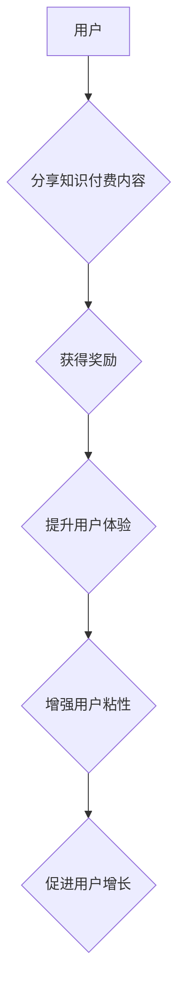

> 知识付费、社交裂变、分享激励、用户增长、社区运营、算法设计

## 1. 背景介绍

知识付费行业近年来发展迅速，从线上课程、付费咨询到付费会员，各种模式层出不穷。然而，用户获取知识付费内容的方式主要依赖于平台推荐和搜索，用户主动分享和传播的现象相对较少。如何激发用户主动分享和传播知识付费内容，从而实现用户增长和商业化，成为行业亟待解决的关键问题。

社交裂变和分享激励机制是解决这一问题的有效手段。社交裂变是指通过用户之间的社交关系，实现内容传播和用户增长的一种营销模式。分享激励机制是指通过奖励用户分享内容的行为，鼓励用户主动传播内容的一种激励机制。

## 2. 核心概念与联系

### 2.1 社交裂变

社交裂变的核心在于利用用户之间的信任关系和社交网络效应，实现内容的病毒式传播。用户更容易相信来自朋友或亲人的推荐，因此，通过用户分享，可以有效地扩大知识付费内容的传播范围。

### 2.2 分享激励机制

分享激励机制通过提供奖励，鼓励用户分享知识付费内容。奖励可以是虚拟的，例如积分、等级、勋章等；也可以是实实在在的，例如优惠券、现金红包等。

### 2.3 核心概念架构



## 3. 核心算法原理 & 具体操作步骤

### 3.1 算法原理概述

分享激励机制的核心算法是基于用户行为和内容价值的推荐算法。该算法通过分析用户分享行为、内容受欢迎程度等因素，推荐用户分享的内容，并根据分享行为给予相应的奖励。

### 3.2 算法步骤详解

1. **数据收集:** 收集用户分享行为、内容浏览量、点赞数、评论数等数据。
2. **用户画像构建:** 根据用户行为数据，构建用户画像，包括用户兴趣、偏好、分享习惯等。
3. **内容价值评估:** 根据内容浏览量、点赞数、评论数等指标，评估内容价值。
4. **推荐算法:** 基于用户画像和内容价值，推荐用户分享的内容。
5. **奖励机制:** 根据用户分享行为，给予相应的奖励。

### 3.3 算法优缺点

**优点:**

* 能够有效地激发用户分享行为。
* 能够提高用户粘性和活跃度。
* 能够促进用户增长和内容传播。

**缺点:**

* 需要收集和分析大量用户数据。
* 需要设计合理的奖励机制。
* 可能存在算法偏差和公平性问题。

### 3.4 算法应用领域

* 知识付费平台
* 社交媒体平台
* 电商平台
* 游戏平台

## 4. 数学模型和公式 & 详细讲解 & 举例说明

### 4.1 数学模型构建

假设用户 $u$ 分享内容 $c$ 的概率为 $P(u, c)$，则可以构建如下数学模型：

$$P(u, c) = f(u, c, r)$$

其中：

* $u$：用户
* $c$：内容
* $r$：奖励

### 4.2 公式推导过程

我们可以将 $f(u, c, r)$ 进一步分解为以下几个因素：

$$P(u, c, r) = \alpha \cdot u(c) + \beta \cdot r(c) + \gamma \cdot s(u, c)$$

其中：

* $u(c)$：用户对内容的兴趣度
* $r(c)$：内容的奖励价值
* $s(u, c)$：用户与内容的社交关联度

### 4.3 案例分析与讲解

假设用户 $A$ 对编程课程 $C1$ 感兴趣，奖励为 $10$ 个积分，用户 $A$ 的朋友 $B$ 也对编程课程 $C1$ 感兴趣，则用户 $A$ 分享 $C1$ 的概率会更高。

## 5. 项目实践：代码实例和详细解释说明

### 5.1 开发环境搭建

* Python 3.x
* Flask 或 Django 框架
* 数据库 (例如 MySQL 或 PostgreSQL)

### 5.2 源代码详细实现

```python
# 用户模型
class User(db.Model):
    id = db.Column(db.Integer, primary_key=True)
    username = db.Column(db.String(80), unique=True, nullable=False)
    # ... 其他用户属性

# 内容模型
class Content(db.Model):
    id = db.Column(db.Integer, primary_key=True)
    title = db.Column(db.String(255), nullable=False)
    # ... 其他内容属性

# 分享记录模型
class ShareRecord(db.Model):
    id = db.Column(db.Integer, primary_key=True)
    user_id = db.Column(db.Integer, db.ForeignKey('user.id'), nullable=False)
    content_id = db.Column(db.Integer, db.ForeignKey('content.id'), nullable=False)
    created_at = db.Column(db.DateTime, nullable=False, default=datetime.utcnow)

# 分享奖励逻辑
def calculate_reward(user, content):
    # 根据用户行为和内容价值计算奖励
    # ...

# 分享内容接口
@app.route('/share/<int:content_id>')
def share_content(content_id):
    user = get_current_user()
    content = Content.query.get_or_404(content_id)
    reward = calculate_reward(user, content)
    # 记录分享行为
    ShareRecord(user=user, content=content).save()
    # 发放奖励
    # ...
    return jsonify({'message': '分享成功'})
```

### 5.3 代码解读与分析

* 用户、内容、分享记录模型分别存储用户、内容和分享行为数据。
* `calculate_reward` 函数根据用户行为和内容价值计算奖励。
* `/share` 接口处理用户分享内容的请求，记录分享行为并发放奖励。

### 5.4 运行结果展示

当用户访问 `/share/<int:content_id>` 接口，并成功分享内容时，系统会记录分享行为，并根据算法计算奖励，并向用户发放奖励。

## 6. 实际应用场景

### 6.1 知识付费平台

知识付费平台可以利用社交裂变和分享激励机制，鼓励用户分享课程、文章、视频等内容，从而扩大用户群体和内容传播范围。

### 6.2 社交媒体平台

社交媒体平台可以利用分享激励机制，鼓励用户分享优质内容，提升平台活跃度和用户粘性。

### 6.3 电商平台

电商平台可以利用社交裂变和分享激励机制，鼓励用户分享商品信息，促进商品销售。

### 6.4 未来应用展望

随着人工智能、大数据等技术的不断发展，社交裂变和分享激励机制将更加智能化、个性化，并应用于更多领域。

## 7. 工具和资源推荐

### 7.1 学习资源推荐

* 《裂变营销》
* 《社交媒体营销》
* 《用户增长黑客》

### 7.2 开发工具推荐

* Python
* Flask 或 Django
* MySQL 或 PostgreSQL

### 7.3 相关论文推荐

* "Social Media Marketing: A Review"
* "The Impact of Social Media on User Engagement"
* "Viral Marketing: A Review"

## 8. 总结：未来发展趋势与挑战

### 8.1 研究成果总结

社交裂变和分享激励机制是用户增长和内容传播的重要手段，在知识付费行业、社交媒体平台、电商平台等领域都有广泛应用。

### 8.2 未来发展趋势

* 智能化推荐算法
* 个性化奖励机制
* 社交裂变与用户行为分析的深度融合

### 8.3 面临的挑战

* 算法偏差和公平性问题
* 用户隐私保护问题
* 内容质量控制问题

### 8.4 研究展望

未来研究将重点关注算法的公平性、隐私保护和内容质量控制等方面，以构建更加安全、高效、可持续的社交裂变和分享激励机制。

## 9. 附录：常见问题与解答

### 9.1 如何设计合理的奖励机制？

奖励机制的设计需要考虑用户行为、内容价值、平台成本等因素，并根据用户反馈进行调整。

### 9.2 如何避免算法偏差和公平性问题？

可以通过数据清洗、算法调优、多维度评估等方式，尽量减少算法偏差和公平性问题。

### 9.3 如何保护用户隐私？

在设计和使用社交裂变和分享激励机制时，需要严格遵守用户隐私保护政策，并采取相应的技术措施保护用户数据安全。


作者：禅与计算机程序设计艺术 / Zen and the Art of Computer Programming 
<end_of_turn>