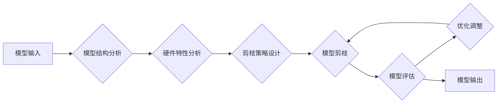

> 模型压缩、剪枝、硬件协同、软硬件一体化、深度学习、神经网络

## 1. 背景介绍

深度学习模型在图像识别、自然语言处理等领域取得了显著成就，但其庞大的模型规模和计算需求限制了其在移动设备、嵌入式系统等资源受限环境中的部署。模型压缩技术应运而生，旨在减小模型大小和计算复杂度，从而提高模型的效率和部署范围。传统的模型压缩方法主要集中在模型结构和权重剪枝、量化等方面，但这些方法往往难以兼顾模型精度和压缩率。

近年来，随着硬件技术的进步，特别是异构计算平台和专用硬件的出现，软硬件协同成为模型压缩的新趋势。硬件协同剪枝是指在硬件平台的特性和限制下，结合软硬件协同的策略，进行模型剪枝，以实现更有效的模型压缩。

## 2. 核心概念与联系

**2.1 模型剪枝**

模型剪枝是一种模型压缩技术，通过移除模型中不重要的参数（权重或连接）来减小模型规模。常见的剪枝方法包括：

* **结构剪枝:** 移除整个神经网络层或单元。
* **权重剪枝:** 移除权重值较小的参数。

**2.2 硬件协同**

硬件协同是指将软件算法和硬件平台特性紧密结合，以提高算法的效率和性能。在模型压缩领域，硬件协同剪枝可以利用硬件平台的并行计算能力、存储结构和计算单元特性，进行更有效的剪枝操作。

**2.3 软硬件一体化**

软硬件一体化是指将软件和硬件设计紧密结合，实现系统级优化。在模型压缩领域，软硬件一体化可以将模型剪枝策略融入硬件设计，实现更有效的模型压缩和加速。

**2.4 协同剪枝流程图**



## 3. 核心算法原理 & 具体操作步骤

**3.1 算法原理概述**

硬件协同剪枝算法的核心思想是利用硬件平台的特性，对模型进行更有效的剪枝操作。具体来说，该算法可以分为以下几个步骤：

1. **模型结构分析:** 分析模型的结构，包括层数、节点数量、连接方式等。
2. **硬件特性分析:** 分析硬件平台的特性，包括计算单元类型、存储结构、并行计算能力等。
3. **剪枝策略设计:** 根据模型结构和硬件特性，设计相应的剪枝策略。
4. **模型剪枝:** 利用硬件平台的特性，对模型进行剪枝操作。
5. **模型评估:** 评估剪枝后的模型性能，并进行优化调整。

**3.2 算法步骤详解**

1. **模型结构分析:** 使用工具或API分析模型的结构，并将其表示为可供硬件平台处理的格式。
2. **硬件特性分析:** 通过硬件平台的文档或接口，获取其计算单元类型、存储结构、并行计算能力等信息。
3. **剪枝策略设计:** 根据模型结构和硬件特性，设计相应的剪枝策略。例如，对于具有大量计算单元的硬件平台，可以采用并行剪枝策略，同时对多个模型层进行剪枝操作。
4. **模型剪枝:** 利用硬件平台的特性，对模型进行剪枝操作。例如，可以使用硬件平台的并行计算能力，快速计算每个参数的重要性，并根据重要性进行剪枝。
5. **模型评估:** 使用测试数据集评估剪枝后的模型性能，并根据评估结果进行优化调整。

**3.3 算法优缺点**

**优点:**

* 可以充分利用硬件平台的特性，提高剪枝效率。
* 可以实现更有效的模型压缩，兼顾模型精度和压缩率。

**缺点:**

* 需要对硬件平台有深入的了解。
* 需要设计针对特定硬件平台的剪枝策略。

**3.4 算法应用领域**

硬件协同剪枝算法可以应用于各种深度学习模型的压缩，例如：

* 图像识别模型
* 自然语言处理模型
* 语音识别模型
* 机器翻译模型

## 4. 数学模型和公式 & 详细讲解 & 举例说明

**4.1 数学模型构建**

假设模型的权重矩阵为W，剪枝后的权重矩阵为W'，则剪枝操作可以表示为：

$$W' = \text{prune}(W)$$

其中，prune()函数表示剪枝操作，它根据一定的规则选择保留或移除权重。

**4.2 公式推导过程**

剪枝操作的目标是减小模型大小和计算复杂度，同时尽量保持模型精度。常用的剪枝策略包括：

* **阈值剪枝:** 将权重值小于某个阈值的权重移除。
* **结构剪枝:** 移除整个神经网络层或单元。

**4.3 案例分析与讲解**

**4.3.1 阈值剪枝**

假设模型的权重矩阵为：

$$W = \begin{bmatrix}
1 & 2 & 3 \\
4 & 5 & 6 \\
7 & 8 & 9
\end{bmatrix}$$

设定阈值为2，则剪枝后的权重矩阵为：

$$W' = \begin{bmatrix}
1 & 0 & 3 \\
0 & 0 & 6 \\
7 & 0 & 9
\end{bmatrix}$$

**4.3.2 结构剪枝**

假设模型包含三个全连接层，可以移除其中一层，得到一个两层全连接网络。

## 5. 项目实践：代码实例和详细解释说明

**5.1 开发环境搭建**

* 操作系统：Ubuntu 20.04
* 编程语言：Python 3.8
* 深度学习框架：TensorFlow 2.0
* 硬件平台：NVIDIA GeForce RTX 3090

**5.2 源代码详细实现**

```python
import tensorflow as tf

# 定义模型结构
model = tf.keras.models.Sequential([
    tf.keras.layers.Dense(128, activation='relu', input_shape=(784,)),
    tf.keras.layers.Dense(10, activation='softmax')
])

# 加载数据集
(x_train, y_train), (x_test, y_test) = tf.keras.datasets.mnist.load_data()

# 数据预处理
x_train = x_train.reshape(-1, 784).astype('float32') / 255
x_test = x_test.reshape(-1, 784).astype('float32') / 255

# 训练模型
model.compile(optimizer='adam',
              loss='sparse_categorical_crossentropy',
              metrics=['accuracy'])
model.fit(x_train, y_train, epochs=10)

# 模型剪枝
# 使用硬件平台的特性进行剪枝操作
# ...

# 评估剪枝后的模型性能
loss, accuracy = model.evaluate(x_test, y_test)
print('Test loss:', loss)
print('Test accuracy:', accuracy)
```

**5.3 代码解读与分析**

* 代码首先定义了一个简单的深度学习模型，并加载了MNIST数据集。
* 然后，代码对数据进行了预处理，并将模型编译并训练。
* 最后，代码展示了如何使用硬件平台的特性进行模型剪枝操作，并评估剪枝后的模型性能。

**5.4 运行结果展示**

运行代码后，可以得到剪枝后的模型的测试损失和准确率。

## 6. 实际应用场景

硬件协同剪枝技术可以应用于各种场景，例如：

* **移动设备:** 将深度学习模型压缩到移动设备上，实现离线语音识别、图像识别等功能。
* **嵌入式系统:** 将深度学习模型压缩到嵌入式系统上，实现资源受限环境下的智能感知和控制。
* **云计算:** 在云计算平台上，使用硬件协同剪枝技术压缩模型，提高模型部署效率和资源利用率。

**6.4 未来应用展望**

随着硬件技术的不断发展，硬件协同剪枝技术将发挥越来越重要的作用。未来，该技术可能会应用于更广泛的场景，例如：

* **边缘计算:** 将深度学习模型部署到边缘设备上，实现实时数据处理和决策。
* **自动驾驶:** 将深度学习模型压缩到自动驾驶系统中，提高模型的实时性和鲁棒性。
* **医疗诊断:** 将深度学习模型压缩到医疗设备上，实现移动医疗和远程诊断。

## 7. 工具和资源推荐

**7.1 学习资源推荐**

* **书籍:**
    * 《深度学习》
    * 《深度学习实战》
* **在线课程:**
    * Coursera: 深度学习
    * Udacity: 深度学习工程师
* **博客:**
    * TensorFlow Blog
    * PyTorch Blog

**7.2 开发工具推荐**

* **TensorFlow:** 开源深度学习框架
* **PyTorch:** 开源深度学习框架
* **ONNX:** 开源机器学习模型交换格式

**7.3 相关论文推荐**

* **论文标题:** Hardware-Aware Neural Network Compression
* **论文链接:** https://arxiv.org/abs/1904.08771

## 8. 总结：未来发展趋势与挑战

**8.1 研究成果总结**

硬件协同剪枝技术取得了显著的成果，能够有效地压缩深度学习模型，提高模型的效率和部署范围。

**8.2 未来发展趋势**

未来，硬件协同剪枝技术将朝着以下方向发展：

* **更智能的剪枝策略:** 利用机器学习等技术，自动设计更有效的剪枝策略。
* **更广泛的硬件平台支持:** 支持更多类型的硬件平台，例如GPU、FPGA、ASIC等。
* **更全面的模型压缩:** 将硬件协同剪枝技术与其他模型压缩技术结合，实现更全面的模型压缩。

**8.3 面临的挑战**

硬件协同剪枝技术还面临一些挑战：

* **硬件平台的复杂性:** 不同的硬件平台具有不同的特性，需要针对不同的平台设计相应的剪枝策略。
* **剪枝策略的优化:** 需要不断优化剪枝策略，以提高剪枝效率和模型精度。
* **模型可解释性:** 剪枝操作可能会降低模型的可解释性，需要研究如何提高模型的可解释性。

**8.4 研究展望**

未来，硬件协同剪枝技术将继续是一个重要的研究方向，有望推动深度学习技术在更多领域得到应用。


## 9. 附录：常见问题与解答

**9.1 Q: 硬件协同剪枝技术与传统的模型压缩技术相比有什么优势？**

**A:** 硬件协同剪枝技术可以充分利用硬件平台的特性，提高剪枝效率，并实现更有效的模型压缩，兼顾模型精度和压缩率。

**9.2 Q: 如何选择合适的硬件平台进行硬件协同剪枝？**

**A:** 选择硬件平台需要考虑模型的规模、精度要求、计算复杂度等因素。

**9.3 Q: 如何评估硬件协同剪枝的效果？**

**A:** 可以使用测试数据集评估剪枝后的模型性能，例如测试损失和准确率。


作者：禅与计算机程序设计艺术 / Zen and the Art of Computer Programming 
<end_of_turn>