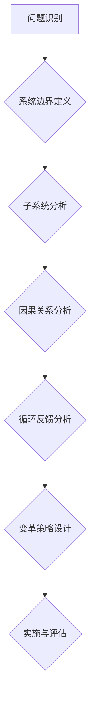

> 系统思考，组织变革，复杂系统，循环反馈，系统边界，系统模型，变革策略

## 1. 背景介绍

在当今瞬息万变的商业环境中，组织变革已成为企业持续发展的必要条件。然而，传统的变革方法往往陷入局部优化，忽视了组织的整体性与复杂性，导致变革效果不佳，甚至引发新的问题。系统思考作为一种全新的思维模式，为组织变革提供了新的视角和方法。

系统思考强调的是整体与部分的关系，认为任何一个系统都是由相互关联、相互影响的子系统组成的。它强调系统内部的循环反馈机制，以及系统与外部环境的相互作用。通过系统思考，我们可以更全面地理解组织的结构、功能和行为模式，从而制定更有效的变革策略。

## 2. 核心概念与联系

**2.1 系统思考的核心概念**

* **系统：** 由相互关联、相互影响的子系统组成的整体。
* **子系统：** 系统中独立运作的组成部分，但与其他子系统相互作用，共同构成系统整体。
* **边界：** 系统与外部环境的分界线，定义了系统包含哪些元素，哪些元素不属于系统。
* **循环反馈：** 系统内部的反馈机制，通过信息传递和行为调整，影响系统状态的演变。
* **因果关系：** 系统中各个元素之间的相互影响关系，理解因果关系有助于预测系统行为。

**2.2 系统思考与组织变革的联系**

系统思考为组织变革提供了以下关键视角：

* **整体性：** 强调变革应从整体出发，而非仅仅关注局部问题。
* **相互关联：** 认识到组织内部各个部门、流程、人员之间的相互关联，变革应考虑各个环节的影响。
* **循环反馈：** 理解组织行为的循环反馈机制，制定变革策略时应考虑反馈的影响。
* **复杂性：** 承认组织是一个复杂系统，变革过程充满不确定性，需要灵活应对。

**2.3 系统思考的应用流程**



## 3. 核心算法原理 & 具体操作步骤

**3.1 算法原理概述**

系统思考的核心算法并非一个具体的算法，而是基于系统思维的分析和决策方法。它强调通过观察、建模、分析和迭代的方式，逐步深入理解系统的复杂性，并制定有效的变革策略。

**3.2 算法步骤详解**

1. **问题识别：** 明确组织变革的目标和需要解决的问题。
2. **系统边界定义：** 确定变革范围，界定系统包含哪些元素，哪些元素不属于系统。
3. **子系统分析：** 将系统分解成多个子系统，分析每个子系统的功能、行为和相互关系。
4. **因果关系分析：** 识别系统中各个元素之间的因果关系，理解问题产生的根源。
5. **循环反馈分析：** 分析系统内部的循环反馈机制，预测变革的影响和潜在风险。
6. **变革策略设计：** 基于系统分析结果，制定切实可行的变革策略，并考虑不同子系统的影响。
7. **实施与评估：** 实施变革策略，并持续评估变革效果，根据反馈进行调整和优化。

**3.3 算法优缺点**

* **优点：**
    * 能够全面理解组织的复杂性，避免局部优化。
    * 强调系统内部的循环反馈机制，有助于预测变革的影响。
    * 能够促进跨部门协作，提升变革的执行力。
* **缺点：**
    * 系统分析过程复杂，需要投入大量时间和资源。
    * 难以量化系统行为，预测变革效果存在不确定性。
    * 需要具备较强的系统思维能力和分析能力。

**3.4 算法应用领域**

系统思考广泛应用于组织变革、战略规划、流程优化、产品开发等领域。

## 4. 数学模型和公式 & 详细讲解 & 举例说明

**4.1 数学模型构建**

系统思考中常用的数学模型包括：

* **差分方程：** 描述系统状态随时间的变化规律。
* **微分方程：** 描述系统状态变化率随时间的变化规律。
* **状态空间模型：** 将系统状态和输入输出关系表示为一个数学空间。

**4.2 公式推导过程**

例如，我们可以使用差分方程来描述一个系统的增长率：

```latex
x_{t+1} = x_t + r x_t
```

其中：

* $x_t$ 表示系统在时间 $t$ 的状态。
* $r$ 表示系统的增长率。

**4.3 案例分析与讲解**

假设一个组织的员工数量随着时间增长，增长率为 10%。我们可以使用上述差分方程来预测员工数量的变化趋势。

如果初始员工数量为 100 人，则员工数量的变化趋势如下：

* $t=0$： $x_0 = 100$
* $t=1$： $x_1 = 100 + 0.1 * 100 = 110$
* $t=2$： $x_2 = 110 + 0.1 * 110 = 121$
* $t=3$： $x_3 = 121 + 0.1 * 121 = 133.1$

我们可以看到，员工数量随着时间的推移呈指数增长。

## 5. 项目实践：代码实例和详细解释说明

**5.1 开发环境搭建**

系统思考的实践需要使用多种工具和技术，例如：

* **建模工具：** 例如，SysML、UML、BPMN 等。
* **数据分析工具：** 例如，Python、R、Tableau 等。
* **协作平台：** 例如，Confluence、Jira 等。

**5.2 源代码详细实现**

由于系统思考的实践涉及多个领域和技术，无法提供一个具体的代码实例。

**5.3 代码解读与分析**

系统思考的代码实现需要根据具体的需求和场景进行定制。

**5.4 运行结果展示**

系统思考的实践结果通常是系统模型、分析报告、变革策略等。

## 6. 实际应用场景

**6.1 组织变革案例**

* **流程优化：** 通过系统思考，可以识别流程中的瓶颈和冗余环节，并制定优化方案。
* **产品开发：** 通过系统思考，可以更好地理解用户需求，并设计更符合用户需求的产品。
* **战略规划：** 通过系统思考，可以分析组织的外部环境和内部资源，制定更有效的战略规划。

**6.2 未来应用展望**

随着人工智能、大数据等技术的快速发展，系统思考将在更多领域得到应用，例如：

* **城市规划：** 通过系统思考，可以更好地规划城市发展，解决城市问题。
* **环境保护：** 通过系统思考，可以更好地理解生态系统，制定更有效的环境保护策略。
* **医疗保健：** 通过系统思考，可以更好地理解疾病的发生机制，制定更有效的治疗方案。

## 7. 工具和资源推荐

**7.1 学习资源推荐**

* **书籍：**
    * 《系统思考》 - Peter Senge
    * 《第五项修炼》 - Jim Collins
    * 《复杂系统》 - Melanie Mitchell
* **在线课程：**
    * Coursera: Systems Thinking
    * edX: Systems Thinking for Sustainability

**7.2 开发工具推荐**

* **建模工具：**
    * SysML
    * UML
    * BPMN
* **数据分析工具：**
    * Python
    * R
    * Tableau

**7.3 相关论文推荐**

* **The Fifth Discipline: The Art and Practice of the Learning Organization** - Peter Senge
* **Complexity: A Guided Tour** - Melanie Mitchell
* **Systems Thinking for Sustainability** - Donella Meadows

## 8. 总结：未来发展趋势与挑战

**8.1 研究成果总结**

系统思考为组织变革提供了新的视角和方法，能够帮助组织更好地理解复杂性，制定更有效的变革策略。

**8.2 未来发展趋势**

随着人工智能、大数据等技术的快速发展，系统思考将更加深入地应用于各个领域，并与其他学科交叉融合，形成新的研究方向。

**8.3 面临的挑战**

系统思考的实践需要克服以下挑战：

* **复杂性：** 系统分析过程复杂，需要投入大量时间和资源。
* **量化困难：** 系统行为难以量化，预测变革效果存在不确定性。
* **思维模式转变：** 需要具备较强的系统思维能力和分析能力。

**8.4 研究展望**

未来研究方向包括：

* **开发更有效的系统分析方法和工具。**
* **建立系统思考与人工智能的结合框架。**
* **推广系统思考的应用，提升组织变革的成功率。**

## 9. 附录：常见问题与解答

**9.1 如何进行系统边界定义？**

系统边界定义需要根据具体问题和场景进行确定，需要考虑以下因素：

* **问题范围：** 变革的目标和需要解决的问题。
* **相关要素：** 与问题相关的部门、流程、人员等。
* **外部环境：** 与系统相关的外部因素，例如市场环境、政策法规等。

**9.2 如何识别系统中的因果关系？**

可以使用因果关系图、鱼骨图等工具来识别系统中的因果关系。

**9.3 如何预测变革的影响？**

可以使用系统模型、仿真分析等方法来预测变革的影响。

**9.4 如何评估变革效果？**

可以使用定量指标和定性分析等方法来评估变革效果。


作者：禅与计算机程序设计艺术 / Zen and the Art of Computer Programming 
<end_of_turn>