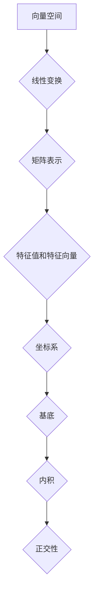

> 线性代数，实欧几里得空间，向量，矩阵，线性变换，基底，坐标系，内积，正交性，特征值，特征向量

## 1. 背景介绍

线性代数是数学的一个分支，它研究向量空间、线性变换、矩阵和线性方程组等概念。它在计算机科学、物理学、工程学、经济学等众多领域都有广泛的应用。

实欧几里得空间是线性代数中一个重要的概念，它指的是具有内积的实数向量空间。内积是一种将两个向量映射到实数的运算，它可以用来度量两个向量的相似性。实欧几里得空间的几何性质和代数性质密切相关，它为理解线性代数中的许多概念提供了直观的几何解释。

## 2. 核心概念与联系

### 2.1 向量

向量是一个具有大小和方向的量。在实欧几里得空间中，向量通常表示为有序的实数列表，例如：

$$
\mathbf{v} = \begin{bmatrix} v_1 \\ v_2 \\ \vdots \\ v_n \end{bmatrix}
$$

其中 $v_1, v_2, \dots, v_n$ 是实数，表示向量的各个分量。

### 2.2 矩阵

矩阵是一个由数或函数排列成行和列的矩形阵列。矩阵可以用来表示线性变换，它将一个向量映射到另一个向量。例如，一个二维空间的旋转变换可以用一个2x2的矩阵来表示。

$$
\mathbf{A} = \begin{bmatrix} a_{11} & a_{12} \\ a_{21} & a_{22} \end{bmatrix}
$$

### 2.3 线性变换

线性变换是一种将向量空间映射到另一个向量空间的函数，它满足以下两个性质：

* **加性:**  对于任意两个向量 $\mathbf{u}$ 和 $\mathbf{v}$，有 $\mathbf{T}(\mathbf{u} + \mathbf{v}) = \mathbf{T}(\mathbf{u}) + \mathbf{T}(\mathbf{v})$。
* **齐次性:** 对于任意一个向量 $\mathbf{u}$ 和一个实数 $c$，有 $\mathbf{T}(c\mathbf{u}) = c\mathbf{T}(\mathbf{u})$。

### 2.4 基底

基底是向量空间的一组线性无关的向量，它可以用来表示空间中的任意向量。

### 2.5 坐标系

坐标系是用来表示向量和点位置的工具。在实欧几里得空间中，常用的坐标系是笛卡尔坐标系。

### 2.6 内积

内积是一种将两个向量映射到实数的运算，它可以用来度量两个向量的相似性。

$$
\langle \mathbf{u}, \mathbf{v} \rangle = u_1v_1 + u_2v_2 + \dots + u_nv_n
$$

### 2.7 正交性

两个向量是正交的，如果它们的内积为零。

### 2.8 特征值和特征向量

特征值和特征向量是线性变换的重要性质。特征值是线性变换的缩放因子，特征向量是线性变换保持方向的向量。

**Mermaid 流程图**



## 3. 核心算法原理 & 具体操作步骤

### 3.1 算法原理概述

线性代数算法的核心是利用矩阵和向量之间的运算来解决线性方程组、求解线性变换、计算特征值和特征向量等问题。这些算法的原理基于线性代数的基本定理和性质，例如线性方程组的解的存在性和唯一性、矩阵的秩、行列式、逆矩阵等。

### 3.2 算法步骤详解

具体算法步骤取决于所要解决的问题类型。以下是一些常见的线性代数算法的步骤：

* **解线性方程组:** 使用高斯消元法或LU分解法等方法将线性方程组转化为阶梯形矩阵，然后通过回代法求解未知数。
* **求解线性变换:** 使用矩阵乘法将向量映射到另一个向量空间。
* **计算特征值和特征向量:** 使用特征值方程或QR算法等方法求解特征值和特征向量。

### 3.3 算法优缺点

线性代数算法的优点包括：

* **效率:** 许多线性代数算法具有良好的时间复杂度，可以高效地处理大规模数据。
* **通用性:** 线性代数算法可以应用于各种不同的领域和问题。
* **可解释性:** 线性代数算法的原理和步骤相对容易理解。

线性代数算法的缺点包括：

* **数值稳定性:** 一些线性代数算法对输入数据敏感，可能出现数值错误。
* **内存消耗:** 处理大规模数据时，线性代数算法可能需要消耗大量的内存。

### 3.4 算法应用领域

线性代数算法广泛应用于以下领域：

* **计算机图形学:** 用于图像渲染、物体变换、光照计算等。
* **机器学习:** 用于特征提取、模型训练、数据分析等。
* **信号处理:** 用于信号滤波、压缩、恢复等。
* **控制理论:** 用于系统建模、控制算法设计等。

## 4. 数学模型和公式 & 详细讲解 & 举例说明

### 4.1 数学模型构建

实欧几里得空间可以数学模型为一个n维向量空间，其中每个向量都由n个实数分量组成。

### 4.2 公式推导过程

**内积公式:**

$$
\langle \mathbf{u}, \mathbf{v} \rangle = u_1v_1 + u_2v_2 + \dots + u_nv_n
$$

**正交性条件:**

$$
\langle \mathbf{u}, \mathbf{v} \rangle = 0
$$

**特征值方程:**

$$
\mathbf{A}\mathbf{v} = \lambda \mathbf{v}
$$

### 4.3 案例分析与讲解

**例题:**

计算两个向量 $\mathbf{u} = \begin{bmatrix} 1 \\ 2 \\ 3 \end{bmatrix}$ 和 $\mathbf{v} = \begin{bmatrix} 4 \\ 5 \\ 6 \end{bmatrix}$ 的内积。

**解题步骤:**

1. 根据内积公式，计算 $\mathbf{u}$ 和 $\mathbf{v}$ 的内积:

$$
\langle \mathbf{u}, \mathbf{v} \rangle = (1)(4) + (2)(5) + (3)(6) = 4 + 10 + 18 = 32
$$

2. 因此，$\mathbf{u}$ 和 $\mathbf{v}$ 的内积为 32。

## 5. 项目实践：代码实例和详细解释说明

### 5.1 开发环境搭建

本项目使用 Python 语言进行开发，并使用 NumPy 库进行数值计算。

### 5.2 源代码详细实现

```python
import numpy as np

# 定义两个向量
u = np.array([1, 2, 3])
v = np.array([4, 5, 6])

# 计算内积
inner_product = np.dot(u, v)

# 打印结果
print(f"向量 u 和 v 的内积为: {inner_product}")
```

### 5.3 代码解读与分析

1. 首先，我们导入 NumPy 库，并定义两个向量 `u` 和 `v`。
2. 然后，我们使用 `np.dot()` 函数计算两个向量的内积。
3. 最后，我们打印计算结果。

### 5.4 运行结果展示

```
向量 u 和 v 的内积为: 32
```

## 6. 实际应用场景

### 6.1 图像处理

在图像处理中，线性代数算法可以用于图像变换、滤波、压缩等操作。例如，可以使用矩阵旋转图像，使用卷积核进行图像滤波。

### 6.2 机器学习

在机器学习中，线性代数算法是基础算法，用于特征提取、模型训练、数据分析等。例如，线性回归模型使用线性代数算法求解权重参数，支持向量机使用线性代数算法计算距离。

### 6.3 计算机图形学

在计算机图形学中，线性代数算法用于物体变换、光照计算、投影变换等操作。例如，可以使用矩阵将物体旋转、缩放、平移，可以使用线性代数算法计算光线与物体的交点。

### 6.4 未来应用展望

随着人工智能、机器学习等技术的快速发展，线性代数算法将在更多领域得到应用。例如，在深度学习中，线性代数算法用于计算神经网络的梯度，在自然语言处理中，线性代数算法用于文本表示和语义分析。

## 7. 工具和资源推荐

### 7.1 学习资源推荐

* **书籍:**
    * 《线性代数及其应用》 - Gilbert Strang
    * 《线性代数及其应用》 - David C. Lay
* **在线课程:**
    * MIT OpenCourseWare 线性代数课程
    * Coursera 线性代数课程

### 7.2 开发工具推荐

* **Python:** 
    * NumPy: 用于数值计算
    * SciPy: 用于科学计算
    * Matplotlib: 用于数据可视化

### 7.3 相关论文推荐

* **Eigenvalues and Eigenvectors:**
    * Golub, G. H., & Van Loan, C. F. (2013). Matrix computations (4th ed.). Johns Hopkins University Press.
* **Singular Value Decomposition:**
    * Golub, G. H., & Van Loan, C. F. (2013). Matrix computations (4th ed.). Johns Hopkins University Press.

## 8. 总结：未来发展趋势与挑战

### 8.1 研究成果总结

线性代数是数学的一个重要分支，它在计算机科学、物理学、工程学等领域都有广泛的应用。近年来，随着人工智能、机器学习等技术的快速发展，线性代数算法在这些领域得到了更广泛的应用。

### 8.2 未来发展趋势

未来，线性代数算法将继续朝着以下方向发展：

* **更高效的算法:** 研究更高效的线性代数算法，以处理更大规模的数据。
* **更鲁棒的算法:** 研究更鲁棒的线性代数算法，以应对噪声数据和不确定性。
* **更广泛的应用:** 将线性代数算法应用于更多新的领域，例如生物信息学、金融工程等。

### 8.3 面临的挑战

线性代数算法也面临一些挑战：

* **数值稳定性:** 一些线性代数算法对输入数据敏感，可能出现数值错误。
* **内存消耗:** 处理大规模数据时，线性代数算法可能需要消耗大量的内存。
* **理论研究:** 许多线性代数问题仍然没有得到完全的理论解决。

### 8.4 研究展望

未来，我们需要继续深入研究线性代数算法，以克服这些挑战，并将其应用于更多新的领域。


## 9. 附录：常见问题与解答

### 9.1 什么是线性无关的向量？

线性无关的向量是指，其中任何一个向量都不能被其他向量的线性组合表示。

### 9.2 什么是基底？

基底是一组线性无关的向量，它可以用来表示向量空间中的任意向量。

### 9.3 什么是特征值和特征向量？

特征值和特征向量是线性变换的重要性质。特征值是线性变换的缩放因子，特征向量是线性变换保持方向的向量。


作者：禅与计算机程序设计艺术 / Zen and the Art of Computer Programming 
<end_of_turn>