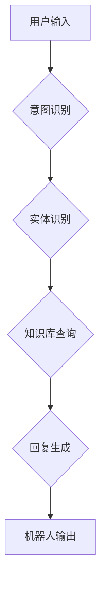

> 聊天机器人、人工智能、自然语言处理、客户服务、用户体验、机器学习、深度学习

## 1. 背景介绍

在当今数字化时代，客户服务扮演着至关重要的角色。企业需要提供快速、高效、个性化的服务体验，以满足日益增长的客户需求。传统客服模式，例如电话、邮件等，往往面临着响应时间长、处理能力有限等问题。而聊天机器人作为一种新兴的客户服务技术，凭借其智能化、自动化和可扩展性，正在迅速改变着客户服务行业的面貌。

聊天机器人是一种能够通过自然语言与用户进行对话的计算机程序。它利用人工智能技术，特别是自然语言处理（NLP）和机器学习（ML）算法，能够理解用户的意图，并提供相应的回复。聊天机器人可以用于各种客户服务场景，例如：

* **提供产品或服务信息：**解答用户关于产品功能、价格、使用说明等方面的疑问。
* **处理订单和退货：**帮助用户下单、查询订单状态、申请退货等。
* **解决常见问题：**自动处理用户遇到的常见问题，例如密码重置、账户激活等。
* **提供个性化推荐：**根据用户的历史购买记录和偏好，推荐相关产品或服务。

## 2. 核心概念与联系

### 2.1 自然语言处理（NLP）

自然语言处理是人工智能领域的一个重要分支，旨在使计算机能够理解、处理和生成人类语言。NLP技术在聊天机器人中扮演着至关重要的角色，它负责将用户的自然语言输入转换为计算机可以理解的格式，并生成自然流畅的文本输出。

### 2.2 机器学习（ML）

机器学习是人工智能的一种实现方式，它通过算法训练模型，使模型能够从数据中学习并做出预测。在聊天机器人中，机器学习算法用于训练模型，使其能够理解用户的意图、识别实体、生成回复等。

### 2.3 深度学习（DL）

深度学习是机器学习的一种高级形式，它利用多层神经网络来模拟人类大脑的学习过程。深度学习算法在自然语言处理领域取得了显著的进展，例如语言模型、机器翻译等。

**Mermaid 流程图**



## 3. 核心算法原理 & 具体操作步骤

### 3.1 算法原理概述

聊天机器人通常采用基于规则的、基于统计的或基于深度学习的算法。

* **基于规则的聊天机器人：** 这种类型的聊天机器人使用预先定义的规则和知识库来处理用户输入。当用户输入一条消息时，聊天机器人会根据规则匹配用户输入，并返回相应的回复。这种方法简单易实现，但缺乏灵活性，难以处理复杂的用户需求。

* **基于统计的聊天机器人：** 这种类型的聊天机器人使用统计模型，例如隐马尔可夫模型（HMM）或条件随机场（CRF），来预测用户的下一个词或句子。这些模型需要大量的训练数据才能达到较好的效果。

* **基于深度学习的聊天机器人：** 这种类型的聊天机器人使用深度学习算法，例如循环神经网络（RNN）或 transformers，来学习语言的语义和语法结构。深度学习模型能够处理更复杂的语言，并生成更自然流畅的回复。

### 3.2 算法步骤详解

以基于深度学习的聊天机器人为例，其工作流程如下：

1. **数据预处理：** 将用户输入的文本进行清洗、分词、词性标注等预处理操作，使其能够被模型理解。
2. **模型训练：** 使用深度学习算法训练模型，例如RNN或 transformers，使其能够学习语言的语义和语法结构。训练数据通常包括大量的对话文本。
3. **意图识别：** 将用户输入的文本作为输入，模型会输出用户的意图，例如查询产品信息、下单购买等。
4. **实体识别：** 模型会识别用户输入中的关键信息，例如产品名称、价格、数量等。
5. **回复生成：** 根据用户的意图和实体信息，模型会生成相应的回复文本。

### 3.3 算法优缺点

**优点：**

* **自然流畅的对话体验：** 深度学习模型能够生成更自然流畅的回复，与人类对话更接近。
* **可处理复杂的用户需求：** 深度学习模型能够理解更复杂的语言，并处理更复杂的对话场景。
* **可持续学习和改进：** 深度学习模型可以通过不断学习新的数据来改进其性能。

**缺点：**

* **训练数据需求量大：** 深度学习模型需要大量的训练数据才能达到较好的效果。
* **训练时间长：** 深度学习模型的训练时间通常较长。
* **解释性差：** 深度学习模型的决策过程难以解释，难以理解模型是如何生成回复的。

### 3.4 算法应用领域

基于深度学习的聊天机器人已经应用于各个领域，例如：

* **客户服务：** 自动处理用户咨询、订单、退货等问题。
* **教育：** 提供个性化的学习辅导、答疑解惑。
* **娱乐：** 提供游戏、聊天、故事等娱乐服务。
* **医疗保健：** 提供医疗咨询、预约挂号等服务。

## 4. 数学模型和公式 & 详细讲解 & 举例说明

### 4.1 数学模型构建

在聊天机器人中，常用的数学模型包括：

* **词嵌入模型：** 将单词映射到低维向量空间，捕捉单词之间的语义关系。例如Word2Vec、GloVe等。
* **语言模型：** 预测下一个词出现的概率，用于生成自然流畅的文本。例如RNN、transformers等。
* **序列标注模型：** 用于识别文本中的实体、情感等信息。例如CRF、BERT等。

### 4.2 公式推导过程

例如，Word2Vec模型使用负采样方法训练词嵌入向量。目标函数为：

$$
J(\theta) = \sum_{i=1}^{N} \sum_{j \in N(w_i)} \log \sigma(v_i^T v_j) + \sum_{i=1}^{N} \sum_{j \notin N(w_i)} \log \sigma(-v_i^T v_j)
$$

其中：

* $\theta$ 是模型参数
* $N$ 是语料库中词语的数量
* $w_i$ 是第 $i$ 个词语
* $N(w_i)$ 是 $w_i$ 的上下文词语集合
* $v_i$ 是 $w_i$ 的词嵌入向量
* $\sigma$ 是 sigmoid 函数

### 4.3 案例分析与讲解

例如，使用Word2Vec模型训练词嵌入向量，可以发现“国王”和“皇后”这两个词语的向量表示非常接近，因为它们在语义上相关。

## 5. 项目实践：代码实例和详细解释说明

### 5.1 开发环境搭建

* Python 3.x
* TensorFlow 或 PyTorch
* NLTK 或 spaCy

### 5.2 源代码详细实现

```python
# 使用 TensorFlow 训练一个简单的聊天机器人模型

import tensorflow as tf

# 定义模型结构
model = tf.keras.Sequential([
    tf.keras.layers.Embedding(input_dim=vocab_size, output_dim=embedding_dim),
    tf.keras.layers.LSTM(units=128),
    tf.keras.layers.Dense(units=vocab_size, activation='softmax')
])

# 编译模型
model.compile(optimizer='adam', loss='sparse_categorical_crossentropy', metrics=['accuracy'])

# 训练模型
model.fit(x_train, y_train, epochs=10)

# 使用模型生成回复
def generate_response(user_input):
    # 将用户输入转换为词向量
    input_vector = encoder.encode(user_input)
    # 使用模型预测下一个词
    predicted_index = model.predict(input_vector)
    # 将预测的词索引转换为词语
    response = decoder.decode(predicted_index)
    return response
```

### 5.3 代码解读与分析

* 模型结构：该代码示例使用了一个简单的循环神经网络（RNN）模型，包含嵌入层、LSTM层和全连接层。
* 训练过程：模型使用 Adam 优化器，交叉熵损失函数和准确率指标进行训练。
* 生成回复：使用预训练的词嵌入模型和训练好的聊天机器人模型，可以将用户的输入转换为词向量，并预测下一个词，从而生成回复。

### 5.4 运行结果展示

运行代码后，可以与聊天机器人进行对话，例如：

```
用户：你好
聊天机器人：你好！
用户：今天天气怎么样？
聊天机器人：今天天气晴朗。
```

## 6. 实际应用场景

### 6.1 电商客服

聊天机器人可以帮助电商平台处理客户咨询、订单查询、退货申请等问题，提高客户服务效率。

### 6.2 金融服务

聊天机器人可以帮助银行处理客户账户查询、转账、理财咨询等问题，提高客户服务体验。

### 6.3 医疗保健

聊天机器人可以帮助医院处理患者预约挂号、咨询病情、获取医疗信息等问题，提高医疗服务效率。

### 6.4 未来应用展望

随着人工智能技术的不断发展，聊天机器人将应用于更多领域，例如教育、娱乐、交通等。未来，聊天机器人将更加智能化、个性化、人性化，能够更好地满足用户的需求。

## 7. 工具和资源推荐

### 7.1 学习资源推荐

* **书籍：**
    * 《深度学习》
    * 《自然语言处理》
* **在线课程：**
    * Coursera
    * edX
    * Udacity

### 7.2 开发工具推荐

* **TensorFlow:** https://www.tensorflow.org/
* **PyTorch:** https://pytorch.org/
* **NLTK:** https://www.nltk.org/
* **spaCy:** https://spacy.io/

### 7.3 相关论文推荐

* **Attention Is All You Need:** https://arxiv.org/abs/1706.03762
* **BERT: Pre-training of Deep Bidirectional Transformers for Language Understanding:** https://arxiv.org/abs/1810.04805

## 8. 总结：未来发展趋势与挑战

### 8.1 研究成果总结

近年来，聊天机器人技术取得了显著进展，特别是深度学习技术的应用，使得聊天机器人能够处理更复杂的对话场景，并提供更自然流畅的对话体验。

### 8.2 未来发展趋势

* **更智能的对话能力：** 未来聊天机器人将更加智能，能够理解更复杂的语言，并进行更自然的对话。
* **更个性化的服务体验：** 聊天机器人将能够根据用户的个人喜好和需求，提供更个性化的服务体验。
* **多模态交互：** 未来聊天机器人将支持多模态交互，例如语音、图像、视频等，提供更丰富的用户体验。

### 8.3 面临的挑战

* **数据标注问题：** 训练高质量的聊天机器人模型需要大量的标注数据，数据标注成本高昂。
* **对话理解问题：** 聊天机器人仍然难以理解复杂的对话上下文，例如讽刺、幽默等。
* **伦理问题：** 聊天机器人可能会被用于欺骗、传播虚假信息等恶意目的，需要考虑伦理问题。

### 8.4 研究展望

未来，研究人员将继续致力于解决上述挑战，开发更智能、更安全、更可靠的聊天机器人技术。


## 9. 附录：常见问题与解答

### 9.1 如何选择合适的聊天机器人平台？

选择聊天机器人平台需要考虑以下因素：

* **功能需求：** 不同的平台提供不同的功能，例如意图识别、实体识别、回复生成等。
* **开发成本：** 不同的平台有不同的开发成本，例如平台费用