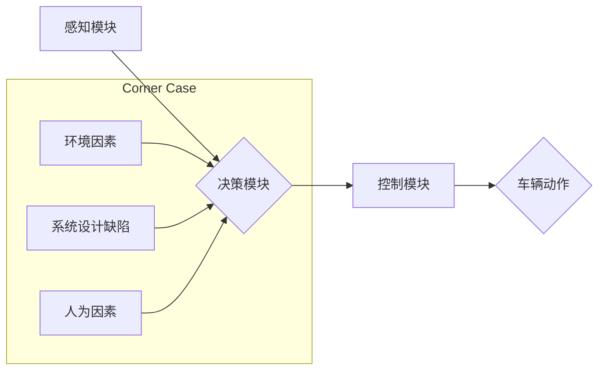

> 自动驾驶, corner case, 异常情况, 深度学习, 强化学习, 安全性, 鲁棒性

## 1. 背景介绍

自动驾驶技术作为未来交通运输的重要发展方向，近年来取得了显著进展。从早期感知、定位、决策等技术突破，到如今的自动驾驶汽车在城市道路上试行，自动驾驶技术已经逐渐走向现实。然而，自动驾驶技术仍然面临着诸多挑战，其中“corner case”问题尤为突出。

“corner case”是指在特定场景下，自动驾驶系统难以处理的特殊情况，这些情况通常是罕见、不可预测的，并且可能导致系统出现错误或事故。例如，突然出现的行人、道路上的障碍物、恶劣天气条件等，都可能成为自动驾驶系统的“corner case”。

## 2. 核心概念与联系

**2.1 自动驾驶系统架构**

自动驾驶系统通常由感知、决策、控制三个主要模块组成：

* **感知模块:** 负责收集车辆周围环境的信息，例如道路状况、车辆位置、行人信息等。常用的感知技术包括摄像头、雷达、激光雷达等。
* **决策模块:** 负责分析感知到的环境信息，并做出相应的驾驶决策，例如加速、减速、转向等。决策模块通常基于深度学习、强化学习等人工智能算法。
* **控制模块:** 负责将决策模块的指令转化为车辆的实际动作，例如控制油门、刹车、方向盘等。

**2.2 Corner Case 的定义与分类**

“corner case”是指在自动驾驶系统运行过程中，由于环境因素、系统设计缺陷等原因，导致系统无法正常处理的特殊情况。

根据不同的分类标准，corner case 可以分为以下几类：

* **环境因素:** 恶劣天气、复杂路况、突然出现的障碍物等。
* **系统设计缺陷:** 算法漏洞、数据偏差、传感器故障等。
* **人为因素:** 行人行为异常、其他车辆驾驶不规范等。

**2.3 Corner Case 的危害**

corner case 的出现可能导致以下危害：

* **安全事故:** 自动驾驶系统无法正确处理corner case，可能导致车辆发生碰撞、翻车等事故。
* **系统崩溃:** corner case 可能导致自动驾驶系统出现错误或崩溃，无法正常运行。
* **用户信任度下降:** 由于corner case 的出现，用户对自动驾驶技术的信任度会下降，从而阻碍自动驾驶技术的普及。

**2.4 Mermaid 流程图**



## 3. 核心算法原理 & 具体操作步骤

### 3.1 算法原理概述

为了应对corner case 的挑战，自动驾驶系统需要采用更加鲁棒、可靠的算法。一些常用的算法包括：

* **深度学习:** 深度学习算法能够从海量数据中学习复杂的特征，提高自动驾驶系统的感知和决策能力。
* **强化学习:** 强化学习算法能够通过与环境交互学习，不断优化驾驶策略，提高自动驾驶系统的适应性和鲁棒性。
* **模型预测控制:** 模型预测控制算法能够预测未来环境状态，并根据预测结果制定最优驾驶策略，提高自动驾驶系统的安全性。

### 3.2 算法步骤详解

以深度学习算法为例，其具体操作步骤如下：

1. **数据收集:** 收集大量的驾驶场景数据，包括图像、视频、传感器数据等。
2. **数据预处理:** 对收集到的数据进行清洗、格式化、标注等预处理操作。
3. **模型训练:** 使用深度学习框架，例如TensorFlow、PyTorch等，训练深度学习模型。
4. **模型评估:** 使用测试数据评估模型的性能，例如准确率、召回率等。
5. **模型部署:** 将训练好的模型部署到自动驾驶系统中。

### 3.3 算法优缺点

**优点:**

* 能够学习复杂的特征，提高感知和决策能力。
* 能够适应不同的驾驶场景。

**缺点:**

* 需要大量的训练数据。
* 训练过程耗时、耗能。
* 对数据质量要求高。

### 3.4 算法应用领域

深度学习算法广泛应用于自动驾驶系统的各个模块，例如：

* **目标检测:** 检测道路上的车辆、行人、障碍物等。
* **路径规划:** 规划车辆行驶的路径。
* **驾驶决策:** 决策车辆的加速、减速、转向等动作。

## 4. 数学模型和公式 & 详细讲解 & 举例说明

### 4.1 数学模型构建

自动驾驶系统的决策模块通常基于强化学习算法，其核心是构建一个数学模型来描述环境状态、动作选择和奖励机制。

**状态空间:**  表示车辆周围环境的所有可观测信息，例如车辆位置、速度、方向、周围车辆信息、道路状况等。

**动作空间:** 表示车辆可以执行的所有动作，例如加速、减速、转向等。

**奖励函数:**  根据车辆的行为和环境状态，给予相应的奖励或惩罚。奖励函数的设计至关重要，它决定了自动驾驶系统学习的目标和行为策略。

### 4.2 公式推导过程

强化学习算法的核心是通过迭代更新策略函数来最大化累积奖励。策略函数表示在给定状态下选择动作的概率分布。

常用的策略函数更新公式为：

$$
\theta_{t+1} = \theta_t + \alpha \nabla_{\theta} J(\theta)
$$

其中：

* $\theta$ 表示策略函数的参数。
* $t$ 表示时间步。
* $\alpha$ 表示学习率。
* $J(\theta)$ 表示累积奖励函数。
* $\nabla_{\theta} J(\theta)$ 表示累积奖励函数对策略函数参数的梯度。

### 4.3 案例分析与讲解

假设自动驾驶系统需要学习在十字路口停车的策略。

* **状态空间:** 包括车辆位置、速度、方向、红绿灯状态、周围车辆信息等。
* **动作空间:** 包括加速、减速、转向等。
* **奖励函数:** 当车辆安全停靠在十字路口时给予奖励，否则给予惩罚。

通过强化学习算法，自动驾驶系统可以不断学习，优化其停车策略，最终能够在十字路口安全停车。

## 5. 项目实践：代码实例和详细解释说明

### 5.1 开发环境搭建

* 操作系统: Ubuntu 20.04
* Python 版本: 3.8
* 深度学习框架: TensorFlow 2.0

### 5.2 源代码详细实现

```python
import tensorflow as tf

# 定义神经网络模型
model = tf.keras.models.Sequential([
    tf.keras.layers.Conv2D(32, (3, 3), activation='relu', input_shape=(64, 64, 3)),
    tf.keras.layers.MaxPooling2D((2, 2)),
    tf.keras.layers.Conv2D(64, (3, 3), activation='relu'),
    tf.keras.layers.MaxPooling2D((2, 2)),
    tf.keras.layers.Flatten(),
    tf.keras.layers.Dense(10, activation='softmax')
])

# 定义损失函数和优化器
loss_fn = tf.keras.losses.CategoricalCrossentropy()
optimizer = tf.keras.optimizers.Adam(learning_rate=0.001)

# 训练模型
model.compile(loss=loss_fn, optimizer=optimizer)
model.fit(x_train, y_train, epochs=10)

# 评估模型
loss, accuracy = model.evaluate(x_test, y_test)
print('Loss:', loss)
print('Accuracy:', accuracy)
```

### 5.3 代码解读与分析

* 代码首先定义了一个简单的卷积神经网络模型，用于分类任务。
* 然后定义了损失函数和优化器，用于训练模型。
* 接着使用 `model.fit()` 函数训练模型，传入训练数据和训练轮数。
* 最后使用 `model.evaluate()` 函数评估模型，传入测试数据并打印损失和准确率。

### 5.4 运行结果展示

训练完成后，可以将模型应用于实际场景，例如识别道路上的车辆、行人等。

## 6. 实际应用场景

### 6.1 自动驾驶汽车

自动驾驶汽车是自动驾驶技术的典型应用场景，其需要处理各种复杂的环境情况，例如拥堵交通、复杂路况、恶劣天气等。

### 6.2 无人机

无人机在物流、农业、监控等领域有着广泛的应用，其需要能够自主避障、路径规划等能力。

### 6.3 机器人

机器人需要能够感知周围环境、做出决策、执行动作，例如工业机器人、服务机器人等。

### 6.4 未来应用展望

随着自动驾驶技术的不断发展，其应用场景将会更加广泛，例如：

* **智能交通系统:** 自动驾驶车辆可以与交通信号灯、道路设施等进行交互，提高交通效率和安全性。
* **智能城市:** 自动驾驶车辆可以为城市提供多种服务，例如公共交通、货运配送等。
* **个性化出行:** 自动驾驶车辆可以根据用户的需求提供个性化的出行服务，例如自动驾驶出租车、自动驾驶共享汽车等。

## 7. 工具和资源推荐

### 7.1 学习资源推荐

* **书籍:**
    * 《深度学习》
    * 《强化学习：原理、算法和应用》
* **在线课程:**
    * Coursera: 深度学习
    * Udacity: 自动驾驶工程师
* **开源项目:**
    * TensorFlow
    * PyTorch
    * Autoware

### 7.2 开发工具推荐

* **仿真平台:**
    * CARLA
    * Gazebo
* **数据标注工具:**
    * LabelImg
    * CVAT

### 7.3 相关论文推荐

* **深度学习在自动驾驶中的应用:**
    * “End to End Learning for Self-Driving Cars”
* **强化学习在自动驾驶中的应用:**
    * “Learning to Drive with Deep Reinforcement Learning”

## 8. 总结：未来发展趋势与挑战

### 8.1 研究成果总结

近年来，自动驾驶技术取得了显著进展，特别是深度学习和强化学习算法的应用，为自动驾驶系统的感知、决策和控制能力带来了提升。

### 8.2 未来发展趋势

* **更鲁棒的算法:** 需要开发更加鲁棒、可靠的算法，能够应对各种corner case。
* **更强大的计算能力:** 自动驾驶系统需要处理海量数据，需要更强大的计算能力来支持。
* **更完善的法律法规:** 需要制定更完善的法律法规，规范自动驾驶技术的应用。

### 8.3 面临的挑战

* **corner case 的处理:** 仍然存在许多corner case，难以被现有的算法处理。
* **数据安全:** 自动驾驶系统需要收集大量的用户数据，需要保证数据的安全和隐私。
* **伦理问题:** 自动驾驶系统可能会面临一些伦理问题，例如在紧急情况下如何做出决策。

### 8.4 研究展望

未来，自动驾驶技术将继续朝着更加安全、可靠、智能的方向发展。需要加强对corner case 的研究，开发更加鲁棒的算法；需要提升计算能力，支持更复杂的算法和数据处理；需要完善法律法规，规范自动驾驶技术的应用；需要关注伦理问题，确保自动驾驶技术的安全和可持续发展。

## 9. 附录：常见问题与解答

### 9.1 什么是corner case？

corner case是指在自动驾驶系统运行过程中，由于环境因素、系统设计缺陷等原因，导致系统无法正常处理的特殊情况。

### 9.2 如何应对corner case？

应对corner case 需要从以下几个方面入手：

* **数据增强:** 收集更多样化的数据，包括corner case 数据，提高模型的鲁棒性。
* **算法改进:** 开发更加鲁棒、可靠的算法，能够应对各种corner case。
* **