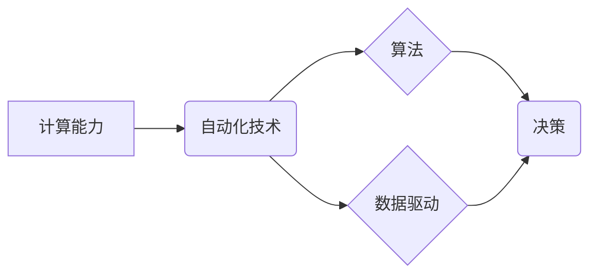

> 计算能力、自动化技术、机器学习、深度学习、人工智能、算法效率、数据驱动、计算模型、软件开发

## 1. 背景介绍

自动化技术在各个领域蓬勃发展，从制造业到金融，再到医疗保健，自动化正在改变着我们生活的方方面面。而计算能力的飞速发展是推动自动化技术进步的根本动力。随着摩尔定律的持续演进，计算机处理器性能不断提升，存储容量和网络带宽也得到显著扩展。这些计算资源的丰富和便捷为自动化技术提供了强大的基础设施支持。

然而，计算能力的提升并非自动化技术进步的唯一因素。算法的创新和数据驱动也是至关重要的。机器学习和深度学习等人工智能技术的发展，使得自动化系统能够从海量数据中学习和优化，从而实现更智能、更精准的自动化决策。

## 2. 核心概念与联系

**2.1 计算能力与自动化技术的关系**

计算能力是自动化技术的基石。自动化技术依赖于计算能力来执行复杂的逻辑运算、数据处理和模型训练。计算能力的提升直接关系到自动化系统的效率、精度和智能水平。

**2.2 算法与自动化技术的关系**

算法是自动化技术的灵魂。算法定义了自动化系统如何处理数据、做出决策和完成任务。算法的优劣直接影响着自动化系统的性能和效果。

**2.3 数据驱动与自动化技术的关系**

数据是自动化技术的燃料。自动化系统需要大量的数据来训练模型、优化算法和进行决策。数据质量和数据量直接关系到自动化系统的准确性和可靠性。

**2.4 核心概念架构图**



## 3. 核心算法原理 & 具体操作步骤

**3.1 算法原理概述**

机器学习算法是自动化技术的核心，它允许计算机从数据中学习并改进其性能。常见的机器学习算法包括：

* **监督学习:** 利用标记数据训练模型，预测未来结果。例如，图像分类、文本分类等。
* **无监督学习:** 从未标记数据中发现模式和结构。例如，聚类分析、异常检测等。
* **强化学习:** 通过试错学习，在环境中获得最大奖励。例如，游戏AI、机器人控制等。

**3.2 算法步骤详解**

以监督学习为例，其基本步骤如下：

1. **数据收集和预处理:** 收集相关数据，并进行清洗、转换和特征工程等预处理操作。
2. **模型选择:** 根据任务需求选择合适的机器学习模型。
3. **模型训练:** 利用标记数据训练模型，调整模型参数，使其能够准确预测目标变量。
4. **模型评估:** 使用测试数据评估模型的性能，例如准确率、召回率、F1-score等。
5. **模型部署:** 将训练好的模型部署到实际应用场景中，用于预测和决策。

**3.3 算法优缺点**

* **优点:** 能够从数据中学习，自动发现模式和规律，无需人工编程，具有强大的泛化能力。
* **缺点:** 需要大量的数据进行训练，训练过程可能耗时和耗能，对数据质量要求高，容易受到数据偏差的影响。

**3.4 算法应用领域**

机器学习算法广泛应用于各个领域，例如：

* **图像识别:** 人脸识别、物体检测、图像分类等。
* **自然语言处理:** 文本分类、情感分析、机器翻译等。
* **推荐系统:** 商品推荐、内容推荐、用户画像等。
* **金融领域:** 风险评估、欺诈检测、信用评分等。
* **医疗保健:** 疾病诊断、药物研发、患者监测等。

## 4. 数学模型和公式 & 详细讲解 & 举例说明

**4.1 数学模型构建**

机器学习算法通常基于数学模型，例如线性回归、逻辑回归、支持向量机等。这些模型通过数学公式来描述数据之间的关系，并预测目标变量的值。

**4.2 公式推导过程**

例如，线性回归模型的目标是找到一条直线，使得这条直线与数据点之间的误差最小。其数学公式如下：

$$y = w_0 + w_1x$$

其中，$y$ 是目标变量，$x$ 是输入变量，$w_0$ 和 $w_1$ 是模型参数。

通过最小化误差函数，可以求解出最佳的模型参数 $w_0$ 和 $w_1$。

**4.3 案例分析与讲解**

假设我们有一个数据集，包含房屋面积和房屋价格的信息。我们可以使用线性回归模型来预测房屋价格。

* 输入变量：房屋面积
* 目标变量：房屋价格

通过训练线性回归模型，我们可以得到一个模型参数 $w_0$ 和 $w_1$。

例如，假设我们得到以下模型参数：

* $w_0 = 10000$
* $w_1 = 500$

这意味着，一个面积为 $x$ 平方米的房屋，其价格可以预测为 $10000 + 500x$ 元。

## 5. 项目实践：代码实例和详细解释说明

**5.1 开发环境搭建**

可以使用 Python 语言和相关的机器学习库，例如 scikit-learn，TensorFlow 或 PyTorch，来实现机器学习项目。

**5.2 源代码详细实现**

```python
from sklearn.linear_model import LinearRegression
import pandas as pd

# 加载数据
data = pd.read_csv('house_data.csv')

# 分割数据
X = data[['面积']]
y = data['价格']

# 创建线性回归模型
model = LinearRegression()

# 训练模型
model.fit(X, y)

# 获取模型参数
w0 = model.intercept_
w1 = model.coef_[0]

# 打印模型参数
print(f'模型参数: w0 = {w0}, w1 = {w1}')

# 预测房屋价格
new_area = 150
predicted_price = w0 + w1 * new_area
print(f'面积为 {new_area} 平方米的房屋价格预测为: {predicted_price} 元')
```

**5.3 代码解读与分析**

* 首先，我们加载数据并将其分割成输入变量 $X$ 和目标变量 $y$。
* 然后，我们创建线性回归模型并使用训练数据进行训练。
* 训练完成后，我们可以获取模型参数 $w_0$ 和 $w_1$。
* 最后，我们可以使用模型参数预测新的房屋价格。

**5.4 运行结果展示**

运行代码后，会输出模型参数 $w_0$ 和 $w_1$，以及根据输入面积预测的房屋价格。

## 6. 实际应用场景

**6.1 自动化制造**

自动化技术在制造业中广泛应用，例如机器人焊接、自动装配线、智能库存管理等。

**6.2 自动化物流**

自动化技术可以提高物流效率，例如自动导引车、智能仓库管理系统、无人配送等。

**6.3 自动化金融**

自动化技术可以提高金融服务效率，例如自动交易、风险评估、欺诈检测等。

**6.4 自动化医疗保健**

自动化技术可以辅助医疗诊断和治疗，例如智能影像分析、机器人手术、个性化医疗等。

**6.5 未来应用展望**

随着计算能力和人工智能技术的不断发展，自动化技术将应用于更多领域，例如自动驾驶、个性化教育、智能家居等。

## 7. 工具和资源推荐

**7.1 学习资源推荐**

* **在线课程:** Coursera、edX、Udacity 等平台提供丰富的机器学习和人工智能课程。
* **书籍:** 《深入理解机器学习》、《Python机器学习实战》等书籍。
* **开源项目:** TensorFlow、PyTorch、scikit-learn 等开源项目。

**7.2 开发工具推荐**

* **Python:** 广泛用于机器学习和人工智能开发。
* **Jupyter Notebook:** 用于编写和执行 Python 代码，并可视化数据和模型结果。
* **IDE:** PyCharm、VS Code 等 IDE 提供强大的代码编辑和调试功能。

**7.3 相关论文推荐**

* **AlphaGo论文:** DeepMind 发布的 AlphaGo 论文，介绍了深度学习在围棋领域的应用。
* **BERT论文:** Google 发布的 BERT 论文，介绍了基于 Transformer 架构的语言模型。

## 8. 总结：未来发展趋势与挑战

**8.1 研究成果总结**

近年来，自动化技术取得了显著进展，人工智能技术已经能够完成许多复杂的任务，例如图像识别、自然语言处理、游戏AI等。

**8.2 未来发展趋势**

* **更强大的计算能力:** 量子计算、神经形态计算等新兴计算技术将推动自动化技术的发展。
* **更智能的算法:** 深度学习、强化学习等算法将继续发展，使自动化系统更加智能和灵活。
* **更广泛的应用场景:** 自动化技术将应用于更多领域，例如自动驾驶、个性化教育、智能家居等。

**8.3 面临的挑战**

* **数据安全和隐私:** 自动化系统依赖于大量数据，如何保护数据安全和隐私是一个重要挑战。
* **算法偏见:** 算法可能受到训练数据的影响，导致算法偏见，需要采取措施解决这个问题。
* **伦理问题:** 自动化技术的发展引发了一些伦理问题，例如工作岗位替代、人工智能的责任等，需要进行深入探讨和研究。

**8.4 研究展望**

未来，自动化技术将继续发展，为人类社会带来更多便利和福祉。我们需要加强对自动化技术的研究和开发，并积极应对其带来的挑战，确保自动化技术能够安全、可靠、公平地发展。

## 9. 附录：常见问题与解答

**9.1 如何选择合适的机器学习算法？**

选择合适的机器学习算法取决于具体的任务需求和数据特点。例如，对于分类任务，可以考虑逻辑回归、支持向量机、决策树等算法；对于回归任务，可以考虑线性回归、支持向量回归等算法。

**9.2 如何评估机器学习模型的性能？**

常用的机器学习模型性能评估指标包括准确率、召回率、F1-score、AUC等。

**9.3 如何解决机器学习算法的过拟合问题？**

过拟合是指模型在训练数据上表现良好，但在测试数据上表现较差。解决过拟合问题的方法包括：

* 减少模型复杂度
* 增加训练数据量
* 使用正则化技术
* 使用交叉验证

作者：禅与计算机程序设计艺术 / Zen and the Art of Computer Programming


<end_of_turn>