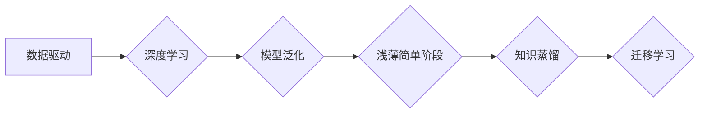

> 认知发展，浅薄简单阶段，人工智能，深度学习，模型泛化，数据驱动，知识蒸馏，迁移学习

## 1. 背景介绍

在人工智能领域，模型的性能提升一直是研究的热点。从最初的规则式人工智能到如今的深度学习，我们不断探索更有效、更智能的学习方法。然而，随着模型规模和复杂度的增加，训练数据需求也随之膨胀，这导致了训练成本高昂、数据稀缺等问题。

同时，我们也观察到，许多深度学习模型在特定领域表现出色，但在其他领域则表现欠佳。这表明，现有的深度学习模型往往存在着“过拟合”的现象，即模型过于依赖训练数据，难以泛化到新的场景。

因此，如何构建更通用的、更易于迁移的模型，成为人工智能领域亟待解决的关键问题。

## 2. 核心概念与联系

**浅薄简单阶段**指的是人工智能模型在认知发展过程中，处于初期阶段，模型结构简单，知识储备有限，只能处理简单问题。

**深度学习**是一种机器学习方法，通过多层神经网络模拟人类大脑的学习过程，能够学习复杂的数据模式。

**模型泛化**是指模型能够将从训练数据中学到的知识应用到新的、未见过的数据上。

**数据驱动**是指人工智能模型的训练和优化完全依赖于数据。

**知识蒸馏**是一种模型压缩技术，通过将知识从大型模型转移到小型模型中，实现模型的知识迁移和泛化能力提升。

**迁移学习**是一种机器学习方法，通过利用已训练好的模型在新的任务上进行微调，减少训练数据需求和训练时间。

**Mermaid 流程图:**



## 3. 核心算法原理 & 具体操作步骤

### 3.1  算法原理概述

浅薄简单阶段的模型通常采用简单的结构，例如线性回归、逻辑回归等。这些模型的训练过程主要依赖于数据驱动，通过最小化模型预测误差来优化模型参数。

### 3.2  算法步骤详解

1. **数据预处理:** 将原始数据进行清洗、转换、特征工程等操作，使其适合模型训练。
2. **模型选择:** 根据任务需求选择合适的模型结构，例如线性回归、逻辑回归等。
3. **模型训练:** 使用训练数据训练模型，通过最小化模型预测误差来优化模型参数。
4. **模型评估:** 使用测试数据评估模型性能，例如准确率、召回率等。
5. **模型调参:** 根据模型评估结果，调整模型参数，例如学习率、正则化参数等，以提高模型性能。

### 3.3  算法优缺点

**优点:**

* 模型结构简单，易于理解和实现。
* 训练速度快，资源消耗低。

**缺点:**

* 表现能力有限，难以处理复杂问题。
* 容易过拟合，泛化能力差。

### 3.4  算法应用领域

浅薄简单阶段的模型主要应用于简单预测任务，例如：

* 线性回归：预测连续数值，例如房价、股票价格等。
* 逻辑回归：分类问题，例如垃圾邮件分类、客户流失预测等。

## 4. 数学模型和公式 & 详细讲解 & 举例说明

### 4.1  数学模型构建

**线性回归模型:**

$$
y = w_0 + w_1x_1 + w_2x_2 + ... + w_nx_n + \epsilon
$$

其中：

* $y$ 是预测值
* $w_0, w_1, ..., w_n$ 是模型参数
* $x_1, x_2, ..., x_n$ 是输入特征
* $\epsilon$ 是误差项

### 4.2  公式推导过程

线性回归模型的目标是找到最优的模型参数，使得模型预测值与真实值之间的误差最小。常用的误差函数是均方误差 (MSE):

$$
MSE = \frac{1}{n} \sum_{i=1}^{n} (y_i - \hat{y}_i)^2
$$

其中：

* $n$ 是样本数量
* $y_i$ 是真实值
* $\hat{y}_i$ 是模型预测值

通过最小化 MSE，可以得到最优的模型参数。

### 4.3  案例分析与讲解

假设我们想要预测房价，输入特征包括房屋面积、房间数量等。我们可以使用线性回归模型来建立房价预测模型。

通过训练数据，我们可以得到模型参数，例如：

* $w_0 = 100000$
* $w_1 = 500$
* $w_2 = 10000$

这意味着，房屋面积每增加 1 平方米，房价会增加 500 元；房间数量每增加 1 个，房价会增加 10000 元。

## 5. 项目实践：代码实例和详细解释说明

### 5.1  开发环境搭建

* Python 3.x
* scikit-learn 库

### 5.2  源代码详细实现

```python
from sklearn.linear_model import LinearRegression
from sklearn.model_selection import train_test_split
import pandas as pd

# 加载数据
data = pd.read_csv('house_price.csv')

# 分割数据
X = data[['area', 'rooms']]
y = data['price']
X_train, X_test, y_train, y_test = train_test_split(X, y, test_size=0.2, random_state=42)

# 创建线性回归模型
model = LinearRegression()

# 训练模型
model.fit(X_train, y_train)

# 预测测试数据
y_pred = model.predict(X_test)

# 评估模型性能
from sklearn.metrics import mean_squared_error
mse = mean_squared_error(y_test, y_pred)
print(f'Mean Squared Error: {mse}')
```

### 5.3  代码解读与分析

* 首先，我们加载数据并将其分割为训练集和测试集。
* 然后，我们创建线性回归模型并使用训练数据进行训练。
* 训练完成后，我们使用测试数据进行预测，并计算模型性能指标 MSE。

### 5.4  运行结果展示

运行代码后，会输出模型的 MSE 值，该值越小，模型性能越好。

## 6. 实际应用场景

浅薄简单阶段的模型在以下场景中具有应用价值：

* **数据量少、特征简单**的场景，例如小型企业的销售预测、简单的分类任务等。
* **实时性要求高**的场景，例如股票交易系统、网络安全系统等。
* **资源受限**的场景，例如嵌入式系统、移动设备等。

### 6.4  未来应用展望

随着人工智能技术的不断发展，浅薄简单阶段的模型将逐渐被更复杂的模型所取代。然而，这些模型仍然在一些特定场景中具有应用价值，例如：

* **边缘计算:** 在资源受限的边缘设备上部署，进行实时数据处理和决策。
* **知识蒸馏:** 将知识从大型模型转移到小型模型中，实现模型压缩和高效部署。
* **联邦学习:** 在隐私保护的前提下，将多个用户的模型进行联合训练，提升模型泛化能力。

## 7. 工具和资源推荐

### 7.1  学习资源推荐

* **书籍:**
    * 《机器学习》 - 周志华
    * 《深入理解机器学习》 -  李航
* **在线课程:**
    * Coursera: Machine Learning
    * edX: Artificial Intelligence

### 7.2  开发工具推荐

* **Python:** 
    * scikit-learn
    * TensorFlow
    * PyTorch

### 7.3  相关论文推荐

* **《Knowledge Distillation》** - Hinton et al. (2015)
* **《Transfer Learning》** - Pan et al. (2010)
* **《Federated Learning》** - McMahan et al. (2017)

## 8. 总结：未来发展趋势与挑战

### 8.1  研究成果总结

浅薄简单阶段的模型虽然在性能上不如深度学习模型，但其易于理解、实现和部署的优势使其在特定场景中仍然具有应用价值。

### 8.2  未来发展趋势

* **模型压缩:** 通过知识蒸馏、量化等技术，将大型模型压缩为更小的模型，降低部署成本和资源消耗。
* **高效训练:** 研究更有效的训练算法，减少训练时间和数据需求。
* **迁移学习:** 探索更有效的迁移学习方法，提高模型在不同领域和任务上的泛化能力。

### 8.3  面临的挑战

* **模型泛化能力:** 浅薄简单阶段的模型容易过拟合，泛化能力不足。
* **数据依赖性:** 模型性能高度依赖于训练数据质量和数量。
* **解释性:** 浅薄简单阶段的模型难以解释其决策过程，缺乏透明度。

### 8.4  研究展望

未来，我们将继续探索更有效的浅薄简单阶段模型，使其能够更好地应对实际应用场景中的挑战。

## 9. 附录：常见问题与解答

**Q1: 浅薄简单阶段的模型与深度学习模型相比，有什么优势？**

**A1:** 浅薄简单阶段的模型易于理解、实现和部署，训练速度快，资源消耗低。

**Q2: 浅薄简单阶段的模型有哪些局限性？**

**A2:** 浅薄简单阶段的模型性能有限，难以处理复杂问题，容易过拟合，泛化能力差。

**Q3: 浅薄简单阶段的模型有哪些应用场景？**

**A3:** 数据量少、特征简单、实时性要求高、资源受限的场景。

作者：禅与计算机程序设计艺术 / Zen and the Art of Computer Programming


<end_of_turn>