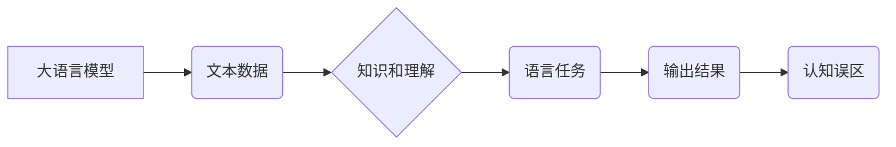

> 大语言模型，认知误区，推理能力，逻辑错误，知识图谱，因果关系，可解释性

## 1. 背景介绍

近年来，大语言模型（LLM）在自然语言处理领域取得了令人瞩目的成就。从文本生成、翻译到问答和代码编写，LLM展现出强大的能力，甚至被认为具有某种程度的“智能”。然而，尽管LLM取得了如此巨大的进步，它们仍然存在着一些关键的认知误区，尤其是在推理能力方面。

传统的AI系统通常依赖于明确的规则和逻辑程序，而LLM则通过学习海量文本数据来构建其知识和理解。这种学习方式使得LLM能够处理更复杂和灵活的语言任务，但也带来了新的挑战。由于LLM的训练数据往往包含大量噪声和偏差，它们可能会学习到错误的推理模式，并产生逻辑错误的输出。

## 2. 核心概念与联系

**2.1 大语言模型 (LLM)**

大语言模型是一种基于Transformer架构的深度学习模型，通过学习大量的文本数据来理解和生成人类语言。它们拥有大量的参数，能够捕捉语言的复杂结构和语义关系。

**2.2 认知误区**

认知误区是指人类或人工智能系统在认知过程中出现的偏差或错误。在LLM的语境下，认知误区主要体现在以下几个方面：

* **逻辑推理能力不足:** 尽管LLM能够处理复杂的语言任务，但它们在逻辑推理方面仍然存在着明显的缺陷。例如，LLM可能无法正确理解因果关系，或者容易受到逻辑谬误的影响。
* **知识图谱构建困难:** LLM缺乏明确的知识表示和推理机制，难以构建完整的知识图谱。这导致它们在回答需要综合多源信息的问题时表现不佳。
* **可解释性差:** LLM的决策过程非常复杂，难以解释其输出结果背后的逻辑。这使得我们难以理解LLM的错误原因，并进行有效的改进。

**2.3 核心概念关系图**



## 3. 核心算法原理 & 具体操作步骤

**3.1 算法原理概述**

LLM的核心算法是Transformer，它是一种基于注意力机制的深度神经网络架构。Transformer能够有效地捕捉文本序列中的长距离依赖关系，从而实现更准确的语言理解和生成。

**3.2 算法步骤详解**

1. **词嵌入:** 将输入文本中的每个词转换为向量表示，以便模型能够理解它们的语义信息。
2. **多头注意力:** 利用多个注意力头来捕捉文本序列中不同词之间的关系，并赋予每个词不同的权重。
3. **前馈神经网络:** 对每个词的注意力输出进行进一步处理，提取更深层的语义特征。
4. **位置编码:** 将词的顺序信息编码到向量表示中，因为Transformer模型本身无法直接理解词的顺序。
5. **解码器:** 基于编码器的输出，生成目标文本序列。

**3.3 算法优缺点**

**优点:**

* 能够捕捉长距离依赖关系
* 训练效率高
* 表现优异

**缺点:**

* 参数量大，计算资源需求高
* 可解释性差
* 容易受到训练数据偏差的影响

**3.4 算法应用领域**

* 文本生成
* 机器翻译
* 问答系统
* 代码生成
* 文本摘要

## 4. 数学模型和公式 & 详细讲解 & 举例说明

**4.1 数学模型构建**

LLM的数学模型主要基于概率论和统计学。其目标是学习一个概率分布，该分布能够生成符合人类语言规律的文本序列。

**4.2 公式推导过程**

LLM的训练过程通常使用最大似然估计（MLE）方法，其目标函数是最大化模型生成训练数据中文本序列的概率。

$$
\mathcal{L} = \prod_{i=1}^{N} p(w_i | w_{<i})
$$

其中：

* $\mathcal{L}$ 是目标函数
* $N$ 是文本序列的长度
* $w_i$ 是文本序列中的第 $i$ 个词
* $w_{<i}$ 是 $w_i$ 之前的词

**4.3 案例分析与讲解**

假设我们有一个训练数据集，包含以下文本序列：

"The cat sat on the mat."

LLM的目标是学习一个概率分布，能够生成类似的文本序列。通过训练，LLM会学习到每个词出现的概率，以及不同词之间的关系。例如，LLM会学习到 "cat" 和 "sat" 经常出现在一起，而 "mat" 则通常出现在 "on" 之后。

## 5. 项目实践：代码实例和详细解释说明

**5.1 开发环境搭建**

* Python 3.7+
* PyTorch 或 TensorFlow
* CUDA 和 cuDNN

**5.2 源代码详细实现**

```python
import torch
import torch.nn as nn

class Transformer(nn.Module):
    def __init__(self, vocab_size, embedding_dim, num_heads, num_layers):
        super(Transformer, self).__init__()
        # ... (代码实现 Transformer 模型结构)

    def forward(self, x):
        # ... (代码实现 Transformer 模型前向传播过程)

# 实例化 Transformer 模型
model = Transformer(vocab_size=10000, embedding_dim=512, num_heads=8, num_layers=6)

# ... (代码实现训练和评估过程)
```

**5.3 代码解读与分析**

* `Transformer` 类定义了 Transformer 模型的结构和前向传播过程。
* `vocab_size` 表示词典的大小。
* `embedding_dim` 表示词向量的维度。
* `num_heads` 表示注意力头的数量。
* `num_layers` 表示 Transformer 模型的层数。

**5.4 运行结果展示**

* 使用训练好的模型生成文本序列。
* 评估模型在文本生成任务上的性能。

## 6. 实际应用场景

**6.1 文本生成**

* 自动生成新闻报道、小说、诗歌等文本。
* 创建聊天机器人，进行自然语言对话。

**6.2 机器翻译**

* 将文本从一种语言翻译成另一种语言。

**6.3 问答系统**

* 回答用户提出的问题，提供相关信息。

**6.4 代码生成**

* 根据自然语言描述生成代码。

**6.5 文本摘要**

* 提取文本的关键信息，生成简短的摘要。

**6.6 未来应用展望**

* 更智能的聊天机器人和虚拟助手
* 个性化教育和学习体验
* 更高效的代码开发和维护
* 更强大的文本分析和理解能力

## 7. 工具和资源推荐

**7.1 学习资源推荐**

* **书籍:**
    * 《深度学习》
    * 《自然语言处理》
* **在线课程:**
    * Coursera: 自然语言处理
    * edX: 深度学习
* **博客和网站:**
    * The Gradient
    * Towards Data Science

**7.2 开发工具推荐**

* **框架:**
    * PyTorch
    * TensorFlow
* **库:**
    * Hugging Face Transformers
    * NLTK
* **平台:**
    * Google Colab
    * Kaggle

**7.3 相关论文推荐**

* Attention Is All You Need
* BERT: Pre-training of Deep Bidirectional Transformers for Language Understanding
* GPT-3: Language Models are Few-Shot Learners

## 8. 总结：未来发展趋势与挑战

**8.1 研究成果总结**

近年来，LLM取得了显著的进展，在许多自然语言处理任务中表现出色。然而，LLM仍然存在着一些挑战，例如推理能力不足、可解释性差和数据偏差问题。

**8.2 未来发展趋势**

* **增强推理能力:** 研究更有效的推理机制，使LLM能够更好地理解因果关系和逻辑关系。
* **提高可解释性:** 开发新的方法，使LLM的决策过程更加透明和可解释。
* **解决数据偏差问题:** 构建更公平、更准确的训练数据，减少LLM的偏见和误差。
* **跨模态理解:** 使LLM能够理解和生成多种模态的数据，例如文本、图像和音频。

**8.3 面临的挑战**

* **计算资源需求:** 训练大型LLM需要大量的计算资源，这对于个人开发者和小型研究机构来说是一个挑战。
* **数据安全和隐私:** LLM的训练数据可能包含敏感信息，需要采取措施保护数据安全和隐私。
* **伦理问题:** LLM的应用可能带来一些伦理问题，例如信息操纵和歧视，需要进行深入的讨论和研究。

**8.4 研究展望**

未来，LLM的研究将继续朝着更智能、更安全、更可解释的方向发展。随着技术的进步和应用场景的拓展，LLM将对我们的生活产生越来越大的影响。

## 9. 附录：常见问题与解答

**9.1 如何训练一个LLM？**

训练一个LLM需要大量的计算资源、数据和专业知识。通常需要使用GPU加速训练，并采用先进的训练算法和模型架构。

**9.2 如何评估LLM的性能？**

LLM的性能可以根据不同的任务进行评估。常用的评估指标包括困惑度（perplexity）、BLEU分数和ROUGE分数。

**9.3 如何解决LLM的逻辑错误问题？**

解决LLM的逻辑错误问题是一个复杂的研究课题。一些可能的解决方案包括：

* 使用更有效的推理机制
* 构建更完整的知识图谱
* 增强训练数据的质量
* 开发新的评估方法，更好地识别和修正逻辑错误

作者：禅与计算机程序设计艺术 / Zen and the Art of Computer Programming


<end_of_turn>