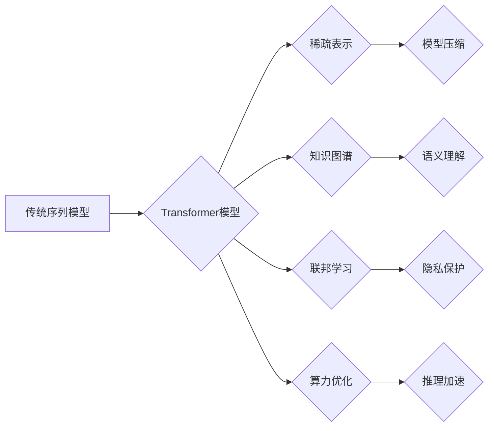

> Transformer, AI基础架构, 序列模型, 知识图谱, 联邦学习, 稀疏表示, 算力优化

## 1. 背景介绍

近年来，深度学习在人工智能领域取得了突破性的进展，其中Transformer模型凭借其强大的序列建模能力，在自然语言处理、计算机视觉等领域展现出令人瞩目的性能。然而，随着模型规模的不断扩大，Transformer模型也面临着训练成本高、参数量大、推理效率低等挑战。为了突破这些瓶颈，探索AI的下一代基础架构成为当前研究的热点。

## 2. 核心概念与联系

**2.1 序列模型的局限性**

传统的序列模型，如RNN和LSTM，虽然能够处理序列数据，但存在以下问题：

* **梯度消失/爆炸问题**: RNN在处理长序列时，梯度容易消失或爆炸，导致模型难以学习长距离依赖关系。
* **训练效率低**: RNN的训练过程是顺序的，难以并行化，训练效率较低。

**2.2 Transformer的优势与局限性**

Transformer模型通过引入注意力机制，有效解决了RNN的上述问题，并取得了显著的性能提升。然而，Transformer模型也存在一些局限性：

* **参数量大**: Transformer模型的参数量巨大，训练和部署成本高。
* **计算复杂度高**: Transformer模型的注意力机制计算复杂度高，推理效率较低。

**2.3 探索下一代基础架构**

为了克服Transformer的局限性，研究者们正在探索以下方向：

* **稀疏表示**: 利用稀疏表示技术，减少模型参数量，降低训练和部署成本。
* **知识图谱**: 将知识图谱融入模型，增强模型的语义理解能力。
* **联邦学习**: 利用联邦学习技术，在不共享原始数据的情况下，训练模型，提高数据隐私保护。
* **算力优化**: 利用硬件加速技术，提高模型的推理效率。

**2.4 架构关系图**



## 3. 核心算法原理 & 具体操作步骤

### 3.1 算法原理概述

**3.1.1 稀疏表示**

稀疏表示是指用少量非零元素来表示一个向量或矩阵。在深度学习模型中，稀疏表示可以有效减少模型参数量，降低训练和部署成本。常见的稀疏表示方法包括字典学习、压缩感知等。

**3.1.2 知识图谱嵌入**

知识图谱嵌入是指将知识图谱中的实体和关系映射到低维向量空间，以便于模型进行语义理解。常见的知识图谱嵌入方法包括TransE、TransR、RotatE等。

**3.1.3 联邦学习**

联邦学习是一种分布式机器学习方法，它允许在不共享原始数据的情况下，训练模型。联邦学习的工作流程如下：

1. **数据分发**: 将训练数据分发到不同的设备上。
2. **模型训练**: 每个设备在本地训练模型，并更新模型参数。
3. **参数聚合**: 将所有设备的模型参数聚合到一个中央服务器上。
4. **模型更新**: 中央服务器根据聚合后的参数更新全局模型。

### 3.2 算法步骤详解

**3.2.1 稀疏表示**

1. **构建字典**: 使用训练数据构建一个字典，字典中的元素代表不同的特征。
2. **稀疏编码**: 将每个数据样本编码成一个稀疏向量，表示该样本包含哪些特征。
3. **模型训练**: 使用稀疏编码后的数据训练模型。

**3.2.2 知识图谱嵌入**

1. **构建知识图谱**: 将实体和关系信息组织成知识图谱。
2. **定义嵌入函数**: 定义一个函数将实体和关系映射到低维向量空间。
3. **训练嵌入函数**: 使用知识图谱中的三元组数据训练嵌入函数。

**3.2.3 联邦学习**

1. **数据分发**: 将训练数据分发到不同的设备上。
2. **模型初始化**: 在中央服务器上初始化模型参数。
3. **本地训练**: 每个设备在本地训练模型，并更新模型参数。
4. **参数聚合**: 将所有设备的模型参数聚合到中央服务器上。
5. **模型更新**: 中央服务器根据聚合后的参数更新全局模型。
6. **迭代**: 重复步骤3-5，直到模型收敛。

### 3.3 算法优缺点

**3.3.1 稀疏表示**

* **优点**: 可以有效减少模型参数量，降低训练和部署成本。
* **缺点**: 稀疏表示方法的选择对模型性能有很大影响，需要进行大量的实验和调参。

**3.3.2 知识图谱嵌入**

* **优点**: 可以增强模型的语义理解能力，提高模型的准确率。
* **缺点**: 知识图谱的构建和维护成本较高，需要专业的知识图谱专家。

**3.3.3 联邦学习**

* **优点**: 可以保护数据隐私，提高数据安全。
* **缺点**: 联邦学习的训练效率较低，需要大量的通信和计算资源。

### 3.4 算法应用领域

**3.4.1 稀疏表示**

* **图像识别**: 使用稀疏表示技术压缩图像数据，提高图像识别效率。
* **文本分类**: 使用稀疏表示技术表示文本数据，提高文本分类准确率。

**3.4.2 知识图谱嵌入**

* **问答系统**: 使用知识图谱嵌入技术增强问答系统的语义理解能力。
* **推荐系统**: 使用知识图谱嵌入技术个性化推荐商品或服务。

**3.4.3 联邦学习**

* **医疗保健**: 使用联邦学习技术在不共享患者数据的情况下，训练疾病诊断模型。
* **金融**: 使用联邦学习技术在不共享用户数据的情况下，训练欺诈检测模型。

## 4. 数学模型和公式 & 详细讲解 & 举例说明

### 4.1 数学模型构建

**4.1.1 稀疏表示模型**

稀疏表示模型可以表示为以下公式：

$$
\mathbf{x} = \mathbf{D} \mathbf{a}
$$

其中：

* $\mathbf{x}$ 是输入数据向量。
* $\mathbf{D}$ 是字典矩阵，包含了字典中的所有元素。
* $\mathbf{a}$ 是稀疏编码向量，表示输入数据向量在字典中的稀疏表示。

**4.1.2 知识图谱嵌入模型**

知识图谱嵌入模型可以表示为以下公式：

$$
\mathbf{h}(e) + \mathbf{r} = \mathbf{h}(t)
$$

其中：

* $e$ 是实体。
* $t$ 是目标实体。
* $r$ 是关系。
* $\mathbf{h}(e)$ 和 $\mathbf{h}(t)$ 分别是实体 $e$ 和 $t$ 的嵌入向量。

### 4.2 公式推导过程

**4.2.1 稀疏表示模型推导**

稀疏表示模型的目标是找到一个稀疏编码向量 $\mathbf{a}$，使得输入数据向量 $\mathbf{x}$ 与字典矩阵 $\mathbf{D}$ 的线性组合尽可能接近。可以使用最小二乘法或其他优化算法来求解 $\mathbf{a}$。

**4.2.2 知识图谱嵌入模型推导**

知识图谱嵌入模型的目标是学习一个嵌入函数，使得知识图谱中的三元组数据满足以下关系：

$$
\mathbf{h}(e) + \mathbf{r} = \mathbf{h}(t)
$$

可以使用最大似然估计或其他优化算法来学习嵌入函数。

### 4.3 案例分析与讲解

**4.3.1 稀疏表示案例**

在图像识别任务中，可以使用稀疏表示技术压缩图像数据，减少模型参数量。例如，可以使用字典学习方法构建一个图像字典，然后将图像数据编码成稀疏向量。

**4.3.2 知识图谱嵌入案例**

在问答系统中，可以使用知识图谱嵌入技术增强问答系统的语义理解能力。例如，可以使用TransE模型将实体和关系映射到低维向量空间，然后使用这些向量来计算实体之间的相似度。

## 5. 项目实践：代码实例和详细解释说明

### 5.1 开发环境搭建

* 操作系统: Ubuntu 20.04
* Python 版本: 3.8
* 必要的库: PyTorch, TensorFlow, scikit-learn

### 5.2 源代码详细实现

```python
# 稀疏表示模型示例代码
import numpy as np
from sklearn.decomposition import SparseCoder

# 生成训练数据
X = np.random.rand(100, 100)

# 构建字典
dictionary = np.random.rand(100, 50)
sparse_coder = SparseCoder(dictionary=dictionary, transform_n_nonzero_coefs=5)

# 稀疏编码
sparse_representation = sparse_coder.transform(X)

# 模型训练
# ...

# 知识图谱嵌入模型示例代码
import torch
from torch import nn

# 定义知识图谱嵌入模型
class KnowledgeGraphEmbedding(nn.Module):
    def __init__(self, embedding_dim):
        super(KnowledgeGraphEmbedding, self).__init__()
        self.embedding_dim = embedding_dim
        self.entity_embeddings = nn.Embedding(num_embeddings=num_entities, embedding_dim=embedding_dim)
        self.relation_embeddings = nn.Embedding(num_embeddings=num_relations, embedding_dim=embedding_dim)

    def forward(self, entities, relations):
        entity_embeddings = self.entity_embeddings(entities)
        relation_embeddings = self.relation_embeddings(relations)
        return entity_embeddings + relation_embeddings

# ...

```

### 5.3 代码解读与分析

* 稀疏表示模型示例代码: 使用Scikit-learn库中的SparseCoder类实现稀疏表示。
* 知识图谱嵌入模型示例代码: 使用PyTorch库定义了一个简单的知识图谱嵌入模型。

### 5.4 运行结果展示

运行上述代码，可以得到稀疏表示后的数据和知识图谱嵌入后的实体和关系向量。

## 6. 实际应用场景

### 6.1 稀疏表示应用场景

* **图像压缩**: 使用稀疏表示技术压缩图像数据，减少存储空间和传输带宽。
* **特征提取**: 使用稀疏表示技术提取图像或文本数据的特征，提高机器学习模型的性能。

### 6.2 知识图谱嵌入应用场景

* **搜索引擎**: 使用知识图谱嵌入技术增强搜索引擎的语义理解能力，提高搜索结果的准确率。
* **问答系统**: 使用知识图谱嵌入技术增强问答系统的语义理解能力，提高问答系统的准确率。

### 6.3 联邦学习应用场景

* **医疗保健**: 使用联邦学习技术在不共享患者数据的情况下，训练疾病诊断模型。
* **金融**: 使用联邦学习技术在不共享用户数据的情况下，训练欺诈检测模型。

### 6.4 未来应用展望

* **跨模态学习**: 将稀疏表示、知识图谱嵌入和联邦学习技术结合起来，实现跨模态学习，例如图像和文本的联合理解。
* **可解释性**: 研究如何提高AI模型的可解释性，例如使用稀疏表示技术解释模型的决策过程。
* **边缘计算**: 将联邦学习技术部署到边缘设备上，实现数据本地化处理，提高隐私保护和效率。

## 7. 工具和资源推荐

### 7.1 学习资源推荐

* **书籍