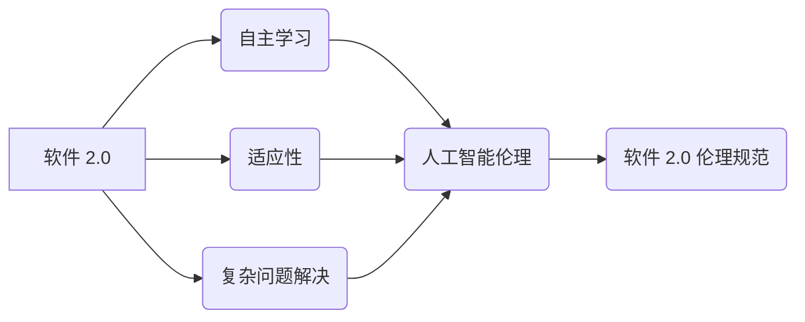

> 人工智能，伦理规范，责任，软件 2.0，可解释性，公平性，透明度，安全

## 1. 背景介绍

软件已经深刻地改变了我们的生活，从智能手机到自动驾驶汽车，软件无处不在。随着人工智能（AI）技术的飞速发展，软件正在进入一个新的时代——软件 2.0。软件 2.0 具有自主学习、适应环境和解决复杂问题的能力，这使得它在各个领域都拥有巨大的潜力。然而，软件 2.0 的强大能力也带来了新的伦理挑战。

传统的软件开发注重功能性和效率，而软件 2.0 的伦理规范则需要更加关注其对社会、经济和个人的影响。我们需要确保 AI 系统的决策是公平、透明、可解释的，并且不会对人类造成伤害。

## 2. 核心概念与联系

**2.1  软件 2.0**

软件 2.0 指的是基于人工智能技术的下一代软件，它具有以下特点：

* **自主学习:** 软件 2.0 可以从数据中学习，并不断改进其性能。
* **适应性:** 软件 2.0 可以根据环境的变化进行调整，并提供个性化的服务。
* **复杂问题解决:** 软件 2.0 可以解决传统软件难以处理的复杂问题。

**2.2  人工智能伦理**

人工智能伦理是指在人工智能技术发展和应用过程中，需要遵循的道德准则和社会规范。人工智能伦理的核心价值观包括：

* **公平性:** AI 系统的决策应该公平公正，不歧视任何群体。
* **透明度:** AI 系统的决策过程应该透明可解释，让人们能够理解其背后的逻辑。
* **可控性:** 人类应该能够控制 AI 系统的行为，并对其负责任。
* **安全:** AI 系统应该安全可靠，不会对人类造成伤害。

**2.3  软件 2.0 伦理规范**

软件 2.0 伦理规范是指在开发和应用软件 2.0 时，需要遵循的道德准则和社会规范。这些规范应该基于人工智能伦理的核心价值观，并考虑到软件 2.0 的独特特性。

**2.4  关系图**



## 3. 核心算法原理 & 具体操作步骤

**3.1  算法原理概述**

软件 2.0 的核心算法通常是基于机器学习和深度学习的。机器学习算法可以从数据中学习模式，并根据这些模式进行预测或分类。深度学习算法则是一种更复杂的机器学习算法，它使用多层神经网络来模拟人类大脑的学习过程。

**3.2  算法步骤详解**

1. **数据收集和预处理:** 收集相关数据并进行清洗、转换和特征工程等预处理步骤。
2. **模型选择:** 根据任务需求选择合适的机器学习或深度学习算法模型。
3. **模型训练:** 使用训练数据训练模型，调整模型参数以达到最佳性能。
4. **模型评估:** 使用测试数据评估模型的性能，并进行调优。
5. **模型部署:** 将训练好的模型部署到实际应用环境中。

**3.3  算法优缺点**

**优点:**

* **自动化:** 可以自动学习和改进，无需人工干预。
* **精准度:** 可以实现比人类更高的精准度。
* **效率:** 可以处理海量数据，并快速进行分析和决策。

**缺点:**

* **数据依赖:** 需要大量高质量的数据进行训练。
* **黑盒效应:** 某些算法的决策过程难以解释。
* **偏差风险:** 如果训练数据存在偏差，模型也会产生偏差。

**3.4  算法应用领域**

* **图像识别:** 人脸识别、物体检测、图像分类等。
* **自然语言处理:** 语音识别、机器翻译、文本摘要等。
* **推荐系统:** 产品推荐、内容推荐、个性化服务等。
* **医疗诊断:** 疾病诊断、影像分析、药物研发等。

## 4. 数学模型和公式 & 详细讲解 & 举例说明

**4.1  数学模型构建**

机器学习算法通常使用数学模型来表示数据之间的关系。例如，线性回归模型使用线性方程来预测连续变量的值。

**4.2  公式推导过程**

线性回归模型的目标是找到一条直线，使得这条直线与数据点之间的距离最小。可以使用最小二乘法来推导线性回归模型的公式。

**4.3  案例分析与讲解**

假设我们有一个数据集，包含房屋面积和房屋价格的信息。我们可以使用线性回归模型来预测房屋价格。

**公式:**

```latex
y = mx + b
```

其中：

* $y$ 是房屋价格
* $x$ 是房屋面积
* $m$ 是斜率
* $b$ 是截距

**推导过程:**

最小二乘法要求最小化误差平方和。误差平方和可以表示为：

```latex
SSE = \sum_{i=1}^{n}(y_i - \hat{y}_i)^2
```

其中：

* $y_i$ 是第 $i$ 个数据点的真实价格
* $\hat{y}_i$ 是第 $i$ 个数据点的预测价格

通过对 $m$ 和 $b$ 求偏导，并令其等于零，可以得到线性回归模型的参数估计值。

## 5. 项目实践：代码实例和详细解释说明

**5.1  开发环境搭建**

* Python 3.x
* TensorFlow 或 PyTorch
* Jupyter Notebook

**5.2  源代码详细实现**

```python
import tensorflow as tf

# 定义模型
model = tf.keras.models.Sequential([
    tf.keras.layers.Dense(64, activation='relu', input_shape=(1,)),
    tf.keras.layers.Dense(1)
])

# 编译模型
model.compile(optimizer='adam', loss='mse')

# 训练模型
model.fit(x_train, y_train, epochs=100)

# 评估模型
loss = model.evaluate(x_test, y_test)
print('Loss:', loss)

# 预测
predictions = model.predict(x_new)
print('Predictions:', predictions)
```

**5.3  代码解读与分析**

* 代码首先定义了一个简单的线性回归模型，包含两层神经网络。
* 然后，模型被编译，指定了优化器、损失函数等参数。
* 接着，模型使用训练数据进行训练，训练过程持续 100 个 epochs。
* 训练完成后，模型的性能被评估，并输出损失值。
* 最后，模型用于预测新的数据点。

**5.4  运行结果展示**

运行结果将显示模型的损失值和预测结果。

## 6. 实际应用场景

**6.1  医疗诊断**

AI 算法可以分析医学影像，辅助医生诊断疾病。例如，AI 可以识别肺部肿瘤、乳腺癌等。

**6.2  金融风险管理**

AI 算法可以分析金融数据，识别潜在的风险。例如，AI 可以检测欺诈交易、预测股票价格波动等。

**6.3  个性化教育**

AI 算法可以根据学生的学习情况，提供个性化的学习内容和辅导。

**6.4  未来应用展望**

软件 2.0 将在更多领域得到应用，例如自动驾驶、机器人、智能家居等。

## 7. 工具和资源推荐

**7.1  学习资源推荐**

* **在线课程:** Coursera、edX、Udacity 等平台提供人工智能相关的在线课程。
* **书籍:** 《深度学习》、《人工智能：一种现代方法》等书籍。
* **开源项目:** TensorFlow、PyTorch 等开源项目可以帮助学习和实践人工智能技术。

**7.2  开发工具推荐**

* **Python:** 人工智能开发的常用编程语言。
* **TensorFlow:** Google 开发的开源机器学习框架。
* **PyTorch:** Facebook 开发的开源机器学习框架。

**7.3  相关论文推荐**

* **《ImageNet Classification with Deep Convolutional Neural Networks》**
* **《Attention Is All You Need》**
* **《BERT: Pre-training of Deep Bidirectional Transformers for Language Understanding》**

## 8. 总结：未来发展趋势与挑战

**8.1  研究成果总结**

近年来，人工智能技术取得了长足的进步，在各个领域都取得了显著的成果。

**8.2  未来发展趋势**

* **更强大的算法:** 研究人员将继续开发更强大的机器学习和深度学习算法。
* **更广泛的应用:** AI 技术将应用于更多领域，例如医疗、教育、金融等。
* **更强的解释性:** 研究人员将致力于开发更可解释的 AI 算法，以便人们能够更好地理解 AI 的决策过程。

**8.3  面临的挑战**

* **数据安全:** AI 算法依赖于大量数据，数据安全是一个重要的挑战。
* **算法偏见:** 如果训练数据存在偏见，AI 算法也会产生偏见。
* **伦理问题:** AI 技术的应用引发了许多伦理问题，例如隐私保护、责任归属等。

**8.4  研究展望**

未来，人工智能研究将更加注重伦理、安全和可解释性。


## 9. 附录：常见问题与解答

**9.1  什么是黑盒效应？**

黑盒效应是指某些 AI 算法的决策过程难以解释，人们无法理解其背后的逻辑。

**9.2  如何解决算法偏见？**

可以通过使用更公平的训练数据、开发更公平的算法模型等方式来解决算法偏见。

**9.3  如何确保 AI 技术的安全？**

可以通过制定安全规范、进行安全测试、使用安全技术等方式来确保 AI 技术的安全。


作者：禅与计算机程序设计艺术 / Zen and the Art of Computer Programming 
<end_of_turn>