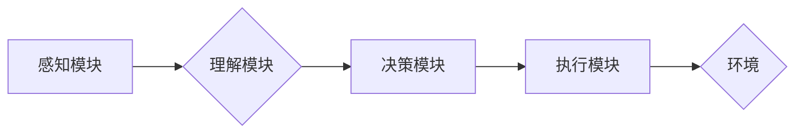

> AI Agent, 智能体, 强化学习, 决策推理, 自然语言理解, 知识图谱, 跨模态交互

## 1. 背景介绍

人工智能（AI）已经从实验室走向现实，并在各个领域取得了突破性进展。从语音助手到自动驾驶，AI正在改变着我们的生活。然而，我们还处于 AI 的早期阶段，许多问题尚未解决。

传统的 AI 系统通常是针对特定任务设计的，缺乏通用性和适应性。例如，一个擅长图像识别的模型可能无法理解自然语言，而一个擅长玩游戏的模型可能无法完成其他任务。

为了解决这些问题，AI 智能体应运而生。AI 智能体是一种能够自主学习、决策、推理和交互的 AI 系统，它拥有更强的通用性和适应性。

## 2. 核心概念与联系

**2.1 AI 智能体定义**

AI 智能体是一种能够感知环境、理解信息、制定决策并执行行动的智能系统。它具备以下核心特征：

* **自主性:** 智能体能够独立完成任务，无需人工干预。
* **学习能力:** 智能体能够从经验中学习，不断提升其性能。
* **决策推理:** 智能体能够分析信息，做出合理的决策。
* **交互能力:** 智能体能够与人类和环境进行交互。

**2.2 AI 智能体与传统 AI 的区别**

| 特征 | 传统 AI | AI 智能体 |
|---|---|---|
| 任务 | 特定任务 | 通用任务 |
| 学习能力 | 有限 | 强化学习 |
| 决策推理 | 基于规则 | 基于知识和经验 |
| 交互能力 | 有限 | 丰富 |

**2.3 AI 智能体架构**

AI 智能体通常由以下几个模块组成：

* **感知模块:** 收集环境信息，例如图像、文本、音频等。
* **理解模块:** 对感知到的信息进行分析和理解，提取关键信息。
* **决策模块:** 基于理解到的信息，制定决策和行动计划。
* **执行模块:** 执行决策，与环境进行交互。

**2.4 Mermaid 流程图**



## 3. 核心算法原理 & 具体操作步骤

**3.1 算法原理概述**

AI 智能体的核心算法是强化学习（Reinforcement Learning，RL）。强化学习是一种机器学习方法，它通过奖励和惩罚机制来训练智能体，使其在特定环境中学习最优策略。

**3.2 算法步骤详解**

1. **环境建模:** 建立一个模拟真实世界的环境，定义智能体的动作空间和状态空间。
2. **奖励函数设计:** 设计一个奖励函数，用于评估智能体在环境中执行动作的结果。
3. **策略学习:** 使用强化学习算法，例如 Q-learning 或 Deep Q-Network (DQN)，训练智能体学习最优策略。
4. **策略评估:** 使用训练好的策略，评估智能体在环境中执行任务的性能。
5. **策略优化:** 根据策略评估结果，对策略进行优化，提高智能体的性能。

**3.3 算法优缺点**

**优点:**

* **自主学习:** 智能体能够自主学习，无需人工标注数据。
* **适应性强:** 智能体能够适应不断变化的环境。
* **通用性:** 强化学习可以应用于各种任务，例如游戏、机器人控制、自动驾驶等。

**缺点:**

* **训练时间长:** 强化学习算法通常需要大量的训练时间。
* **奖励函数设计困难:** 设计一个合适的奖励函数是强化学习的关键，但往往非常困难。
* **样本效率低:** 强化学习算法对样本效率要求较高，需要大量的训练数据。

**3.4 算法应用领域**

* **游戏:** AI 智能体可以学习玩各种游戏，例如围棋、Go、Dota 2 等。
* **机器人控制:** AI 智能体可以控制机器人完成各种任务，例如导航、抓取、组装等。
* **自动驾驶:** AI 智能体可以帮助汽车自动驾驶，提高安全性。
* **医疗诊断:** AI 智能体可以辅助医生诊断疾病，提高诊断准确率。

## 4. 数学模型和公式 & 详细讲解 & 举例说明

**4.1 数学模型构建**

强化学习的数学模型通常由以下几个要素组成：

* **状态空间 (S):** 智能体可能处于的所有状态的集合。
* **动作空间 (A):** 智能体可以执行的所有动作的集合。
* **奖励函数 (R):** 评估智能体在特定状态执行特定动作后的奖励值。
* **价值函数 (V):** 评估智能体在特定状态下获得的长期奖励的期望值。
* **策略 (π):** 智能体在特定状态下选择动作的概率分布。

**4.2 公式推导过程**

* **Bellman 方程:** 价值函数的更新公式，用于计算智能体在特定状态下获得的长期奖励的期望值。

$$
V(s) = \max_{\pi} \sum_{a \in A} \pi(a|s) [R(s, a) + \gamma \max_{a'} V(s')]
$$

其中：

* $V(s)$ 是状态 $s$ 的价值函数。
* $\pi(a|s)$ 是策略 $\pi$ 在状态 $s$ 下选择动作 $a$ 的概率。
* $R(s, a)$ 是智能体在状态 $s$ 执行动作 $a$ 后获得的奖励。
* $\gamma$ 是折扣因子，控制未来奖励的权重。
* $s'$ 是执行动作 $a$ 后进入的下一个状态。

* **Q-learning 公式:** 用于更新 Q 值，即在特定状态执行特定动作的期望回报。

$$
Q(s, a) = Q(s, a) + \alpha [R(s, a) + \gamma \max_{a'} Q(s', a') - Q(s, a)]
$$

其中：

* $Q(s, a)$ 是状态 $s$ 执行动作 $a$ 的 Q 值。
* $\alpha$ 是学习率，控制学习速度。

**4.3 案例分析与讲解**

例如，在玩游戏时，智能体可以将游戏画面作为状态，可以执行的动作包括向上、向下、向左、向右等。奖励函数可以设计为，当智能体获得分数时奖励，当智能体失败时惩罚。通过强化学习算法，智能体可以学习到最优策略，例如如何获得更高的分数或如何避免失败。

## 5. 项目实践：代码实例和详细解释说明

**5.1 开发环境搭建**

* Python 3.x
* TensorFlow 或 PyTorch
* OpenAI Gym

**5.2 源代码详细实现**

```python
import gym
import numpy as np
from tensorflow.keras.models import Sequential
from tensorflow.keras.layers import Dense

# 创建环境
env = gym.make('CartPole-v1')

# 定义神经网络模型
model = Sequential()
model.add(Dense(128, activation='relu', input_shape=(env.observation_space.shape[0],)))
model.add(Dense(64, activation='relu'))
model.add(Dense(env.action_space.n))

# 编译模型
model.compile(loss='mse', optimizer='adam')

# 训练模型
for episode in range(1000):
    state = env.reset()
    done = False
    total_reward = 0

    while not done:
        # 选择动作
        action = np.argmax(model.predict(state.reshape(1, -1)))

        # 执行动作
        next_state, reward, done, _ = env.step(action)

        # 更新状态
        state = next_state

        # 更新奖励
        total_reward += reward

    # 打印奖励
    print(f'Episode {episode+1}: Reward = {total_reward}')

# 保存模型
model.save('cartpole_model.h5')
```

**5.3 代码解读与分析**

* 代码首先创建了一个 CartPole-v1 环境，这是一个经典的强化学习环境。
* 然后定义了一个神经网络模型，用于预测智能体在特定状态下执行不同动作的 Q 值。
* 模型使用 MSE 损失函数和 Adam 优化器进行训练。
* 训练过程循环执行多个 episode，每个 episode 中智能体与环境交互，并根据奖励更新模型参数。
* 最后，训练好的模型被保存为一个文件。

**5.4 运行结果展示**

运行代码后，会输出每个 episode 的奖励值。随着训练的进行，奖励值会逐渐提高，表明智能体正在学习到最优策略。最终，智能体能够在环境中保持平衡，获得高奖励。

## 6. 实际应用场景

**6.1 游戏 AI**

AI 智能体可以学习玩各种游戏，例如围棋、Go、Dota 2 等。例如，AlphaGo 使用强化学习算法战胜了世界围棋冠军，DeepMind 的 AlphaStar 则在 StarCraft II 中取得了职业水平的成绩。

**6.2 机器人控制**

AI 智能体可以控制机器人完成各种任务，例如导航、抓取、组装等。例如，Boston Dynamics 的 Spot 机器人使用强化学习算法学习行走和避障。

**6.3 自动驾驶**

AI 智能体可以帮助汽车自动驾驶，提高安全性。例如，Waymo 使用强化学习算法训练自动驾驶汽车，使其能够在复杂道路环境中安全行驶。

**6.4 医疗诊断**

AI 智能体可以辅助医生诊断疾病，提高诊断准确率。例如，Google DeepMind 的 AlphaFold 使用深度学习算法预测蛋白质结构，这对于药物研发和疾病诊断具有重要意义。

**6.5 未来应用展望**

AI 智能体在未来将有更广泛的应用场景，例如：

* **个性化教育:** AI 智能体可以根据学生的学习进度和风格提供个性化的学习方案。
* **智能客服:** AI 智能体可以处理客户的咨询和投诉，提高服务效率。
* **金融风险管理:** AI 智能体可以分析金融数据，识别和预测金融风险。

## 7. 工具和资源推荐

**7.1 学习资源推荐**

* **书籍:**
    * Reinforcement Learning: An Introduction by Richard S. Sutton and Andrew G. Barto
    * Deep Reinforcement Learning Hands-On by Maxim Lapan
* **在线课程:**
    * Deep Reinforcement Learning Specialization by DeepLearning.AI
    * Reinforcement Learning by David Silver (University of DeepMind)

**7.2 开发工具推荐**

* **TensorFlow:** 开源深度学习框架，支持强化学习算法。
* **PyTorch:** 开源深度学习框架，支持强化学习算法。
* **OpenAI Gym:** 强化学习环境库，提供各种经典的强化学习环境。

**7.3 相关论文推荐**

* Deep Reinforcement Learning with Double Q-learning (Mnih et al., 2015)
* Asynchronous Methods for Deep Reinforcement Learning (Mnih et al., 2016)
* Proximal Policy Optimization Algorithms (Schulman et al., 2017)

## 8. 总结：未来发展趋势与挑战

**8.1 研究成果总结**

近年来，强化学习取得了显著进展，在游戏、机器人控制、自动驾驶等领域取得了突破性成果。

**8.2 未来发展趋势**

* **更强大的算法:** 研究更强大的强化学习算法，提高智能体的学习效率和性能。
* **更复杂的场景:** 将强化学习应用于更复杂的场景，例如医疗诊断、金融风险管理等。
* **更安全的智能体:** 研究更安全的强化学习算法，确保智能体的行为可控和可靠。

**8.3 面临的挑战**

* **样本效率:** 强化学习算法对样本效率要求较高，需要大量的训练数据。
* **奖励函数设计:** 设计一个合适的奖励函数是强化学习的关键，但往往非常困难。
* **可解释性:** 强化学习模型的决策过程往往难以解释，这对于安全性和信任度至关重要。