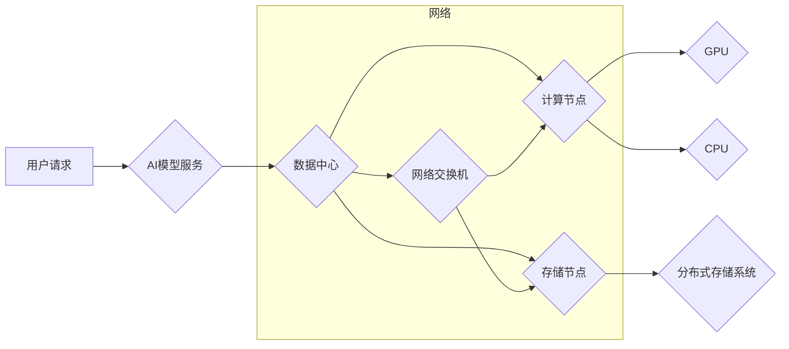

> AI大模型，数据中心，扩展性，并行计算，分布式存储，微服务架构，云计算

## 1. 背景介绍

近年来，人工智能（AI）技术取得了飞速发展，尤其是大规模语言模型（LLM）的出现，如GPT-3、LaMDA等，展现出强大的文本生成、理解和翻译能力，为各行各业带来了革命性的变革。然而，这些大型模型的训练和部署都需要海量计算资源和存储空间，对数据中心的扩展性提出了更高的要求。

传统的集中式数据中心架构难以满足大模型的计算和存储需求，随着模型规模的不断增长，单机性能瓶颈逐渐显现。为了应对这一挑战，业界开始探索新的数据中心架构和技术，以实现大模型应用的更高效、更灵活、更可扩展的部署。

## 2. 核心概念与联系

**2.1  AI大模型应用数据中心**

AI大模型应用数据中心是指专门为训练和部署大型AI模型而设计的专用数据中心。它通常具备以下特点：

* **高性能计算能力:**  配备大量GPU和CPU，支持高性能并行计算，以加速模型训练和推理。
* **海量存储空间:**  提供分布式存储系统，支持海量数据存储和访问，满足模型训练和部署的数据需求。
* **灵活可扩展性:**  采用模块化设计，支持按需扩展计算和存储资源，以适应模型规模和业务需求的变化。
* **高效的网络架构:**  构建高速、低延迟的网络，保证数据传输效率，支持大规模模型的并行训练和推理。

**2.2  扩展性**

扩展性是指系统能够随着需求增长而增加资源的能力。对于AI大模型应用数据中心来说，扩展性主要体现在以下几个方面：

* **计算资源扩展:**  能够灵活增加GPU和CPU数量，以满足模型训练和推理的计算需求。
* **存储资源扩展:**  能够动态增加存储容量，以容纳不断增长的模型参数和训练数据。
* **网络资源扩展:**  能够扩展网络带宽和节点数量，以支持大规模模型的并行训练和推理。

**2.3  相关技术**

* **并行计算:**  将模型训练和推理任务分解成多个子任务，并行执行，以提高计算效率。
* **分布式存储:**  将数据存储在多个节点上，并通过网络进行访问，以提高存储容量和数据访问速度。
* **微服务架构:**  将系统分解成多个独立的服务，每个服务负责特定的功能，并通过API进行通信，以提高系统的灵活性和可扩展性。
* **云计算:**  利用云平台提供的计算、存储和网络资源，以实现弹性扩展和按需付费。

**2.4  架构图**



## 3. 核心算法原理 & 具体操作步骤

**3.1  算法原理概述**

大模型应用数据中心的扩展性主要依赖于并行计算、分布式存储和微服务架构等技术的应用。

* **并行计算:**  将模型训练和推理任务分解成多个子任务，并行执行，以提高计算效率。常用的并行计算方法包括数据并行、模型并行和混合并行。
* **分布式存储:**  将数据存储在多个节点上，并通过网络进行访问，以提高存储容量和数据访问速度。常用的分布式存储系统包括HDFS、Cassandra和MongoDB等。
* **微服务架构:**  将系统分解成多个独立的服务，每个服务负责特定的功能，并通过API进行通信，以提高系统的灵活性和可扩展性。

**3.2  算法步骤详解**

1. **数据预处理:** 将原始数据进行清洗、转换和格式化，使其适合模型训练。
2. **模型划分:** 将模型分割成多个子模型，每个子模型负责处理一部分数据或模型参数。
3. **数据分配:** 将数据分配到不同的计算节点，每个节点负责训练或推理相应的子模型。
4. **并行训练:**  多个计算节点同时训练各自的子模型，并通过通信机制进行参数更新和模型融合。
5. **模型推理:**  将训练好的模型部署到推理节点，接收用户请求并进行预测或生成结果。

**3.3  算法优缺点**

* **优点:**
    * 提高计算效率，缩短训练时间。
    * 提高存储容量，支持海量数据处理。
    * 提高系统灵活性和可扩展性。
* **缺点:**
    * 增加了系统复杂度和管理难度。
    * 需要考虑数据同步和模型融合的挑战。
    * 需要优化网络通信和数据传输效率。

**3.4  算法应用领域**

* **自然语言处理:**  文本生成、机器翻译、问答系统等。
* **计算机视觉:**  图像识别、物体检测、图像分割等。
* **语音识别:**  语音转文本、语音合成等。
* **推荐系统:**  商品推荐、内容推荐等。

## 4. 数学模型和公式 & 详细讲解 & 举例说明

**4.1  数学模型构建**

大模型训练通常采用深度学习算法，其核心是神经网络模型。神经网络模型可以看作是一个复杂的函数映射，将输入数据映射到输出结果。

**4.2  公式推导过程**

神经网络模型的训练过程是通过优化模型参数来最小化损失函数的过程。损失函数衡量模型预测结果与真实结果之间的差异。常用的损失函数包括均方误差（MSE）、交叉熵损失（Cross-Entropy Loss）等。

**4.3  案例分析与讲解**

假设我们训练一个简单的线性回归模型，其目标是预测房价。模型输入特征包括房屋面积、房间数量等，输出结果为房价。

损失函数可以定义为均方误差：

$$
L = \frac{1}{N} \sum_{i=1}^{N} (y_i - \hat{y}_i)^2
$$

其中：

* $L$ 为损失函数
* $N$ 为样本数量
* $y_i$ 为真实房价
* $\hat{y}_i$ 为模型预测的房价

通过梯度下降算法，我们可以迭代更新模型参数，以最小化损失函数。

## 5. 项目实践：代码实例和详细解释说明

**5.1  开发环境搭建**

* 操作系统：Ubuntu 20.04
* 编程语言：Python 3.8
* 深度学习框架：TensorFlow 2.0
* GPU：NVIDIA GeForce RTX 3090

**5.2  源代码详细实现**

```python
import tensorflow as tf

# 定义模型
model = tf.keras.Sequential([
    tf.keras.layers.Dense(64, activation='relu', input_shape=(5,)),
    tf.keras.layers.Dense(1)
])

# 定义损失函数和优化器
loss_fn = tf.keras.losses.MeanSquaredError()
optimizer = tf.keras.optimizers.Adam(learning_rate=0.001)

# 训练模型
for epoch in range(10):
    for batch in data_generator:
        with tf.GradientTape() as tape:
            predictions = model(batch)
            loss = loss_fn(batch[:, -1], predictions)
        gradients = tape.gradient(loss, model.trainable_variables)
        optimizer.apply_gradients(zip(gradients, model.trainable_variables))

# 保存模型
model.save('house_price_model.h5')
```

**5.3  代码解读与分析**

* 代码首先定义了一个简单的线性回归模型，包含两个全连接层。
* 然后定义了损失函数和优化器，用于训练模型。
* 训练模型的循环结构迭代训练多个epoch，每个epoch包含多个batch。
* 在每个batch中，模型预测结果与真实结果的差异计算损失，并通过梯度下降算法更新模型参数。
* 最后，训练好的模型被保存为文件。

**5.4  运行结果展示**

训练完成后，我们可以使用保存的模型进行预测。

```python
from tensorflow.keras.models import load_model

model = load_model('house_price_model.h5')

# 预测房价
prediction = model.predict([[100, 2, 1, 1, 1]])

print(prediction)
```

## 6. 实际应用场景

**6.1  金融领域**

* **风险评估:**  利用大模型分析海量金融数据，识别潜在的风险因素，提高风险管理的准确性。
* **欺诈检测:**  识别异常交易行为，降低金融机构的欺诈损失。
* **客户服务:**  构建智能客服系统，自动处理客户咨询和投诉，提高客户服务效率。

**6.2  医疗领域**

* **疾病诊断:**  分析患者的病历、影像数据等，辅助医生进行疾病诊断。
* **药物研发:**  加速药物研发过程，预测药物的疗效和安全性。
* **个性化医疗:**  根据患者的基因信息和生活习惯，提供个性化的医疗建议。

**6.3  教育领域**

* **智能辅导:**  为学生提供个性化的学习辅导，提高学习效率。
* **自动批改:**  自动批改学生的作业，节省教师的时间和精力。
* **语言学习:**  构建智能语言学习平台，帮助学生提高语言水平。

**6.4  未来应用展望**

随着AI技术的不断发展，大模型应用数据中心的扩展性将发挥越来越重要的作用。未来，我们将看到更多创新应用场景，例如：

* **元宇宙:**  构建沉浸式虚拟世界，提供更逼真的交互体验。
* **自动驾驶:**  提高自动驾驶系统的安全性、可靠性和智能化水平。
* **科学研究:**  加速科学发现，解决复杂科学问题。

## 7. 工具和资源推荐

**7.1  学习资源推荐**

* **书籍:**
    * 深度学习
    * 人工智能：一种现代方法
* **在线课程:**
    * Coursera: 深度学习
    * edX: 人工智能
* **博客和论坛:**
    * TensorFlow Blog
    * PyTorch Blog
    * Kaggle

**7.2  开发工具推荐**

* **深度学习框架:**
    * TensorFlow
    * PyTorch
    * Keras
* **云计算平台:**
    * AWS
    * Azure
    * Google Cloud Platform
* **分布式存储系统:**
    * HDFS
    * Cassandra
    * MongoDB

**7.3  相关论文推荐**

* Attention Is All You Need
* BERT: Pre-training of Deep Bidirectional Transformers for Language Understanding
* GPT-3: Language Models are Few-Shot Learners

## 8. 总结：未来发展趋势与挑战

**8.1  研究成果总结**

近年来，AI大模型应用数据中心的扩展性取得了显著进展，并取得了广泛的应用。并行计算、分布式存储和微服务架构等技术为大模型的训练和部署提供了强大的支持。

**8.2  未来发展趋势**

* **模型规模的进一步扩大:**  随着计算资源的不断提升，大模型的规模将继续扩大，带来更强大的能力。
* **模型训练效率的提升:**  研究人员将继续探索新的训练算法和优化方法，以提高模型训练效率。
* **模型部署的灵活性:**  微服务架构和容器技术将进一步提高模型部署的灵活性，支持更灵活的应用场景。
* **边缘计算的融合:**  将大模型部署到边缘设备，实现更低延迟、更私密的数据处理。

**8.3  面临的挑战**

* **计算资源的成本:**  大模型的训练和部署需要大量的计算资源，成本较高。
* **数据安全和隐私:**