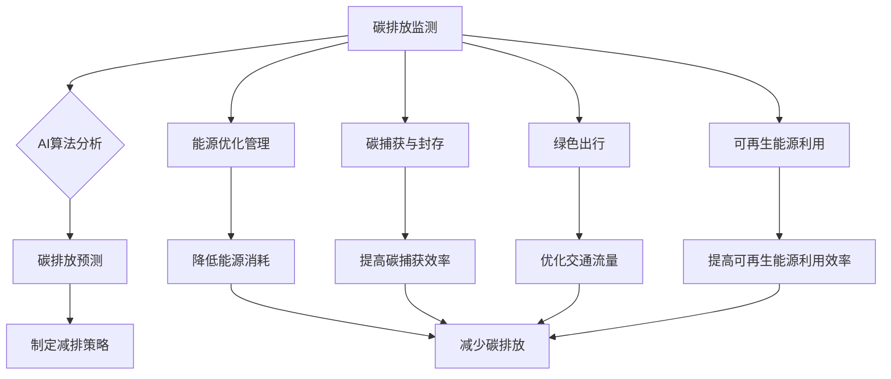

> AI, 碳中和, 可持续发展, 机器学习, 深度学习, 优化算法

## 1. 背景介绍

全球气候变化已成为人类面临的严峻挑战，碳排放是导致气候变化的主要因素之一。为了应对气候变化，世界各国纷纷制定了碳中和目标，力求在未来几十年内实现碳排放净零。

人工智能（AI）作为一项新兴技术，在推动碳中和进程中发挥着越来越重要的作用。AI算法能够高效分析海量数据，识别碳排放模式，并提出优化方案，从而帮助企业和政府降低碳排放，实现可持续发展。

## 2. 核心概念与联系

**2.1 碳中和**

碳中和是指人类活动排放的二氧化碳等温室气体，通过植树造林、碳捕获与封存等方式，在一定时间内被吸收或抵消，实现碳排放净零的目标。

**2.2 人工智能 (AI)**

人工智能是指模拟人类智能行为的计算机系统，包括学习、推理、决策、感知和语言理解等能力。

**2.3 AI助力碳中和**

AI技术可以应用于各个环节，帮助实现碳中和目标：

* **碳排放监测与预测:** 利用AI算法分析历史数据，预测未来碳排放趋势，为制定减排策略提供依据。
* **能源优化管理:** 通过AI智能控制，优化能源使用效率，减少能源浪费和碳排放。
* **碳捕获与封存:** AI算法可以帮助优化碳捕获与封存技术，提高碳捕获效率和安全性。
* **绿色出行:** AI技术可以应用于智能交通系统，优化交通流量，减少交通拥堵和碳排放。
* **可再生能源利用:** AI算法可以帮助预测可再生能源发电量，优化能源调度，提高可再生能源利用效率。

**2.4 AI与碳中和的联系**

AI技术可以帮助我们更有效地监测、预测、管理和减少碳排放，从而实现碳中和目标。



## 3. 核心算法原理 & 具体操作步骤

**3.1 算法原理概述**

在AI助力碳中和的各个环节中，许多算法发挥着关键作用，例如机器学习、深度学习、强化学习等。

* **机器学习:** 通过训练模型，从数据中学习规律，预测碳排放趋势、优化能源使用等。
* **深度学习:** 利用多层神经网络，对复杂数据进行更深入的分析，提高预测精度和识别能力。
* **强化学习:** 通过奖励机制，训练智能体在特定环境中做出最优决策，例如优化碳捕获与封存过程。

**3.2 算法步骤详解**

以机器学习为例，其核心步骤包括：

1. **数据收集与预处理:** 收集相关数据，例如能源消耗数据、碳排放数据、天气数据等，并进行清洗、转换、特征提取等预处理。
2. **模型选择:** 根据具体任务选择合适的机器学习模型，例如线性回归、决策树、支持向量机等。
3. **模型训练:** 利用训练数据，训练机器学习模型，调整模型参数，使其能够准确预测碳排放趋势或优化能源使用。
4. **模型评估:** 利用测试数据，评估模型的预测精度或优化效果，并进行模型调优。
5. **模型部署:** 将训练好的模型部署到实际应用场景中，例如能源管理系统、碳排放监测平台等。

**3.3 算法优缺点**

* **优点:** 能够高效分析海量数据，识别复杂模式，提高预测精度和优化效果。
* **缺点:** 需要大量训练数据，模型训练时间长，对数据质量要求高。

**3.4 算法应用领域**

* **碳排放预测:** 预测企业、城市或国家的碳排放趋势，为制定减排策略提供依据。
* **能源优化管理:** 优化能源使用效率，减少能源浪费和碳排放。
* **碳捕获与封存:** 优化碳捕获与封存技术，提高碳捕获效率和安全性。
* **绿色出行:** 优化交通流量，减少交通拥堵和碳排放。
* **可再生能源利用:** 预测可再生能源发电量，优化能源调度，提高可再生能源利用效率。

## 4. 数学模型和公式 & 详细讲解 & 举例说明

**4.1 数学模型构建**

碳排放预测模型可以构建为一个时间序列模型，例如ARIMA模型，其核心公式如下：

$$
y_t = c + \sum_{i=1}^{p} \phi_i y_{t-i} + \sum_{j=1}^{q} \theta_j \epsilon_{t-j} + \epsilon_t
$$

其中：

* $y_t$：时间t的碳排放量
* $c$：截距项
* $\phi_i$：自回归系数
* $p$：自回归阶数
* $\theta_j$：移动平均系数
* $q$：移动平均阶数
* $\epsilon_t$：随机误差项

**4.2 公式推导过程**

ARIMA模型的推导过程较为复杂，涉及时间序列分析、统计学等多个领域。

**4.3 案例分析与讲解**

假设我们想要预测某城市的未来碳排放量，可以使用ARIMA模型进行预测。首先，我们需要收集该城市的过去几年的碳排放数据，然后根据数据特征选择合适的ARIMA模型参数。最后，利用训练好的模型预测未来碳排放量。

## 5. 项目实践：代码实例和详细解释说明

**5.1 开发环境搭建**

* 操作系统：Linux/Windows/macOS
* Python版本：3.6+
* 必要的库：pandas, numpy, scikit-learn, matplotlib等

**5.2 源代码详细实现**

```python
import pandas as pd
from sklearn.model_selection import train_test_split
from sklearn.linear_model import LinearRegression
from sklearn.metrics import mean_squared_error

# 数据加载
data = pd.read_csv('carbon_emission_data.csv')

# 数据预处理
X = data[['year', 'population', 'GDP']]
y = data['carbon_emission']

# 数据分割
X_train, X_test, y_train, y_test = train_test_split(X, y, test_size=0.2, random_state=42)

# 模型训练
model = LinearRegression()
model.fit(X_train, y_train)

# 模型预测
y_pred = model.predict(X_test)

# 模型评估
mse = mean_squared_error(y_test, y_pred)
print('Mean Squared Error:', mse)
```

**5.3 代码解读与分析**

* 代码首先加载碳排放数据，并进行数据预处理，例如特征选择、数据清洗等。
* 然后，将数据分割为训练集和测试集，用于模型训练和评估。
* 选择线性回归模型进行训练，并利用训练好的模型对测试集进行预测。
* 最后，使用均方误差（MSE）评估模型的预测精度。

**5.4 运行结果展示**

运行代码后，会输出模型的均方误差值，该值越小，模型的预测精度越高。

## 6. 实际应用场景

**6.1 碳排放监测与预测**

* 企业可以利用AI算法分析自身生产过程中的碳排放数据，预测未来碳排放趋势，并制定相应的减排措施。
* 城市政府可以利用AI算法监测城市整体碳排放情况，预测未来碳排放趋势，制定城市碳中和规划。

**6.2 能源优化管理**

* 电力公司可以利用AI算法优化电力调度，提高能源利用效率，减少碳排放。
* 建筑物管理者可以利用AI算法控制建筑物照明、空调等设备，优化能源使用，降低碳排放。

**6.3 碳捕获与封存**

* 化工企业可以利用AI算法优化碳捕获与封存技术，提高碳捕获效率和安全性。
* 政府可以利用AI算法评估碳捕获与封存项目的经济效益和环境效益，制定相应的政策支持。

**6.4 未来应用展望**

随着AI技术的不断发展，其在碳中和领域的应用将更加广泛和深入。例如：

* 利用AI技术开发更精准的碳排放预测模型，为制定更有效的减排策略提供依据。
* 利用AI技术开发更智能的能源管理系统，实现更精准的能源优化，减少碳排放。
* 利用AI技术开发更先进的碳捕获与封存技术，提高碳捕获效率和安全性。

## 7. 工具和资源推荐

**7.1 学习资源推荐**

* **书籍:**
    * 《深度学习》
    * 《机器学习实战》
    * 《AI 碳中和》
* **在线课程:**
    * Coursera: 深度学习
    * edX: 机器学习
    * Udacity: AI 碳中和

**7.2 开发工具推荐**

* **Python:** 广泛应用于AI开发，拥有丰富的库和工具。
* **TensorFlow:** 开源深度学习框架，用于构建和训练深度学习模型。
* **PyTorch:** 开源深度学习框架，灵活易用，适合研究和开发。

**7.3 相关论文推荐**

* **AI for Climate Change Mitigation and Adaptation:** https://arxiv.org/abs/2106.04977
* **Deep Learning for Carbon Emission Forecasting:** https://ieeexplore.ieee.org/document/9298777
* **Artificial Intelligence for Sustainable Energy Systems:** https://www.sciencedirect.com/science/article/pii/S092183642100018X

## 8. 总结：未来发展趋势与挑战

**8.1 研究成果总结**

AI技术在碳中和领域取得了显著成果，例如碳排放预测、能源优化管理、碳捕获与封存等方面都取得了突破。

**8.2 未来发展趋势**

* **模型精度提升:** 研究更精准的碳排放预测模型，提高预测精度和可靠性。
* **应用场景拓展:** 将AI技术应用到更多碳中和领域，例如绿色交通、可再生能源利用等。
* **数据共享与协作:** 加强数据共享和协作，构建更完善的碳中和数据平台。

**8.3 面临的挑战**

* **数据质量:** 碳中和领域的数据质量参差不齐，需要加强数据清洗和预处理工作。
* **模型 interpretability:** 许多AI模型难以解释其决策过程，需要提高模型 interpretability，增强用户信任。
* **伦理问题:** AI技术在碳中和领域的应用需要考虑伦理问题，例如数据隐私、算法偏见等。

**8.4 研究展望**

未来，AI技术将继续推动碳中和进程，为实现碳中和目标提供更强大的技术支撑。


## 9. 附录：常见问题与解答

**9.1 如何选择合适的AI模型？**

选择合适的AI模型需要根据具体任务和数据特征进行选择。例如，对于时间序列数据，ARIMA模型是一个不错的选择；对于分类问题，支持向量机或决策树模型是一个不错的选择。

**9.2 如何评估AI模型的性能？**

常用的AI模型性能评估指标