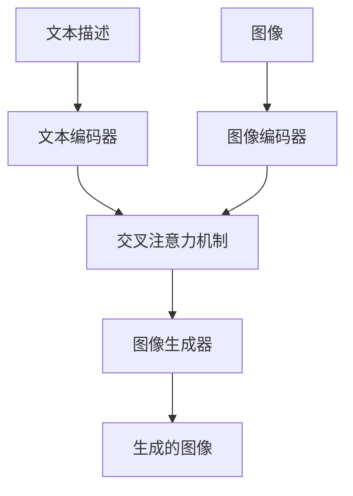

                 

**AIGC从入门到实战：提升：Midjourney 让我们人人都能成为设计师**

**作者：禅与计算机程序设计艺术 / Zen and the Art of Computer Programming**

## 1. 背景介绍

人工智能驱动的创意生成（AIGC）是当今科技领域最具前景的应用之一。其中，图像生成模型如Midjourney等，正在改变设计和创意行业的格局。本文将深入探讨Midjourney的工作原理，并提供实践指南，帮助读者理解和应用这项强大的工具。

## 2. 核心概念与联系

### 2.1 核心概念

Midjourney是基于Transformer模型的文本到图像（T2I）生成模型，它将文本描述转化为相应的图像。其核心组件包括：

- **文本编码器**：将文本描述转化为模型可以理解的表示。
- **图像编码器**：将图像表示转化为模型可以理解的表示。
- **交叉注意力机制**：允许文本和图像表示相互交互。
- **图像生成器**：根据文本描述和交互信息生成图像。

### 2.2 Mermaid 流程图



## 3. 核心算法原理 & 具体操作步骤

### 3.1 算法原理概述

Midjourney使用改进的Transformer模型，结合了文本编码器、图像编码器、交叉注意力机制和图像生成器。它采用自注意力机制，允许模型在处理文本和图像表示时进行自引用。

### 3.2 算法步骤详解

1. **文本编码**：将文本描述转化为模型可以理解的表示。
2. **图像编码**：将图像表示转化为模型可以理解的表示。
3. **交叉注意力**：允许文本和图像表示相互交互，生成关联表示。
4. **图像生成**：根据文本描述和交互信息生成图像。

### 3.3 算法优缺点

**优点**：Midjourney可以生成高质量的图像，并支持文本到图像的转化。它还可以接受图像作为输入，进行图像编辑和变化。

**缺点**：如同所有基于Transformer的模型一样，Midjourney也存在过拟合和计算资源需求高的问题。此外，它可能会生成不准确或不相关的图像，需要人工干预进行调整。

### 3.4 算法应用领域

Midjourney可以应用于各种设计领域，包括但不限于：图像编辑、图像生成、图像风格转化、图像描述生成等。

## 4. 数学模型和公式 & 详细讲解 & 举例说明

### 4.1 数学模型构建

Midjourney的数学模型基于Transformer模型，使用自注意力机制。其数学表示如下：

$$z_0 = f(x_0) + g(y_0)$$

其中，$x_0$是文本描述，$y_0$是图像表示，$f$和$g$分别是文本编码器和图像编码器，$z_0$是交互表示。

### 4.2 公式推导过程

交叉注意力机制可以表示为：

$$z_i = \text{Attention}(Q=W^Qz_{i-1}, K=W^Kz_{i-1}, V=W^Vz_{i-1})$$

其中，$W^Q$, $W^K$, $W^V$是学习的权重矩阵，$z_i$是当前层的输出。

### 4.3 案例分析与讲解

例如，给定文本描述"一只坐在树枝上的猫头鹰"，Midjourney可以生成相应的图像。通过交互表示，$z_0$, 它可以生成图像表示，并通过图像生成器生成最终图像。

## 5. 项目实践：代码实例和详细解释说明

### 5.1 开发环境搭建

Midjourney需要GPU支持，推荐使用NVIDIA GPU。环境搭建包括安装Python、PyTorch、Transformers库等。

### 5.2 源代码详细实现

Midjourney的源代码可以在其官方仓库找到。以下是关键代码片段：

```python
class Midjourney:
    def __init__(self):
        self.text_encoder = TextEncoder()
        self.image_encoder = ImageEncoder()
        self.transformer = Transformer()
        self.image_generator = ImageGenerator()

    def generate_image(self, text, image=None):
        text_embedding = self.text_encoder.encode(text)
        image_embedding = self.image_encoder.encode(image) if image else None
        interaction = self.transformer(text_embedding, image_embedding)
        image = self.image_generator.generate(interaction)
        return image
```

### 5.3 代码解读与分析

`Midjourney`类初始化时，实例化了文本编码器、图像编码器、Transformer和图像生成器。`generate_image`方法接受文本描述和可选的图像输入，并返回生成的图像。

### 5.4 运行结果展示

运行`generate_image`方法，输入文本描述"一只坐在树枝上的猫头鹰"，Midjourney会生成相应的图像。

## 6. 实际应用场景

### 6.1 当前应用

Midjourney已被广泛应用于设计、编辑和创意领域，包括图像编辑、图像生成、图像风格转化等。

### 6.2 未来应用展望

未来，Midjourney有望应用于更多领域，如虚拟现实、增强现实、自动驾驶等。它还可以与其他AIGC模型结合，实现更复杂的创意生成任务。

## 7. 工具和资源推荐

### 7.1 学习资源推荐

- [Midjourney官方文档](https://midjourney.readthedocs.io/en/latest/)
- [Transformer模型原文](https://arxiv.org/abs/1706.03762)
- [Midjourney GitHub仓库](https://github.com/midjourney/midjourney)

### 7.2 开发工具推荐

- [Google Colab](https://colab.research.google.com/)
- [Jupyter Notebook](https://jupyter.org/)
- [PyTorch](https://pytorch.org/)

### 7.3 相关论文推荐

- [DALL-E: Deep Learning for Generative Design](https://arxiv.org/abs/2102.05918)
- [CLIP: Connecting Text to Image Embeddings](https://arxiv.org/abs/2103.00020)

## 8. 总结：未来发展趋势与挑战

### 8.1 研究成果总结

Midjourney是当前最先进的文本到图像生成模型之一，它展示了Transformer模型在图像生成领域的强大潜力。

### 8.2 未来发展趋势

未来，Midjourney有望与其他模型结合，实现更复杂的创意生成任务。它还可以应用于更多领域，如虚拟现实、增强现实等。

### 8.3 面临的挑战

Midjourney面临的挑战包括过拟合问题、计算资源需求高等。此外，如何保证生成图像的准确性和相关性也是一项挑战。

### 8.4 研究展望

未来的研究方向包括改进模型架构、优化训练过程、扩展应用领域等。

## 9. 附录：常见问题与解答

**Q：Midjourney需要多少GPU内存？**

**A：Midjourney需要至少11GB的GPU内存。**

**Q：Midjourney可以接受图像作为输入吗？**

**A：是的，Midjourney可以接受图像作为输入，进行图像编辑和变化。**

**Q：Midjourney的开源许可证是什么？**

**A：Midjourney使用Apache License 2.0。**

**作者：禅与计算机程序设计艺术 / Zen and the Art of Computer Programming**

