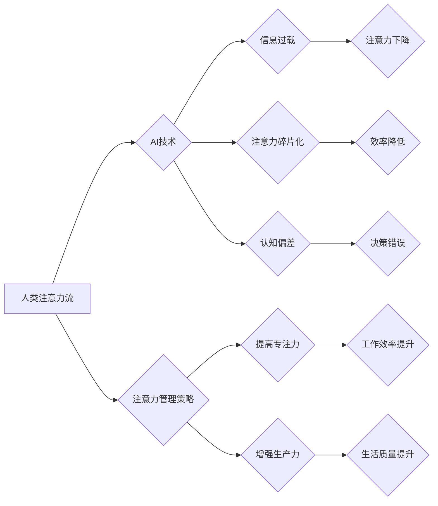

> 人工智能，注意力流，工作场所，注意力管理，深度学习，认知科学，未来趋势

## 1. 背景介绍

在当今信息爆炸的时代，人类面临着前所未有的注意力挑战。来自社交媒体、电子邮件、即时通讯等各种渠道的信息洪流，不断地冲击着我们的注意力，导致专注力下降、效率降低，甚至影响身心健康。与此同时，人工智能（AI）技术飞速发展，正在深刻地改变着我们的生活和工作方式。AI驱动的智能助手、自动化工具、个性化推荐系统等，正在逐渐融入我们的日常，并对我们的注意力机制产生着越来越大的影响。

如何有效地管理注意力，在AI时代保持专注力和生产力，成为一个越来越重要的课题。本文将探讨AI与人类注意力流之间的关系，分析AI对注意力机制的影响，并提出一些注意力管理策略，帮助我们在未来工作场所中更好地应对注意力挑战。

## 2. 核心概念与联系

### 2.1 人类注意力流

注意力流是指人类对信息进行选择性感知、加工和记忆的过程。它是一个动态的、多层次的认知过程，涉及到多个脑区和神经机制的协同作用。

人类的注意力流可以分为以下几个方面：

* **选择性注意:**  从众多刺激中选择性地关注特定信息。
* **持续注意:**  长时间地集中注意力在某一特定任务或目标上。
* **分心:**  注意力被无关信息或干扰所吸引，导致注意力转移。
* **注意力的恢复:**  从分心状态中恢复注意力，重新集中在目标上。

### 2.2 AI对注意力流的影响

AI技术正在以多种方式影响人类的注意力流：

* **信息过载:** AI驱动的个性化推荐系统和信息推送机制，会带来更多的信息流入，加剧信息过载，使人们难以集中注意力。
* **注意力碎片化:**  AI驱动的社交媒体、游戏和娱乐平台，会让人们注意力更加碎片化，难以长时间专注于一项任务。
* **认知偏差:** AI算法可能会利用人们的认知偏差，例如确认偏见和锚定效应，引导人们关注特定信息，从而影响他们的判断和决策。

### 2.3  AI与注意力流的交互关系

AI技术与人类注意力流之间存在着复杂的交互关系。一方面，AI可以帮助人们更好地管理注意力，例如通过智能过滤信息、提醒重要任务、提供个性化学习方案等。另一方面，AI也可能加剧注意力问题，例如导致信息过载、注意力碎片化、认知偏差等。

**Mermaid 流程图**



## 3. 核心算法原理 & 具体操作步骤

### 3.1  算法原理概述

为了更好地理解AI与人类注意力流之间的关系，我们需要了解一些核心算法原理，例如深度学习、自然语言处理、计算机视觉等。

* **深度学习:** 深度学习是一种机器学习的子领域，它利用多层神经网络来模拟人类大脑的学习过程。深度学习算法能够从海量数据中学习复杂的模式和特征，并应用于各种任务，例如图像识别、语音识别、自然语言理解等。
* **自然语言处理:** 自然语言处理（NLP）是人工智能的一个重要分支，它致力于使计算机能够理解、处理和生成人类语言。NLP算法可以用于文本分类、情感分析、机器翻译、对话系统等应用。
* **计算机视觉:** 计算机视觉是人工智能的一个领域，它致力于使计算机能够“看”和理解图像和视频。计算机视觉算法可以用于图像识别、物体检测、场景理解、图像分割等应用。

### 3.2  算法步骤详解

以下是一些AI算法在注意力管理领域的具体操作步骤：

* **数据收集:** 收集用户行为数据，例如浏览记录、点击行为、阅读时间等，以及用户反馈数据，例如注意力水平、任务完成情况等。
* **数据预处理:** 对收集到的数据进行清洗、转换、编码等预处理操作，使其能够被AI算法处理。
* **模型训练:** 利用深度学习算法，训练一个注意力预测模型，该模型能够根据用户的行为数据和反馈数据，预测用户的注意力水平。
* **注意力提醒:** 当模型预测用户的注意力水平下降时，会向用户发出提醒，例如播放提醒音、显示提示信息等，帮助用户恢复注意力。
* **个性化推荐:** 根据用户的注意力偏好和任务需求，为用户推荐相关的文章、视频、音频等内容，帮助用户更好地集中注意力。

### 3.3  算法优缺点

**优点:**

* **精准预测:** 深度学习算法能够从海量数据中学习复杂的模式，对用户的注意力水平进行精准预测。
* **个性化定制:** AI算法可以根据用户的个人特征和行为数据，提供个性化的注意力管理策略。
* **自动化提醒:** AI系统可以自动提醒用户注意力的下降，帮助用户及时恢复注意力。

**缺点:**

* **数据依赖:** AI算法需要大量的用户行为数据进行训练，如果数据质量不高或数据量不足，模型的预测精度会降低。
* **隐私问题:** 收集和使用用户的行为数据可能会引发隐私问题，需要采取相应的措施保护用户隐私。
* **算法偏差:** AI算法可能会存在算法偏差，导致对不同用户群体进行不公平的注意力管理。

### 3.4  算法应用领域

AI算法在注意力管理领域具有广泛的应用前景，例如：

* **教育领域:**  帮助学生提高学习效率，专注于课堂内容。
* **工作领域:**  帮助员工提高工作效率，专注于重要任务。
* **医疗领域:**  帮助患者集中注意力，进行康复训练。
* **娱乐领域:**  帮助用户更好地沉浸在游戏和视频体验中。

## 4. 数学模型和公式 & 详细讲解 & 举例说明

### 4.1  数学模型构建

为了量化用户的注意力水平，我们可以构建一个数学模型，例如基于贝叶斯网络的注意力模型。该模型将用户的行为数据、生理数据和环境因素作为输入，并输出用户的注意力水平预测值。

**贝叶斯网络模型结构:**

```
注意力水平 <-  浏览时间 + 点击次数 + 阅读时长 + 心率 + 脑电波 + 环境噪音
```

### 4.2  公式推导过程

我们可以使用贝叶斯定理来推导注意力水平的预测公式。

**贝叶斯定理:**

$$P(A|B) = \frac{P(B|A)P(A)}{P(B)}$$

其中：

* $P(A|B)$ 是在已知事件 B 发生的情况下，事件 A 发生的概率。
* $P(B|A)$ 是在已知事件 A 发生的情况下，事件 B 发生的概率。
* $P(A)$ 是事件 A 发生的概率。
* $P(B)$ 是事件 B 发生的概率。

**注意力水平预测公式:**

$$P(\text{注意力水平} | \text{行为数据, 生理数据, 环境因素}) = \frac{P(\text{行为数据, 生理数据, 环境因素} | \text{注意力水平})P(\text{注意力水平})}{P(\text{行为数据, 生理数据, 环境因素})}$$

### 4.3  案例分析与讲解

假设我们有一个用户，他的浏览时间为 30 分钟，点击次数为 5 次，阅读时长为 10 分钟，心率为 70 次/分钟，脑电波为 8 微伏特，环境噪音为 50 分贝。我们可以将这些数据代入注意力水平预测公式，并根据模型训练得到的参数，计算出该用户的注意力水平预测值。

## 5. 项目实践：代码实例和详细解释说明

### 5.1  开发环境搭建

为了实现注意力管理系统，我们需要搭建一个开发环境，包括以下软件和硬件：

* **操作系统:**  Windows、macOS 或 Linux
* **编程语言:**  Python
* **深度学习框架:**  TensorFlow 或 PyTorch
* **数据存储:**  MySQL 或 MongoDB
* **硬件:**  电脑、摄像头、心率监测器等

### 5.2  源代码详细实现

以下是一个基于 TensorFlow 的注意力预测模型的代码示例：

```python
import tensorflow as tf

# 定义模型结构
model = tf.keras.models.Sequential([
    tf.keras.layers.Dense(64, activation='relu', input_shape=(7,)),
    tf.keras.layers.Dense(32, activation='relu'),
    tf.keras.layers.Dense(1, activation='sigmoid')
])

# 编译模型
model.compile(optimizer='adam', loss='binary_crossentropy', metrics=['accuracy'])

# 训练模型
model.fit(X_train, y_train, epochs=10)

# 预测注意力水平
predictions = model.predict(X_test)
```

### 5.3  代码解读与分析

* **模型结构:**  该模型是一个简单的多层感知机，包含三个全连接层和一个 sigmoid 激活函数的输出层。
* **输入数据:**  模型的输入数据是一个包含 7 个特征的向量，例如浏览时间、点击次数、阅读时长、心率、脑电波、环境噪音等。
* **输出结果:**  模型的输出结果是一个介于 0 和 1 之间的数值，表示用户的注意力水平预测值。
* **训练过程:**  模型使用 Adam 优化器和二元交叉熵损失函数进行训练。

### 5.4  运行结果展示

训练完成后，我们可以使用测试数据来评估模型的性能，例如计算准确率、召回率、F1 值等指标。

## 6. 实际应用场景

### 6.1  教育领域

AI驱动的注意力管理系统可以帮助学生提高学习效率，例如：

* **个性化学习方案:** 根据学生的注意力水平和学习偏好，提供个性化的学习方案，例如调整学习内容、学习节奏、学习方式等。
* **注意力提醒:** 当学生注意力下降时，系统会发出提醒，帮助学生恢复注意力。
* **学习进度跟踪:** 系统可以跟踪学生的学习进度，并及时反馈学生的学习情况，帮助学生更好地掌握学习内容。

### 6.2  工作领域

AI驱动的注意力管理系统可以帮助员工提高工作效率，例如：

* **任务优先级排序:** 根据员工的注意力水平和任务重要性，自动排序任务优先级，帮助员工集中精力完成重要任务。
* **工作时间管理:** 系统可以帮助员工合理安排工作时间，避免过度疲劳，提高工作效率。
* **信息过滤:** 系统可以过滤无关信息，帮助员工集中精力处理重要信息。

### 6.3  医疗领域

AI驱动的注意力管理系统可以帮助患者进行康复训练，例如：

* **注意力训练游戏:** 系统可以开发一些注意力训练游戏，帮助患者提高注意力水平。
* **康复进度跟踪:** 系统可以跟踪患者的康复进度，并及时反馈患者的康复情况，帮助患者更好地进行康复训练。
* **心理健康监测:** 系统可以监测患者的心理状态，例如焦虑、抑郁等，并及时提醒患者寻求帮助。

### 6.4  未来应用展望

随着AI技术的不断发展，注意力管理系统将会有更广泛的应用场景，例如：

* **智能家居:**  AI系统可以根据用户的注意力水平，自动调节家居环境，例如灯光、温度、音乐等，帮助用户更好地放松和休息。
* **智能交通:**  AI系统可以根据驾驶员的注意力水平，提供驾驶辅助功能，例如自动驾驶、疲劳驾驶提醒等，提高交通安全。
* **虚拟现实:**  AI系统可以根据用户的注意力水平，调整虚拟现实体验，例如游戏难度、场景变化等，提供更沉浸式的体验。

## 7. 工具和资源推荐

### 7.1  学习资源推荐

* **书籍:**
    