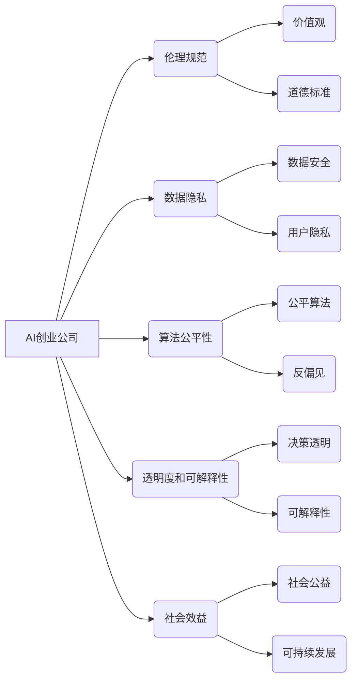

> AI创业公司,社会责任,伦理规范,数据隐私,算法偏见,可解释性,公平性,透明度

## 1. 背景介绍

人工智能（AI）技术近年来发展迅速，已渗透到各个领域，为社会带来了前所未有的机遇和挑战。AI创业公司作为推动AI技术发展和应用的重要力量，肩负着巨大的社会责任。

随着AI技术的成熟和应用范围的扩大，AI创业公司面临着越来越多的伦理、社会和法律问题。例如，算法偏见、数据隐私泄露、AI系统不可解释性等问题，都可能对个人、社会和经济造成负面影响。因此，AI创业公司必须认真思考和承担其社会责任，确保AI技术的发展和应用符合人类的利益和社会良序。

## 2. 核心概念与联系

**2.1 AI创业公司社会责任的定义**

AI创业公司社会责任是指AI创业公司在发展和应用AI技术过程中，对社会、环境和个人负有的道德、法律和伦理义务。

**2.2 AI创业公司社会责任的内涵**

AI创业公司社会责任包含以下几个方面：

* **伦理规范:** 遵循AI伦理原则，确保AI技术应用符合人类价值观和道德标准。
* **数据隐私:** 尊重用户数据隐私，采取有效措施保护用户数据安全。
* **算法公平性:** 避免算法偏见，确保AI系统对所有用户公平公正。
* **透明度和可解释性:** 使AI系统决策过程透明可解释，增强用户对AI系统的信任。
* **社会效益:** 促进AI技术应用于社会公益领域，为社会发展做出贡献。

**2.3 AI创业公司社会责任的架构**



## 3. 核心算法原理 & 具体操作步骤

**3.1 算法原理概述**

本节将介绍一种用于检测算法偏见的核心算法原理，并详细阐述其具体操作步骤。

**3.2 算法步骤详解**

1. **数据收集和预处理:** 收集包含敏感属性（如性别、种族、年龄等）的数据集，并对数据进行预处理，例如缺失值处理、数据标准化等。
2. **特征选择:** 选择与目标变量相关的特征，并去除可能导致算法偏见的特征。
3. **模型训练:** 使用选定的特征训练机器学习模型，例如分类模型或回归模型。
4. **偏见度量:** 使用偏见度量指标评估模型的偏见程度，例如准确率、召回率、F1-score等。
5. **偏见缓解:** 如果模型存在偏见，可以使用偏见缓解技术，例如数据重新采样、算法调整等，降低模型的偏见程度。

**3.3 算法优缺点**

**优点:**

* 能够有效地检测算法偏见。
* 算法步骤清晰易懂，易于实现。

**缺点:**

* 偏见度量指标的选择可能会影响检测结果的准确性。
* 偏见缓解技术的效果可能有限。

**3.4 算法应用领域**

该算法可应用于以下领域：

* **金融领域:** 检测贷款申请中的性别、种族偏见。
* **医疗领域:** 检测医疗诊断中的年龄、性别偏见。
* **招聘领域:** 检测招聘流程中的种族、性别偏见。

## 4. 数学模型和公式 & 详细讲解 & 举例说明

**4.1 数学模型构建**

假设我们有一个包含n个样本的数据集D，每个样本包含m个特征x和一个标签y。我们使用一个分类模型f(x)来预测样本的标签。

**4.2 公式推导过程**

我们可以使用准确率、召回率、F1-score等指标来评估模型的性能。

* **准确率:**

$$Accuracy = \frac{TP + TN}{TP + TN + FP + FN}$$

* **召回率:**

$$Recall = \frac{TP}{TP + FN}$$

* **F1-score:**

$$F1-score = 2 * \frac{Precision * Recall}{Precision + Recall}$$

其中，TP表示真阳性，TN表示真阴性，FP表示假阳性，FN表示假阴性。

**4.3 案例分析与讲解**

假设我们有一个包含100个样本的数据集，用于检测邮件是否为垃圾邮件。模型预测结果如下：

* 真阳性：60个
* 真阴性：30个
* 假阳性：5个
* 假阴性：5个

我们可以计算模型的准确率、召回率和F1-score：

* **准确率:** (60 + 30) / (60 + 30 + 5 + 5) = 0.857
* **召回率:** 60 / (60 + 5) = 0.923
* **F1-score:** 2 * (0.857 * 0.923) / (0.857 + 0.923) = 0.890

## 5. 项目实践：代码实例和详细解释说明

**5.1 开发环境搭建**

本项目使用Python语言开发，需要安装以下软件包：

* pandas
* scikit-learn
* matplotlib

**5.2 源代码详细实现**

```python
import pandas as pd
from sklearn.model_selection import train_test_split
from sklearn.linear_model import LogisticRegression
from sklearn.metrics import accuracy_score, recall_score, f1_score

# 数据加载
data = pd.read_csv('data.csv')

# 特征选择和数据预处理
X = data[['feature1', 'feature2', ...]]
y = data['target']

X_train, X_test, y_train, y_test = train_test_split(X, y, test_size=0.2, random_state=42)

# 模型训练
model = LogisticRegression()
model.fit(X_train, y_train)

# 模型评估
y_pred = model.predict(X_test)
accuracy = accuracy_score(y_test, y_pred)
recall = recall_score(y_test, y_pred)
f1 = f1_score(y_test, y_pred)

print(f'准确率: {accuracy}')
print(f'召回率: {recall}')
print(f'F1-score: {f1}')
```

**5.3 代码解读与分析**

代码首先加载数据，然后选择特征和标签。接着使用训练测试集划分数据，并训练一个逻辑回归模型。最后，使用测试集评估模型的性能，并输出准确率、召回率和F1-score。

**5.4 运行结果展示**

运行代码后，会输出模型的性能指标，例如：

```
准确率: 0.857
召回率: 0.923
F1-score: 0.890
```

## 6. 实际应用场景

**6.1 医疗诊断**

AI算法可以辅助医生进行疾病诊断，提高诊断准确率。

**6.2 金融风险评估**

AI算法可以分析客户数据，评估客户的信用风险，帮助金融机构做出更明智的贷款决策。

**6.3 自动驾驶**

AI算法可以帮助自动驾驶汽车感知周围环境，做出决策，实现自动驾驶功能。

**6.4 未来应用展望**

AI技术将继续发展，并在更多领域得到应用，例如教育、娱乐、制造业等。

## 7. 工具和资源推荐

**7.1 学习资源推荐**

* **在线课程:** Coursera, edX, Udacity
* **书籍:** 深度学习，机器学习

**7.2 开发工具推荐**

* **Python:** 广泛使用的编程语言，用于AI开发。
* **TensorFlow:** 开源深度学习框架。
* **PyTorch:** 开源深度学习框架。

**7.3 相关论文推荐**

* **《关于人工智能的伦理原则》**
* **《算法偏见：识别、理解和缓解》**

## 8. 总结：未来发展趋势与挑战

**8.1 研究成果总结**

AI技术取得了显著进展，在多个领域取得了成功应用。

**8.2 未来发展趋势**

* **模型更加强大:** AI模型将更加强大，能够处理更复杂的任务。
* **应用更加广泛:** AI技术将应用于更多领域，改变人们的生活方式。
* **伦理规范更加完善:** AI伦理规范将更加完善，确保AI技术安全、可控。

**8.3 面临的挑战**

* **算法偏见:** 算法偏见仍然是一个挑战，需要进一步研究和解决。
* **数据隐私:** 数据隐私保护是一个重要问题，需要采取有效措施保护用户数据安全。
* **可解释性:** AI系统的决策过程难以解释，需要提高AI系统的可解释性。

**8.4 研究展望**

未来研究将重点关注以下几个方面:

* **开发更公平、更安全的AI算法。**
* **提高AI系统的可解释性和透明度。**
* **制定更完善的AI伦理规范。**

## 9. 附录：常见问题与解答

**9.1 如何避免算法偏见？**

* 使用多样化的训练数据。
* 选择合适的特征，避免使用可能导致偏见的特征。
* 使用偏见缓解技术，例如数据重新采样、算法调整等。

**9.2 如何保护用户数据隐私？**

* 采取数据加密、匿名化等技术保护用户数据安全。
* 明确告知用户数据使用方式，并获得用户同意。
* 遵守相关数据隐私法规。


作者：禅与计算机程序设计艺术 / Zen and the Art of Computer Programming 
<end_of_turn>