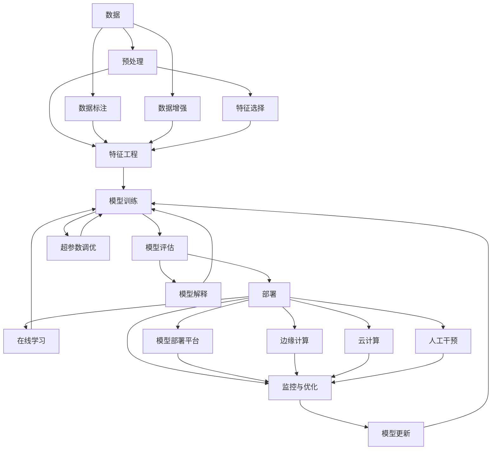

                 

- AI创业
- 垂直领域
- 机器学习
- 深度学习
- 自然语言处理
- 计算机视觉
- 无人驾驶

## 1. 背景介绍

人工智能（AI）正在各行各业掀起一场革命，为创业者带来了前所未有的机遇。垂直领域，即特定行业或细分市场，正在成为AI创业的热门选择。本文将深入探讨AI在垂直领域的应用，并提供实用的指南，帮助读者把握AI创业机遇。

## 2. 核心概念与联系

### 2.1 AI与垂直领域

AI在垂直领域的应用，需要理解AI与垂直领域的关系。AI可以为垂直领域提供智能化解决方案，帮助其提高效率、降低成本、改善用户体验。垂直领域则为AI提供了丰富的数据和应用场景，助推AI技术的发展。

### 2.2 AI技术栈

AI技术栈包括机器学习、深度学习、自然语言处理、计算机视觉等。这些技术为AI在垂直领域的应用提供了基础。



## 3. 核心算法原理 & 具体操作步骤

### 3.1 算法原理概述

在垂直领域应用AI时，需要选择合适的算法。常用的算法包括线性回归、逻辑回归、支持向量机、决策树、随机森林、神经网络等。

### 3.2 算法步骤详解

以线性回归为例，其步骤包括：

1. 数据收集：收集垂直领域相关的数据。
2. 数据预处理：清洗数据，处理缺失值，进行特征工程。
3. 模型训练：使用训练数据训练线性回归模型。
4. 模型评估：使用验证数据评估模型性能。
5. 模型部署：将模型部署到生产环境中。

### 3.3 算法优缺点

线性回归优点包括简单易懂、训练快、预测快。缺点包括对数据线性关系的假设，对异常值敏感。

### 3.4 算法应用领域

线性回归在垂直领域的应用包括预测销售额、预测客户流失率、预测设备故障率等。

## 4. 数学模型和公式 & 详细讲解 & 举例说明

### 4.1 数学模型构建

线性回归的数学模型为：

$$y = wx + b$$

其中，$y$为目标变量，$x$为特征变量，$w$为权重，$b$为偏置。

### 4.2 公式推导过程

线性回归的目标是最小化误差平方和：

$$J(w, b) = \frac{1}{2} \sum_{i=1}^{n} (y_i - (wx_i + b))^2$$

使用梯度下降法求解：

$$w := w - \eta \frac{\partial J}{\partial w}$$
$$b := b - \eta \frac{\partial J}{\partial b}$$

### 4.3 案例分析与讲解

例如，在零售垂直领域，可以使用线性回归预测销售额。特征变量$x$可以包括商品价格、促销活动、季节等。目标变量$y$为销售额。

## 5. 项目实践：代码实例和详细解释说明

### 5.1 开发环境搭建

本项目使用Python、Scikit-learn、Jupyter Notebook。

### 5.2 源代码详细实现

```python
from sklearn.linear_model import LinearRegression
from sklearn.model_selection import train_test_split
from sklearn.metrics import mean_squared_error
import pandas as pd

# 加载数据
data = pd.read_csv('sales_data.csv')

# 分割数据
X = data[['price', 'promotion','season']]
y = data['sales']

X_train, X_test, y_train, y_test = train_test_split(X, y, test_size=0.2, random_state=42)

# 训练模型
model = LinearRegression()
model.fit(X_train, y_train)

# 预测
y_pred = model.predict(X_test)

# 评估
mse = mean_squared_error(y_test, y_pred)
print('Mean Squared Error:', mse)
```

### 5.3 代码解读与分析

本项目使用Scikit-learn库训练线性回归模型。首先加载数据，然后分割数据为训练集和测试集。接着训练模型，并使用测试集预测销售额。最后计算均方误差评估模型性能。

### 5.4 运行结果展示

均方误差越小，模型性能越好。通过调整特征变量、优化模型参数等手段，可以改善模型性能。

## 6. 实际应用场景

### 6.1 当前应用

AI在垂直领域的当前应用包括：

- 金融：风险评估、欺诈检测、客户画像。
- 医疗：疾病诊断、药物发现、个性化治疗。
- 交通：无人驾驶、路网优化、交通预测。
- 制造：质量控制、设备维护、供应链管理。

### 6.2 未来应用展望

未来AI在垂直领域的应用将更加广泛，包括：

- 智能城市：智能交通、智能能源、智能环保。
- 智能农业：精准灌溉、病虫害监测、智能收割。
- 智能零售：个性化推荐、库存管理、无人零售。
- 智能教育：个性化学习、智能辅导、在线评估。

## 7. 工具和资源推荐

### 7.1 学习资源推荐

- 书籍：《机器学习》《深度学习》《自然语言处理》《计算机视觉：模式识别与机器学习方法》《无人驾驶汽车技术与应用》。
- 在线课程：Coursera、Udacity、edX、Fast.ai。
- 论坛：Stack Overflow、KDnuggets、Towards Data Science。

### 7.2 开发工具推荐

- 编程语言：Python、R、Julia。
- 开发环境：Jupyter Notebook、PyCharm、RStudio。
- AI框架：TensorFlow、PyTorch、Keras。
- 云平台：AWS、Google Cloud、Microsoft Azure。

### 7.3 相关论文推荐

- LeCun, Y., Bengio, Y., & Hinton, G. (2015). Deep learning. Nature, 521(7553), 436-444.
- Goodfellow, I., Bengio, Y., & Courville, A. (2016). Deep learning (Vol. 1). MIT press.
- Rumelhart, D. E., Hinton, G. E., & Williams, R. J. (1986). Learning representations by back-propagating errors. Nature, 323(6088), 533-536.
- Hinton, G. E., & Salakhutdinov, R. R. (2006). Reducing the dimensionality of data with neural networks. Science, 313(5786), 504-507.

## 8. 总结：未来发展趋势与挑战

### 8.1 研究成果总结

本文介绍了AI在垂直领域的应用，并提供了线性回归算法的详细讲解。通过项目实践，读者可以学习如何使用线性回归预测销售额。

### 8.2 未来发展趋势

未来AI在垂直领域的发展趋势包括：

- 端到端学习：直接从原始数据中学习，无需人工特征工程。
- 解释性AI：帮助用户理解模型决策的原因。
- 多模式学习：结合文本、图像、音频等多模式数据学习。
- 可解释AI：帮助用户理解模型决策的原因。
- 可持续AI：考虑能源消耗、碳排放等因素，实现可持续发展。

### 8.3 面临的挑战

AI在垂直领域的发展面临的挑战包括：

- 数据匮乏：垂直领域数据往往不足，需要进行数据增强、数据采集等工作。
- 数据质量：垂直领域数据往往存在缺失值、异常值等问题，需要进行数据预处理。
- 模型泛化：垂直领域数据往往不平衡，需要进行数据平衡、模型调优等工作。
- 解释性：垂直领域往往需要解释模型决策的原因，需要进行模型解释等工作。
- 伦理道德：AI在垂直领域的应用需要考虑伦理道德问题，需要进行伦理审查等工作。

### 8.4 研究展望

未来AI在垂直领域的研究展望包括：

- 端到端学习：研究如何直接从原始数据中学习，无需人工特征工程。
- 多模式学习：研究如何结合文本、图像、音频等多模式数据学习。
- 可解释AI：研究如何帮助用户理解模型决策的原因。
- 可持续AI：研究如何考虑能源消耗、碳排放等因素，实现可持续发展。
- 伦理道德：研究如何在AI在垂直领域的应用中考虑伦理道德问题。

## 9. 附录：常见问题与解答

### 9.1 如何选择合适的算法？

选择合适的算法需要考虑数据特征、任务类型、模型复杂度等因素。常用的算法包括线性回归、逻辑回归、支持向量机、决策树、随机森林、神经网络等。

### 9.2 如何评估模型性能？

评估模型性能需要使用验证集、测试集等评估指标。常用的评估指标包括均方误差、精确度、召回率、F1分数等。

### 9.3 如何处理数据缺失？

处理数据缺失需要根据缺失原因、缺失比例等因素选择合适的方法。常用的方法包括删除法、插补法、建模法等。

### 9.4 如何处理数据异常？

处理数据异常需要根据异常原因、异常比例等因素选择合适的方法。常用的方法包括删除法、修正法、建模法等。

### 9.5 如何处理数据不平衡？

处理数据不平衡需要根据不平衡原因、不平衡比例等因素选择合适的方法。常用的方法包括过采样、欠采样、SMOTE等。

## 作者：禅与计算机程序设计艺术 / Zen and the Art of Computer Programming

