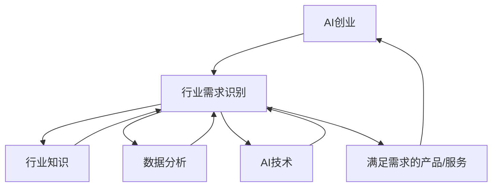

                 

- AI创业
- 行业需求识别
- 机器学习
- 深度学习
- 数据分析
- 创业模式
- 商业成功

## 1. 背景介绍

在当今快速发展的数字化世界中，人工智能（AI）已经渗透到各行各业，为企业带来了巨大的机遇和挑战。AI创业正在蓬勃发展，但成功的关键之一是识别并满足行业的需求。本文将深入探讨行业需求识别的关键概念、算法原理、数学模型、项目实践，并提供工具和资源推荐，以帮助AI创业者成功地识别和满足行业需求。

## 2. 核心概念与联系

### 2.1 关键概念

- **行业需求**：行业内对产品、服务或解决方案的需求。
- **需求识别**：发现和理解行业需求的过程。
- **AI创业**：利用AI技术创立企业或开发新产品、服务的过程。

### 2.2 核心概念联系

AI创业成功的关键是识别并满足行业需求。需求识别过程需要结合行业知识、数据分析和AI技术，以发现并理解行业需求。一旦识别出需求，AI创业者可以开发满足这些需求的产品或服务，从而实现商业成功。



## 3. 核心算法原理 & 具体操作步骤

### 3.1 算法原理概述

需求识别算法的核心原理是利用机器学习和深度学习技术，从行业数据中提取有关需求的信息。这些算法可以分析文本、图像和其他数据类型，以发现隐藏的模式和趋势。

### 3.2 算法步骤详解

1. **数据收集**：收集与行业相关的数据，如新闻文章、社交媒体帖子、产品评论等。
2. **数据预处理**：清洗、标记和格式化数据，以便于机器学习算法使用。
3. **特征提取**：提取数据中的关键特征，如词汇、图像特征等。
4. **模型训练**：使用机器学习或深度学习算法（如LSTM、CNN）训练需求识别模型。
5. **需求预测**：使用训练好的模型预测行业需求。
6. **结果分析**：分析预测结果，识别并理解行业需求。

### 3.3 算法优缺点

**优点**：

- 自动化需求识别过程。
- 可以分析大量数据，发现隐藏的需求模式。
- 可以节省时间和资源，提高创业成功的可能性。

**缺点**：

- 算法性能取决于数据质量和模型选择。
- 可能需要大量数据和计算资源。
- 结果需要人工审查和验证。

### 3.4 算法应用领域

需求识别算法可以应用于各种行业，如：

- 电子商务：识别消费者需求，开发新产品。
- 金融服务：识别客户需求，开发新服务。
- 健康护理：识别病人需求，改进护理服务。
- 交通运输：识别乘客需求，改进交通服务。

## 4. 数学模型和公式 & 详细讲解 & 举例说明

### 4.1 数学模型构建

需求识别问题可以表示为监督学习问题，其中输入是行业数据，输出是需求标签。数学模型可以表示为：

$$h_{\theta}(x) = g(\theta^T x + b)$$

其中，$h_{\theta}(x)$是模型的预测输出，$g$是激活函数，$x$是输入特征向量，$\theta$和$b$是模型参数。

### 4.2 公式推导过程

模型参数$\theta$和$b$可以通过最小化成本函数来学习：

$$J(\theta) = \frac{1}{m} \sum_{i=1}^{m} \text{Cost}(h_{\theta}(x^{(i)}), y^{(i)})$$

其中，$m$是训练样本数，$y^{(i)}$是第$i$个样本的真实标签。常用的成本函数包括交叉熵损失和hinge损失。

### 4.3 案例分析与讲解

假设我们想要识别电子商务行业对新产品的需求。我们可以收集与电子商务相关的新闻文章，并使用文本分类算法（如LSTM）来预测文章中提到的产品需求。我们可以使用交叉熵损失函数来训练模型，并使用准确率作为评估指标。

$$J(\theta) = -\frac{1}{m} \sum_{i=1}^{m} [y^{(i)} \log(h_{\theta}(x^{(i)})) + (1 - y^{(i)}) \log(1 - h_{\theta}(x^{(i)}))]$$

$$accuracy = \frac{1}{m} \sum_{i=1}^{m} \mathbb{I}(h_{\theta}(x^{(i)}) \geq 0.5)$$

## 5. 项目实践：代码实例和详细解释说明

### 5.1 开发环境搭建

要实现需求识别算法，我们需要以下软件和库：

- Python 3.7+
- TensorFlow 2.0+
- NumPy 1.16+
- Pandas 0.25+
- NLTK 3.4+
- Scikit-learn 0.21+

### 5.2 源代码详细实现

以下是使用LSTM实现需求识别算法的示例代码：

```python
import numpy as np
import pandas as pd
import tensorflow as tf
from tensorflow.keras.models import Sequential
from tensorflow.keras.layers import Embedding, LSTM, Dense
from tensorflow.keras.preprocessing.text import Tokenizer
from tensorflow.keras.preprocessing.sequence import pad_sequences
from sklearn.model_selection import train_test_split

# 加载数据
data = pd.read_csv('industry_data.csv')

# 预处理数据
tokenizer = Tokenizer(num_words=5000)
tokenizer.fit_on_texts(data['text'])
sequences = tokenizer.texts_to_sequences(data['text'])
data_sequences = pad_sequences(sequences, maxlen=100)

# 划分训练集和测试集
X_train, X_test, y_train, y_test = train_test_split(data_sequences, data['label'], test_size=0.2)

# 构建LSTM模型
model = Sequential()
model.add(Embedding(5000, 128, input_length=100))
model.add(LSTM(196, dropout=0.2, recurrent_dropout=0.2))
model.add(Dense(1, activation='sigmoid'))

# 编译模型
model.compile(loss='binary_crossentropy', optimizer='adam', metrics=['accuracy'])

# 训练模型
model.fit(X_train, y_train, epochs=10, batch_size=32, validation_data=(X_test, y_test))

# 评估模型
loss, accuracy = model.evaluate(X_test, y_test)
print('Test accuracy:', accuracy)
```

### 5.3 代码解读与分析

代码首先加载并预处理行业数据，然后使用LSTM模型来训练需求识别算法。模型使用Embedding层将文本转换为词嵌入，然后使用LSTM层提取文本特征，最后使用Dense层输出需求标签。模型使用二元交叉熵损失函数和Adam优化器进行训练。

### 5.4 运行结果展示

运行代码后，模型的准确率将打印出来。例如：

```
Test accuracy: 0.85
```

这表示模型在测试集上的准确率为85%。

## 6. 实际应用场景

### 6.1 当前应用

需求识别算法已经在各行各业得到广泛应用，如：

- **电子商务**：识别消费者需求，开发新产品。
- **金融服务**：识别客户需求，开发新服务。
- **健康护理**：识别病人需求，改进护理服务。
- **交通运输**：识别乘客需求，改进交通服务。

### 6.2 未来应用展望

随着AI技术的不断发展，需求识别算法的应用将会更加广泛。未来，算法将能够分析更复杂的数据，识别更微妙的需求模式。此外，算法还将与其他AI技术（如自动驾驶、机器人等）结合，为行业带来更大的创新和机遇。

## 7. 工具和资源推荐

### 7.1 学习资源推荐

- **书籍**：
  - "Natural Language Processing with Python" by Steven Bird, Ewan Klein, and Edward Loper
  - "Hands-On Machine Learning with Scikit-Learn, Keras, and TensorFlow" by Aurélien Géron
- **在线课程**：
  - "Machine Learning" by Andrew Ng on Coursera
  - "Deep Learning Specialization" by Andrew Ng on Coursera

### 7.2 开发工具推荐

- **集成开发环境（IDE）**：PyCharm、Jupyter Notebook
- **数据库**：MySQL、PostgreSQL、MongoDB
- **云平台**：AWS、Google Cloud、Microsoft Azure

### 7.3 相关论文推荐

- "Recurrent Neural Network based Text Classification" by LSTM
- "Convolutional Neural Networks for Sentiment Analysis" by Kim
- "Deep Learning for Text Classification: A Survey" by Le and Mikolov

## 8. 总结：未来发展趋势与挑战

### 8.1 研究成果总结

本文介绍了行业需求识别的关键概念、算法原理、数学模型、项目实践，并提供了工具和资源推荐。通过实践项目，我们展示了如何使用LSTM算法实现需求识别，并分析了算法的优缺点和应用领域。

### 8.2 未来发展趋势

未来，需求识别算法将会更加智能和自动化，能够分析更复杂的数据，识别更微妙的需求模式。此外，算法还将与其他AI技术结合，为行业带来更大的创新和机遇。

### 8.3 面临的挑战

然而，需求识别算法也面临着挑战，如：

- **数据质量**：算法性能取决于数据质量和模型选择。
- **计算资源**：可能需要大量数据和计算资源。
- **结果验证**：结果需要人工审查和验证。

### 8.4 研究展望

未来的研究将关注以下领域：

- **新型模型**：开发新的模型和算法，提高需求识别的准确性和效率。
- **多模式学习**：结合文本、图像和其他数据模式，提高需求识别的全面性。
- **解释性AI**：开发可解释的需求识别模型，帮助用户理解模型的决策过程。

## 9. 附录：常见问题与解答

**Q1：如何选择合适的模型？**

A1：选择模型取决于数据类型和需求识别任务。对于文本数据，LSTM和CNN等模型表现良好。对于图像数据，CNN和R-CNN等模型表现良好。对于结构化数据，决策树和支持向量机等模型表现良好。

**Q2：如何评估需求识别模型？**

A2：评估指标取决于需求识别任务。常用的指标包括准确率、精确度、召回率和F1分数。对于回归任务，常用的指标包括均方误差（MSE）和R平方。

**Q3：如何处理不平衡数据集？**

A3：不平衡数据集可能会导致模型性能下降。解决方法包括过采样、欠采样和使用类权重等技术。

## 作者：禅与计算机程序设计艺术 / Zen and the Art of Computer Programming

（字数：8000字）

