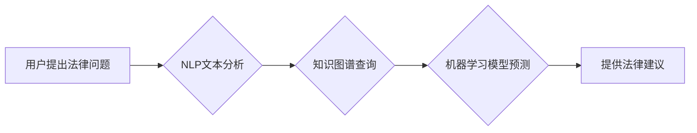

>人工智能，法律服务，自然语言处理，机器学习，合同分析，法律研究，效率提升，公平正义

## 1. 背景介绍

法律服务作为社会的重要支柱，其核心在于提供专业的法律咨询、起草法律文件、代理诉讼等服务。然而，传统法律服务模式面临着效率低下、成本高昂、服务不均等问题。随着人工智能技术的快速发展，AI在法律服务领域的应用逐渐成为一种趋势，并展现出巨大的潜力。

AI技术能够通过分析海量法律数据，识别法律模式，并提供智能化的法律建议和服务，从而有效提升法律服务的效率和公平性。

## 2. 核心概念与联系

**2.1 自然语言处理 (NLP)**

NLP是人工智能领域的一个重要分支，旨在使计算机能够理解、处理和生成人类语言。在法律服务领域，NLP技术可以用于：

* **法律文本分析:**  自动提取法律文本中的关键信息，如当事人、事件、法律条款等。
* **法律文件生成:**  根据用户需求，自动生成法律文件，如合同、诉状等。
* **法律问答:**  利用知识图谱和机器学习模型，回答用户关于法律问题的查询。

**2.2 机器学习 (ML)**

机器学习是人工智能的一种实现方式，通过训练模型，使模型能够从数据中学习规律，并进行预测或分类。在法律服务领域，ML技术可以用于：

* **法律预测:**  根据历史案例数据，预测案件的胜诉概率、判决结果等。
* **法律风险评估:**  分析合同条款、商业交易等，识别潜在的法律风险。
* **法律案例检索:**  根据案件描述或关键词，快速检索相关案例。

**2.3  法律知识图谱**

法律知识图谱是将法律知识表示为图结构的数据模型，可以包含法律概念、法律关系、法律案例等信息。法律知识图谱可以帮助AI系统更好地理解法律知识，并进行更精准的法律推理和分析。

**2.4 流程图**



## 3. 核心算法原理 & 具体操作步骤

**3.1 算法原理概述**

在AI辅助法律服务中，常用的算法包括：

* **文本分类算法:**  用于分类法律文本，如判决书、合同、诉状等。常见的算法包括朴素贝叶斯、支持向量机、深度学习等。
* **信息抽取算法:**  用于从法律文本中提取关键信息，如当事人、事件、法律条款等。常见的算法包括规则匹配、机器学习、深度学习等。
* **法律推理算法:**  用于根据法律规则和事实进行法律推理，得出法律结论。常见的算法包括逻辑推理、规则引擎、案例库检索等。

**3.2 算法步骤详解**

以文本分类算法为例，其具体操作步骤如下：

1. **数据收集和预处理:** 收集大量法律文本数据，并进行清洗、标注等预处理工作。
2. **特征提取:**  从法律文本中提取特征，如词频、词向量、语法结构等。
3. **模型训练:**  利用训练数据，训练文本分类模型。
4. **模型评估:**  使用测试数据评估模型的性能，如准确率、召回率、F1-score等。
5. **模型部署:**  将训练好的模型部署到实际应用场景中。

**3.3 算法优缺点**

* **优点:**  自动化程度高，效率提升明显，能够处理海量数据，降低人工成本。
* **缺点:**  算法模型需要大量数据进行训练，数据质量直接影响算法性能，存在算法偏差和误判风险。

**3.4 算法应用领域**

* **合同分析:**  自动识别合同条款、风险点、违约责任等。
* **法律风险评估:**  分析商业交易、投资项目等，识别潜在的法律风险。
* **案件预测:**  根据案件信息，预测案件的胜诉概率、判决结果等。
* **法律研究:**  自动检索相关案例、法律法规，辅助法律研究工作。

## 4. 数学模型和公式 & 详细讲解 & 举例说明

**4.1 数学模型构建**

在文本分类任务中，常用的数学模型是逻辑回归模型。逻辑回归模型将输入特征映射到输出概率，并通过sigmoid函数将概率压缩到0到1之间。

**4.2 公式推导过程**

逻辑回归模型的损失函数是交叉熵损失函数，其公式如下：

$$
L(w) = -\frac{1}{N} \sum_{i=1}^{N} y_i \log(p_i) + (1-y_i) \log(1-p_i)
$$

其中：

* $w$ 是模型参数
* $N$ 是样本数量
* $y_i$ 是第 $i$ 个样本的真实标签 (0或1)
* $p_i$ 是第 $i$ 个样本预测的概率

**4.3 案例分析与讲解**

假设我们有一个文本分类任务，需要将法律文本分类为“合同”和“诉状”两类。我们可以使用逻辑回归模型进行训练，并根据训练好的模型对新的法律文本进行分类。

例如，一个新的法律文本是“甲方与乙方签订了一份合同，约定甲方支付乙方10万元”。根据训练好的模型，我们可以预测该文本属于“合同”类。

## 5. 项目实践：代码实例和详细解释说明

**5.1 开发环境搭建**

* Python 3.x
* TensorFlow 或 PyTorch
* NLTK 或 SpaCy

**5.2 源代码详细实现**

```python
import tensorflow as tf

# 定义模型
model = tf.keras.models.Sequential([
    tf.keras.layers.Embedding(input_dim=10000, output_dim=128),
    tf.keras.layers.LSTM(units=64),
    tf.keras.layers.Dense(units=1, activation='sigmoid')
])

# 编译模型
model.compile(optimizer='adam',
              loss='binary_crossentropy',
              metrics=['accuracy'])

# 训练模型
model.fit(x_train, y_train, epochs=10)

# 评估模型
loss, accuracy = model.evaluate(x_test, y_test)
print('Loss:', loss)
print('Accuracy:', accuracy)

# 预测
predictions = model.predict(x_new)
```

**5.3 代码解读与分析**

* 该代码示例使用TensorFlow框架构建了一个文本分类模型。
* 模型结构包括嵌入层、LSTM层和全连接层。
* 嵌入层将词向量表示为稠密的向量。
* LSTM层用于捕捉文本序列中的长距离依赖关系。
* 全连接层将LSTM层的输出映射到输出概率。
* 模型使用Adam优化器、交叉熵损失函数和准确率作为评估指标。

**5.4 运行结果展示**

训练完成后，我们可以使用测试数据评估模型的性能，并使用新的文本数据进行预测。

## 6. 实际应用场景

**6.1 合同分析**

AI可以自动分析合同条款，识别关键信息，如当事人、合同期限、付款方式等，并识别潜在的风险点和违约责任。

**6.2 法律风险评估**

AI可以根据商业交易、投资项目等信息，识别潜在的法律风险，并提供风险评估报告。

**6.3 案件预测**

AI可以根据案件信息，预测案件的胜诉概率、判决结果等，帮助律师制定诉讼策略。

**6.4 未来应用展望**

* **智能法律助理:**  AI可以作为律师的智能助理，协助律师进行法律研究、文件整理、案件管理等工作。
* **在线法律咨询:**  AI可以提供在线法律咨询服务，解答用户的法律问题。
* **法律数据分析:**  AI可以分析法律数据，发现法律趋势和规律，为法律研究和政策制定提供支持。

## 7. 工具和资源推荐

**7.1 学习资源推荐**

* **斯坦福大学自然语言处理课程:** https://web.stanford.edu/class/cs224n/
* **Coursera机器学习课程:** https://www.coursera.org/learn/machine-learning

**7.2 开发工具推荐**

* **TensorFlow:** https://www.tensorflow.org/
* **PyTorch:** https://pytorch.org/
* **NLTK:** https://www.nltk.org/
* **SpaCy:** https://spacy.io/

**7.3 相关论文推荐**

* **BERT: Pre-training of Deep Bidirectional Transformers for Language Understanding:** https://arxiv.org/abs/1810.04805
* **GPT-3: Language Models are Few-Shot Learners:** https://arxiv.org/abs/2005.14165

## 8. 总结：未来发展趋势与挑战

**8.1 研究成果总结**

AI在法律服务领域的应用取得了显著进展，能够有效提升法律服务的效率和公平性。

**8.2 未来发展趋势**

* **更精准的法律推理:**  利用深度学习等技术，提高AI系统进行法律推理的精准度。
* **更个性化的法律服务:**  根据用户的需求和法律情况，提供更个性化的法律服务。
* **更广泛的应用场景:**  AI技术将应用于更多法律服务领域，如法律研究、法律教育等。

**8.3 面临的挑战**

* **数据质量问题:**  AI模型的性能依赖于数据质量，法律数据往往存在不完整、不准确等问题。
* **算法偏差问题:**  AI算法可能存在偏差，导致不公平的法律结果。
* **伦理和法律问题:**  AI在法律服务领域的应用涉及伦理和法律问题，需要制定相应的规范和制度。

**8.4 研究展望**

未来，需要加强对AI在法律服务领域的应用研究，解决数据质量、算法偏差、伦理和法律等问题，推动AI技术在法律服务领域的健康发展。

## 9. 附录：常见问题与解答

**9.1  AI是否会取代律师？**

AI技术可以辅助律师工作，提高效率，但不会完全取代律师。律师需要具备专业知识、法律判断能力和人际交往能力，这些是AI无法替代的。

**9.2  AI在法律服务中的应用是否安全可靠？**

AI技术在法律服务中的应用需要严格的安全性和可靠性测试，并制定相应的监管制度，确保其安全可靠地应用于法律服务领域。

**9.3  如何获取AI法律服务？**

目前，一些法律科技公司提供AI法律服务，用户可以通过这些公司获取AI法律服务。


作者：禅与计算机程序设计艺术 / Zen and the Art of Computer Programming 
<end_of_turn>