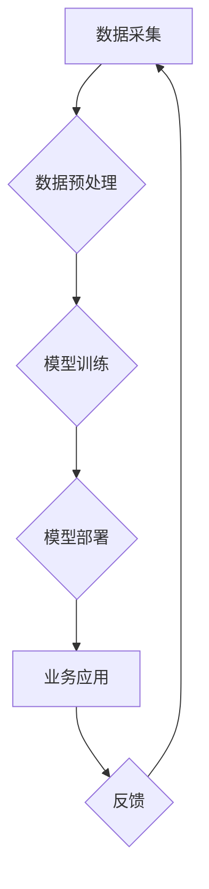

> 人工智能，商业模式，创新，深度学习，机器学习，数据分析，商业应用，未来趋势

## 1. 背景介绍

人工智能（AI）技术近年来发展迅速，从学术研究走向了实际应用，深刻地改变着人们的生活方式和商业模式。AI技术的核心在于模拟人类智能，通过学习和分析数据，实现自动决策、预测和优化等功能。

随着大数据时代的到来，海量数据为AI技术的训练和应用提供了充足的燃料。同时，计算能力的提升和算法的不断优化也推动了AI技术的快速发展。从语音识别、图像识别到自然语言处理、机器翻译，AI技术已经渗透到各个领域，并取得了令人瞩目的成就。

然而，AI技术的发展也带来了新的挑战和机遇。如何将AI技术与商业模式相结合，创造新的价值和商业模式，是企业和研究者共同面临的课题。

## 2. 核心概念与联系

**2.1 AI技术与商业模式的关系**

AI技术可以被视为一种工具，它可以帮助企业提高效率、降低成本、创造新的产品和服务，从而改变传统的商业模式。

**2.2 AI技术对商业模式的影响**

AI技术对商业模式的影响主要体现在以下几个方面：

* **个性化定制:** AI技术可以根据用户的行为和偏好，提供个性化的产品和服务，提升用户体验。
* **自动化运营:** AI技术可以自动化完成许多重复性的任务，例如客服、数据分析等，提高运营效率。
* **精准营销:** AI技术可以分析用户的行为数据，精准地进行营销推广，提高营销效果。
* **新产品和服务创新:** AI技术可以帮助企业开发新的产品和服务，满足用户的不断变化的需求。

**2.3 AI技术与商业模式的创新**

AI技术与商业模式的创新是相互促进的。AI技术的进步推动了商业模式的创新，而商业模式的创新也为AI技术的应用提供了新的场景和需求。

**2.4  AI商业模式的架构**



## 3. 核心算法原理 & 具体操作步骤

**3.1 算法原理概述**

深度学习是人工智能领域的重要分支，它利用多层神经网络来模拟人类大脑的学习过程。深度学习算法能够从海量数据中自动提取特征，并进行复杂的模式识别和预测。

**3.2 算法步骤详解**

深度学习算法的训练过程主要包括以下步骤：

1. **数据预处理:** 将原始数据进行清洗、转换和格式化，使其适合深度学习模型的训练。
2. **网络结构设计:** 根据具体任务需求，设计合适的深度学习网络结构，包括神经网络的层数、节点数量和激活函数等。
3. **模型训练:** 使用训练数据对深度学习模型进行训练，通过调整模型参数，使模型的预测结果与真实值尽可能接近。
4. **模型评估:** 使用测试数据对训练好的模型进行评估，评估模型的准确率、召回率等指标。
5. **模型调优:** 根据模型评估结果，对模型参数进行调整，进一步提高模型的性能。

**3.3 算法优缺点**

**优点:**

* 能够自动提取特征，无需人工特征工程。
* 能够处理海量数据，学习复杂的模式。
* 在图像识别、语音识别、自然语言处理等领域取得了优异的性能。

**缺点:**

* 训练数据量大，训练时间长。
* 对硬件资源要求高。
* 模型解释性差，难以理解模型的决策过程。

**3.4 算法应用领域**

深度学习算法广泛应用于以下领域：

* **计算机视觉:** 图像识别、物体检测、图像分割、人脸识别等。
* **自然语言处理:** 文本分类、情感分析、机器翻译、对话系统等。
* **语音识别:** 语音转文本、语音助手等。
* **推荐系统:** 商品推荐、内容推荐等。
* **医疗诊断:** 病情诊断、疾病预测等。

## 4. 数学模型和公式 & 详细讲解 & 举例说明

**4.1 数学模型构建**

深度学习模型的核心是神经网络，它由多个层级的神经元组成。每个神经元接收来自上一层的输入信号，并通过激活函数进行处理，输出到下一层。

**4.2 公式推导过程**

深度学习模型的训练过程基于梯度下降算法。目标函数是模型的预测结果与真实值的误差，梯度下降算法通过不断调整模型参数，使目标函数最小化。

**损失函数:**

$$L = \frac{1}{N} \sum_{i=1}^{N} (y_i - \hat{y}_i)^2$$

其中：

* $L$ 是损失函数
* $N$ 是样本数量
* $y_i$ 是真实值
* $\hat{y}_i$ 是模型预测值

**梯度:**

$$\frac{\partial L}{\partial w} = \frac{1}{N} \sum_{i=1}^{N} 2(y_i - \hat{y}_i) \frac{\partial \hat{y}_i}{\partial w}$$

其中：

* $w$ 是模型参数

**参数更新:**

$$w = w - \alpha \frac{\partial L}{\partial w}$$

其中：

* $\alpha$ 是学习率

**4.3 案例分析与讲解**

例如，在图像分类任务中，深度学习模型可以学习图像特征，并将其映射到不同的类别。训练过程中，模型会根据图像标签和预测结果计算损失函数，并通过梯度下降算法更新模型参数，最终实现对图像的准确分类。

## 5. 项目实践：代码实例和详细解释说明

**5.1 开发环境搭建**

* Python 3.x
* TensorFlow 或 PyTorch 深度学习框架
* Jupyter Notebook 或 VS Code 开发环境

**5.2 源代码详细实现**

```python
import tensorflow as tf

# 定义模型结构
model = tf.keras.models.Sequential([
    tf.keras.layers.Conv2D(32, (3, 3), activation='relu', input_shape=(28, 28, 1)),
    tf.keras.layers.MaxPooling2D((2, 2)),
    tf.keras.layers.Conv2D(64, (3, 3), activation='relu'),
    tf.keras.layers.MaxPooling2D((2, 2)),
    tf.keras.layers.Flatten(),
    tf.keras.layers.Dense(10, activation='softmax')
])

# 编译模型
model.compile(optimizer='adam',
              loss='sparse_categorical_crossentropy',
              metrics=['accuracy'])

# 加载数据集
(x_train, y_train), (x_test, y_test) = tf.keras.datasets.mnist.load_data()

# 数据预处理
x_train = x_train.astype('float32') / 255.0
x_test = x_test.astype('float32') / 255.0
x_train = x_train.reshape((x_train.shape[0], 28, 28, 1))
x_test = x_test.reshape((x_test.shape[0], 28, 28, 1))

# 训练模型
model.fit(x_train, y_train, epochs=5)

# 评估模型
loss, accuracy = model.evaluate(x_test, y_test)
print('Test loss:', loss)
print('Test accuracy:', accuracy)
```

**5.3 代码解读与分析**

这段代码实现了使用 TensorFlow 框架训练一个简单的 MNIST 手写数字识别模型。

* 首先定义了模型结构，包括卷积层、池化层和全连接层。
* 然后编译模型，指定优化器、损失函数和评估指标。
* 加载 MNIST 数据集，并进行数据预处理，将图像数据转换为适合模型输入的格式。
* 训练模型，指定训练轮数。
* 最后评估模型，计算测试集上的损失和准确率。

**5.4 运行结果展示**

训练完成后，模型可以对新的手写数字图像进行识别。

## 6. 实际应用场景

**6.1 个性化推荐**

AI技术可以分析用户的行为数据，例如浏览历史、购买记录、评分等，并推荐个性化的商品、内容或服务。

**6.2 智能客服**

AI技术可以构建智能客服系统，自动回答用户常见问题，提高客服效率。

**6.3 欺诈检测**

AI技术可以分析交易数据，识别异常行为，并进行欺诈检测。

**6.4 医疗诊断辅助**

AI技术可以辅助医生进行疾病诊断，提高诊断准确率。

**6.5 自动驾驶**

AI技术是自动驾驶的核心技术，可以实现车辆的感知、决策和控制。

**6.4 未来应用展望**

AI技术的应用场景还在不断扩展，未来将应用于更多领域，例如教育、金融、制造业等。

## 7. 工具和资源推荐

**7.1 学习资源推荐**

* **在线课程:** Coursera、edX、Udacity 等平台提供丰富的 AI 课程。
* **书籍:** 《深度学习》、《机器学习》、《人工智能导论》等书籍。
* **开源项目:** TensorFlow、PyTorch、Keras 等开源深度学习框架。

**7.2 开发工具推荐**

* **Python:** AI 开发的主要编程语言。
* **Jupyter Notebook:** 用于代码编写、数据分析和可视化。
* **VS Code:** 强大的代码编辑器，支持多种编程语言和插件。

**7.3 相关论文推荐**

* **《ImageNet Classification with Deep Convolutional Neural Networks》**
* **《Attention Is All You Need》**
* **《BERT: Pre-training of Deep Bidirectional Transformers for Language Understanding》**

## 8. 总结：未来发展趋势与挑战

**8.1 研究成果总结**

近年来，AI技术取得了显著的进展，在图像识别、语音识别、自然语言处理等领域取得了突破性成果。

**8.2 未来发展趋势**

* **模型规模和能力的提升:** 未来 AI 模型将更加强大，能够处理更复杂的任务。
* **算法的创新:** 新的 AI 算法将不断涌现，提高模型的效率和性能。
* **边缘计算和部署:** AI 模型将部署到边缘设备，实现更实时和高效的应用。
* **AI 伦理和安全:** AI 技术的伦理和安全问题将受到越来越多的关注。

**8.3 面临的挑战**

* **数据获取和隐私保护:** AI 模型需要大量数据进行训练，如何获取高质量数据并保护用户隐私是一个挑战。
* **模型解释性和可信度:** AI 模型的决策过程难以理解，如何提高模型的解释性和可信度是一个重要问题。
* **算法偏见和公平性:** AI 模型可能存在算法偏见，如何确保 AI 技术的公平性和公正性是一个挑战。

**8.4 研究展望**

未来 AI 研究将继续探索新的算法、模型和应用场景，并致力于解决 AI 技术面临的挑战，推动 AI 技术的健康发展。

## 9. 附录：常见问题与解答

**9.1 如何选择合适的 AI 算法？**

选择合适的 AI 算法取决于具体的应用场景和数据特点。例如，对于图像识别任务，卷积神经网络是常用的选择；对于文本分类任务，循环神经网络或 Transformer 模型是不错的选择。

**9.2 如何处理不平衡数据？**

不平衡数据是指训练数据中某些类别样本数量远大于其他类别样本数量。处理不平衡数据的方法包括：

* **数据采样:** 随机抽取少数类样本，增加其数量。
* **权重调整:** 给少数类样本赋予更高的权重，提高其在训练过程中的影响力。
* **生成对抗网络 (GAN):** 使用 GAN 生成新的少数类样本，增加训练数据的多样性。

**9.3 如何评估 AI 模型的性能？**

