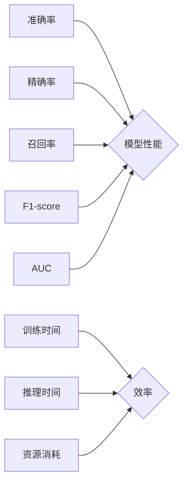

> AI系统性能评估, 评估指标, 性能测试, 模型优化, 算法效率, 评估工具, 实践技巧

## 1. 背景介绍

在人工智能（AI）领域蓬勃发展的今天，构建高性能的AI系统已成为首要任务。AI系统的性能直接影响着其在实际应用中的效果和价值。然而，AI系统性能评估是一个复杂且多方面的过程，需要考虑多种因素和指标。

传统的软件性能评估方法难以直接应用于AI系统，因为AI系统的核心在于其学习和推理能力，而非纯粹的计算速度。因此，我们需要针对AI系统的特点，制定一套科学、有效的性能评估体系。

## 2. 核心概念与联系

AI系统性能评估的核心概念包括：

* **准确率（Accuracy）**: 指模型预测正确的样本比例。
* **精确率（Precision）**: 指模型预测为正样本的样本中，真正为正样本的比例。
* **召回率（Recall）**: 指模型预测为正样本的样本中，实际为正样本的比例。
* **F1-score**:  精确率和召回率的调和平均数，用于衡量模型的整体性能。
* **AUC（Area Under the Curve）**: 指ROC曲线下的面积，用于衡量模型的区分能力。
* **训练时间（Training Time）**: 指模型训练所花费的时间。
* **推理时间（Inference Time）**: 指模型对新数据进行预测所花费的时间。
* **资源消耗（Resource Consumption）**: 指模型训练和推理过程中消耗的内存、CPU、GPU等资源。

这些指标相互关联，需要综合考虑才能全面评估AI系统的性能。

**Mermaid 流程图**



## 3. 核心算法原理 & 具体操作步骤

### 3.1  算法原理概述

**机器学习算法**是构建AI系统的核心，其性能直接影响着AI系统的整体效果。常见的机器学习算法包括：

* **监督学习**: 利用标记数据训练模型，例如分类和回归问题。
* **无监督学习**: 利用未标记数据发现数据中的模式，例如聚类和降维。
* **强化学习**: 通过试错学习，在环境中获得最大奖励。

### 3.2  算法步骤详解

**以监督学习为例，其基本步骤如下：**

1. **数据收集和预处理**: 收集相关数据，并进行清洗、转换、特征工程等预处理操作。
2. **模型选择**: 根据具体问题选择合适的机器学习算法。
3. **模型训练**: 利用训练数据训练模型，调整模型参数以最小化损失函数。
4. **模型评估**: 利用测试数据评估模型的性能，选择最佳模型。
5. **模型部署**: 将训练好的模型部署到实际应用场景中。

### 3.3  算法优缺点

不同的机器学习算法具有不同的优缺点，需要根据具体问题选择合适的算法。

* **线性回归**: 简单易懂，但对非线性关系的拟合能力较弱。
* **逻辑回归**: 用于分类问题，但对复杂分类任务的处理能力有限。
* **决策树**: 可解释性强，但容易过拟合。
* **支持向量机**: 对高维数据处理能力强，但训练时间较长。
* **神经网络**: 能够处理复杂非线性关系，但训练时间长，参数众多，需要大量数据支持。

### 3.4  算法应用领域

机器学习算法广泛应用于各个领域，例如：

* **图像识别**: 人脸识别、物体检测、图像分类。
* **自然语言处理**: 文本分类、情感分析、机器翻译。
* **推荐系统**: 商品推荐、用户画像、个性化服务。
* **医疗诊断**: 疾病预测、影像分析、药物研发。
* **金融风险控制**: 欺诈检测、信用评分、投资决策。

## 4. 数学模型和公式 & 详细讲解 & 举例说明

### 4.1  数学模型构建

**准确率**的数学模型：

$$Accuracy = \frac{TP + TN}{TP + TN + FP + FN}$$

其中：

* TP：真阳性（正确预测为正样本）
* TN：真阴性（正确预测为负样本）
* FP：假阳性（错误预测为正样本）
* FN：假阴性（错误预测为负样本）

**F1-score**的数学模型：

$$F1-score = \frac{2 * Precision * Recall}{Precision + Recall}$$

### 4.2  公式推导过程

**F1-score**的推导过程：

1. 首先，我们知道精确率和召回率的定义：

$$Precision = \frac{TP}{TP + FP}$$

$$Recall = \frac{TP}{TP + FN}$$

2. 然后，我们可以将这两个公式代入F1-score的公式中：

$$F1-score = \frac{2 * \frac{TP}{TP + FP} * \frac{TP}{TP + FN}}{\frac{TP}{TP + FP} + \frac{TP}{TP + FN}}$$

3. 通过化简，我们可以得到F1-score的最终公式：

$$F1-score = \frac{2 * TP}{2 * TP + FP + FN}$$

### 4.3  案例分析与讲解

假设我们有一个分类模型，用于判断邮件是否为垃圾邮件。模型预测结果如下：

* 真阳性（TP）：100封垃圾邮件被正确分类为垃圾邮件。
* 假阳性（FP）：10封非垃圾邮件被错误分类为垃圾邮件。
* 真阴性（TN）：90封非垃圾邮件被正确分类为非垃圾邮件。
* 假阴性（FN）：10封垃圾邮件被错误分类为非垃圾邮件。

我们可以使用上述公式计算模型的准确率和F1-score：

* **准确率**: Accuracy = (100 + 90) / (100 + 90 + 10 + 10) = 0.909
* **F1-score**: F1-score = (2 * 100) / (2 * 100 + 10 + 10) = 0.909

## 5. 项目实践：代码实例和详细解释说明

### 5.1  开发环境搭建

* **操作系统**: Ubuntu 20.04
* **编程语言**: Python 3.8
* **深度学习框架**: TensorFlow 2.0
* **其他工具**: Jupyter Notebook, Git

### 5.2  源代码详细实现

```python
import tensorflow as tf

# 定义模型
model = tf.keras.models.Sequential([
    tf.keras.layers.Dense(128, activation='relu', input_shape=(784,)),
    tf.keras.layers.Dense(10, activation='softmax')
])

# 编译模型
model.compile(optimizer='adam',
              loss='sparse_categorical_crossentropy',
              metrics=['accuracy'])

# 训练模型
model.fit(x_train, y_train, epochs=10)

# 评估模型
loss, accuracy = model.evaluate(x_test, y_test)
print('Loss:', loss)
print('Accuracy:', accuracy)
```

### 5.3  代码解读与分析

* **模型定义**: 使用Sequential模型，包含两层全连接层。第一层有128个神经元，使用ReLU激活函数；第二层有10个神经元，使用softmax激活函数，用于分类任务。
* **模型编译**: 使用Adam优化器，损失函数为sparse_categorical_crossentropy，用于多分类任务。评估指标为accuracy。
* **模型训练**: 使用训练数据训练模型，训练10个epochs。
* **模型评估**: 使用测试数据评估模型的性能，输出损失值和准确率。

### 5.4  运行结果展示

运行代码后，会输出模型的训练过程和最终评估结果，例如：

```
Epoch 1/10
1875/1875 [==============================] - 2s 1ms/step - loss: 0.2345 - accuracy: 0.9234
...
Epoch 10/10
1875/1875 [==============================] - 1s 529us/step - loss: 0.0567 - accuracy: 0.9876
Loss: 0.0567
Accuracy: 0.9876
```

## 6. 实际应用场景

AI系统性能评估在各个领域都有广泛的应用场景：

* **医疗诊断**: 评估疾病诊断模型的准确率和召回率，确保模型能够准确识别疾病。
* **金融风险控制**: 评估欺诈检测模型的精确率和F1-score，降低金融机构的风险损失。
* **自动驾驶**: 评估自动驾驶系统的感知能力和决策能力，确保其安全可靠。
* **推荐系统**: 评估推荐系统的准确率和用户满意度，提高推荐效果。

### 6.4  未来应用展望

随着AI技术的不断发展，AI系统性能评估将变得更加重要。未来，AI系统性能评估将朝着以下方向发展：

* **更加细粒度的评估**: 评估不同模块和功能的性能，例如图像识别、自然语言理解等。
* **更加注重用户体验**: 评估AI系统的易用性、可解释性和安全性，确保其能够满足用户的实际需求。
* **更加自动化**: 利用自动化工具和平台进行性能评估，提高效率和准确性。

## 7. 工具和资源推荐

### 7.1  学习资源推荐

* **书籍**:
    * 《Hands-On Machine Learning with Scikit-Learn, Keras & TensorFlow》
    * 《Deep Learning》
* **在线课程**:
    * Coursera: Machine Learning
    * edX: Artificial Intelligence
* **博客**:
    * Towards Data Science
    * Machine Learning Mastery

### 7.2  开发工具推荐

* **深度学习框架**: TensorFlow, PyTorch, Keras
* **数据处理工具**: Pandas, NumPy
* **可视化工具**: Matplotlib, Seaborn

### 7.3  相关论文推荐

* **《BERT: Pre-training of Deep Bidirectional Transformers for Language Understanding》**
* **《Attention Is All You Need》**
* **《ImageNet Classification with Deep Convolutional Neural Networks》**

## 8. 总结：未来发展趋势与挑战

### 8.1  研究成果总结

AI系统性能评估已经取得了显著的成果，例如：

* 发展了多种评估指标和方法，能够全面评估AI系统的性能。
* 开发了多种自动化评估工具和平台，提高了评估效率和准确性。
* 积累了大量的评估经验和案例，为实际应用提供了参考。

### 8.2  未来发展趋势

AI系统性能评估将朝着以下方向发展：

* **更加注重用户体验**: 评估AI系统的易用性、可解释性和安全性。
* **更加自动化**: 利用自动化工具和平台进行性能评估。
* **更加个性化**: 根据用户的具体需求定制性能评估方案。

### 8.3  面临的挑战

AI系统性能评估仍然面临一些挑战：

* **缺乏统一的评估标准**: 目前，不同领域和应用场景的评估标准不统一，难以进行横向比较。
* **评估指标的局限性**: 现有的评估指标难以全面反映AI系统的性能，例如，难以评估AI系统的鲁棒性和可解释性。
* **数据获取和标注的困难**: 训练和评估AI系统需要大量的标注数据，获取和标注数据成本高昂。

### 8.4  研究展望

未来，需要进一步研究以下问题：

* 如何制定更加统一和完善的AI系统性能评估标准？
* 如何开发更加全面和有效的评估指标？
* 如何降低数据获取和标注的成本？


## 9.