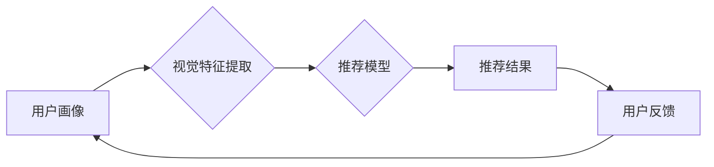

> AI视觉推荐系统，计算机视觉，深度学习，推荐算法，用户画像，个性化推荐，商业应用

## 1. 背景介绍

随着互联网和移动互联网的快速发展，海量信息涌现，用户面临着信息过载的困境。如何精准推荐用户感兴趣的内容，提升用户体验，成为各大平台和企业亟需解决的关键问题。传统的推荐系统主要依赖用户行为数据，例如浏览历史、购买记录等，但这些数据无法全面反映用户的真实需求和偏好。

近年来，计算机视觉技术取得了长足进步，能够从图像和视频中提取丰富的语义信息。结合深度学习算法，AI视觉推荐系统应运而生，它能够通过分析用户的视觉偏好，例如喜欢的颜色、风格、物品等，提供更加精准、个性化的推荐服务。

## 2. 核心概念与联系

**2.1 核心概念**

* **计算机视觉 (Computer Vision):** 赋予计算机“看”的能力，通过算法和模型，使计算机能够理解和解释图像和视频中的信息。
* **深度学习 (Deep Learning):** 一种机器学习的子领域，利用多层神经网络模拟人类大脑的学习机制，能够从海量数据中自动提取特征，学习复杂的模式。
* **推荐算法 (Recommendation Algorithm):** 用于预测用户对某一物品或内容的兴趣程度，并推荐相关物品或内容的算法。

**2.2 系统架构**



**2.3 工作流程**

1. **用户画像构建:** 收集用户的视觉偏好数据，例如浏览过的图片、点赞过的商品、收藏过的视频等，构建用户的视觉特征向量。
2. **视觉特征提取:** 利用计算机视觉算法，从图片或视频中提取关键特征，例如颜色、形状、纹理、物体类别等。
3. **推荐模型训练:** 将用户视觉特征向量和商品/内容视觉特征向量作为输入，训练推荐模型，学习用户视觉偏好与商品/内容之间的关联关系。
4. **推荐结果生成:** 根据用户的视觉特征向量，利用训练好的推荐模型，预测用户对不同商品/内容的兴趣程度，并生成推荐结果。
5. **用户反馈收集:** 收集用户的反馈信息，例如点击、购买、评分等，用于模型的持续优化和改进。

## 3. 核心算法原理 & 具体操作步骤

**3.1 算法原理概述**

AI视觉推荐系统通常采用基于深度学习的推荐算法，例如协同过滤、内容过滤、混合推荐等。

* **协同过滤:** 基于用户的相似性或物品的相似性进行推荐。
* **内容过滤:** 基于物品的特征信息进行推荐。
* **混合推荐:** 将协同过滤和内容过滤相结合，提高推荐效果。

**3.2 算法步骤详解**

1. **数据预处理:** 对用户视觉特征数据和商品/内容视觉特征数据进行清洗、转换、归一化等处理，使其适合模型训练。
2. **模型构建:** 选择合适的深度学习模型，例如卷积神经网络 (CNN)、循环神经网络 (RNN) 等，构建推荐模型。
3. **模型训练:** 利用训练数据，训练推荐模型，学习用户视觉偏好与商品/内容之间的关联关系。
4. **模型评估:** 利用测试数据，评估模型的推荐效果，例如准确率、召回率、覆盖率等。
5. **模型优化:** 根据评估结果，调整模型参数、优化模型结构，提高模型性能。

**3.3 算法优缺点**

* **优点:**
    * 能够精准捕捉用户的视觉偏好，提供更加个性化的推荐。
    * 不依赖于用户行为数据，能够推荐新用户或新商品/内容。
    * 能够挖掘用户潜在需求，提升推荐效果。
* **缺点:**
    * 需要大量的视觉数据进行训练，数据获取成本较高。
    * 模型训练复杂度高，需要专业的技术人员进行开发和维护。
    * 算法解释性较差，难以理解模型的推荐机制。

**3.4 算法应用领域**

* **电商推荐:** 推荐商品、服装、家居等。
* **内容推荐:** 推荐视频、图片、文章等。
* **广告推荐:** 推荐与用户视觉偏好相关的广告。
* **医疗诊断:** 辅助医生进行疾病诊断。
* **智能家居:** 根据用户的视觉偏好，自动调节灯光、温度等。

## 4. 数学模型和公式 & 详细讲解 & 举例说明

**4.1 数学模型构建**

AI视觉推荐系统通常采用矩阵分解模型，将用户和商品/内容表示为低维向量，并学习用户-商品/内容之间的交互关系。

**用户-商品/内容交互矩阵:**

$$
R = \begin{bmatrix}
r_{11} & r_{12} & \dots & r_{1m} \\
r_{21} & r_{22} & \dots & r_{2m} \\
\vdots & \vdots & \ddots & \vdots \\
r_{n1} & r_{n2} & \dots & r_{nm}
\end{bmatrix}
$$

其中，$r_{ij}$ 表示用户 $i$ 对商品/内容 $j$ 的评分或交互行为。

**用户向量:**

$$
u_i = \begin{bmatrix}
u_{i1} & u_{i2} & \dots & u_{ik}
\end{bmatrix}
$$

**商品/内容向量:**

$$
v_j = \begin{bmatrix}
v_{j1} & v_{j2} & \dots & v_{jk}
\end{bmatrix}
$$

**预测评分:**

$$
\hat{r}_{ij} = u_i \cdot v_j
$$

**4.2 公式推导过程**

通过最小化预测评分与真实评分之间的误差，学习用户向量和商品/内容向量。常用的损失函数是均方误差 (MSE):

$$
Loss = \frac{1}{2} \sum_{i=1}^{n} \sum_{j=1}^{m} (r_{ij} - \hat{r}_{ij})^2
$$

利用梯度下降算法，更新用户向量和商品/内容向量，直到损失函数最小化。

**4.3 案例分析与讲解**

假设有一个电商平台，用户 $A$ 喜欢购买红色衣服，用户 $B$ 喜欢购买蓝色衣服。

* 用户 $A$ 的视觉特征向量可能包含“红色”等关键词。
* 用户 $B$ 的视觉特征向量可能包含“蓝色”等关键词。

当推荐系统推荐新商品时，可以根据用户的视觉特征向量，预测用户对不同商品的兴趣程度。例如，如果新商品是红色的，那么推荐系统会认为用户 $A$ 对该商品的兴趣程度较高。

## 5. 项目实践：代码实例和详细解释说明

**5.1 开发环境搭建**

* Python 3.x
* TensorFlow 或 PyTorch 深度学习框架
* OpenCV 图像处理库
* Jupyter Notebook 或 VS Code 开发环境

**5.2 源代码详细实现**

```python
import tensorflow as tf

# 定义用户-商品/内容交互矩阵
R = tf.constant([[5, 3, 4],
                 [2, 5, 1],
                 [4, 2, 5]])

# 定义用户向量和商品/内容向量
u = tf.Variable(tf.random.normal([3, 10]))
v = tf.Variable(tf.random.normal([10, 3]))

# 计算预测评分
predictions = tf.matmul(u, v, transpose_b=True)

# 定义损失函数
loss = tf.reduce_mean(tf.square(R - predictions))

# 定义优化器
optimizer = tf.keras.optimizers.Adam()

# 训练模型
for epoch in range(100):
    with tf.GradientTape() as tape:
        loss_value = loss
    gradients = tape.gradient(loss_value, [u, v])
    optimizer.apply_gradients(zip(gradients, [u, v]))

    print(f"Epoch {epoch+1}, Loss: {loss_value.numpy()}")

# 打印训练后的用户向量和商品/内容向量
print("User Vectors:")
print(u.numpy())
print("Item Vectors:")
print(v.numpy())
```

**5.3 代码解读与分析**

* 代码首先定义了用户-商品/内容交互矩阵、用户向量和商品/内容向量。
* 然后，计算预测评分，并定义损失函数和优化器。
* 最后，使用梯度下降算法训练模型，并打印训练后的用户向量和商品/内容向量。

**5.4 运行结果展示**

训练完成后，可以将训练后的用户向量和商品/内容向量用于推荐新商品。

## 6. 实际应用场景

**6.1 电商推荐**

AI视觉推荐系统可以帮助电商平台推荐更符合用户视觉偏好的商品，例如：

* 根据用户的浏览历史和点赞记录，推荐与之风格相似的服装、家居用品等。
* 根据用户的购物清单，推荐与之搭配的商品。
* 根据用户的收藏夹，推荐与之相关的新品或促销活动。

**6.2 内容推荐**

AI视觉推荐系统可以帮助内容平台推荐更符合用户视觉偏好的内容，例如：

* 根据用户的浏览历史和点赞记录，推荐与之风格相似的视频、图片、文章等。
* 根据用户的兴趣标签，推荐与之相关的新闻、娱乐、科技等内容。
* 根据用户的观看习惯，推荐与之类似的视频或电影。

**6.3 广告推荐**

AI视觉推荐系统可以帮助广告平台推荐更符合用户视觉偏好的广告，例如：

* 根据用户的浏览历史和点赞记录，推荐与之相关的商品或服务广告。
* 根据用户的兴趣标签，推荐与之相关的品牌或行业广告。
* 根据用户的观看习惯，推荐与之类似的视频或图片广告。

**6.4 未来应用展望**

随着计算机视觉和深度学习技术的不断发展，AI视觉推荐系统的应用场景将会更加广泛，例如：

* **个性化教育:** 根据学生的视觉偏好，推荐个性化的学习内容。
* **医疗诊断辅助:** 根据病人的影像数据，辅助医生进行疾病诊断。
* **智能家居:** 根据用户的视觉偏好，自动调节灯光、温度、音乐等。

## 7. 工具和资源推荐

**7.1 学习资源推荐**

* **书籍:**
    * 《深度学习》
    * 《计算机视觉:算法与应用》
* **在线课程:**
    * Coursera: 深度学习
    * Udacity: 计算机视觉
* **博客和网站:**
    * TensorFlow 官方博客
    * PyTorch 官方博客
    * OpenCV 官方网站

**7.2 开发工具推荐**

* **深度学习框架:** TensorFlow, PyTorch
* **图像处理库:** OpenCV
* **数据可视化工具:** Matplotlib, Seaborn

**7.3 相关论文推荐**

* 《Collaborative Filtering for Implicit Feedback Datasets》
* 《Deep Learning for Recommender Systems》
* 《Visual Recommendation: A Survey》

## 8. 总结：未来发展趋势与挑战

**8.1 研究成果总结**

AI视觉推荐系统在精准推荐方面取得了显著成果，能够有效提升用户体验和商业价值。

**8.2 未来发展趋势**

* **多模态融合:** 将视觉信息与其他模态信息，例如文本、音频、用户行为等，进行融合，提升推荐效果。
* **个性化定制:** 基于用户的个性化需求，提供更加定制化的推荐服务。
* **跨平台推荐:** 实现跨平台的推荐服务，例如将电商平台的推荐结果与社交平台进行融合。

**8.3 面临的挑战**

* **数据获取和隐私保护:** 视觉数据获取成本较高，且需要考虑用户隐私保护问题。
* **算法解释性和可解释性:** 现有的深度学习模型难以解释其推荐机制，缺乏透明度。
* **模型鲁棒性和安全性:** 模型需要具备一定的鲁棒性，能够应对数据噪声和攻击行为。

**8.4 研究展望**

未来，AI