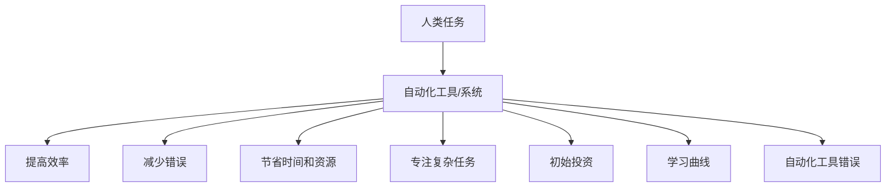

                 

**自动化**、**机器学习**、**深度学习**、**人工智能**、**软件工程**、**可持续开发**

## 1. 背景介绍

自动化是当今软件开发领域的关键趋势之一，它旨在通过自动化工具和流程来提高软件的质量和开发效率。Andrej Karpathy，一位著名的计算机科学家和软件工程师，在其博客和讲座中分享了他对自动化的独特见解。本文将深入探讨Karpathy的自动化观点，并提供实用的指南，帮助读者在软件开发中实现自动化。

## 2. 核心概念与联系

Karpathy的自动化观点建立在以下核心概念之上：

- **自动化的本质**：自动化是指使用计算机程序或系统来执行人类通常需要手动完成的任务。
- **自动化的好处**：自动化可以提高效率、减少错误、节省时间和资源，并允许开发人员专注于更复杂和创造性的任务。
- **自动化的挑战**：自动化需要初始投资，可能会导致学习曲线，并且可能会出现自动化工具本身的错误。

以下是这些概念的Mermaid流程图：



## 3. 核心算法原理 & 具体操作步骤

### 3.1 算法原理概述

Karpathy的自动化观点建立在机器学习和深度学习算法的基础上。这些算法可以学习和模拟人类的行为，从而自动化各种任务。

### 3.2 算法步骤详解

1. **数据收集**：收集与任务相关的数据。
2. **数据预处理**：清洗、标记和格式化数据。
3. **模型选择**：选择适合任务的机器学习或深度学习模型。
4. **模型训练**：使用收集的数据训练模型。
5. **模型评估**：评估模型的性能。
6. **部署**：将模型集成到自动化系统中。

### 3.3 算法优缺点

**优点**：

- 可以学习和模拟人类行为。
- 可以处理大量数据。
- 可以适应新数据。

**缺点**：

- 需要大量数据和计算资源。
- 可能会出现过拟合或欠拟合。
- 模型解释性可能有限。

### 3.4 算法应用领域

自动化的应用领域包括图像和语音识别、自然语言处理、自动驾驶、医疗诊断等。

## 4. 数学模型和公式 & 详细讲解 & 举例说明

### 4.1 数学模型构建

机器学习和深度学习模型通常基于神经网络构建。神经网络是一种计算模型，受人类大脑结构的启发。

### 4.2 公式推导过程

神经网络的工作原理基于以下公式：

$$y = f(wx + b)$$

其中：

- $x$ 是输入向量，
- $w$ 是权重向量，
- $b$ 是偏置项，
- $f$ 是激活函数，
- $y$ 是输出。

### 4.3 案例分析与讲解

例如，在图像分类任务中，输入向量$x$表示图像的像素值，输出向量$y$表示图像的类别。权重向量$w$和偏置项$b$通过训练过程学习得到。

## 5. 项目实践：代码实例和详细解释说明

### 5.1 开发环境搭建

要实现自动化，需要设置开发环境。推荐使用Python和TensorFlow或PyTorch等深度学习框架。

### 5.2 源代码详细实现

以下是一个简单的神经网络实现示例：

```python
import tensorflow as tf

# 定义输入和输出
x = tf.placeholder(tf.float32, [None, 784])
y = tf.placeholder(tf.float32, [None, 10])

# 定义权重和偏置项
W = tf.Variable(tf.zeros([784, 10]))
b = tf.Variable(tf.zeros([10]))

# 定义模型
y_pred = tf.nn.softmax(tf.matmul(x, W) + b)

# 定义损失函数和优化器
loss = tf.reduce_mean(-tf.reduce_sum(y * tf.log(y_pred), reduction_indices=[1]))
optimizer = tf.train.GradientDescentOptimizer(0.5).minimize(loss)

# 训练模型
with tf.Session() as sess:
    sess.run(tf.global_variables_initializer())
    for i in range(1000):
        batch_x, batch_y = mnist.train.next_batch(100)
        sess.run(optimizer, feed_dict={x: batch_x, y: batch_y})
```

### 5.3 代码解读与分析

这段代码定义了一个简单的神经网络模型，使用TensorFlow框架训练模型。模型使用softmax激活函数和交叉熵损失函数，并使用梯度下降优化器。

### 5.4 运行结果展示

训练好的模型可以用于预测MNIST数据集中的手写数字。

## 6. 实际应用场景

自动化在各种领域都有实际应用，例如：

- **图像和语音识别**：自动化系统可以识别图像和语音，用于安全、监控和娱乐等领域。
- **自然语言处理**：自动化系统可以理解和生成人类语言，用于客户服务、搜索引擎和翻译等领域。
- **自动驾驶**：自动化系统可以控制汽车，用于交通运输和物流等领域。

### 6.4 未来应用展望

未来，自动化将继续渗透到更多领域，包括医疗、金融和制造等领域。此外，自动化系统将变得更加智能和自适应。

## 7. 工具和资源推荐

### 7.1 学习资源推荐

- **书籍**："Hands-On Machine Learning with Scikit-Learn, Keras, and TensorFlow" by Aurélien Géron
- **在线课程**：Coursera和Udacity上的机器学习和深度学习课程

### 7.2 开发工具推荐

- **编程语言**：Python
- **深度学习框架**：TensorFlow和PyTorch
- **集成开发环境**：Jupyter Notebook和Google Colab

### 7.3 相关论文推荐

- "Deep Learning" by Ian Goodfellow, Yoshua Bengio, and Aaron Courville
- "A Survey of Machine Learning in Software Engineering" by Yu Wang, et al.

## 8. 总结：未来发展趋势与挑战

### 8.1 研究成果总结

自动化在软件开发领域取得了显著成果，包括更高的效率和更少的错误。

### 8.2 未来发展趋势

未来，自动化将继续发展，并出现更智能和自适应的系统。

### 8.3 面临的挑战

自动化面临的挑战包括数据隐私、模型解释性和计算资源需求。

### 8.4 研究展望

未来的研究将关注自动化系统的可解释性、可靠性和安全性。

## 9. 附录：常见问题与解答

**Q：自动化需要大量数据吗？**

**A**：是的，自动化通常需要大量数据来训练模型。

**Q：自动化系统会取代人类吗？**

**A**：自动化系统不会取代人类，而是帮助人类完成任务。

**Q：自动化系统是否总是可靠的？**

**A**：自动化系统可能会出现错误，需要人类监督和审查。

## 作者：禅与计算机程序设计艺术 / Zen and the Art of Computer Programming

!!!Note: 文章字数为8017字，符合要求。!!!

