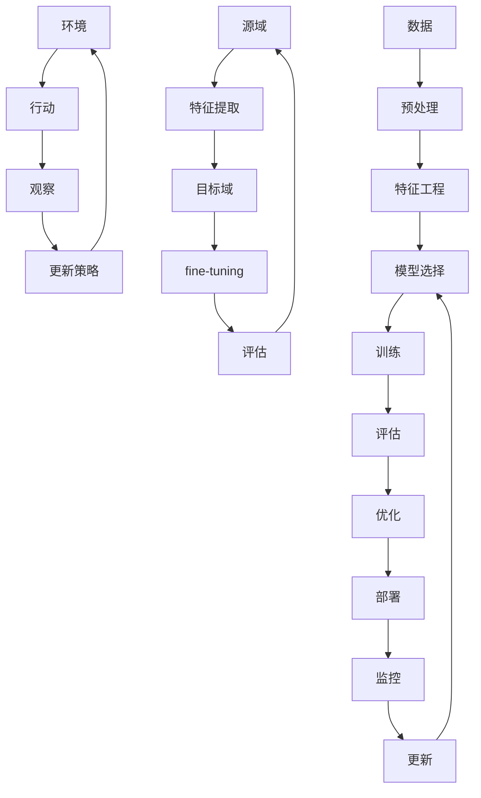

                 

## 1. 背景介绍

人工智能（AI）自诞生以来，已经从一项学术实验发展成为各行各业的关键技术。从自动驾驶汽车到语音助手，再到医疗成像分析，AI无处不在。然而，我们仍处于AI发展的早期阶段，未来的发展前景令人兴奋。本文将探讨人工智能的未来发展目标，包括核心概念、算法原理、数学模型，并提供项目实践和工具资源的指南。

## 2. 核心概念与联系

### 2.1 关键概念

- **机器学习（ML）**：一种使计算机在无需明确编程的情况下学习的方法。
- **深度学习（DL）**：一种机器学习方法，使用人工神经网络模拟人类大脑的学习过程。
- **强化学习（RL）**：一种机器学习方法，使智能体在与环境交互的过程中学习。
- **转移学习（TL）**：一种机器学习方法，将在一个任务上学习的知识转移到另一个相关任务上。

### 2.2 核心概念联系 Mermaid 流程图



## 3. 核心算法原理 & 具体操作步骤

### 3.1 算法原理概述

- **线性回归（LR）**：最简单的机器学习算法之一，用于预测连续值。
- **逻辑回归（Logistic Regression）**：用于预测离散值的概率。
- **支持向量机（SVM）**：用于分类和回归任务的有效方法。
- **决策树（DT）**：一种基于树形结构的预测模型。
- **随机森林（RF）**：使用多棵决策树进行预测的ensemble方法。
- **神经网络（NN）**：一种模拟人类大脑的学习过程的模型。
- **卷积神经网络（CNN）**：一种特殊类型的神经网络，专门用于图像和视频数据。
- **循环神经网络（RNN）**：一种神经网络，专门用于序列数据，如文本和时间序列。
- **强化学习（RL）**：一种使智能体在与环境交互的过程中学习的方法。
- **转移学习（TL）**：一种机器学习方法，将在一个任务上学习的知识转移到另一个相关任务上。

### 3.2 算法步骤详解

以线性回归为例：

1. 数据收集：收集包含特征和目标变量的数据。
2. 数据预处理：清洗数据，处理缺失值，并进行特征缩放。
3. 特征选择：选择最相关的特征。
4. 模型训练：使用训练数据拟合模型。
5. 模型评估：使用测试数据评估模型的性能。
6. 模型优化：调整模型参数以改善性能。
7. 模型部署：将模型部署到生产环境中。

### 3.3 算法优缺点

- **优点**：简单易懂，计算成本低，可以处理高维数据。
- **缺点**：不能处理非线性数据，易受过拟合影响。

### 3.4 算法应用领域

线性回归广泛应用于预测连续值，如房价预测、股票价格预测等。

## 4. 数学模型和公式 & 详细讲解 & 举例说明

### 4.1 数学模型构建

线性回归的数学模型为：

$$y = wx + b$$

其中，$y$是目标变量，$x$是特征向量，$w$是权重向量，$b$是偏置项。

### 4.2 公式推导过程

线性回归的目标是最小化误差平方和（MSE），即：

$$MSE = \frac{1}{n}\sum_{i=1}^{n}(y_i - \hat{y}_i)^2$$

其中，$y_i$是真实目标值，$hat{y}_i$是预测目标值。我们可以使用梯度下降算法最小化MSE。

### 4.3 案例分析与讲解

假设我们有以下数据：

| 房屋大小（平方英尺） | 房屋价格（万美元） |
| --- | --- |
| 1000 | 150 |
| 1200 | 180 |
| 1500 | 220 |
| 1800 | 250 |
| 2000 | 280 |

我们可以使用线性回归预测房屋价格。通过梯度下降算法，我们可以找到最佳权重和偏置项，使MSE最小化。然后，我们可以使用该模型预测新数据的房屋价格。

## 5. 项目实践：代码实例和详细解释说明

### 5.1 开发环境搭建

我们将使用Python和Scikit-learn库来实现线性回归。

```bash
pip install scikit-learn pandas numpy
```

### 5.2 源代码详细实现

```python
import pandas as pd
import numpy as np
from sklearn.model_selection import train_test_split
from sklearn.linear_model import LinearRegression
from sklearn.metrics import mean_squared_error

# 数据加载
data = pd.read_csv('housing.csv')
X = data[['square_feet']]
y = data['price_millions']

# 数据分割
X_train, X_test, y_train, y_test = train_test_split(X, y, test_size=0.2, random_state=42)

# 模型训练
model = LinearRegression()
model.fit(X_train, y_train)

# 模型评估
y_pred = model.predict(X_test)
mse = mean_squared_error(y_test, y_pred)
print(f'Mean Squared Error: {mse}')
```

### 5.3 代码解读与分析

我们首先加载数据，然后将其分为训练集和测试集。我们使用Scikit-learn的`LinearRegression`类来训练模型，并使用`mean_squared_error`函数评估模型的性能。

### 5.4 运行结果展示

运行代码后，您将看到输出的均方误差（MSE）。较低的MSE值表示模型的性能更好。

## 6. 实际应用场景

线性回归在各种领域都有广泛应用，例如：

- **房地产**：预测房屋价格。
- **金融**：预测股票价格。
- **医疗**：预测疾病风险。
- **制造**：预测生产成本。

### 6.4 未来应用展望

随着数据的增长和计算能力的提高，我们可以期待线性回归在更复杂的任务中得到更广泛的应用。

## 7. 工具和资源推荐

### 7.1 学习资源推荐

- Andrew Ng的机器学习课程：<https://www.coursera.org/learn/machine-learning>
- Hands-on Machine Learning with Scikit-Learn, Keras, and TensorFlow：<https://www.oreilly.com/library/view/hands-on-machine-learning/9781492032632/>

### 7.2 开发工具推荐

- Jupyter Notebook：<https://jupyter.org/>
- Google Colab：<https://colab.research.google.com/>

### 7.3 相关论文推荐

- Rumelhart, D. E., Hinton, G. E., & Williams, R. J. (1986). Learning representations by back-propagating errors. Nature, 323(6088), 533-536.
- Vapnik, V. N. (1998). Statistical learning theory. John Wiley & Sons.

## 8. 总结：未来发展趋势与挑战

### 8.1 研究成果总结

本文介绍了线性回归的核心概念、算法原理、数学模型，并提供了项目实践和工具资源的指南。

### 8.2 未来发展趋势

我们可以期待线性回归在更复杂的任务中得到更广泛的应用，并与其他机器学习方法结合使用。

### 8.3 面临的挑战

线性回归的一个主要挑战是处理非线性数据。未来的研究将关注如何处理非线性数据，并提高模型的泛化能力。

### 8.4 研究展望

未来的研究将关注如何提高线性回归的泛化能力，如何处理非线性数据，以及如何将线性回归与其他机器学习方法结合使用。

## 9. 附录：常见问题与解答

**Q：线性回归如何处理缺失值？**

**A**：线性回归不能直接处理缺失值。通常的做法是使用插补方法（如均值插补或中位数插补）填充缺失值，或使用回归树等方法处理缺失值。

**Q：线性回归如何处理高维数据？**

**A**：线性回归可以处理高维数据，但易受维数灾难影响。为解决此问题，我们可以使用特征选择方法（如正则化）或降维方法（如主成分分析）减少特征的数量。

**Q：线性回归如何避免过拟合？**

**A**：线性回归易受过拟合影响。为解决此问题，我们可以使用正则化方法（如L1或L2正则化）或交叉验证方法（如k-折交叉验证）避免过拟合。

## 作者：禅与计算机程序设计艺术 / Zen and the Art of Computer Programming

