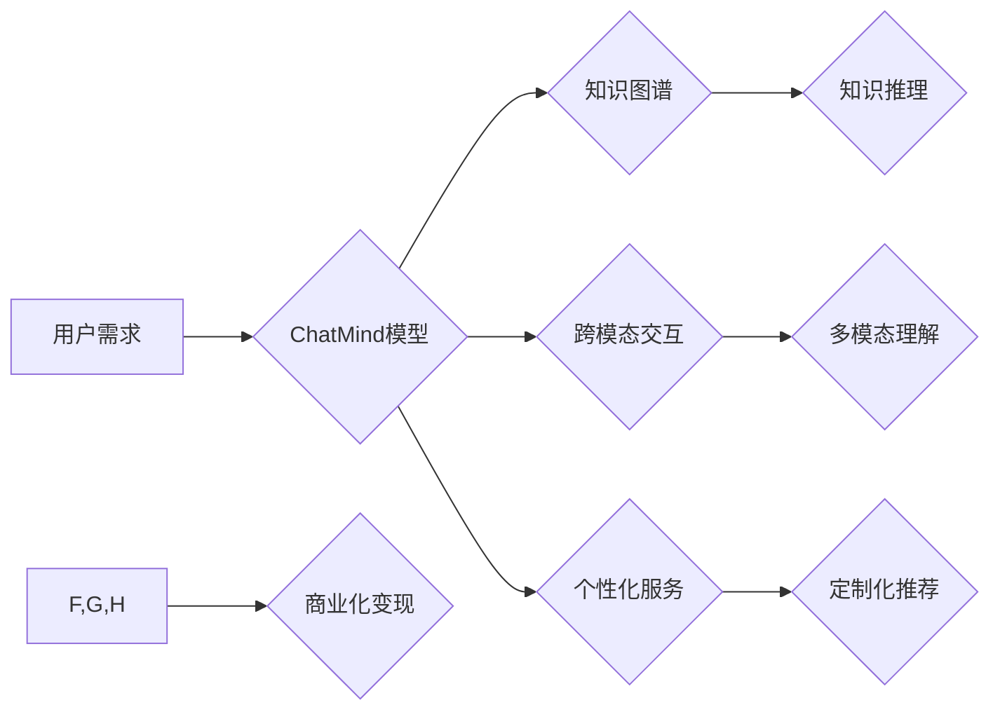

> ChatMind, 商业化变现, 大语言模型, 知识图谱, 跨模态交互, 个性化服务, 盈利模式

## 1. 背景介绍

近年来，人工智能技术取得了飞速发展，特别是大语言模型（LLM）的出现，为人类与机器的交互方式带来了革命性的改变。ChatMind作为一款基于Transformer架构的强大LLM，展现出令人惊叹的文本生成、理解和对话能力。然而，仅仅拥有强大的技术能力还不够，如何将ChatMind的潜力转化为商业价值，使其真正服务于社会，是摆在面前的重大挑战。

## 2. 核心概念与联系

ChatMind的商业化变现需要建立在对核心概念和联系的深入理解之上。

**2.1  大语言模型 (LLM)**

LLM是一种能够理解和生成人类语言的深度学习模型。它通过训练海量文本数据，学习语言的语法、语义和上下文关系，从而具备强大的文本处理能力，例如文本生成、翻译、摘要、问答等。

**2.2  知识图谱 (KG)**

知识图谱是一种结构化的知识表示形式，它将实体和关系以图的形式表示出来。通过构建知识图谱，ChatMind可以获得更丰富的知识背景，并能够进行更精准、更深入的理解和推理。

**2.3  跨模态交互**

跨模态交互是指机器能够理解和处理多种类型的输入和输出，例如文本、图像、音频等。通过支持跨模态交互，ChatMind可以提供更丰富的用户体验，并拓展应用场景。

**2.4  个性化服务**

个性化服务是指根据用户的需求和偏好，提供定制化的服务。通过分析用户的行为数据和偏好，ChatMind可以提供更精准、更个性化的服务，例如推荐内容、个性化学习等。

**2.5  商业化变现模式**

ChatMind的商业化变现模式可以包括：

* **订阅服务:** 用户可以订阅ChatMind的服务，获得更高级的功能和更快的响应速度。
* **API接口:** 开发者可以利用ChatMind的API接口，将其集成到自己的应用程序中，例如聊天机器人、智能客服等。
* **数据服务:** ChatMind可以提供其训练数据和模型参数，供其他公司和研究机构使用。
* **定制开发:** 为企业提供定制化的ChatMind解决方案，例如智能文档处理、知识管理等。

**2.6  Mermaid 流程图**

## 3. 核心算法原理 & 具体操作步骤

### 3.1  算法原理概述

ChatMind的核心算法是基于Transformer架构的深度神经网络，它能够学习语言的上下文关系，并生成流畅、自然的文本。Transformer模型的核心创新在于使用注意力机制，能够有效地捕捉文本中的长距离依赖关系。

### 3.2  算法步骤详解

1. **文本预处理:** 将输入文本进行分词、词性标注、词向量化等预处理操作，以便模型能够理解文本内容。
2. **编码器:** 将预处理后的文本输入编码器，编码器会将文本序列编码成一个固定长度的向量表示，该向量包含了文本的语义信息。
3. **解码器:** 将编码器的输出作为输入，解码器会根据输入的上下文信息，生成一个一个的单词，最终生成完整的文本序列。
4. **注意力机制:** 在编码器和解码器中，注意力机制被广泛应用，它能够帮助模型关注文本中重要的信息，并忽略不重要的信息，从而提高模型的理解和生成能力。

### 3.3  算法优缺点

**优点:**

* 能够捕捉长距离依赖关系，生成更流畅、更自然的文本。
* 训练效率高，能够在海量数据上进行高效训练。
* 可迁移性强，能够应用于多种自然语言处理任务。

**缺点:**

* 参数量大，需要大量的计算资源进行训练和推理。
* 对训练数据的质量要求高，训练数据不纯净会导致模型性能下降。

### 3.4  算法应用领域

ChatMind的算法应用领域非常广泛，例如：

* **聊天机器人:** 提供自然、流畅的对话体验。
* **智能客服:** 自动回答用户常见问题，提高客服效率。
* **文本摘要:** 自动生成文本的摘要，节省用户阅读时间。
* **机器翻译:** 将文本从一种语言翻译成另一种语言。
* **代码生成:** 根据自然语言描述生成代码。

## 4. 数学模型和公式 & 详细讲解 & 举例说明

### 4.1  数学模型构建

ChatMind的数学模型主要基于Transformer架构，其核心是注意力机制和多头注意力机制。

**4.1.1  注意力机制**

注意力机制允许模型关注输入序列中与当前任务相关的部分，并对这些部分赋予更高的权重。注意力机制的计算公式如下：

$$
Attention(Q, K, V) = softmax(\frac{QK^T}{\sqrt{d_k}})V
$$

其中：

* $Q$：查询矩阵
* $K$：键矩阵
* $V$：值矩阵
* $d_k$：键向量的维度
* $softmax$：softmax函数

**4.1.2  多头注意力机制**

多头注意力机制是将多个注意力机制并行执行，并对结果进行融合，从而提高模型的表达能力。

### 4.2  公式推导过程

注意力机制的公式推导过程可以参考相关文献，例如Vaswani et al. (2017)的论文《Attention Is All You Need》。

### 4.3  案例分析与讲解

假设我们有一个句子“我爱吃苹果”，我们想要计算“吃”这个词的注意力权重。

* $Q$：包含“吃”这个词的查询向量
* $K$：包含所有词的键向量
* $V$：包含所有词的价值向量

通过计算注意力机制，我们可以得到“吃”这个词与其他词的注意力权重，例如，“我”和“苹果”的权重可能较高，因为它们与“吃”这个词语义相关。

## 5. 项目实践：代码实例和详细解释说明

### 5.1  开发环境搭建

ChatMind的开发环境搭建需要安装Python、PyTorch等相关软件包。

### 5.2  源代码详细实现

ChatMind的源代码可以参考HuggingFace等开源平台。

### 5.3  代码解读与分析

ChatMind的代码主要包含以下部分：

* **模型定义:** 定义Transformer模型的结构和参数。
* **数据加载:** 加载训练数据和验证数据。
* **模型训练:** 使用梯度下降算法训练模型。
* **模型评估:** 使用验证数据评估模型的性能。
* **文本生成:** 使用训练好的模型生成文本。

### 5.4  运行结果展示

ChatMind的运行结果可以展示其文本生成能力，例如生成故事、诗歌、对话等。

## 6. 实际应用场景

### 6.1  教育领域

ChatMind可以作为智能学习助手，帮助学生理解课本内容、完成作业、进行知识复习。

### 6.2  医疗领域

ChatMind可以作为智能医疗助手，帮助医生诊断疾病、提供医疗建议、管理患者信息。

### 6.3  客服领域

ChatMind可以作为智能客服机器人，自动回答用户常见问题、处理简单的客户请求。

### 6.4  未来应用展望

ChatMind的未来应用前景广阔，例如：

* **个性化教育:** 根据学生的学习进度和需求，提供个性化的学习方案。
* **远程医疗:** 提供远程医疗咨询服务，方便患者获得医疗帮助。
* **智能写作:** 帮助用户撰写各种类型的文本，例如文章、报告、邮件等。

## 7. 工具和资源推荐

### 7.1  学习资源推荐

* **论文:** Attention Is All You Need (Vaswani et al., 2017)
* **博客:** The Illustrated Transformer (Jay Alammar)
* **课程:** Deep Learning Specialization (Andrew Ng)

### 7.2  开发工具推荐

* **Python:** 编程语言
* **PyTorch:** 深度学习框架
* **HuggingFace:** 开源机器学习平台

### 7.3  相关论文推荐

* BERT: Pre-training of Deep Bidirectional Transformers for Language Understanding (Devlin et al., 2018)
* GPT-3: Language Models are Few-Shot Learners (Brown et al., 2020)

## 8. 总结：未来发展趋势与挑战

### 8.1  研究成果总结

ChatMind的商业化变现需要建立在对核心概念和联系的深入理解之上，并结合先进的算法、工具和资源进行开发和应用。

### 8.2  未来发展趋势

ChatMind的未来发展趋势包括：

* **模型规模的扩大:** 训练更大规模的模型，提高模型的性能和能力。
* **多模态交互的增强:** 支持更多类型的输入和输出，例如图像、音频等。
* **个性化服务的提升:** 更精准地理解用户的需求，提供更个性化的服务。

### 8.3  面临的挑战

ChatMind的商业化变现也面临着一些挑战：

* **数据安全和隐私:** 需要确保用户数据的安全和隐私。
* **算法偏见:** 需要解决算法可能存在的偏见问题。
* **伦理问题:** 需要考虑ChatMind的应用可能带来的伦理问题。

### 8.4  研究展望

未来，ChatMind的研究将继续深入，探索更强大的模型架构、更有效的训练方法、更广泛的应用场景，并积极应对商业化变现过程中面临的挑战，为人类社会带来更多价值。

## 9. 附录：常见问题与解答

### 9.1  ChatMind的训练数据是什么？

ChatMind的训练数据包括大量的文本数据，例如书籍、文章、网站内容等。

### 9.2  ChatMind的模型参数是多少？

ChatMind的模型参数数量取决于具体的模型架构，通常情况下，参数数量在数十亿甚至数百亿级别。

### 9.3  如何使用ChatMind进行文本生成？

可以使用ChatMind的API接口进行文本生成，也可以使用开源的ChatMind代码进行本地部署。

### 9.4  ChatMind的商业化模式有哪些？

ChatMind的商业化模式包括订阅服务、API接口、数据服务和定制开发等。

### 9.5  ChatMind的未来发展方向是什么？

ChatMind的未来发展方向包括模型规模的扩大、多模态交互的增强、个性化服务的提升等。

作者：禅与计算机程序设计艺术 / Zen and the Art of Computer Programming 
<end_of_turn>