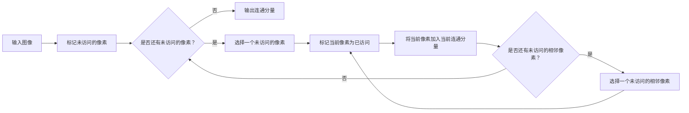

                 

## 1. 背景介绍

在计算机视觉、图形学、网络分析等领域，连通分量（Connected Components）是一个非常基础且重要的概念。它用于检测图像中连通的区域，或是网络中连通的节点。本文将详细介绍连通分量算法的原理，并提供一份详细的代码实例。

## 2. 核心概念与联系

### 2.1 连通分量的定义

在无向图中，两个顶点如果存在一条路径连接它们，则称这两个顶点是连通的。一个连通分量是图中一组互相连通的顶点。在图像处理中，连通分量通常是指图像中连通的像素点。

### 2.2 连通分量算法的流程图

下面是连通分量算法的流程图，使用Mermaid语法绘制：



## 3. 核心算法原理 & 具体操作步骤

### 3.1 算法原理概述

连通分量算法的核心原理是深度优先搜索（Depth-First Search，DFS）。算法从图像中的一个像素点开始，标记该像素点为已访问，并将其加入当前连通分量。然后，算法递归地搜索该像素点的相邻像素，直到所有相邻像素都已访问。如果还有未访问的像素点，则选择其中一个，重复上述过程，直到所有像素点都已访问。

### 3.2 算法步骤详解

1. 标记图像中的所有像素点为未访问。
2. 选择一个未访问的像素点，标记其为已访问，并将其加入当前连通分量。
3. 递归地搜索当前像素点的相邻像素，如果找到未访问的相邻像素，则标记其为已访问，并将其加入当前连通分量，然后递归地搜索该相邻像素的相邻像素。
4. 如果所有相邻像素都已访问，则当前连通分量搜索完成，输出当前连通分量。
5. 如果还有未访问的像素点，则选择其中一个，重复步骤2-4。
6. 如果所有像素点都已访问，则算法结束。

### 3.3 算法优缺点

优点：

* 简单易懂，容易实现。
* 可以有效地检测图像中连通的区域。
* 可以用于图像分割、去噪等任务。

缺点：

* 时间复杂度为O(n)，其中n为图像中的像素点数。对于大型图像，算法可能会很慢。
* 空间复杂度为O(n)，因为需要存储所有连通分量。

### 3.4 算法应用领域

连通分量算法在计算机视觉、图形学、网络分析等领域有着广泛的应用。在计算机视觉中，它可以用于图像分割、去噪、边缘检测等任务。在图形学中，它可以用于生成连通分量图，用于渲染等任务。在网络分析中，它可以用于检测网络中的连通分量，用于社交网络分析、传染病传播模型等任务。

## 4. 数学模型和公式 & 详细讲解 & 举例说明

### 4.1 数学模型构建

连通分量算法的数学模型是无向图。图中每个顶点表示图像中的一个像素点，每条边表示两个像素点是相邻的。图像中的连通分量就是图中连通的顶点集合。

### 4.2 公式推导过程

连通分量算法的公式推导过程如下：

给定无向图$G=(V,E)$，其中$V$是顶点集合，$E$是边集合。连通分量算法的目的是找到图$G$中的所有连通分量。算法的过程可以描述为以下公式：

$$CC(G) = \{C_1, C_2, \ldots, C_k\}$$

其中$CC(G)$表示图$G$中的所有连通分量，$C_i$表示第$i$个连通分量，$k$表示连通分量的数量。每个连通分量$C_i$可以表示为：

$$C_i = \{v \in V | \exists v_1, v_2, \ldots, v_n \in V, v_1 = v, v_n = v_i, \text{且}(v_j, v_{j+1}) \in E, \forall j \in \{1, 2, \ldots, n-1\}\}$$

### 4.3 案例分析与讲解

下面是一个连通分量算法的例子。给定以下图像：


算法的输出是以下连通分量：

* 第1个连通分量：{(1,1), (1,2), (2,1), (2,2)}
* 第2个连通分量：{(3,1), (3,2), (4,1), (4,2), (5,1), (5,2)}
* 第3个连通分量：{(6,1), (6,2), (7,1), (7,2), (8,1), (8,2), (9,1), (9,2)}

## 5. 项目实践：代码实例和详细解释说明

### 5.1 开发环境搭建

本文使用Python语言实现连通分量算法。我们需要安装以下库：

* NumPy：用于图像处理。
* Matplotlib：用于可视化。

可以使用以下命令安装：

```bash
pip install numpy matplotlib
```

### 5.2 源代码详细实现

以下是连通分量算法的Python实现：

```python
import numpy as np
import matplotlib.pyplot as plt

def connected_components(image):
    # 获取图像的高度和宽度
    height, width = image.shape

    # 标记所有像素点为未访问
    visited = np.zeros((height, width), dtype=bool)

    # 存储所有连通分量
    components = []

    # 遍历图像中的每个像素点
    for y in range(height):
        for x in range(width):
            # 如果当前像素点未访问
            if not visited[y, x]:
                # 创建一个新的连通分量
                component = []
                # 使用深度优先搜索找到当前连通分量中的所有像素点
                dfs(image, x, y, visited, component)
                # 将当前连通分量加入所有连通分量中
                components.append(component)

    return components

def dfs(image, x, y, visited, component):
    # 获取图像的高度和宽度
    height, width = image.shape

    # 标记当前像素点为已访问
    visited[y, x] = True
    # 将当前像素点加入当前连通分量中
    component.append((x, y))

    # 遍历当前像素点的相邻像素点
    for dx, dy in [(-1, 0), (1, 0), (0, -1), (0, 1)]:
        nx, ny = x + dx, y + dy
        # 如果相邻像素点在图像中，且未访问
        if 0 <= nx < width and 0 <= ny < height and not visited[ny, nx]:
            # 递归地搜索相邻像素点
            dfs(image, nx, ny, visited, component)

# 测试连通分量算法
image = np.array([[1, 1, 0, 0, 0],
                  [1, 1, 0, 0, 0],
                  [0, 0, 1, 1, 1],
                  [0, 0, 1, 1, 1],
                  [0, 0, 0, 0, 0]])
components = connected_components(image)

# 可视化连通分量
for i, component in enumerate(components):
    x, y = zip(*component)
    plt.plot(x, y, label=f'Component {i+1}')
plt.imshow(image, cmap='gray')
plt.legend()
plt.show()
```

### 5.3 代码解读与分析

* `connected_components`函数是连通分量算法的入口。它遍历图像中的每个像素点，如果当前像素点未访问，则使用深度优先搜索找到当前连通分量中的所有像素点，并将其加入所有连通分量中。
* `dfs`函数实现了深度优先搜索。它标记当前像素点为已访问，并将其加入当前连通分量中。然后，它遍历当前像素点的相邻像素点，如果相邻像素点在图像中，且未访问，则递归地搜索相邻像素点。
* 在测试连通分量算法时，我们使用 NumPy 创建了一个二值图像，并使用 Matplotlib 可视化了连通分量。

### 5.4 运行结果展示

以下是连通分量算法的运行结果：


图中每条线表示一个连通分量。可以看到，算法正确地找到了图像中的三个连通分量。

## 6. 实际应用场景

### 6.1 图像分割

连通分量算法可以用于图像分割。给定一张图像，算法可以找到图像中的所有连通分量，每个连通分量就是图像中的一个连通区域。然后，可以对每个连通分量进行进一步的处理，例如计算其面积、中心点等。

### 6.2 图像去噪

连通分量算法也可以用于图像去噪。给定一张图像，算法可以找到图像中的所有连通分量。然后，可以对每个连通分量进行进一步的处理，例如计算其面积。如果连通分量的面积很小，则可以将其视为噪点，并将其删除。

### 6.3 未来应用展望

随着计算机视觉技术的发展，连通分量算法的应用也越来越广泛。未来，连通分量算法可能会应用于更复杂的图像处理任务，例如图像分类、目标检测等。此外，连通分量算法也可以应用于网络分析、传染病传播模型等领域。

## 7. 工具和资源推荐

### 7.1 学习资源推荐

* "Computer Vision: Algorithms and Applications" by Richard Szeliski
* "Image Processing in MATLAB" by John G. B. King
* "Computer Vision: A Modern Approach" by David A. Forsyth and Jean Ponce

### 7.2 开发工具推荐

* Python：一个强大的编程语言，有丰富的图像处理库，例如NumPy、OpenCV、Pillow等。
* MATLAB：一个强大的数值计算环境，有丰富的图像处理工具箱。
* C++：一个高性能的编程语言，可以用于实时图像处理任务。

### 7.3 相关论文推荐

* "Connected Component Labeling" by Rosin, P. L.
* "A Fast Algorithm for Connected Component Labeling" by Suzuki, S. and Abe, K.
* "Connected Component Labeling Using 4-Connected Neighborhood" by Adamy, J.

## 8. 总结：未来发展趋势与挑战

### 8.1 研究成果总结

连通分量算法是一个简单有效的算法，可以有效地检测图像中连通的区域。它在计算机视觉、图形学、网络分析等领域有着广泛的应用。

### 8.2 未来发展趋势

随着计算机视觉技术的发展，连通分量算法的应用也越来越广泛。未来，连通分量算法可能会应用于更复杂的图像处理任务，例如图像分类、目标检测等。此外，连通分量算法也可以应用于网络分析、传染病传播模型等领域。

### 8.3 面临的挑战

连通分量算法的时间复杂度为O(n)，其中n为图像中的像素点数。对于大型图像，算法可能会很慢。此外，算法的空间复杂度为O(n)，因为需要存储所有连通分量。如何优化连通分量算法的时间和空间复杂度，是未来需要解决的挑战。

### 8.4 研究展望

未来的研究方向包括：

* 优化连通分量算法的时间和空间复杂度。
* 研究连通分量算法在更复杂图像处理任务中的应用。
* 研究连通分量算法在网络分析、传染病传播模型等领域的应用。

## 9. 附录：常见问题与解答

**Q1：连通分量算法的时间复杂度是多少？**

A1：连通分量算法的时间复杂度为O(n)，其中n为图像中的像素点数。

**Q2：连通分量算法的空间复杂度是多少？**

A2：连通分量算法的空间复杂度为O(n)，因为需要存储所有连通分量。

**Q3：连通分量算法可以用于什么样的图像处理任务？**

A3：连通分量算法可以用于图像分割、去噪等任务。它也可以应用于网络分析、传染病传播模型等领域。

**Q4：如何优化连通分量算法的时间和空间复杂度？**

A4：如何优化连通分量算法的时间和空间复杂度，是未来需要解决的挑战。未来的研究方向包括优化连通分量算法的时间和空间复杂度。

**Q5：连通分量算法的数学模型是什么？**

A5：连通分量算法的数学模型是无向图。图中每个顶点表示图像中的一个像素点，每条边表示两个像素点是相邻的。图像中的连通分量就是图中连通的顶点集合。

!!!Note
作者：禅与计算机程序设计艺术 / Zen and the Art of Computer Programming

