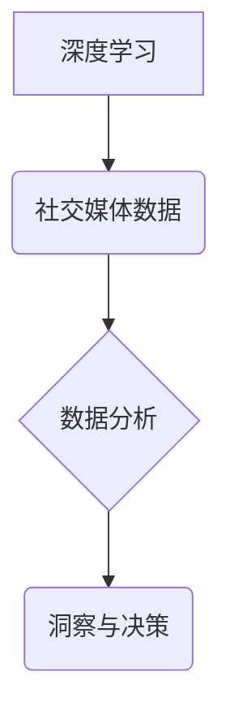

> 深度学习，社交媒体，数据分析，自然语言处理，情感分析，用户画像，推荐系统

## 1. 背景介绍

社交媒体平台如Facebook、Twitter、Instagram等已经成为人们日常生活不可或缺的一部分，每天产生海量的用户数据，蕴藏着丰富的社会、文化和商业价值。如何有效地挖掘这些数据，从中获取有价值的洞察，是当前社会面临的重要挑战。深度学习作为一种强大的机器学习方法，凭借其强大的学习能力和泛化能力，在社交媒体数据分析领域展现出巨大的潜力。

传统的社交媒体数据分析方法主要依赖于规则引擎和统计模型，难以捕捉数据中的复杂模式和非线性关系。而深度学习算法能够自动学习数据中的特征表示，并从中发现隐藏的模式和规律，从而实现更精准、更深入的数据分析。

## 2. 核心概念与联系

### 2.1 深度学习

深度学习是一种基于多层人工神经网络的机器学习方法。它通过模拟人脑神经网络的结构和功能，学习数据中的复杂特征表示。深度学习算法能够自动学习数据中的特征，无需人工特征工程，具有强大的学习能力和泛化能力。

### 2.2 社交媒体数据

社交媒体数据是指用户在社交媒体平台上产生的各种信息，包括文本、图片、视频、音频等。这些数据反映了用户的兴趣、行为、情感等信息，蕴藏着丰富的社会、文化和商业价值。

### 2.3 数据分析

数据分析是指通过收集、清洗、整理、分析和挖掘数据，以发现数据中的规律、趋势和模式，从而为决策提供支持。

**深度学习与社交媒体数据分析的联系**

深度学习算法能够有效地处理社交媒体数据中的复杂模式和非线性关系，从而实现更精准、更深入的数据分析。



## 3. 核心算法原理 & 具体操作步骤

### 3.1 算法原理概述

在社交媒体数据分析中，常用的深度学习算法包括：

* **循环神经网络 (RNN)**：RNN能够处理序列数据，例如文本和时间序列数据，能够捕捉数据中的长期依赖关系。
* **卷积神经网络 (CNN)**：CNN擅长处理图像数据，能够提取图像中的特征，例如边缘、纹理等。
* **Transformer**：Transformer是一种新型的深度学习架构，能够处理长序列数据，并具有强大的并行能力。

### 3.2 算法步骤详解

以情感分析为例，使用深度学习算法进行情感分析的步骤如下：

1. **数据收集和预处理**: 收集社交媒体平台上的文本数据，并进行预处理，例如去除停用词、标点符号等。
2. **特征提取**: 使用深度学习算法，例如RNN或Transformer，提取文本数据中的特征表示。
3. **模型训练**: 使用训练数据训练深度学习模型，学习文本数据与情感之间的映射关系。
4. **模型评估**: 使用测试数据评估模型的性能，例如准确率、召回率等。
5. **模型部署**: 将训练好的模型部署到生产环境中，用于对新的文本数据进行情感分析。

### 3.3 算法优缺点

**优点**:

* 能够自动学习数据中的特征，无需人工特征工程。
* 具有强大的学习能力和泛化能力，能够处理复杂的数据模式。
* 能够实现更精准、更深入的数据分析。

**缺点**:

* 需要大量的训练数据。
* 训练过程耗时和耗能。
* 模型解释性较差，难以理解模型的决策过程。

### 3.4 算法应用领域

深度学习算法在社交媒体数据分析领域具有广泛的应用场景，例如：

* **情感分析**: 分析用户对产品、服务、事件等的情绪态度。
* **用户画像**: 建立用户画像，了解用户的兴趣、行为、偏好等信息。
* **内容推荐**: 根据用户的兴趣和行为，推荐相关的内容。
* **欺诈检测**: 检测社交媒体平台上的虚假账户和恶意行为。
* **舆情监测**: 监测社交媒体平台上的舆情变化，及时了解公众对事件的看法和态度。

## 4. 数学模型和公式 & 详细讲解 & 举例说明

### 4.1 数学模型构建

深度学习模型通常由多层神经网络组成，每层神经网络包含多个神经元。每个神经元接收来自上一层的输入信号，并通过激活函数进行处理，输出到下一层。

**神经网络模型的数学表示**:

假设一个神经网络有 L 层，第 l 层有 N_l 个神经元，则神经网络的数学表示为：

```latex
y_l = f_l(W_l * x_{l-1} + b_l)
```

其中：

* $y_l$ 是第 l 层的输出向量。
* $x_{l-1}$ 是第 l-1 层的输出向量。
* $W_l$ 是第 l 层的权重矩阵。
* $b_l$ 是第 l 层的偏置向量。
* $f_l$ 是第 l 层的激活函数。

### 4.2 公式推导过程

深度学习模型的训练过程是通过优化模型参数来最小化损失函数的过程。损失函数衡量模型预测结果与真实结果之间的差异。常用的损失函数包括均方误差 (MSE) 和交叉熵 (CE)。

**均方误差 (MSE)**:

```latex
MSE = \frac{1}{N} \sum_{i=1}^{N} (y_i - \hat{y}_i)^2
```

其中：

* $y_i$ 是第 i 个样本的真实值。
* $\hat{y}_i$ 是第 i 个样本的预测值。
* $N$ 是样本总数。

**交叉熵 (CE)**:

```latex
CE = -\sum_{i=1}^{N} y_i \log(\hat{y}_i)
```

其中：

* $y_i$ 是第 i 个样本的真实值 (0 或 1)。
* $\hat{y}_i$ 是第 i 个样本的预测值 (0 到 1 之间)。

### 4.3 案例分析与讲解

以情感分析为例，假设我们使用深度学习模型对文本数据进行情感分类，目标是将文本数据分类为正向情感、负向情感或中性情感。

我们可以使用交叉熵损失函数来衡量模型预测结果与真实结果之间的差异。训练过程中，模型会不断调整参数，以最小化损失函数的值。

## 5. 项目实践：代码实例和详细解释说明

### 5.1 开发环境搭建

* **操作系统**: Ubuntu 18.04
* **编程语言**: Python 3.6
* **深度学习框架**: TensorFlow 2.0
* **其他依赖**: numpy, pandas, matplotlib

### 5.2 源代码详细实现

```python
import tensorflow as tf
from tensorflow.keras.models import Sequential
from tensorflow.keras.layers import Embedding, LSTM, Dense

# 数据加载和预处理
# ...

# 模型构建
model = Sequential()
model.add(Embedding(input_dim=vocab_size, output_dim=embedding_dim, input_length=max_length))
model.add(LSTM(units=128))
model.add(Dense(units=num_classes, activation='softmax'))

# 模型编译
model.compile(optimizer='adam', loss='sparse_categorical_crossentropy', metrics=['accuracy'])

# 模型训练
model.fit(x_train, y_train, epochs=10, batch_size=32)

# 模型评估
loss, accuracy = model.evaluate(x_test, y_test)
print('Test Loss:', loss)
print('Test Accuracy:', accuracy)

# 模型保存
model.save('sentiment_analysis_model.h5')
```

### 5.3 代码解读与分析

* **数据加载和预处理**: 首先需要加载和预处理社交媒体数据，例如文本数据。
* **模型构建**: 使用深度学习框架构建深度学习模型，例如循环神经网络 (RNN) 或 Transformer。
* **模型编译**: 配置模型的优化器、损失函数和评价指标。
* **模型训练**: 使用训练数据训练深度学习模型，并不断调整模型参数以最小化损失函数的值。
* **模型评估**: 使用测试数据评估模型的性能，例如准确率、召回率等。
* **模型保存**: 将训练好的模型保存到文件，以便后续使用。

### 5.4 运行结果展示

训练完成后，可以使用测试数据评估模型的性能。例如，可以使用准确率来衡量模型对情感分类的准确性。

## 6. 实际应用场景

### 6.1 情感分析

* **品牌监控**: 监测用户对品牌、产品和服务的评价，了解用户情绪变化趋势。
* **市场调研**: 分析用户对特定产品或服务的兴趣和需求，为市场营销提供决策依据。
* **客户服务**: 自动识别客户的负面情绪，并提供及时有效的解决方案。

### 6.2 用户画像

* **个性化推荐**: 根据用户的兴趣和行为，推荐个性化的内容和产品。
* **精准营销**: 针对不同用户群体的特点，进行精准的营销推广。
* **用户行为分析**: 了解用户的浏览习惯、购买行为等，为产品设计和改进提供参考。

### 6.3 内容推荐

* **社交媒体平台**: 推荐用户可能感兴趣的内容，提高用户粘性和活跃度。
* **新闻网站**: 推荐用户可能感兴趣的新闻文章，提高用户阅读量和参与度。
* **电商平台**: 推荐用户可能感兴趣的商品，提高用户购买转化率。

### 6.4 欺诈检测

* **账户安全**: 检测虚假账户和恶意行为，保护用户账户安全。
* **信息安全**: 检测网络钓鱼、垃圾邮件等恶意信息，保障信息安全。
* **金融安全**: 检测金融诈骗行为，防止资金损失。

### 6.5 舆情监测

* **事件追踪**: 监测社交媒体平台上的舆情变化，及时了解公众对事件的看法和态度。
* **风险预警**: 识别潜在的社会风险和危机，及时采取应对措施。
* **品牌危机管理**: 应对品牌危机，维护品牌形象。

### 6.6 未来应用展望

随着深度学习技术的不断发展，其在社交媒体数据分析领域的应用场景将更加广泛。例如：

* **更精准的用户画像**: 利用更先进的深度学习算法，构建更精准的用户画像，更好地理解用户的需求和行为。
* **更个性化的内容推荐**: 基于用户的兴趣和行为，提供更个性化的内容推荐，提高用户体验。
* **更有效的欺诈检测**: 利用深度学习算法，识别更复杂的欺诈行为，提高安全防范能力。
* **更深入的社会分析**: 利用深度学习算法，分析社交媒体数据中的社会趋势和规律，为社会发展提供决策支持。

## 7. 工具和资源推荐

### 7.1 学习资源推荐

* **书籍**:
    * 深度学习 (Deep Learning) - Ian Goodfellow, Yoshua Bengio, Aaron Courville
    * 自然语言处理 (Natural Language Processing) - Jurafsky, Martin
* **在线课程**:
    * Coursera: 深度学习 Specialization
    * Udacity: 自然语言处理 Nanodegree
* **博客**:
    * The Gradient
    * Towards Data Science

### 7.2 开发工具推荐

* **深度学习框架**: TensorFlow, PyTorch, Keras
* **数据处理工具**: Pandas, NumPy
* **可视化工具**: Matplotlib, Seaborn

### 7.3 相关论文推荐

* **Attention Is All You Need**: https://arxiv.org/abs/1706.03762
* **BERT: Pre-training of Deep Bidirectional Transformers for Language Understanding**: https://arxiv.org/abs/1810.04805
* **Recurrent Neural Network for Text Classification**: https://arxiv.org/abs/1408.5882

## 8. 总结：未来发展趋势与