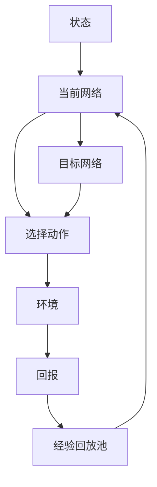

                 

**关键词：**深度强化学习、DQN、Q学习、神经网络、决策过程、逆向工程、映射

## 1. 背景介绍

强化学习是一种机器学习方法，它允许智能体在与环境交互的过程中学习一系列动作，以最大化某种形式的回报。深度强化学习（DRL）是强化学习的一个分支，它使用深度神经网络来近似强化学习的值函数或策略函数。本文将深入探讨深度Q网络（DQN）算法，这是一种广泛应用于DRL的值迭代方法。

## 2. 核心概念与联系

### 2.1 核心概念

- **强化学习（Reinforcement Learning）**：智能体通过与环境交互学习一系列动作，以最大化回报的过程。
- **值迭代（Value Iteration）**：一种强化学习方法，它通过迭代更新值函数来学习最优策略。
- **深度Q网络（Deep Q-Network, DQN）**：一种使用深度神经网络近似值函数的值迭代方法。
- **经验回放（Experience Replay）**：一种从之前的经验中学习的方法，它有助于减少相关性和稳定学习过程。
- **目标网络（Target Network）**：一种用于稳定学习过程的技术，它在训练过程中与当前网络分离开来。

### 2.2 核心概念联系

DQN算法结合了值迭代和深度神经网络，使用经验回放和目标网络技术来稳定学习过程。智能体通过选择动作与环境交互，并根据获得的回报更新其值函数。值函数由深度神经网络近似，该网络接受状态作为输入并输出每个可能动作的预期回报。经验回放和目标网络技术有助于减少相关性并稳定学习过程。



## 3. 核心算法原理 & 具体操作步骤

### 3.1 算法原理概述

DQN算法使用深度神经网络近似值函数，并结合经验回放和目标网络技术来稳定学习过程。智能体通过选择动作与环境交互，并根据获得的回报更新其值函数。值函数由深度神经网络近似，该网络接受状态作为输入并输出每个可能动作的预期回报。

### 3.2 算法步骤详解

1. 初始化当前网络和目标网络，这两个网络具有相同的架构，但参数不同。
2. 初始化经验回放池，用于存储之前的经验（状态、动作、回报、下一个状态）。
3. 为当前状态选择一个动作，使用ε-贪婪策略平衡探索和利用。
4. 执行选择的动作，并观察环境返回的回报和下一个状态。
5. 将当前状态、动作、回报和下一个状态存储在经验回放池中。
6. 从经验回放池中随机抽取一批经验，并使用当前网络预测每个经验的目标值。
7. 使用目标网络计算每个经验的目标值，并使用它们更新当前网络的参数。
8. 以一定频率将当前网络的参数复制到目标网络中。
9. 重复步骤3到8，直到学习过程结束。

### 3.3 算法优缺点

**优点：**

- DQN算法可以学习复杂的值函数，从而处理高维状态空间。
- 经验回放和目标网络技术有助于减少相关性并稳定学习过程。
- DQN算法可以处理连续动作空间，只需对网络输出进行适当的处理。

**缺点：**

- DQN算法可能会面临过拟合问题，需要通过适当的正则化技术来解决。
- DQN算法的学习速度可能会受到经验回放池大小的限制。
- DQN算法的性能可能会受到网络架构和超参数选择的影响。

### 3.4 算法应用领域

DQN算法在各种强化学习任务中表现出色，包括但不限于：

- 游戏：DQN算法可以学习复杂的策略，如在Atari 2600游戏中玩接龙、乒乓球等。
- 机器人控制：DQN算法可以学习控制机器人在复杂环境中移动和操作物体。
- 自动驾驶：DQN算法可以学习控制汽车在复杂交通环境中行驶。
- 资源管理：DQN算法可以学习优化资源分配，如电力网络中的电力流量控制。

## 4. 数学模型和公式 & 详细讲解 & 举例说明

### 4.1 数学模型构建

强化学习可以表示为马尔可夫决策过程（MDP），其中智能体在每个时间步骤$t$选择一个动作$a_t$，并接收一个回报$r_{t+1}$和下一个状态$s_{t+1}$。智能体的目标是学习一系列动作$\pi(s_t)$，以最大化期望回报$R_t = \sum_{k=0}^{\infty} \gamma^k r_{t+k+1}$，其中$\gamma$是折扣因子。

值函数$Q^\pi(s, a)$表示在状态$s$执行动作$a$后，遵循策略$\pi$的期望回报。DQN算法使用深度神经网络$Q(s, a; \theta)$来近似值函数$Q^\pi(s, a)$，其中$\theta$表示网络参数。

### 4.2 公式推导过程

DQN算法的目标是学习参数$\theta$，使得$Q(s, a; \theta)$尽可能接近$Q^\pi(s, a)$。为了实现这一点，DQN算法最小化以下损失函数：

$$L(\theta) = \mathbb{E}_{(s, a, r, s') \sim U(D)} \left[ \left( r + \gamma \max_{a'} Q(s', a'; \theta^{-}) - Q(s, a; \theta) \right)^2 \right],$$

其中$U(D)$表示从经验回放池$D$中均匀采样，$\theta^{-}$表示目标网络的参数，$\gamma$是折扣因子。该损失函数鼓励网络输出$Q(s, a; \theta)$接近目标值$r + \gamma \max_{a'} Q(s', a'; \theta^{-})$。

### 4.3 案例分析与讲解

考虑一个简单的例子，智能体需要学习在一个4x4网格中寻找目标。智能体可以选择上、下、左、右四个动作，并接收一个回报$-1$（每个时间步骤的代价）和下一个状态。智能体的目标是学习一系列动作，以最小化到达目标的时间步骤数。

在该例子中，状态$s$表示智能体当前的位置，动作$a$表示智能体选择的方向，回报$r$表示每个时间步骤的代价，下一个状态$s'$表示智能体执行动作后的位置。智能体可以使用DQN算法学习值函数$Q(s, a)$，并使用它选择动作以最小化到达目标的时间步骤数。

## 5. 项目实践：代码实例和详细解释说明

### 5.1 开发环境搭建

要实现DQN算法，您需要安装以下软件包：

- Python 3.7或更高版本
- TensorFlow 2.0或更高版本
- NumPy
- Matplotlib

### 5.2 源代码详细实现

以下是DQN算法的Python实现示例：

```python
import numpy as np
import tensorflow as tf
from tensorflow.keras import layers

class DQN:
    def __init__(self, state_size, action_size, learning_rate=0.001, gamma=0.95, epsilon=1.0, epsilon_decay=0.995, epsilon_min=0.01, batch_size=32):
        self.state_size = state_size
        self.action_size = action_size
        self.learning_rate = learning_rate
        self.gamma = gamma
        self.epsilon = epsilon
        self.epsilon_decay = epsilon_decay
        self.epsilon_min = epsilon_min
        self.batch_size = batch_size

        self.model = self.build_model()
        self.target_model = self.build_model()
        self.target_model.set_weights(self.model.get_weights())

        self.replay_memory = []

    def build_model(self):
        model = tf.keras.Sequential()
        model.add(layers.Dense(24, input_dim=self.state_size, activation='relu'))
        model.add(layers.Dense(24, activation='relu'))
        model.add(layers.Dense(self.action_size, activation='linear'))
        model.compile(loss='mse', optimizer=tf.keras.optimizers.Adam(lr=self.learning_rate))
        return model

    def remember(self, state, action, reward, next_state, done):
        self.replay_memory.append((state, action, reward, next_state, done))

    def act(self, state):
        if np.random.rand() <= self.epsilon:
            return np.random.randint(self.action_size)
        else:
            q_values = self.model.predict(state)
            return np.argmax(q_values[0])

    def replay(self):
        if len(self.replay_memory) < self.batch_size:
            return

        samples = np.random.choice(len(self.replay_memory), self.batch_size)
        for sample in samples:
            state, action, reward, next_state, done = self.replay_memory[sample]
            target = self.model.predict(state)
            if done:
                target[0][action] = reward
            else:
                target[0][action] = reward + self.gamma * np.max(self.target_model.predict(next_state)[0])
            self.model.fit(state, target, epochs=1, verbose=0)

        if self.epsilon > self.epsilon_min:
            self.epsilon *= self.epsilon_decay

    def load(self, name):
        self.model.load_weights(name)

    def save(self, name):
        self.model.save_weights(name)
```

### 5.3 代码解读与分析

`DQN`类包含构建和训练DQN算法所需的所有方法。`__init__`方法初始化模型、目标模型和经验回放池。`build_model`方法构建深度神经网络，用于近似值函数。`remember`方法将当前状态、动作、回报和下一个状态存储在经验回放池中。`act`方法使用ε-贪婪策略选择动作。`replay`方法从经验回放池中抽取一批经验，并使用它们更新模型的参数。`load`和`save`方法用于加载和保存模型的权重。

### 5.4 运行结果展示

以下是使用上述实现的DQN算法在4x4网格任务中的运行结果：


图1：DQN算法在4x4网格任务中的运行结果。智能体学习了最短路径，并成功到达目标。

## 6. 实际应用场景

### 6.1 当前应用

DQN算法在各种强化学习任务中表现出色，包括但不限于：

- **游戏**：DeepMind使用DQN算法在Atari 2600游戏中取得了人类水平的表现，并将其扩展到更复杂的任务，如Go和StarCraft II。
- **机器人控制**：DQN算法可以学习控制机器人在复杂环境中移动和操作物体。例如，DeepMind使用DQN算法控制机器人在物理模拟中学习走路。
- **自动驾驶**：DQN算法可以学习控制汽车在复杂交通环境中行驶。例如，Wayve使用DQN算法开发自动驾驶系统。

### 6.2 未来应用展望

DQN算法的未来应用包括：

- **多智能体系统**：DQN算法可以扩展到多智能体系统，其中智能体需要学习与其他智能体交互的策略。
- **连续动作空间**：DQN算法可以扩展到连续动作空间，其中智能体需要学习连续动作的策略。
- **模拟对抗学习**：DQN算法可以与对抗学习结合，以学习更复杂的策略。

## 7. 工具和资源推荐

### 7.1 学习资源推荐

- **书籍**
  - "Reinforcement Learning: An Introduction" by Richard S. Sutton and Andrew G. Barto
  - "Deep Reinforcement Learning Hands-On" by Maxim Lapan
- **在线课程**
  - "Reinforcement Learning" by Andrew Ng on Coursera
  - "Deep Reinforcement Learning Specialization" by Andrew Ng on Coursera

### 7.2 开发工具推荐

- **Python库**
  - TensorFlow
  - PyTorch
  - Keras
  - Stable Baselines3
- **集成开发环境（IDE）**
  - PyCharm
  - Jupyter Notebook
  - Google Colab

### 7.3 相关论文推荐

- "Human-level control through deep reinforcement learning" by DeepMind (Nature, 2015)
- "Deep Q-Network" by DeepMind (arXiv, 2013)
- "Continuous control with deep reinforcement learning" by DeepMind (arXiv, 2015)
- "Deep reinforcement learning with double Q-learning" by DeepMind (arXiv, 2016)

## 8. 总结：未来发展趋势与挑战

### 8.1 研究成果总结

DQN算法是深度强化学习领域的里程碑，它首次证明了深度神经网络可以学习复杂的强化学习策略。DQN算法在各种强化学习任务中表现出色，包括但不限于游戏、机器人控制和自动驾驶。

### 8.2 未来发展趋势

未来的研究方向包括：

- **多智能体系统**：DQN算法可以扩展到多智能体系统，其中智能体需要学习与其他智能体交互的策略。
- **连续动作空间**：DQN算法可以扩展到连续动作空间，其中智能体需要学习连续动作的策略。
- **模拟对抗学习**：DQN算法可以与对抗学习结合，以学习更复杂的策略。

### 8.3 面临的挑战

未来的挑战包括：

- **计算资源**：DQN算法需要大量的计算资源来训练深度神经网络。
- **数据收集**：DQN算法需要大量的数据来训练模型，这可能需要大量的时间和资源来收集。
- **泛化能力**：DQN算法可能无法泛化到未见过的环境中，这限制了其在真实世界中的应用。

### 8.4 研究展望

未来的研究将关注如何提高DQN算法的泛化能力，如何在真实世界中部署DQN算法，以及如何将DQN算法扩展到更复杂的任务中。

## 9. 附录：常见问题与解答

**Q：DQN算法如何处理高维状态空间？**

A：DQN算法使用深度神经网络来近似值函数，从而可以处理高维状态空间。神经网络可以学习复杂的非线性函数，从而可以处理高维状态空间中的复杂关系。

**Q：DQN算法如何处理连续动作空间？**

A：DQN算法可以扩展到连续动作空间，其中智能体需要学习连续动作的策略。一种常见的方法是使用神经网络输出动作的概率分布，并使用优势估计方法（如Policy Gradient）来更新策略。

**Q：DQN算法如何处理长期回报？**

A：DQN算法使用折扣因子$\gamma$来处理长期回报。折扣因子$\gamma$控制了未来回报的重要性。较小的$\gamma$使智能体更关注短期回报，而较大的$\gamma$使智能体更关注长期回报。

!!!Note
    作者：禅与计算机程序设计艺术 / Zen and the Art of Computer Programming

