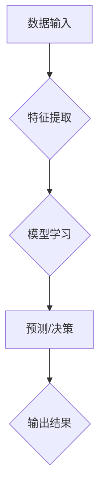

> 人工智能,机器学习,深度学习,神经网络,算法,代码实例,实践

## 1. 背景介绍

人工智能 (Artificial Intelligence, AI) 作为一项前沿科技，近年来发展迅速，并已渗透到我们生活的方方面面。从智能手机的语音助手到自动驾驶汽车，从医疗诊断到金融风险评估，AI技术正在改变着世界。

随着AI技术的不断发展，对AI原理和应用的理解和掌握变得越来越重要。本篇文章将从AI的核心概念、算法原理、数学模型、代码实例等方面进行深入讲解，帮助读者理解AI的本质，并掌握AI开发的基本技能。

## 2. 核心概念与联系

人工智能的核心概念是模拟人类智能的行为。这包括学习、推理、决策、感知、语言理解等能力。

**AI系统通常由以下几个关键部分组成：**

* **数据输入层:** 收集和处理来自外部环境的数据，例如图像、文本、音频等。
* **特征提取层:** 从数据中提取有用的特征，例如图像中的物体、文本中的关键词等。
* **模型层:** 使用算法学习数据中的模式和关系，构建一个可以进行预测或决策的模型。
* **输出层:** 根据模型的预测结果，生成相应的输出，例如分类结果、预测值等。

**AI系统的工作流程:**



## 3. 核心算法原理 & 具体操作步骤

### 3.1  算法原理概述

机器学习 (Machine Learning, ML) 是AI领域的核心技术之一。它通过算法学习数据，并从数据中发现模式和规律，从而实现对新数据的预测或分类。

**常见的机器学习算法包括：**

* **监督学习:** 使用标记数据训练模型，例如分类和回归问题。
* **无监督学习:** 使用未标记数据训练模型，例如聚类和降维问题。
* **强化学习:** 通过试错学习，在环境中获得最大奖励。

### 3.2  算法步骤详解

以监督学习为例，其基本步骤如下：

1. **数据收集和预处理:** 收集相关数据，并进行清洗、转换、特征工程等预处理操作。
2. **模型选择:** 根据具体问题选择合适的机器学习算法。
3. **模型训练:** 使用训练数据训练模型，调整模型参数，使其能够准确地预测或分类。
4. **模型评估:** 使用测试数据评估模型的性能，例如准确率、召回率、F1-score等。
5. **模型调优:** 根据评估结果，调整模型参数或选择其他算法，提高模型性能。
6. **模型部署:** 将训练好的模型部署到实际应用场景中。

### 3.3  算法优缺点

不同的机器学习算法具有不同的优缺点，需要根据具体问题选择合适的算法。

**例如：**

* **线性回归:** 算法简单易懂，但对非线性关系的拟合能力较弱。
* **决策树:** 算法易于理解和解释，但容易过拟合。
* **支持向量机:** 算法对高维数据具有较好的泛化能力，但训练时间较长。
* **神经网络:** 算法能够学习复杂的非线性关系，但训练数据量较大，参数较多，容易过拟合。

### 3.4  算法应用领域

机器学习算法广泛应用于各个领域，例如：

* **图像识别:** 人脸识别、物体检测、图像分类等。
* **自然语言处理:** 文本分类、情感分析、机器翻译等。
* **推荐系统:** 商品推荐、用户画像、个性化服务等。
* **金融风险评估:** 欺诈检测、信用评分、投资决策等。
* **医疗诊断:** 疾病预测、影像分析、药物研发等。

## 4. 数学模型和公式 & 详细讲解 & 举例说明

### 4.1  数学模型构建

机器学习算法的核心是数学模型。数学模型通过公式和参数来描述数据之间的关系。

**例如：**

* **线性回归模型:** 假设数据之间存在线性关系，可以使用以下公式来描述：

$$y = w_0 + w_1x_1 + w_2x_2 + ... + w_nx_n + \epsilon$$

其中：

* $y$ 是预测值
* $x_1, x_2, ..., x_n$ 是输入特征
* $w_0, w_1, w_2, ..., w_n$ 是模型参数
* $\epsilon$ 是误差项

* **逻辑回归模型:** 用于二分类问题，使用sigmoid函数将线性组合映射到0到1之间，表示预测概率。

$$p(y=1|x) = \frac{1}{1 + e^{-(w_0 + w_1x_1 + w_2x_2 + ... + w_nx_n)}}$$

### 4.2  公式推导过程

机器学习算法的训练过程本质上是参数优化过程。通过使用梯度下降等优化算法，不断调整模型参数，使得模型预测结果与真实值之间的误差最小化。

**例如：**

* **梯度下降算法:** 使用梯度方向更新模型参数，朝着误差最小化的方向前进。

$$w = w - \alpha \frac{\partial Loss}{\partial w}$$

其中：

* $w$ 是模型参数
* $\alpha$ 是学习率
* $\frac{\partial Loss}{\partial w}$ 是损失函数对参数的梯度

### 4.3  案例分析与讲解

**例如：**

* 使用线性回归模型预测房价，输入特征包括房屋面积、房间数量、地理位置等。
* 使用逻辑回归模型预测用户是否会点击广告，输入特征包括用户年龄、性别、浏览历史等。

## 5. 项目实践：代码实例和详细解释说明

### 5.1  开发环境搭建

使用Python语言进行机器学习开发，需要安装以下软件：

* Python 3.x
* NumPy
* Pandas
* Scikit-learn

### 5.2  源代码详细实现

**例如：**

使用Scikit-learn库实现线性回归模型的训练和预测：

```python
import numpy as np
from sklearn.linear_model import LinearRegression
from sklearn.model_selection import train_test_split

# 生成示例数据
X = np.array([[1, 2], [3, 4], [5, 6], [7, 8]])
y = np.array([3, 7, 11, 15])

# 将数据划分为训练集和测试集
X_train, X_test, y_train, y_test = train_test_split(X, y, test_size=0.2)

# 创建线性回归模型
model = LinearRegression()

# 训练模型
model.fit(X_train, y_train)

# 预测测试集数据
y_pred = model.predict(X_test)

# 打印预测结果
print(y_pred)
```

### 5.3  代码解读与分析

* 使用`train_test_split`函数将数据划分为训练集和测试集，用于模型训练和评估。
* 使用`LinearRegression()`类创建线性回归模型对象。
* 使用`fit()`方法训练模型，将训练数据输入模型，学习模型参数。
* 使用`predict()`方法预测测试集数据，根据模型参数生成预测结果。

### 5.4  运行结果展示

运行上述代码，会输出测试集数据的预测结果。

## 6. 实际应用场景

### 6.1  图像识别

* **人脸识别:** 用于身份验证、安全监控等场景。
* **物体检测:** 用于自动驾驶、安防监控等场景。
* **图像分类:** 用于医学影像诊断、产品分类等场景。

### 6.2  自然语言处理

* **文本分类:** 用于垃圾邮件过滤、情感分析等场景。
* **机器翻译:** 用于跨语言沟通、信息翻译等场景。
* **聊天机器人:** 用于客服、陪伴等场景。

### 6.3  推荐系统

* **商品推荐:** 用于电商平台、内容平台等场景。
* **用户画像:** 用于精准营销、个性化服务等场景。

### 6.4  未来应用展望

AI技术的发展将带来更多新的应用场景，例如：

* **个性化教育:** 根据学生的学习情况提供个性化的学习方案。
* **智能医疗:** 辅助医生诊断疾病、预测患者风险。
* **自动驾驶:** 实现无人驾驶汽车的普及。

## 7. 工具和资源推荐

### 7.1  学习资源推荐

* **在线课程:** Coursera、edX、Udacity等平台提供丰富的AI课程。
* **书籍:** 《深度学习》、《机器学习实战》等书籍是AI学习的经典教材。
* **博客和论坛:** Kaggle、Towards Data Science等平台提供AI相关的博客文章和论坛讨论。

### 7.2  开发工具推荐

* **Python:** 作为AI开发的主要语言，拥有丰富的库和工具。
* **TensorFlow:** Google开发的开源深度学习框架。
* **PyTorch:** Facebook开发的开源深度学习框架。
* **Scikit-learn:** Python机器学习库，提供各种经典算法实现。

### 7.3  相关论文推荐

* **《ImageNet Classification with Deep Convolutional Neural Networks》:** 提出AlexNet模型，标志着深度学习在图像识别领域的突破。
* **《Attention Is All You Need》:** 提出Transformer模型，在自然语言处理领域取得了重大进展。

## 8. 总结：未来发展趋势与挑战

### 8.1  研究成果总结

近年来，AI技术取得了长足的进步，在图像识别、自然语言处理、推荐系统等领域取得了突破性进展。深度学习算法的出现，使得AI模型的性能大幅提升，并应用于越来越多的领域。

### 8.2  未来发展趋势

* **模型规模和能力的提升:** 未来AI模型将更加庞大，拥有更强的学习能力和推理能力。
* **跨模态学习:** AI模型将能够处理多种数据类型，例如文本、图像、音频等，实现跨模态的理解和交互。
* **可解释性增强:** 研究如何提高AI模型的透明度和可解释性，使其决策过程更加可理解。
* **边缘计算:** 将AI模型部署到边缘设备，实现更快速的响应和更低的延迟。

### 8.3  面临的挑战

* **数据获取和隐私保护:** AI模型的训练需要大量数据，如何获取高质量数据并保护用户隐私是一个重要挑战。
* **算法偏见和公平性:** AI模型可能存在算法偏见，导致不公平的结果，需要研究如何解决算法偏见问题。
* **安全性和可靠性:** AI模型的安全性和可靠性至关重要，需要研究如何防止模型被攻击和误用。

### 8.4  研究展望

未来AI研究将继续探索新的算法、模型和应用场景，并致力于解决AI技术面临的挑战，推动AI技术向更安全、更可靠、更公平的方向发展。

## 9. 附录：常见问题与解答

**常见问题:**

* **什么是机器学习？**

机器学习是一种人工智能技术，通过算法学习数据，并从数据中发现模式和规律，从而实现对新数据的预测或分类。

* **什么是深度学习？**

深度学习是一种机器学习的子领域，使用多层神经网络来学习数据，能够学习更复杂的非线性关系。

* **如何选择合适的机器学习算法？**

选择合适的机器学习算法需要根据具体问题和数据特点进行选择。

* **如何评估机器学习模型的性能？**

可以使用准确率、召回率、F1-score等指标来评估机器学习模型的性能。

**解答:**

* **什么是机器学习？**

机器学习是一种人工智能技术，通过算法学习数据，并从数据中发现模式和规律，