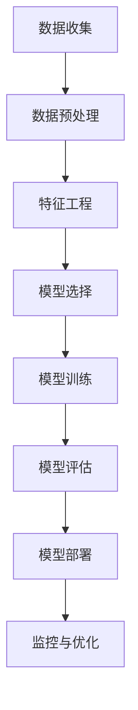

                 

**人工智能创业：技术创新的重要性**

## 1. 背景介绍

在当今的商业世界中，人工智能（AI）已经成为驱动创新和竞争的关键因素。根据国际数据公司（IDC）的预测，到2025年，全球人工智能市场规模将达到1900亿美元。然而，成功的AI创业并非易事，它需要对技术创新的深刻理解和应用。

## 2. 核心概念与联系

### 2.1 AI创业的关键要素

AI创业的成功取决于以下关键要素：

- **数据**：AI模型的性能取决于训练数据的质量和量。
- **算法**：选择正确的算法模型是成功的关键。
- **基础设施**：高性能的计算和存储基础设施是 AI创业的必要条件。
- **人才**：拥有顶尖AI专家和工程师团队是成功的关键。

### 2.2 AI创业的架构

下图展示了AI创业的架构，从数据收集到模型部署的完整流程。



## 3. 核心算法原理 & 具体操作步骤

### 3.1 算法原理概述

选择正确的算法模型是AI创业成功的关键。常用的AI算法包括：

- **监督学习**：如线性回归、逻辑回归、决策树、随机森林、支持向量机（SVM）、神经网络。
- **无监督学习**：如K-均值聚类、自动编码器、深度belief网络。
- **强化学习**：如Q学习、SARSA、深度Q网络（DQN）、Policy Gradient。

### 3.2 算法步骤详解

以监督学习的线性回归为例，其步骤如下：

1. **数据收集**：收集包含特征和标签的数据。
2. **数据预处理**：清洗数据，处理缺失值，进行标准化。
3. **特征工程**：选择特征，进行特征缩放。
4. **模型选择**：选择线性回归算法。
5. **模型训练**：使用训练数据训练模型。
6. **模型评估**：使用测试数据评估模型性能。
7. **模型部署**：将模型部署到生产环境。

### 3.3 算法优缺点

每种算法都有其优缺点。例如：

- **线性回归**：优点是简单易懂，缺点是只适用于线性可分的数据。
- **决策树**：优点是可解释性强，缺点是易过拟合。
- **神经网络**：优点是适用于复杂数据，缺点是训练时间长，易过拟合。

### 3.4 算法应用领域

AI算法在各个领域都有广泛应用，如：

- **金融**：风险评估、欺诈检测、交易预测。
- **医疗**：疾病诊断、药物发现、个性化治疗。
- **制造**：质量控制、预测维护、自动化。
- **交通**：自动驾驶、路径规划、交通预测。

## 4. 数学模型和公式 & 详细讲解 & 举例说明

### 4.1 数学模型构建

以线性回归为例，其数学模型为：

$$y = \beta_0 + \beta_1x_1 + \beta_2x_2 + \ldots + \beta_nx_n + \epsilon$$

其中，$y$是目标变量，$\beta_0, \beta_1, \ldots, \beta_n$是模型参数，$\epsilon$是误差项。

### 4.2 公式推导过程

线性回归模型的参数可以通过最小化误差平方和来求解：

$$\min_{\beta_0, \beta_1, \ldots, \beta_n} \sum_{i=1}^{n} (y_i - \hat{y}_i)^2$$

其中，$y_i$是真实值，$\hat{y}_i$是预测值。这个优化问题可以使用梯度下降算法来解决。

### 4.3 案例分析与讲解

假设我们要预测房价，特征包括房屋面积、房龄、卧室数等。我们可以使用线性回归模型来建模。通过收集数据，预处理数据，选择特征，训练模型，我们可以得到模型的参数。然后，我们可以使用这些参数来预测新数据的房价。

## 5. 项目实践：代码实例和详细解释说明

### 5.1 开发环境搭建

我们将使用Python和Scikit-learn库来实现线性回归模型。首先，我们需要安装必要的库：

```bash
pip install numpy pandas scikit-learn
```

### 5.2 源代码详细实现

以下是使用Scikit-learn实现线性回归的代码：

```python
from sklearn.linear_model import LinearRegression
from sklearn.model_selection import train_test_split
from sklearn.metrics import mean_squared_error
import numpy as np
import pandas as pd

# 加载数据
data = pd.read_csv('housing.csv')

# 预处理数据
data = data.dropna()
X = data.drop('median_house_value', axis=1)
y = data['median_house_value']

# 选择特征
X = pd.get_dummies(X)

# 划分数据集
X_train, X_test, y_train, y_test = train_test_split(X, y, test_size=0.2, random_state=42)

# 训练模型
model = LinearRegression()
model.fit(X_train, y_train)

# 评估模型
y_pred = model.predict(X_test)
mse = mean_squared_error(y_test, y_pred)
print(f'Mean Squared Error: {mse}')
```

### 5.3 代码解读与分析

这段代码首先加载数据，然后预处理数据，选择特征，划分数据集，训练模型，评估模型。其中，`LinearRegression`是Scikit-learn提供的线性回归模型，`train_test_split`用于划分数据集，`mean_squared_error`用于计算均方误差。

### 5.4 运行结果展示

运行这段代码后，你会看到输出的均方误差。这个值越小，模型的性能越好。

## 6. 实际应用场景

### 6.1 当前应用

AI创业已经在各个领域得到广泛应用，如：

- **搜索引擎**：如Google、Bing使用AI来改进搜索结果。
- **推荐系统**：如Netflix、Amazon使用AI来个性化推荐内容和商品。
- **自动驾驶**：如Waymo、Tesla使用AI来实现自动驾驶。

### 6.2 未来应用展望

未来，AI创业将会在以下领域得到更广泛的应用：

- **医疗**：AI将会帮助医生进行更准确的诊断，发现新药，个性化治疗。
- **制造**：AI将会帮助制造商提高生产效率，预测维护，改进质量控制。
- **能源**：AI将会帮助能源公司优化能源分配，预测需求，改进能源效率。

## 7. 工具和资源推荐

### 7.1 学习资源推荐

- **书籍**：《机器学习》作者：Tom Mitchell、《深度学习》作者：Ian Goodfellow、Yoshua Bengio、Aaron Courville。
- **在线课程**：Coursera、Udacity、edX上的AI和机器学习课程。

### 7.2 开发工具推荐

- **编程语言**：Python、R。
- **库和框架**：TensorFlow、PyTorch、Scikit-learn、Keras。
- **开发环境**：Jupyter Notebook、Google Colab。

### 7.3 相关论文推荐

- **监督学习**：LeCun, Y., Bengio, Y., & Hinton, G. (2015). Deep learning. Nature, 521(7553), 436-444.
- **无监督学习**：Hinton, G. E., & Salakhutdinov, R. R. (2006). Reducing the dimensionality of data with neural networks. Science, 313(5786), 504-507.
- **强化学习**：Sutton, R. S., & Barto, A. G. (2018). Reinforcement learning: An introduction. MIT press.

## 8. 总结：未来发展趋势与挑战

### 8.1 研究成果总结

AI创业已经取得了显著的成就，从搜索引擎到自动驾驶，AI已经渗透到我们的日常生活中。

### 8.2 未来发展趋势

未来，AI创业将会朝着以下方向发展：

- **边缘AI**：AI将会在边缘设备上运行，实现实时处理。
- **自监督学习**：AI将会在无监督数据上学习，实现更好的泛化能力。
- **生成式AI**：AI将会生成新的内容，如图像、音乐、文本。

### 8.3 面临的挑战

然而，AI创业也面临着以下挑战：

- **数据隐私**：AI需要大量的数据，但收集和使用数据需要遵循严格的隐私保护规则。
- **算法偏见**：AI模型可能会受到训练数据的偏见影响，导致不公平的结果。
- **解释性AI**：AI模型的决策过程通常是不透明的，这给监管和解释带来了挑战。

### 8.4 研究展望

未来的AI创业需要解决这些挑战，并朝着更智能、更可解释、更可靠的方向发展。

## 9. 附录：常见问题与解答

**Q：什么是AI创业？**

A：AI创业是指使用人工智能技术来创建新产品或服务的创业活动。

**Q：AI创业需要什么技能？**

A：AI创业需要数据科学、机器学习、深度学习、自然语言处理、计算机视觉等技能。

**Q：AI创业有哪些挑战？**

A：AI创业面临的挑战包括数据隐私、算法偏见、解释性AI等。

**Q：未来AI创业的发展趋势是什么？**

A：未来AI创业的发展趋势包括边缘AI、自监督学习、生成式AI等。

## 作者：禅与计算机程序设计艺术 / Zen and the Art of Computer Programming

