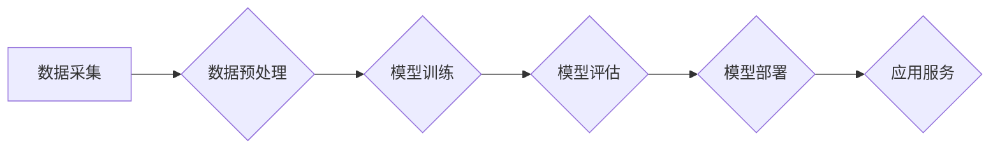

> 人工智能大模型，创业指南，深度学习，Transformer，模型训练，应用场景，商业化

## 1. 背景介绍

人工智能（AI）技术近年来发展迅速，特别是深度学习领域取得了突破性进展。其中，大模型（Large Model）作为深度学习的重要分支，凭借其强大的学习能力和泛化能力，在自然语言处理、计算机视觉、语音识别等领域展现出巨大的潜力。

大模型的出现，为人工智能的商业化应用提供了新的机遇。越来越多的创业公司涌入这个领域，希望利用大模型技术开发出具有商业价值的产品和服务。然而，创业者在开发和商业化大模型时，需要面对许多挑战，例如模型训练成本高、数据获取困难、模型部署复杂等。

本指南旨在为创业者提供一个全面的框架，帮助他们理解大模型的原理、技术、应用场景以及商业化策略，并成功地将大模型技术转化为商业价值。

## 2. 核心概念与联系

### 2.1 大模型的概念

大模型是指参数量达到数百万、数十亿甚至千亿级别的深度学习模型。这些模型通过训练海量数据，学习到复杂的模式和知识，从而能够在各种任务中表现出强大的能力。

### 2.2 核心技术

大模型的训练和应用依赖于以下核心技术：

* **深度学习:** 深度学习是一种机器学习的子领域，利用多层神经网络来模拟人类大脑的学习过程。
* **Transformer:** Transformer是一种新型的神经网络架构，能够有效地处理序列数据，例如文本和语音。它在自然语言处理领域取得了突破性的进展，成为大模型的核心技术之一。
* **分布式训练:** 由于大模型的参数量巨大，需要大量的计算资源进行训练。分布式训练技术将模型的训练任务分解到多个机器上进行并行计算，从而大幅提高训练效率。

### 2.3 架构图



## 3. 核心算法原理 & 具体操作步骤

### 3.1 算法原理概述

Transformer模型的核心是**自注意力机制**（Self-Attention）。自注意力机制能够学习到输入序列中不同元素之间的关系，从而更好地理解上下文信息。

### 3.2 算法步骤详解

1. **输入嵌入:** 将输入序列中的每个单词或子词转换为向量表示，称为词嵌入。
2. **多头自注意力:** 对词嵌入进行多头自注意力计算，学习到每个词与其他词之间的关系。
3. **前馈神经网络:** 对自注意力输出进行前馈神经网络处理，进一步提取特征。
4. **位置编码:** 添加位置编码，使模型能够理解词序信息。
5. **输出层:** 将模型输出转换为目标序列的预测结果。

### 3.3 算法优缺点

**优点:**

* 能够有效地处理长序列数据。
* 学习到的上下文信息更丰富。
* 在自然语言处理任务中取得了优异的性能。

**缺点:**

* 计算复杂度较高。
* 训练数据量要求较高。

### 3.4 算法应用领域

* **自然语言理解:** 文本分类、情感分析、问答系统等。
* **机器翻译:** 自动翻译不同语言的文本。
* **文本生成:** 自动写作、对话系统等。
* **代码生成:** 自动生成代码。

## 4. 数学模型和公式 & 详细讲解 & 举例说明

### 4.1 数学模型构建

Transformer模型的数学模型主要包括以下几个部分：

* **词嵌入层:** 将每个词转换为向量表示。
* **多头自注意力层:** 计算每个词与其他词之间的关系。
* **前馈神经网络层:** 进一步提取特征。
* **位置编码层:** 添加位置信息。
* **输出层:** 将模型输出转换为目标序列的预测结果。

### 4.2 公式推导过程

**自注意力机制:**

$$
Attention(Q, K, V) = \frac{exp(Q \cdot K^T / \sqrt{d_k})}{exp(Q \cdot K^T / \sqrt{d_k})} \cdot V
$$

其中：

* $Q$：查询矩阵
* $K$：键矩阵
* $V$：值矩阵
* $d_k$：键向量的维度

**多头自注意力:**

$$
MultiHead(Q, K, V) = Concat(head_1, head_2, ..., head_h) \cdot W_o
$$

其中：

* $head_i$：第 $i$ 个注意力头的输出
* $h$：注意力头的数量
* $W_o$：最终输出层的权重矩阵

### 4.3 案例分析与讲解

**文本分类:**

假设我们有一个文本分类任务，需要将文本分类为正类或负类。我们可以使用Transformer模型进行训练，将文本序列作为输入，模型输出一个概率值，表示文本属于正类的概率。

**代码生成:**

我们可以使用Transformer模型进行代码生成，将自然语言描述作为输入，模型输出相应的代码。

## 5. 项目实践：代码实例和详细解释说明

### 5.1 开发环境搭建

* **操作系统:** Linux
* **编程语言:** Python
* **深度学习框架:** TensorFlow 或 PyTorch
* **硬件环境:** GPU

### 5.2 源代码详细实现

```python
# 使用 TensorFlow 实现一个简单的 Transformer 模型

import tensorflow as tf

# 定义词嵌入层
embedding_layer = tf.keras.layers.Embedding(vocab_size, embedding_dim)

# 定义多头自注意力层
multi_head_attention_layer = tf.keras.layers.MultiHeadAttention(num_heads=8, key_dim=64)

# 定义前馈神经网络层
ffn_layer = tf.keras.layers.Dense(units=128, activation='relu')

# 定义 Transformer 模型
model = tf.keras.Sequential([
    embedding_layer,
    multi_head_attention_layer,
    ffn_layer,
])

# 编译模型
model.compile(optimizer='adam', loss='mse')

# 训练模型
model.fit(x_train, y_train, epochs=10)
```

### 5.3 代码解读与分析

* **词嵌入层:** 将每个词转换为向量表示。
* **多头自注意力层:** 计算每个词与其他词之间的关系。
* **前馈神经网络层:** 进一步提取特征。
* **模型编译:** 使用 Adam 优化器和均方误差损失函数编译模型。
* **模型训练:** 使用训练数据训练模型。

### 5.4 运行结果展示

训练完成后，我们可以使用测试数据评估模型的性能。

## 6. 实际应用场景

### 6.1 自然语言处理

* **机器翻译:** 将文本从一种语言翻译成另一种语言。
* **文本摘要:** 自动生成文本的摘要。
* **问答系统:** 回答用户提出的问题。

### 6.2 计算机视觉

* **图像分类:** 将图像分类为不同的类别。
* **目标检测:** 在图像中检测到特定目标。
* **图像生成:** 生成新的图像。

### 6.3 语音识别

* **语音转文本:** 将语音转换为文本。
* **语音助手:** 理解用户的语音指令并执行相应的操作。

### 6.4 未来应用展望

* **个性化教育:** 根据学生的学习情况提供个性化的学习内容和辅导。
* **医疗诊断:** 辅助医生进行疾病诊断和治疗方案制定。
* **自动驾驶:** 帮助车辆理解周围环境并做出决策。

## 7. 工具和资源推荐

### 7.1 学习资源推荐

* **书籍:**
    * 《深度学习》
    * 《自然语言处理》
* **在线课程:**
    * Coursera
    * edX
* **博客:**
    * TensorFlow Blog
    * PyTorch Blog

### 7.2 开发工具推荐

* **深度学习框架:** TensorFlow, PyTorch
* **编程语言:** Python
* **云计算平台:** AWS, Google Cloud, Azure

### 7.3 相关论文推荐

* **Attention Is All You Need:** https://arxiv.org/abs/1706.03762
* **BERT: Pre-training of Deep Bidirectional Transformers for Language Understanding:** https://arxiv.org/abs/1810.04805

## 8. 总结：未来发展趋势与挑战

### 8.1 研究成果总结

近年来，大模型技术取得了显著进展，在各种应用领域展现出巨大的潜力。

### 8.2 未来发展趋势

* **模型规模继续扩大:** 模型参数量将继续增加，从而提升模型的性能。
* **模型训练效率提升:** 研究人员将继续探索新的训练方法，提高模型训练效率。
* **模型应用场景拓展:** 大模型将应用于更多领域，例如医疗、教育、金融等。

### 8.3 面临的挑战

* **数据获取困难:** 大模型的训练需要海量数据，而获取高质量数据仍然是一个挑战。
* **模型训练成本高:** 大模型的训练成本很高，需要大量的计算资源。
* **模型解释性差:** 大模型的决策过程难以解释，这限制了其在一些敏感领域的应用。

### 8.4 研究展望

未来，大模型技术将继续发展，并解决当前面临的挑战。研究人员将继续探索新的模型架构、训练方法和应用场景，推动大模型技术向更广泛领域普及。

## 9. 附录：常见问题与解答

### 9.1 如何选择合适的模型架构？

选择合适的模型架构取决于具体的应用场景和数据特点。

### 9.2 如何解决过拟合问题？

可以使用正则化技术、数据增强和交叉验证等方法来解决过拟合问题。

### 9.3 如何评估模型性能？

可以使用准确率、召回率、F1-score等指标来评估模型性能。

作者：禅与计算机程序设计艺术 / Zen and the Art of Computer Programming


<end_of_turn>