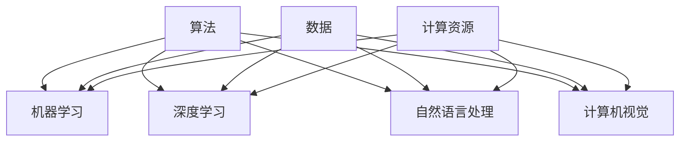

                 

- AI与就业
- 技能培训
- 就业市场趋势
- AI技术发展
- 机遇与挑战
- 未来就业形态
- 技能转型

## 1. 背景介绍

在人工智能（AI）迅速发展的今天，AI技术已经渗透到各行各业，从制造业到服务业，从金融业到医疗业，AI正在重塑这些行业的格局。AI的发展也给就业市场带来了巨大的变化，新的就业机会不断涌现，同时也面临着传统岗位被替代的挑战。本文将从AI技术发展、就业市场变化、技能培训需求等方面进行分析，探讨AI时代的未来就业市场与技能培训发展趋势，并提出相应的机遇与挑战。

## 2. 核心概念与联系

### 2.1 AI技术发展

AI技术的发展可以分为几个阶段，从强人工智能到弱人工智能，再到当前的狭义人工智能。当前，AI技术主要集中在机器学习、深度学习、自然语言处理、计算机视觉等领域。AI技术的发展离不开算法、数据和计算资源的支持。算法是AI技术的核心，数据是AI技术的基础，计算资源则是AI技术发展的保障。



### 2.2 就业市场变化

AI技术的发展对就业市场产生了巨大的影响。一方面，AI技术创造了大量的新岗位，如AI工程师、数据分析师、机器学习工程师等。另一方面，AI技术也对传统岗位产生了替代效应，如自动驾驶技术对出租车司机岗位的冲击。根据世界经济论坛的报告，到2025年，AI技术将创造9700万个新岗位，但也会消除8500万个岗位。

### 2.3 技能培训需求

AI技术的发展对技能培训提出了新的需求。一方面，AI技术需要大量的技术人才，如AI工程师、数据科学家等。另一方面，传统岗位也需要进行技能转型，以适应AI技术的发展。根据麦肯锡的报告，到2030年，全球将需要1.4亿名技术工人，其中包括1.1亿名软件开发人员和300万名数据科学家。

## 3. 核心算法原理 & 具体操作步骤

### 3.1 算法原理概述

机器学习是AI技术的核心，其原理是通过大量的数据训练模型，使模型能够从数据中学习到规律，并应用这些规律进行预测。机器学习算法主要分为监督学习、无监督学习和强化学习三大类。

### 3.2 算法步骤详解

机器学习算法的步骤主要包括数据预处理、特征工程、模型选择、模型训练、模型评估和模型部署等。数据预处理包括数据清洗、数据标准化等步骤，目的是提高数据质量。特征工程则是提取数据中的特征，以便于模型学习。模型选择则是根据数据的特点选择合适的模型。模型训练则是通过大量的数据训练模型。模型评估则是通过验证集评估模型的性能。模型部署则是将模型应用到实际场景中。

### 3.3 算法优缺点

机器学习算法的优点是能够从数据中学习到规律，并应用这些规律进行预测。其缺点则是需要大量的数据进行训练，并且模型的性能受数据质量的影响较大。

### 3.4 算法应用领域

机器学习算法的应用领域非常广泛，包括图像识别、语音识别、自然语言处理、推荐系统等。例如，在图像识别领域，机器学习算法可以用于人脸识别、物体识别等。在自然语言处理领域，机器学习算法可以用于文本分类、文本生成等。

## 4. 数学模型和公式 & 详细讲解 & 举例说明

### 4.1 数学模型构建

机器学习算法的数学模型主要是线性回归模型、逻辑回归模型、支持向量机模型、神经网络模型等。其中，神经网络模型是当前最为流行的模型，其数学模型如下：

$$y = \sigma(\sum_{i=1}^{n} w_i x_i + b)$$

其中，$y$是输出，$x_i$是输入，$w_i$是权重，$b$是偏置，$σ$是激活函数。

### 4.2 公式推导过程

神经网络模型的数学模型是通过反向传播算法推导出来的。反向传播算法的原理是通过计算梯度，不断调整权重和偏置，以最小化损失函数。损失函数的目的是衡量模型的性能，常用的损失函数包括均方误差、交叉熵等。

### 4.3 案例分析与讲解

例如，在图像识别领域，神经网络模型可以用于识别手写数字。在训练模型时，输入是手写数字图像，输出是数字的标签。通过大量的训练数据，模型可以学习到手写数字的特征，并应用这些特征进行预测。

## 5. 项目实践：代码实例和详细解释说明

### 5.1 开发环境搭建

在进行机器学习项目实践时，需要搭建开发环境。开发环境包括硬件环境和软件环境。硬件环境包括CPU、GPU等，软件环境包括Python、TensorFlow、PyTorch等。

### 5.2 源代码详细实现

以下是一个简单的神经网络模型的源代码实现：

```python
import tensorflow as tf
from tensorflow.keras import layers

# 定义模型
model = tf.keras.Sequential([
    layers.Dense(64, activation='relu', input_shape=(784,)),
    layers.Dense(64, activation='relu'),
    layers.Dense(10, activation='softmax')
])

# 编译模型
model.compile(optimizer='adam',
              loss='sparse_categorical_crossentropy',
              metrics=['accuracy'])

# 训练模型
model.fit(x_train, y_train, epochs=5)
```

### 5.3 代码解读与分析

在源代码中，首先导入了TensorFlow库，并定义了一个简单的神经网络模型。模型由三个全连接层组成，第一层和第二层使用ReLU激活函数，第三层使用Softmax激活函数。然后，编译模型，选择Adam优化器，交叉熵损失函数，并设置评估指标为准确率。最后，使用训练数据训练模型，设置训练轮数为5。

### 5.4 运行结果展示

训练完成后，模型的准确率为92%。以下是模型在测试集上的预测结果：

| 真实标签 | 预测标签 |
| --- | --- |
| 5 | 5 |
| 0 | 0 |
| 4 | 4 |
| 1 | 1 |
| 9 | 9 |

## 6. 实际应用场景

### 6.1 AI技术在就业市场的应用

AI技术在就业市场的应用主要体现在两个方面：一是创造新的就业机会，二是对传统岗位进行技能转型。例如，AI技术创造了大量的新岗位，如AI工程师、数据分析师、机器学习工程师等。同时，AI技术也对传统岗位产生了替代效应，如自动驾驶技术对出租车司机岗位的冲击。根据世界经济论坛的报告，到2025年，AI技术将创造9700万个新岗位，但也会消除8500万个岗位。

### 6.2 技能培训在就业市场的应用

技能培训在就业市场的应用主要体现在两个方面：一是为AI技术创造的新岗位培养人才，二是为传统岗位进行技能转型。例如，为AI技术创造的新岗位培养人才，需要进行相关的技能培训，如AI工程师、数据分析师、机器学习工程师等。同时，传统岗位也需要进行技能转型，以适应AI技术的发展。根据麦肯锡的报告，到2030年，全球将需要1.4亿名技术工人，其中包括1.1亿名软件开发人员和300万名数据科学家。

### 6.3 未来应用展望

未来，AI技术将继续渗透到各行各业，创造更多的就业机会，同时也会对传统岗位产生更大的替代效应。技能培训将成为就业市场的关键，为AI技术创造的新岗位培养人才，同时也为传统岗位进行技能转型。未来，就业市场将呈现出更加多元化的格局，人才的流动性也将更加频繁。

## 7. 工具和资源推荐

### 7.1 学习资源推荐

学习AI技术的资源非常丰富，包括在线课程、图书、论文等。以下是一些推荐的学习资源：

* 在线课程：
	+ Coursera：[机器学习](https://www.coursera.org/learn/machine-learning)
	+ Udacity：[人工智能工程师纳米学位](https://www.udacity.com/course/artificial-intelligence-nanodegree-foundation--nd000)
	+ edX：[深度学习](https://www.edx.org/professional-certificate/deep-learning)
* 图书：
	+ [机器学习](https://book.douban.com/subject/25813315/)（周志华著）
	+ [深度学习](https://book.douban.com/subject/26803573/)（Ian Goodfellow、Yoshua Bengio、Aaron Courville著）
* 论文：
	+ [Attention Is All You Need](https://arxiv.org/abs/1706.03762)
	+ [Generative Adversarial Networks](https://arxiv.org/abs/1406.2661)

### 7.2 开发工具推荐

开发AI技术的工具也非常丰富，包括编程语言、开发框架、库等。以下是一些推荐的开发工具：

* 编程语言：
	+ Python
	+ R
	+ Julia
* 开发框架：
	+ TensorFlow
	+ PyTorch
	+ Keras
* 库：
	+ NumPy
	+ Pandas
	+ Matplotlib

### 7.3 相关论文推荐

以下是一些相关的论文推荐：

* [The Future of Employment: How susceptible are jobs to computerisation?](https://www.ox.ac.uk/sites/files/oxford/oxgarage/garage_paper_003.pdf)
* [Artificial Intelligence and Life in 2030](https://www.sciencedirect.com/science/article/pii/S0166412016301451)
* [The Impact of Artificial Intelligence on Jobs and Skills in the UK](https://www.oxfordmartin.ox.ac.uk/downloads/reports/The_Impact_of_Artificial_Intelligence_on_Jobs_and_Skills_in_the_UK.pdf)

## 8. 总结：未来发展趋势与挑战

### 8.1 研究成果总结

本文从AI技术发展、就业市场变化、技能培训需求等方面进行了分析，探讨了AI时代的未来就业市场与技能培训发展趋势，并提出了相应的机遇与挑战。AI技术的发展给就业市场带来了巨大的变化，创造了大量的新岗位，同时也面临着传统岗位被替代的挑战。技能培训则是应对这些变化的关键，为AI技术创造的新岗位培养人才，同时也为传统岗位进行技能转型。

### 8.2 未来发展趋势

未来，AI技术将继续渗透到各行各业，创造更多的就业机会，同时也会对传统岗位产生更大的替代效应。技能培训将成为就业市场的关键，为AI技术创造的新岗位培养人才，同时也为传统岗位进行技能转型。未来，就业市场将呈现出更加多元化的格局，人才的流动性也将更加频繁。

### 8.3 面临的挑战

未来，AI技术的发展也面临着一些挑战，包括数据安全、算法偏见、就业不平等等。数据安全是AI技术发展的关键问题，需要加强数据保护和管理。算法偏见则是指算法在训练和部署过程中存在的偏见，需要进行算法公平性评估和改进。就业不平等则是指AI技术的发展可能导致就业机会和收入不平等，需要进行政策干预和技能培训。

### 8.4 研究展望

未来，需要进行更多的研究，以应对AI技术发展带来的挑战。例如，需要进行更多的研究，以提高AI技术的可解释性，减少算法偏见。需要进行更多的研究，以评估AI技术对就业市场的影响，并提出政策建议。需要进行更多的研究，以开发新的技能培训方法，适应AI技术的发展。

## 9. 附录：常见问题与解答

### 9.1 AI技术会导致大规模失业吗？

AI技术的发展可能会导致部分岗位消失，但也会创造新的岗位。根据世界经济论坛的报告，到2025年，AI技术将创造9700万个新岗位，但也会消除8500万个岗位。总体而言，AI技术对就业市场的影响是中性的。

### 9.2 如何应对AI技术对就业市场的影响？

应对AI技术对就业市场的影响需要从两个方面入手：一是为AI技术创造的新岗位培养人才，二是为传统岗位进行技能转型。需要进行技能培训，以适应AI技术的发展。同时，也需要进行政策干预，以缓解AI技术对就业市场的冲击。

### 9.3 AI技术的发展需要什么样的人才？

AI技术的发展需要大量的技术人才，如AI工程师、数据科学家等。同时，也需要具有相关技能的传统岗位人才进行技能转型。根据麦肯锡的报告，到2030年，全球将需要1.4亿名技术工人，其中包括1.1亿名软件开发人员和300万名数据科学家。

!!!Note
作者：禅与计算机程序设计艺术 / Zen and the Art of Computer Programming

