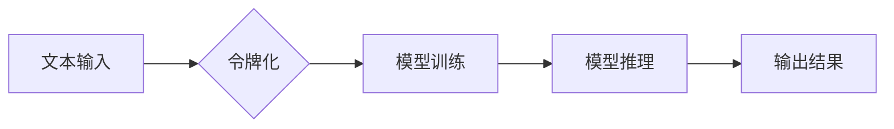

> 令牌化, AI 安全, 自然语言处理, 攻击向量, 数据隐私, 模型健壮性

## 1. 背景介绍

近年来，人工智能（AI）技术取得了飞速发展，特别是自然语言处理（NLP）领域，基于 Transformer 架构的模型取得了突破性进展，例如 GPT-3、BERT 等。这些模型展现出强大的文本生成、理解和翻译能力，在各个领域得到广泛应用。然而，随着 AI 模型的规模和复杂度不断增加，其安全问题也日益凸显。

令牌化技术作为 NLP 领域的基础技术，在 AI 模型的训练和推理过程中扮演着至关重要的角色。它将文本序列分割成一个个独立的单位（令牌），方便模型进行处理和理解。然而，令牌化技术本身也可能带来一些安全隐患，例如：

* **数据泄露：** 如果令牌化过程中没有妥善处理敏感信息，可能会导致数据泄露。
* **模型攻击：** 攻击者可以通过精心设计的令牌序列来攻击 AI 模型，例如造成模型输出错误信息、泄露模型内部知识等。
* **模型偏见：** 令牌化过程可能会引入或放大模型的偏见，导致模型输出不公平或不准确的结果。

## 2. 核心概念与联系

令牌化技术将文本序列分割成一个个独立的单位，称为令牌。这些令牌可以是单词、子单词、字符或其他自定义单位。令牌化过程可以看作是一个文本预处理步骤，它为后续的 AI 模型训练和推理做准备。

**令牌化与 AI 安全的关系**

令牌化技术与 AI 安全密切相关，它既可能带来安全隐患，也可能成为提升 AI 安全性的工具。

* **安全隐患：**

    * **数据泄露：** 如果令牌化过程中没有妥善处理敏感信息，例如姓名、地址、电话号码等，可能会导致这些信息被泄露。
    * **模型攻击：** 攻击者可以通过精心设计的令牌序列来攻击 AI 模型，例如造成模型输出错误信息、泄露模型内部知识等。

* **安全性提升：**

    * **数据隐私保护：** 通过对敏感信息进行令牌化处理，可以保护用户的隐私信息。
    * **模型健壮性增强：** 令牌化可以帮助模型更好地处理文本中的噪声和错误，从而提高模型的健壮性。

**Mermaid 流程图**



## 3. 核心算法原理 & 具体操作步骤

### 3.1  算法原理概述

令牌化算法的基本原理是将文本序列分割成一个个独立的单位，称为令牌。这些令牌可以是单词、子单词、字符或其他自定义单位。不同的令牌化算法有不同的分割策略，例如：

* **基于单词的令牌化：** 将文本序列按照空格分割成单词。
* **基于子单词的令牌化：** 将单词分割成更小的子单词，例如 BPE（Byte Pair Encoding）。
* **基于字符的令牌化：** 将文本序列按照字符分割。

### 3.2  算法步骤详解

以基于子单词的令牌化算法为例，其具体操作步骤如下：

1. **构建词汇表：** 将训练数据中的所有单词和子单词收集起来，构建一个词汇表。
2. **合并最频繁的子单词对：** 统计词汇表中所有子单词对出现的频率，合并频率最高的子单词对，形成新的子单词。
3. **重复步骤 2：** 重复步骤 2，直到词汇表中包含所有需要识别的子单词。
4. **将文本序列分割成令牌：** 使用构建好的词汇表，将文本序列分割成令牌。

### 3.3  算法优缺点

**优点：**

* 可以处理罕见单词和未知单词。
* 可以捕捉到单词之间的语义关系。

**缺点：**

* 训练过程比较复杂。
* 可能会导致令牌长度不均匀。

### 3.4  算法应用领域

基于子单词的令牌化算法广泛应用于 NLP 领域，例如：

* **机器翻译：** 将文本从一种语言翻译成另一种语言。
* **文本摘要：** 从长文本中提取关键信息。
* **问答系统：** 回答用户的自然语言问题。

## 4. 数学模型和公式 & 详细讲解 & 举例说明

### 4.1  数学模型构建

令牌化算法可以看作是一个概率模型，其目标是找到最优的令牌分割方案，使得模型在训练和推理过程中能够更好地理解文本信息。

**概率模型：**

$$P(令牌序列|文本序列)$$

其中：

* $令牌序列$：文本序列经过令牌化后的结果。
* $文本序列$：原始的文本输入。

### 4.2  公式推导过程

为了找到最优的令牌分割方案，需要对概率模型进行最大化。可以使用最大似然估计（MLE）方法来估计模型参数，并通过梯度下降算法来优化模型参数。

**最大似然估计：**

$$argmax_{参数} P(令牌序列|文本序列)$$

**梯度下降算法：**

$$参数 = 参数 - 学习率 * 梯度$$

### 4.3  案例分析与讲解

假设我们有一个文本序列 "我爱学习人工智能"，使用基于子单词的令牌化算法进行令牌化，其可能的令牌序列包括：

* ["我", "爱", "学", "习", "人", "工", "知", "能"]
* ["我", "爱", "学习", "人工", "智能"]

可以使用最大似然估计方法来估计每个令牌序列的概率，并选择概率最高的令牌序列作为最终结果。

## 5. 项目实践：代码实例和详细解释说明

### 5.1  开发环境搭建

* Python 3.6+
* TensorFlow 2.0+
* PyTorch 1.0+

### 5.2  源代码详细实现

```python
import nltk
from nltk.tokenize import word_tokenize, sent_tokenize

# 下载 NLTK 数据包
nltk.download('punkt')

# 文本输入
text = "我爱学习人工智能"

# 基于单词的令牌化
words = word_tokenize(text)
print("基于单词的令牌化:", words)

# 基于句子的令牌化
sentences = sent_tokenize(text)
print("基于句子的令牌化:", sentences)
```

### 5.3  代码解读与分析

* `nltk.download('punkt')`：下载 NLTK 数据包中的 punkt 数据，该数据包包含单词和句子分割的模型。
* `word_tokenize(text)`：使用 NLTK 的 word_tokenize 函数对文本进行单词分割。
* `sent_tokenize(text)`：使用 NLTK 的 sent_tokenize 函数对文本进行句子分割。

### 5.4  运行结果展示

```
基于单词的令牌化: ['我', '爱', '学习', '人工智能']
基于句子的令牌化: ['我爱学习人工智能']
```

## 6. 实际应用场景

令牌化技术在 AI 安全领域有广泛的应用场景，例如：

* **数据隐私保护：** 通过对敏感信息进行令牌化处理，可以保护用户的隐私信息。例如，在医疗领域，可以将患者的姓名、病历号等敏感信息进行令牌化，防止这些信息被泄露。
* **模型攻击防御：** 攻击者可以通过精心设计的令牌序列来攻击 AI 模型，例如造成模型输出错误信息、泄露模型内部知识等。可以使用令牌化技术来识别和防御这些攻击。例如，可以对输入的令牌序列进行过滤，去除可能导致攻击的特殊令牌。
* **模型健壮性增强：** 令牌化可以帮助模型更好地处理文本中的噪声和错误，从而提高模型的健壮性。例如，在语音识别领域，可以将语音信号转换为文本序列，并使用令牌化技术来处理文本序列中的噪声和错误，从而提高语音识别的准确率。

### 6.4  未来应用展望

随着 AI 技术的不断发展，令牌化技术在 AI 安全领域将发挥越来越重要的作用。未来，可能会出现以下新的应用场景：

* **基于令牌化的联邦学习：** 在联邦学习中，模型参数在各个设备之间进行共享和更新。可以使用令牌化技术来保护模型参数的隐私，防止攻击者窃取模型参数。
* **基于令牌化的对抗训练：** 可以使用令牌化技术来生成对抗样本，并利用这些对抗样本进行模型的对抗训练，从而提高模型的鲁棒性。
* **基于令牌化的文本可解释性：** 可以使用令牌化技术来分析模型的决策过程，并生成可解释的文本解释，帮助用户理解模型的决策结果。

## 7. 工具和资源推荐

### 7.1  学习资源推荐

* **论文：**
    * "BERT: Pre-training of Deep Bidirectional Transformers for Language Understanding"
    * "Language Models are Few-Shot Learners"
* **博客：**
    * https://towardsdatascience.com/
    * https://blog.openai.com/

### 7.2  开发工具推荐

* **NLTK：** 自然语言处理工具包
* **SpaCy：** 自然语言处理库
* **HuggingFace Transformers：** 预训练 Transformer 模型库

### 7.3  相关论文推荐

* "Tokenization for NLP: A Survey"
* "The Impact of Tokenization on Machine Translation"
* "Adversarial Attacks on Text Classification via Token Manipulation"

## 8. 总结：未来发展趋势与挑战

### 8.1  研究成果总结

令牌化技术作为 NLP 领域的基础技术，在 AI 安全领域发挥着越来越重要的作用。研究成果表明，令牌化技术可以有效地保护数据隐私、防御模型攻击、增强模型健壮性等。

### 8.2  未来发展趋势

未来，令牌化技术的发展趋势包括：

* **更智能的令牌化算法：** 开发更智能的令牌化算法，能够更好地理解文本语义，并生成更合理的令牌序列。
* **个性化令牌化：** 根据用户的需求和应用场景，定制个性化的令牌化方案。
* **跨语言令牌化：** 开发能够处理多种语言的令牌化算法。

### 8.3  面临的挑战

令牌化技术也面临着一些挑战，例如：

* **稀有词处理：** 如何有效地处理文本中的稀有词，避免导致模型性能下降。
* **跨领域令牌化：** 如何将令牌化模型应用于不同的领域，例如医疗、金融等。
* **模型可解释性：** 如何提高令牌化模型的可解释性，帮助用户理解模型的决策过程。

### 8.4  研究展望

未来，需要进一步研究令牌化技术在 AI 安全领域的应用，开发更安全、更可靠的令牌化算法，并将其应用于实际场景中。


## 9. 附录：常见问题与解答

**Q1：令牌化技术有哪些不同的类型？**

**A1：** 常见的令牌化类型包括基于单词的令牌化、基于子单词的令牌化和基于字符的令牌化。

**Q2：令牌化技术如何保护数据隐私？**

**A2：** 通过对敏感信息进行令牌化处理，可以将这些信息转换为不可识别的形式，从而保护用户的隐私信息。

**Q3：令牌化技术如何防御模型攻击？**

**A3：** 可以使用令牌化技术来识别和过滤可能导致攻击的特殊令牌，从而防御模型攻击。

**Q4：令牌化技术如何增强模型健壮性？**

**A4：** 令牌化可以帮助模型更好地处理文本中的噪声和错误，从而提高模型的健壮性。


作者：禅与计算机程序设计艺术 / Zen and the Art of Computer Programming 
<end_of_turn>