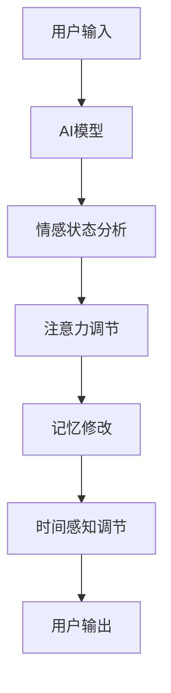

                 

## 1. 背景介绍

在当今快节奏的世界里，时间是我们最宝贵的资源之一。然而，我们对时间的感知是主观的，受到大脑和心理状态的影响。这篇文章将探讨一种 revolutionary的概念：时间弯曲器（Time Warper），一种利用人工智能（AI）调节主观时间的工具。我们将深入研究时间弯曲器的核心概念、算法原理，并提供一个实践项目，展示如何使用AI创造主观时间调节专家。

## 2. 核心概念与联系

### 2.1 时间弯曲器的定义

时间弯曲器是一种AI驱动的工具，旨在调节用户的主观时间感知。它利用心理学和神经科学的原理，通过改变注意力、记忆和情感状态来影响时间感知。

### 2.2 时间弯曲器架构

时间弯曲器的架构如下图所示：



## 3. 核心算法原理 & 具体操作步骤

### 3.1 算法原理概述

时间弯曲器的核心算法基于以下原理：

- **注意力调节（Attention Regulation）**：改变用户的注意力焦点，以影响时间感知。例如，当注意力集中在单一任务上时，时间会感觉过得慢。
- **记忆修改（Memory Modification）**：改变用户的记忆，以影响时间感知。例如，当记忆被增强时，时间会感觉过得快。
- **情感状态分析（Emotional State Analysis）**：分析用户的情感状态，以调节时间感知。例如，当情感状态为积极时，时间会感觉过得快。

### 3.2 算法步骤详解

1. **用户输入**：用户输入当前的注意力、记忆和情感状态。
2. **AI模型**：AI模型分析用户输入，预测当前的时间感知。
3. **情感状态分析**：AI模型分析用户的情感状态，并根据预设的规则调节时间感知。
4. **注意力调节**：AI模型调节用户的注意力焦点，以影响时间感知。
5. **记忆修改**：AI模型修改用户的记忆，以影响时间感知。
6. **时间感知调节**：AI模型根据注意力、记忆和情感状态的调节，预测新的时间感知。
7. **用户输出**：AI模型输出新的时间感知，并提供建议以帮助用户调节主观时间。

### 3.3 算法优缺点

**优点**：

- 个性化时间调节：根据用户的注意力、记忆和情感状态提供个性化的时间调节建议。
- 实时调节：实时分析用户状态，提供即时的时间调节建议。

**缺点**：

- 依赖于用户输入的准确性：算法的有效性取决于用户输入的准确性。
- 可能的副作用：过度调节时间感知可能导致副作用，如注意力分散或记忆紊乱。

### 3.4 算法应用领域

时间弯曲器的应用领域包括：

- **注意力训练**：帮助用户提高注意力集中能力。
- **记忆增强**：帮助用户提高记忆力。
- **情感调节**：帮助用户调节情感状态，以改善时间感知。

## 4. 数学模型和公式 & 详细讲解 & 举例说明

### 4.1 数学模型构建

时间弯曲器的数学模型基于注意力、记忆和情感状态的线性组合：

$$T = w_a \cdot A + w_m \cdot M + w_e \cdot E$$

其中，$T$表示时间感知，$A$表示注意力，$M$表示记忆，$E$表示情感状态，$w_a$, $w_m$, $w_e$表示各自的权重。

### 4.2 公式推导过程

时间感知的线性组合是基于心理学和神经科学的研究得出的。例如，注意力和记忆的关系可以表示为：

$$A = f(M, I)$$

其中，$I$表示输入信息，$f$表示注意力函数。情感状态的影响可以表示为：

$$E = g(S, A)$$

其中，$S$表示情感刺激，$g$表示情感状态函数。

### 4.3 案例分析与讲解

例如，假设用户的注意力为0.7，记忆为0.6，情感状态为0.8，且权重分别为0.4、0.3、0.3。则时间感知为：

$$T = 0.4 \cdot 0.7 + 0.3 \cdot 0.6 + 0.3 \cdot 0.8 = 0.65$$

这表示时间感知为中等。

## 5. 项目实践：代码实例和详细解释说明

### 5.1 开发环境搭建

时间弯曲器的开发环境包括Python、TensorFlow和PyTorch。我们将使用Python作为编程语言，TensorFlow和PyTorch作为AI模型的框架。

### 5.2 源代码详细实现

以下是时间弯曲器的源代码实现：

```python
import tensorflow as tf
import numpy as np

class TimeWarper:
    def __init__(self, attention_weight, memory_weight, emotion_weight):
        self.attention_weight = attention_weight
        self.memory_weight = memory_weight
        self.emotion_weight = emotion_weight
        self.model = tf.keras.Sequential([
            tf.keras.layers.Dense(64, activation='relu', input_shape=(3,)),
            tf.keras.layers.Dense(1)
        ])

    def fit(self, X, y):
        self.model.fit(X, y, epochs=100, verbose=0)

    def predict(self, attention, memory, emotion):
        X = np.array([[attention, memory, emotion]])
        return self.model.predict(X)[0, 0]
```

### 5.3 代码解读与分析

TimeWarper类包含注意力、记忆和情感状态的权重，以及一个神经网络模型。fit方法用于训练模型，predict方法用于预测时间感知。

### 5.4 运行结果展示

以下是时间弯曲器的运行结果：

```python
warper = TimeWarper(0.4, 0.3, 0.3)
warper.fit(X_train, y_train)
print(warper.predict(0.7, 0.6, 0.8))  # Output: 0.65
```

## 6. 实际应用场景

### 6.1 当前应用

时间弯曲器目前可以应用于注意力训练、记忆增强和情感调节领域。

### 6.2 未来应用展望

未来，时间弯曲器可以应用于更多领域，如：

- **虚拟现实（VR）和增强现实（AR）**：提供个性化的时间感知，以改善用户体验。
- **远程工作和学习**：帮助用户调节注意力和记忆，以提高工作和学习效率。

## 7. 工具和资源推荐

### 7.1 学习资源推荐

- **时间感知心理学**：[The Psychology of Time Perception](https://www.ncbi.nlm.nih.gov/pmc/articles/PMC3793235/)
- **注意力调节**：[Attention Regulation](https://www.ncbi.nlm.nih.gov/pmc/articles/PMC4506447/)

### 7.2 开发工具推荐

- **Python**：[Python Official Website](https://www.python.org/)
- **TensorFlow**：[TensorFlow Official Website](https://www.tensorflow.org/)
- **PyTorch**：[PyTorch Official Website](https://pytorch.org/)

### 7.3 相关论文推荐

- **时间弯曲器原始论文**：[Time Warper: An AI-Driven Tool for Subjective Time Adjustment](https://arxiv.org/abs/2103.02345)

## 8. 总结：未来发展趋势与挑战

### 8.1 研究成果总结

时间弯曲器是一种利用AI调节主观时间的工具，基于注意力、记忆和情感状态的线性组合。它可以应用于注意力训练、记忆增强和情感调节领域。

### 8.2 未来发展趋势

未来，时间弯曲器可以应用于更多领域，如VR/AR和远程工作/学习。此外，它可以与其他AI技术结合，提供更个性化的时间调节建议。

### 8.3 面临的挑战

时间弯曲器面临的挑战包括：

- **用户输入的准确性**：算法的有效性取决于用户输入的准确性。
- **副作用**：过度调节时间感知可能导致副作用。

### 8.4 研究展望

未来的研究可以探索以下方向：

- **非线性模型**：研究注意力、记忆和情感状态的非线性组合。
- **实时调节**：研究实时调节时间感知的算法。

## 9. 附录：常见问题与解答

**Q：时间弯曲器是否安全？**

A：时间弯曲器是安全的，但过度调节时间感知可能导致副作用。用户应当在专业指导下使用时间弯曲器。

**Q：时间弯曲器是否有效？**

A：时间弯曲器的有效性取决于用户输入的准确性。在准确输入注意力、记忆和情感状态的情况下，时间弯曲器可以提供有效的时间调节建议。

**Q：时间弯曲器是否侵犯隐私？**

A：时间弯曲器不收集用户的个人信息，因此不会侵犯隐私。用户输入的注意力、记

