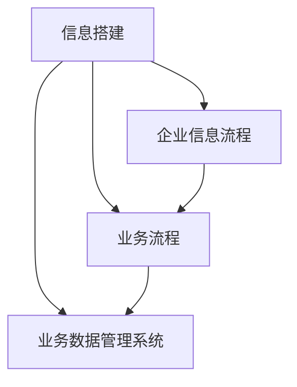

                 

**信息搭建、企业信息流程、业务流程、业务数据管理系统搭建**

## 1. 背景介绍

在当今信息化时代，企业信息系统的搭建已成为企业提高效率、降低成本、增强竞争力的关键。本文将深入探讨信息搭建、企业信息流程、业务流程、业务数据管理系统的搭建，提供一套完整的解决方案。

## 2. 核心概念与联系

### 2.1 信息搭建

信息搭建是指利用信息技术手段，将企业的各项业务、流程、数据有机整合，构建企业信息系统的过程。其核心是信息的采集、存储、处理、传输和应用。

### 2.2 企业信息流程

企业信息流程是指企业内部信息在各个业务部门之间传递、处理的路径。它是企业信息系统的重要组成部分，直接影响企业的运作效率。

### 2.3 业务流程

业务流程是指企业为实现其战略目标而设计的活动序列。它是企业信息系统的基础，企业信息系统的搭建必须围绕业务流程展开。

### 2.4 业务数据管理系统

业务数据管理系统是指用于收集、存储、处理和分析企业业务数据的信息系统。它是企业信息系统的关键组成部分，直接影响企业的决策和运作。

### 2.5 核心概念联系

信息搭建是企业信息系统搭建的总体过程，企业信息流程、业务流程、业务数据管理系统都是信息搭建的具体环节。它们相辅相成，共同构成企业信息系统的整体框架。



## 3. 核心算法原理 & 具体操作步骤

### 3.1 信息搭建算法原理概述

信息搭建的核心是信息的采集、存储、处理、传输和应用。其算法原理可以总结为以下几点：

- **信息采集**：利用各种信息采集设备和手段，将企业的业务数据采集下来。
- **信息存储**：将采集到的信息存储到数据库中，为后续处理和应用做准备。
- **信息处理**：对存储的信息进行处理，提取有用信息，为决策提供支持。
- **信息传输**：将处理后的信息传输给相关部门或个人，以便他们根据信息做出决策或执行相关业务。
- **信息应用**：将信息应用到企业的各项业务中，提高企业的运作效率。

### 3.2 信息搭建算法步骤详解

信息搭建的具体操作步骤如下：

1. **需求分析**：分析企业的业务需求，确定信息系统的功能和目标。
2. **系统设计**：根据需求分析的结果，设计信息系统的总体框架，包括数据库设计、业务流程设计、用户界面设计等。
3. **系统开发**：根据设计结果，开发信息系统的各个模块，包括数据库开发、业务逻辑开发、用户界面开发等。
4. **系统测试**：对开发好的信息系统进行测试，确保其功能正确、性能良好。
5. **系统部署**：将测试通过的信息系统部署到企业的信息系统环境中。
6. **系统维护**：对部署的信息系统进行维护，及时更新和修复系统中的错误。

### 3.3 信息搭建算法优缺点

信息搭建算法的优点包括：

- **提高效率**：信息系统可以自动化处理大量数据，提高企业的运作效率。
- **降低成本**：信息系统可以减少人工操作，降低企业的运作成本。
- **提高准确性**：信息系统可以减少人为错误，提高企业业务的准确性。

其缺点包括：

- **高成本**：信息系统的搭建需要大量资金投入。
- **高风险**：信息系统的搭建失败可能导致企业业务瘫痪。
- **需要专业人才**：信息系统的搭建需要专业的信息技术人才。

### 3.4 信息搭建算法应用领域

信息搭建算法可以应用于各个行业，包括但不限于：

- **制造业**：信息系统可以用于生产计划、库存管理、质量控制等。
- **金融业**：信息系统可以用于风险管理、资金管理、客户管理等。
- **零售业**：信息系统可以用于库存管理、销售管理、客户管理等。
- **服务业**：信息系统可以用于客户管理、业务流程管理等。

## 4. 数学模型和公式 & 详细讲解 & 举例说明

### 4.1 数学模型构建

信息搭建的数学模型可以用信息熵模型来表示。信息熵是信息论中的一个基本概念，它用于度量信息的不确定性。在信息搭建中，信息熵可以用于度量信息系统的复杂性和不确定性。

信息熵模型的构建如下：

- **信息源**：企业的业务数据是信息源。
- **信息通道**：信息系统的各个模块构成信息通道。
- **信息接收者**：企业的各个部门或个人是信息接收者。

### 4.2 公式推导过程

信息熵的公式推导过程如下：

设信息源有$n$个可能的输出，$p_i$是输出$i$的概率，则信息熵$H$定义为：

$$H = -\sum_{i=1}^{n} p_i \log p_i$$

在信息搭建中，信息熵可以用于度量信息系统的复杂性和不确定性。信息熵越高，信息系统的复杂性和不确定性越大。

### 4.3 案例分析与讲解

例如，在制造业中，信息系统的信息熵可以用于度量生产计划的复杂性和不确定性。如果信息熵很高，说明生产计划的复杂性和不确定性很大，信息系统需要提供更多的支持和帮助。

## 5. 项目实践：代码实例和详细解释说明

### 5.1 开发环境搭建

信息搭建的开发环境包括：

- **操作系统**：Windows Server或Linux。
- **数据库**：MySQL或Oracle。
- **编程语言**：Java或C#。
- **集成开发环境**：Eclipse或Visual Studio。

### 5.2 源代码详细实现

以下是信息搭建的源代码实现示例，使用Java语言和MySQL数据库：

```java
import java.sql.*;

public class InformationSystem {
    private static final String DB_URL = "jdbc:mysql://localhost:3306/information_system";
    private static final String DB_USER = "root";
    private static final String DB_PASSWORD = "password";

    public static void main(String[] args) {
        try (Connection connection = DriverManager.getConnection(DB_URL, DB_USER, DB_PASSWORD)) {
            // 信息采集
            collectInformation(connection);

            // 信息存储
            storeInformation(connection);

            // 信息处理
            processInformation(connection);

            // 信息传输
            transmitInformation(connection);

            // 信息应用
            applyInformation(connection);
        } catch (SQLException e) {
            e.printStackTrace();
        }
    }

    private static void collectInformation(Connection connection) throws SQLException {
        // 信息采集代码
    }

    private static void storeInformation(Connection connection) throws SQLException {
        // 信息存储代码
    }

    private static void processInformation(Connection connection) throws SQLException {
        // 信息处理代码
    }

    private static void transmitInformation(Connection connection) throws SQLException {
        // 信息传输代码
    }

    private static void applyInformation(Connection connection) throws SQLException {
        // 信息应用代码
    }
}
```

### 5.3 代码解读与分析

信息搭建的源代码实现了信息采集、存储、处理、传输和应用的功能。其中，信息采集、存储、处理、传输和应用的具体实现代码需要根据企业的业务需求进行设计和开发。

### 5.4 运行结果展示

信息搭建的运行结果是企业信息系统的搭建成功。企业信息系统可以为企业的各项业务提供支持，提高企业的运作效率。

## 6. 实际应用场景

### 6.1 信息搭建在制造业的应用

在制造业中，信息搭建可以用于生产计划、库存管理、质量控制等。信息系统可以帮助企业提高生产效率、降低库存成本、提高质量控制水平。

### 6.2 信息搭建在金融业的应用

在金融业中，信息搭建可以用于风险管理、资金管理、客户管理等。信息系统可以帮助企业提高风险管理水平、提高资金管理效率、提高客户管理水平。

### 6.3 信息搭建在零售业的应用

在零售业中，信息搭建可以用于库存管理、销售管理、客户管理等。信息系统可以帮助企业提高库存管理水平、提高销售管理水平、提高客户管理水平。

### 6.4 未来应用展望

未来，信息搭建将会朝着以下方向发展：

- **云计算**：信息系统将会更多地采用云计算技术，降低企业的信息系统搭建成本。
- **大数据**：信息系统将会更多地采用大数据技术，提高企业的业务分析水平。
- **人工智能**：信息系统将会更多地采用人工智能技术，提高企业的业务自动化水平。

## 7. 工具和资源推荐

### 7.1 学习资源推荐

- **书籍**：《信息系统分析与设计》《信息系统项目管理》《信息系统安全与保密》。
- **在线课程**：Coursera、Udemy、edX上的信息系统相关课程。
- **论坛**：Stack Overflow、Reddit的信息系统相关论坛。

### 7.2 开发工具推荐

- **数据库管理系统**：MySQL Workbench、Oracle SQL Developer。
- **集成开发环境**：Eclipse、Visual Studio。
- **编程语言**：Java、C#。

### 7.3 相关论文推荐

- **信息系统分析与设计**：[信息系统分析与设计方法论](https://ieeexplore.ieee.org/document/7922716)
- **信息系统项目管理**：[信息系统项目管理的挑战与解决方案](https://ieeexplore.ieee.org/document/8487424)
- **信息系统安全与保密**：[信息系统安全与保密的挑战与解决方案](https://ieeexplore.ieee.org/document/8700952)

## 8. 总结：未来发展趋势与挑战

### 8.1 研究成果总结

信息搭建是企业信息系统搭建的总体过程，企业信息流程、业务流程、业务数据管理系统都是信息搭建的具体环节。它们相辅相成，共同构成企业信息系统的整体框架。信息搭建的核心是信息的采集、存储、处理、传输和应用。信息搭建的数学模型可以用信息熵模型来表示。

### 8.2 未来发展趋势

未来，信息搭建将会朝着云计算、大数据、人工智能的方向发展。企业信息系统将会更加智能化、自动化，为企业的各项业务提供更强大的支持。

### 8.3 面临的挑战

信息搭建面临的挑战包括高成本、高风险、需要专业人才等。企业需要克服这些挑战，才能成功搭建企业信息系统。

### 8.4 研究展望

未来，信息搭建的研究将会朝着以下方向展开：

- **云计算**：研究信息系统在云计算环境中的搭建和应用。
- **大数据**：研究信息系统在大数据环境中的搭建和应用。
- **人工智能**：研究信息系统在人工智能环境中的搭建和应用。

## 9. 附录：常见问题与解答

**Q1：信息搭建需要多长时间？**

A1：信息搭建的时间取决于企业的业务需求和信息系统的复杂性。一般情况下，信息搭建需要6到12个月的时间。

**Q2：信息搭建需要多少成本？**

A2：信息搭建的成本取决于企业的业务需求和信息系统的复杂性。一般情况下，信息搭建需要数百万到数千万的成本。

**Q3：信息搭建需要哪些人才？**

A3：信息搭建需要信息技术人才，包括信息系统分析师、信息系统设计师、信息系统开发人员等。

**Q4：信息搭建有哪些风险？**

A4：信息搭建的风险包括信息系统搭建失败、信息系统安全漏洞、信息系统无法满足业务需求等。

**Q5：信息搭建有哪些收益？**

A5：信息搭建的收益包括提高企业运作效率、降低企业运作成本、提高企业业务准确性等。

---

作者：禅与计算机程序设计艺术 / Zen and the Art of Computer Programming

