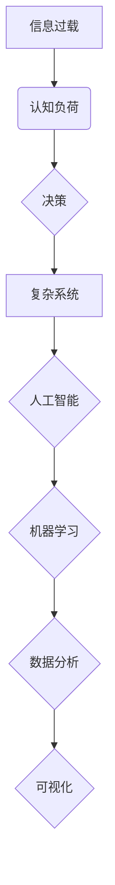

> 信息过载，认知负荷，决策，人工智能，机器学习，数据分析，复杂系统，可视化

## 1. 背景介绍

在当今信息爆炸的时代，我们每天都被海量的信息包围。从新闻推送到社交媒体，从电子邮件到各种应用程序，信息无处不在，无时不刻地冲击着我们的感官和认知。然而，并非所有信息都具有价值，很多信息都是重复、冗余或无关紧要的。这种信息过载现象导致我们面临着巨大的认知负荷，即处理和理解信息所带来的心理压力和负担。

认知负荷过高会严重影响我们的决策能力。当我们被大量信息淹没时，难以集中注意力，难以进行深入思考，难以做出理性的判断。这不仅会影响我们的个人生活，还会对工作、学习和社会发展造成负面影响。

## 2. 核心概念与联系

**2.1 信息过载**

信息过载是指在短时间内接收和处理的信息量超过个体认知能力的极限，导致个体难以有效地理解、记忆和利用信息。

**2.2 认知负荷**

认知负荷是指个体进行认知活动时所消耗的心理资源，包括注意力、记忆力和执行功能等。当认知负荷过高时，个体会感到疲劳、压力和焦虑，难以集中注意力和进行有效思考。

**2.3 决策**

决策是指在面对多个选择时，根据一定的标准和目标，选择最优方案的过程。

**2.4 复杂系统**

复杂系统是指由许多相互作用的个体或子系统组成的系统，其整体行为难以通过简单地分析其组成部分来预测。

**2.5 人工智能**

人工智能是指模拟人类智能的计算机系统，能够执行类似人类的认知任务，例如学习、推理、决策和语言理解。

**2.6 机器学习**

机器学习是人工智能的一个子领域，旨在通过算法训练模型，使模型能够从数据中学习并进行预测或分类。

**2.7 数据分析**

数据分析是指从数据中提取有价值的信息，并将其用于决策支持、问题解决和趋势预测。

**2.8 可视化**

可视化是指将数据以图形、图表等形式呈现，以帮助人们更好地理解和分析数据。

**2.9 关系图**

关系图是一种用于表示实体和它们之间关系的图形模型。



## 3. 核心算法原理 & 具体操作步骤

### 3.1 算法原理概述

为了应对信息过载和认知负荷带来的挑战，我们可以利用人工智能和机器学习算法来辅助决策。这些算法可以帮助我们从海量数据中提取关键信息，识别潜在的模式和趋势，并提供更准确、更有效的决策建议。

### 3.2 算法步骤详解

1. **数据收集和预处理:** 收集相关数据，并进行清洗、转换和格式化，以确保数据质量和算法的有效性。
2. **特征提取:** 从原始数据中提取具有代表性的特征，这些特征可以是文本、图像、音频或其他类型的数据。
3. **模型训练:** 使用机器学习算法对提取的特征进行训练，建立一个能够预测或分类的模型。
4. **模型评估:** 使用测试数据评估模型的性能，并根据评估结果进行模型调优。
5. **决策支持:** 将训练好的模型应用于实际场景，根据输入数据生成决策建议。

### 3.3 算法优缺点

**优点:**

* 自动化决策过程，提高效率和准确性。
* 能够处理海量数据，发现隐藏的模式和趋势。
* 提供数据驱动的决策建议，降低主观判断的风险。

**缺点:**

* 需要大量的数据进行训练，数据质量直接影响模型性能。
* 模型的解释性和透明度较低，难以理解模型的决策逻辑。
* 可能存在算法偏差，导致不公平或不准确的决策结果。

### 3.4 算法应用领域

* **金融领域:** 风险评估、欺诈检测、投资决策。
* **医疗领域:** 疾病诊断、药物研发、个性化治疗。
* **电商领域:** 商品推荐、客户画像、精准营销。
* **交通领域:** 交通流量预测、智能驾驶、路线规划。

## 4. 数学模型和公式 & 详细讲解 & 举例说明

### 4.1 数学模型构建

我们可以使用信息论和认知科学的理论来构建数学模型，描述信息过载和认知负荷之间的关系。

**信息熵:**

$$H(X) = - \sum_{i=1}^{n} p(x_i) \log_2 p(x_i)$$

其中，$X$ 是随机变量，$x_i$ 是 $X$ 的取值，$p(x_i)$ 是 $x_i$ 的概率。信息熵衡量了随机变量的不确定性，信息量越大，熵值越大。

**认知负荷:**

$$C(X) = f(H(X), W, T)$$

其中，$C(X)$ 是认知负荷，$H(X)$ 是信息熵，$W$ 是个体的认知能力，$T$ 是处理信息的时长。

### 4.2 公式推导过程

我们可以通过分析信息熵和认知负荷之间的关系，推导出一系列公式来描述信息过载和认知负荷的动态变化过程。例如，我们可以推导出一个关于信息过载对认知负荷影响的公式：

$$C(X) = C_0 + k \cdot H(X)$$

其中，$C_0$ 是个体在没有信息输入时的基础认知负荷，$k$ 是一个常数，表示信息熵对认知负荷的影响程度。

### 4.3 案例分析与讲解

假设一个个体在处理一组包含 10 个信息的文档时，信息熵为 3 bits，其认知能力为 10 units，处理时长为 10 minutes。根据上述公式，我们可以计算出该个体的认知负荷为：

$$C(X) = C_0 + k \cdot H(X) = C_0 + k \cdot 3$$

其中，$C_0$ 和 $k$ 的具体值取决于个体和任务的具体情况。

## 5. 项目实践：代码实例和详细解释说明

### 5.1 开发环境搭建

* 操作系统: Ubuntu 20.04
* Python 版本: 3.8
* 必要的库: numpy, pandas, scikit-learn, matplotlib

### 5.2 源代码详细实现

```python
import numpy as np
from sklearn.linear_model import LogisticRegression

# 数据加载和预处理
data = pd.read_csv('data.csv')
X = data[['feature1', 'feature2']]
y = data['target']

# 模型训练
model = LogisticRegression()
model.fit(X, y)

# 模型评估
accuracy = model.score(X, y)
print(f'模型准确率: {accuracy}')

# 决策支持
new_data = np.array([[0.5, 0.8]])
prediction = model.predict(new_data)
print(f'新数据的预测结果: {prediction}')
```

### 5.3 代码解读与分析

* 数据加载和预处理: 使用 pandas 库加载数据，并对数据进行清洗、转换和格式化。
* 模型训练: 使用 scikit-learn 库中的 LogisticRegression 模型对数据进行训练。
* 模型评估: 使用模型的 score 方法评估模型的准确率。
* 决策支持: 使用训练好的模型对新数据进行预测，并输出预测结果。

### 5.4 运行结果展示

运行上述代码后，会输出模型的准确率和对新数据的预测结果。

## 6. 实际应用场景

### 6.1 信息过滤

我们可以利用机器学习算法对电子邮件、社交媒体消息等信息进行过滤，识别并过滤掉无关紧要或垃圾信息，从而减轻信息过载的压力。

### 6.2 个性化推荐

我们可以根据用户的兴趣爱好和行为数据，利用机器学习算法进行个性化推荐，推荐用户感兴趣的内容，提高用户体验。

### 6.3 智能客服

我们可以利用自然语言处理和机器学习算法构建智能客服系统，自动回复用户常见问题，提高客服效率。

### 6.4 未来应用展望

随着人工智能技术的不断发展，信息过载和认知负荷问题将得到越来越多的关注和解决。未来，我们可以期待看到更多基于人工智能的解决方案，帮助人们更好地应对信息爆炸的时代。

## 7. 工具和资源推荐

### 7.1 学习资源推荐

* **书籍:**
    * 《深度学习》
    * 《机器学习实战》
    * 《人工智能：一种现代方法》
* **在线课程:**
    * Coursera: 深度学习
    * edX: 机器学习
    * Udacity: 人工智能工程师

### 7.2 开发工具推荐

* **Python:** 
    * scikit-learn
    * TensorFlow
    * PyTorch
* **数据可视化工具:**
    * matplotlib
    * seaborn
    * Tableau

### 7.3 相关论文推荐

* **信息过载:**
    * "Information Overload: A Review"
    * "The Impact of Information Overload on Decision Making"
* **认知负荷:**
    * "Cognitive Load Theory"
    * "The Effects of Cognitive Load on Learning"

## 8. 总结：未来发展趋势与挑战

### 8.1 研究成果总结

近年来，在信息过载和认知负荷领域取得了显著的进展。人工智能和机器学习算法为解决这些问题提供了新的思路和方法。

### 8.2 未来发展趋势

* **更精准的个性化推荐:** 利用更先进的机器学习算法，对用户的兴趣爱好和行为数据进行更精准的分析，提供更个性化的信息推荐。
* **更智能的决策支持系统:** 开发更智能的决策支持系统，能够根据用户的需求和上下文信息，提供更准确、更有效的决策建议。
* **更有效的认知负荷管理:** 研究更有效的认知负荷管理方法，帮助人们更好地应对信息过载带来的压力。

### 8.3 面临的挑战

* **数据隐私和安全:** 人工智能算法需要大量的数据进行训练，如何保护用户数据隐私和安全是一个重要的挑战。
* **算法解释性和透明度:** 许多机器学习算法的决策逻辑难以解释，如何提高算法的解释性和透明度是一个重要的研究方向。
* **伦理问题:** 人工智能技术的应用可能会带来一些伦理问题，例如算法偏见、就业替代等，需要认真思考和解决。

### 8.4 研究展望

未来，信息过载和认知负荷问题将继续受到关注和研究。随着人工智能技术的不断发展，我们相信能够开发出更有效的解决方案，帮助人们更好地应对信息爆炸的时代。

## 9. 附录：常见问题与解答

**Q1: 如何降低信息过载带来的压力？**

A1: 可以尝试以下方法：

* **过滤信息:** 使用邮件过滤器、社交媒体屏蔽等工具，过滤掉无关紧要的信息。
* **集中注意力:** 使用番茄工作法等时间管理技巧，集中注意力处理重要信息。
* **定期断网:** 定期断开网络连接，休息一下，让大脑得到放松。

**Q2: 如何提高认知负荷的处理能力？**

A2: 可以尝试以下方法：

* **锻炼大脑:** 通过阅读、学习、玩游戏等方式锻炼大脑，提高认知能力。
* **保证充足睡眠:** 睡眠不足会降低认知能力，保证充足的睡眠可以提高认知负荷的处理能力。
* **保持健康的生活方式:** 健康的生活方式可以提高身体和大脑的健康状况，从而提高认知负荷的处理能力。


作者：禅与计算机程序设计艺术 / Zen and the Art of Computer Programming 
<end_of_turn>