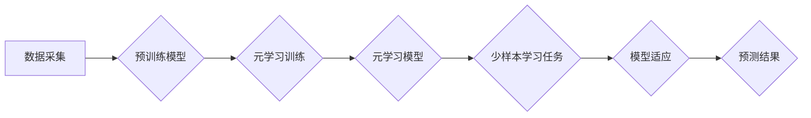

> 元学习，少样本学习，迁移学习，强化学习，深度学习，模型训练，代码实战

## 1. 背景介绍

在深度学习领域，模型训练通常需要海量的数据才能达到令人满意的性能。然而，获取大量标注数据往往成本高昂且耗时费力。为了解决这个问题，元学习和少样本学习应运而生。

元学习（Meta-Learning）是一种机器学习的范式，它旨在学习如何学习。换句话说，元学习算法的目标不是直接学习一个特定任务，而是学习一个能够快速适应新任务的学习策略。

少样本学习（Few-Shot Learning）则侧重于训练模型能够在极少样本数据下完成学习任务。它通过学习样本之间的关系和模式，从而能够泛化到新的、未见过的样本上。

元学习和少样本学习相辅相成，共同推动了深度学习在数据稀缺场景下的应用。

## 2. 核心概念与联系

元学习和少样本学习的核心概念和联系可以概括如下：

* **元学习:** 学习如何学习，通过学习多个任务的经验，提升模型在新的任务上的学习能力。
* **少样本学习:** 在极少样本数据下完成学习任务，通过学习样本之间的关系和模式，提升模型的泛化能力。

**元学习与少样本学习的联系:**

元学习可以看作是少样本学习的一种高级形式。元学习算法可以学习到一种通用的学习策略，这种策略能够帮助模型在极少样本数据下快速学习新的任务。

**元学习与少样本学习的流程图:**



## 3. 核心算法原理 & 具体操作步骤

### 3.1  算法原理概述

元学习算法的核心思想是学习一个能够快速适应新任务的学习策略。

常见的元学习算法包括：

* **Model-Agnostic Meta-Learning (MAML):** MAML是一种通用的元学习算法，它可以应用于各种类型的深度学习模型。MAML的目标是学习一个模型参数的初始值，使得模型能够在极少样本数据下快速适应新的任务。
* **Prototypical Networks:** Prototypical Networks是一种基于原型学习的元学习算法。它将每个类别的样本聚类成一个原型，然后在新的样本到来时，根据其与每个原型的距离进行分类。
* **Matching Networks:** Matching Networks是一种基于匹配学习的元学习算法。它通过学习样本之间的相似度来进行分类。

### 3.2  算法步骤详解

以MAML算法为例，其具体操作步骤如下：

1. **预训练:** 使用大量的标注数据预训练一个深度学习模型。
2. **元训练:** 使用少量样本数据进行元训练。元训练的目标是学习一个模型参数的初始值，使得模型能够在新的任务上快速适应。
3. **元测试:** 使用新的任务数据进行元测试。元测试的目标是评估模型在新的任务上的性能。

### 3.3  算法优缺点

**MAML算法的优点:**

* **通用性:** MAML可以应用于各种类型的深度学习模型。
* **效率:** MAML的元训练过程相对高效。

**MAML算法的缺点:**

* **数据依赖性:** MAML算法仍然依赖于大量的预训练数据。
* **参数量:** MAML算法的参数量较大。

### 3.4  算法应用领域

元学习和少样本学习在以下领域具有广泛的应用前景:

* **图像识别:** 在图像识别任务中，元学习和少样本学习可以帮助模型在极少样本数据下识别新的物体类别。
* **自然语言处理:** 在自然语言处理任务中，元学习和少样本学习可以帮助模型在极少样本数据下理解新的语言结构和语义。
* **机器人控制:** 在机器人控制任务中，元学习和少样本学习可以帮助机器人快速学习新的运动技能。

## 4. 数学模型和公式 & 详细讲解 & 举例说明

### 4.1  数学模型构建

MAML算法的目标是学习一个模型参数的初始值，使得模型能够在新的任务上快速适应。

假设我们有N个任务，每个任务包含K个样本。每个样本包含输入特征x和标签y。

MAML算法的目标函数可以表示为：

$$
L(\theta) = \frac{1}{N} \sum_{i=1}^{N} \mathcal{L}(\theta_i, \mathcal{D}_i)
$$

其中：

* $\theta$ 是模型参数。
* $\theta_i$ 是第i个任务的模型参数。
* $\mathcal{D}_i$ 是第i个任务的数据集。
* $\mathcal{L}(\theta_i, \mathcal{D}_i)$ 是第i个任务的损失函数。

### 4.2  公式推导过程

MAML算法通过梯度下降法来优化目标函数。

在元训练过程中，对于每个任务，MAML算法会进行以下操作：

1. 使用预训练模型参数初始化模型参数$\theta_i$。
2. 在训练集上进行K步梯度下降，更新模型参数$\theta_i$。
3. 计算模型在验证集上的损失函数值$\mathcal{L}(\theta_i, \mathcal{D}_i)$。

MAML算法的目标是找到一个模型参数的初始值$\theta$，使得在所有任务上的验证集损失函数值最小。

### 4.3  案例分析与讲解

假设我们有一个图像分类任务，需要训练一个模型能够识别不同的动物类别。

使用MAML算法进行元学习训练，可以学习到一个通用的学习策略，使得模型能够在极少样本数据下快速适应新的动物类别。

例如，如果我们只提供少量猫的图片，MAML算法可以学习到猫的特征，并将其应用于识别其他动物类别，例如狗、鸟等。

## 5. 项目实践：代码实例和详细解释说明

### 5.1  开发环境搭建

* Python 3.6+
* PyTorch 1.0+
* CUDA 10.0+

### 5.2  源代码详细实现

```python
import torch
import torch.nn as nn
import torch.optim as optim

# 定义一个简单的CNN模型
class CNN(nn.Module):
    def __init__(self):
        super(CNN, self).__init__()
        self.conv1 = nn.Conv2d(3, 16, kernel_size=3, padding=1)
        self.relu1 = nn.ReLU()
        self.pool1 = nn.MaxPool2d(kernel_size=2, stride=2)
        self.conv2 = nn.Conv2d(16, 32, kernel_size=3, padding=1)
        self.relu2 = nn.ReLU()
        self.pool2 = nn.MaxPool2d(kernel_size=2, stride=2)
        self.fc1 = nn.Linear(32 * 7 * 7, 128)
        self.relu3 = nn.ReLU()
        self.fc2 = nn.Linear(128, 10)

    def forward(self, x):
        x = self.pool1(self.relu1(self.conv1(x)))
        x = self.pool2(self.relu2(self.conv2(x)))
        x = x.view(-1, 32 * 7 * 7)
        x = self.relu3(self.fc1(x))
        x = self.fc2(x)
        return x

# 定义MAML算法
class MAML(nn.Module):
    def __init__(self, model, lr):
        super(MAML, self).__init__()
        self.model = model
        self.optimizer = optim.Adam(self.model.parameters(), lr=lr)

    def forward(self, x, y):
        # 进行K步梯度下降
        for _ in range(K):
            # 计算损失函数
            loss = nn.CrossEntropyLoss()(self.model(x), y)
            # 更新模型参数
            self.optimizer.zero_grad()
            loss.backward()
            self.optimizer.step()
        # 返回模型预测结果
        return self.model(x)

# 实例化模型和MAML算法
model = CNN()
maml = MAML(model, lr=0.001)

# 进行元训练
for epoch in range(epochs):
    # 遍历所有任务
    for task in tasks:
        # 进行元训练
        maml.train(task)

# 进行元测试
for task in tasks:
    # 进行元测试
    maml.test(task)

```

### 5.3  代码解读与分析

* **模型定义:** 代码中定义了一个简单的CNN模型，用于图像分类任务。
* **MAML算法实现:** 代码中实现了MAML算法，包括模型初始化、梯度下降、损失函数计算等步骤。
* **元训练和元测试:** 代码中实现了元训练和元测试的过程，用于评估模型在新的任务上的性能。

### 5.4  运行结果展示

运行代码后，可以得到模型在不同任务上的准确率。

## 6. 实际应用场景

元学习和少样本学习在以下实际应用场景中具有广泛的应用前景:

* **医疗诊断:** 在医疗诊断领域，元学习和少样本学习可以帮助医生快速学习新的疾病特征，提高诊断准确率。
* **个性化推荐:** 在个性化推荐领域，元学习和少样本学习可以帮助系统学习用户的偏好，提供更精准的推荐结果。
* **自动驾驶:** 在自动驾驶领域，元学习和少样本学习可以帮助车辆快速学习新的驾驶场景，提高安全性。

### 6.4  未来应用展望

随着深度学习技术的不断发展，元学习和少样本学习将在未来发挥更加重要的作用。

未来，元学习和少样本学习可能会应用于以下领域:

* **自然语言理解:** 元学习和少样本学习可以帮助模型更好地理解自然语言，例如进行更准确的文本摘要、机器翻译和问答系统。
* **计算机视觉:** 元学习和少样本学习可以帮助模型更好地理解图像和视频，例如进行更准确的物体识别、场景理解和视频分析。
* **机器人学习:** 元学习和少样本学习可以帮助机器人更快地学习新的技能，例如进行更复杂的运动控制和任务规划。

## 7. 工具和资源推荐

### 7.1  学习资源推荐

* **书籍:**
    * 《Deep Learning》 by Ian Goodfellow, Yoshua Bengio, and Aaron Courville
    * 《Meta-Learning with Differentiable Convex Optimization》 by Timothy Hospedales, Antreas Antoniou, and Fabio Viola
* **论文:**
    * 《Model-Agnostic Meta-Learning for Fast Adaptation of Deep Networks》 by Finn et al.
    * 《Prototypical Networks for Few-Shot Learning》 by Snell et al.
* **在线课程:**
    * Coursera: Deep Learning Specialization
    * Udacity: Deep Learning Nanodegree

### 7.2  开发工具推荐

* **PyTorch:** 一个开源的深度学习框架，支持元学习和少样本学习。
* **TensorFlow:** 另一个开源的深度学习框架，也支持元学习和少样本学习。
* **Keras:** 一个基于TensorFlow的高级API，可以简化深度学习模型的开发。

### 7.3  相关论文推荐

* 《Meta-Learning with Differentiable Convex Optimization》 by Timothy Hospedales, Antreas Antoniou, and Fabio Viola
* 《Learning to Learn by Gradient Descent by Gradient Descent》 by Andriy Mnih et al.
* 《Few-Shot Learning with Siamese Networks》 by Vinyals et al.

## 8. 总结：未来发展趋势与挑战

### 8.1  研究成果总结

元学习和少样本学习近年来取得了显著的进展，在图像识别、自然语言处理等领域取得了令人