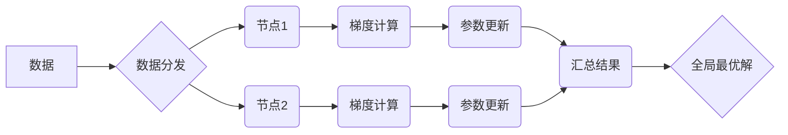

> 分布式优化，机器学习，深度学习，大规模数据，并行计算，算法设计

## 1. 背景介绍

随着数据规模的爆炸式增长和机器学习模型的复杂度不断提高，分布式优化已成为人工智能领域的核心技术之一。传统的集中式优化方法在面对海量数据和高维模型时，面临着巨大的计算瓶颈和效率问题。分布式优化通过将优化问题分解到多个节点上进行并行处理，有效地缓解了这些问题，并为训练更复杂、更强大的机器学习模型提供了新的可能性。

分布式优化在各个领域都有广泛的应用，例如：

* **机器学习**: 训练大型深度学习模型，例如图像识别、自然语言处理等。
* **推荐系统**: 建立个性化推荐模型，提高用户体验。
* **搜索引擎**: 优化搜索结果排名算法，提升搜索效率。
* **金融领域**: 风险管理、投资策略优化等。

## 2. 核心概念与联系

分布式优化是指将一个优化问题分解成多个子问题，分别在不同的计算节点上进行求解，最终通过协调和融合子问题的解，得到全局最优解。

**核心概念**:

* **节点**: 分布式优化系统中的计算单元，每个节点负责处理一部分优化问题。
* **参数**: 模型需要学习的参数，在分布式优化中，参数会被分配到不同的节点上进行更新。
* **梯度**: 参数更新的方向，由损失函数的导数决定。
* **同步**: 节点之间数据交换和参数更新的协调机制。
* **异步**: 节点之间数据交换和参数更新的非同步机制。

**架构**:



## 3. 核心算法原理 & 具体操作步骤

### 3.1  算法原理概述

分布式优化算法的核心思想是通过协调多个节点的计算，并行地更新模型参数，最终达到全局最优解。常见的分布式优化算法包括：

* **梯度下降法**: 沿着梯度方向更新参数，是最基本的优化算法。
* **随机梯度下降法**: 使用随机样本计算梯度，可以加速训练速度。
* **动量法**: 利用动量项加速参数更新，可以避免局部最优解。
* **Adam**: 结合动量和自适应学习率的优化算法，具有较好的收敛性能。

### 3.2  算法步骤详解

以随机梯度下降法为例，其分布式优化步骤如下：

1. **数据分发**: 将训练数据均匀地分配到各个节点上。
2. **梯度计算**: 每个节点使用其分配的数据计算模型参数的梯度。
3. **参数更新**: 每个节点根据其计算的梯度更新模型参数。
4. **参数汇总**: 所有节点将更新后的参数汇总到一个中心节点。
5. **全局更新**: 中心节点将汇总后的参数广播回所有节点，更新所有节点的模型参数。
6. **重复步骤2-5**: 直到模型收敛或达到预设的迭代次数。

### 3.3  算法优缺点

**优点**:

* 并行计算，加速训练速度。
* 适用于大规模数据和高维模型。

**缺点**:

* 需要协调多个节点的计算，增加了系统复杂度。
* 存在参数更新不一致的问题，可能导致模型性能下降。

### 3.4  算法应用领域

* **深度学习**: 训练大型深度学习模型，例如图像识别、自然语言处理等。
* **推荐系统**: 建立个性化推荐模型，提高用户体验。
* **搜索引擎**: 优化搜索结果排名算法，提升搜索效率。

## 4. 数学模型和公式 & 详细讲解 & 举例说明

### 4.1  数学模型构建

假设我们有一个包含 $n$ 个样本的训练数据集 $D = \{x_1, y_1, x_2, y_2, ..., x_n, y_n\}$, 其中 $x_i$ 是输入样本，$y_i$ 是目标输出。我们的目标是找到一个模型参数 $\theta$，使得模型在训练数据集上的损失函数最小化。

损失函数通常定义为样本预测值与真实值的差值，例如均方误差 (MSE) 或交叉熵损失 (Cross-Entropy Loss)。

### 4.2  公式推导过程

随机梯度下降法 (SGD) 的核心思想是通过迭代更新模型参数 $\theta$，使得损失函数不断减小。

更新公式为：

$$\theta = \theta - \eta \nabla L(\theta)$$

其中：

* $\theta$ 是模型参数
* $\eta$ 是学习率，控制参数更新的步长
* $\nabla L(\theta)$ 是损失函数 $L(\theta)$ 关于参数 $\theta$ 的梯度

### 4.3  案例分析与讲解

假设我们有一个线性回归模型，其损失函数为均方误差 (MSE)：

$$L(\theta) = \frac{1}{n} \sum_{i=1}^{n} (y_i - \theta^T x_i)^2$$

其中：

* $n$ 是样本数量
* $y_i$ 是真实输出
* $x_i$ 是输入样本
* $\theta$ 是模型参数

根据 SGD 更新公式，我们可以计算梯度并更新参数：

$$\nabla L(\theta) = \frac{1}{n} \sum_{i=1}^{n} 2(y_i - \theta^T x_i) x_i$$

$$\theta = \theta - \eta \frac{1}{n} \sum_{i=1}^{n} 2(y_i - \theta^T x_i) x_i$$

## 5. 项目实践：代码实例和详细解释说明

### 5.1  开发环境搭建

* Python 3.6+
* TensorFlow 2.0+
* PyTorch 1.0+

### 5.2  源代码详细实现

```python
import tensorflow as tf

# 定义模型参数
model_params = tf.Variable(tf.random.normal([10, 1]))

# 定义损失函数
def loss_function(y_true, y_pred):
  return tf.reduce_mean(tf.square(y_true - y_pred))

# 定义优化器
optimizer = tf.keras.optimizers.SGD(learning_rate=0.01)

# 定义训练步骤
@tf.function
def train_step(x, y):
  with tf.GradientTape() as tape:
    y_pred = model_params @ x
    loss = loss_function(y, y_pred)
  gradients = tape.gradient(loss, model_params)
  optimizer.apply_gradients(zip(gradients, [model_params]))
  return loss

# 训练数据
x_train = tf.random.normal([1000, 10])
y_train = tf.random.normal([1000, 1])

# 训练模型
for epoch in range(10):
  for batch in range(x_train.shape[0] // 32):
    loss = train_step(x_train[batch * 32:(batch + 1) * 32], y_train[batch * 32:(batch + 1) * 32])
    print(f"Epoch: {epoch}, Batch: {batch}, Loss: {loss.numpy()}")
```

### 5.3  代码解读与分析

* 代码首先定义了模型参数、损失函数和优化器。
* 然后定义了一个训练步骤函数 `train_step`，该函数使用梯度下降法更新模型参数。
* 训练数据使用随机生成的数值进行模拟。
* 最后，代码循环训练模型，并打印每批次的损失值。

### 5.4  运行结果展示

运行代码后，会输出每批次的损失值，随着训练的进行，损失值会逐渐减小，表明模型正在学习。

## 6. 实际应用场景

### 6.1  推荐系统

分布式优化在推荐系统中用于训练个性化推荐模型，例如协同过滤和内容过滤。

### 6.2  搜索引擎

分布式优化用于训练搜索引擎的排名算法，例如PageRank和BM25。

### 6.3  金融领域

分布式优化用于金融风险管理、投资策略优化等领域。

### 6.4  未来应用展望

随着人工智能技术的不断发展，分布式优化将在更多领域得到应用，例如：

* **自动驾驶**: 训练自动驾驶系统的决策模型。
* **医疗诊断**: 训练医疗诊断模型，辅助医生进行诊断。
* **药物研发**: 训练药物研发模型，加速新药研发。

## 7. 工具和资源推荐

### 7.1  学习资源推荐

* **书籍**:
    * "Distributed Machine Learning with Python" by  A. K. Singh
    * "Deep Learning" by Ian Goodfellow, Yoshua Bengio, and Aaron Courville
* **在线课程**:
    * Coursera: "Distributed Machine Learning" by Stanford University
    * Udacity: "Deep Learning Nanodegree"

### 7.2  开发工具推荐

* **TensorFlow**: 开源深度学习框架，支持分布式训练。
* **PyTorch**: 开源深度学习框架，支持分布式训练。
* **Spark**: 大数据处理框架，支持分布式机器学习。

### 7.3  相关论文推荐

* "Parameter Server: A Distributed Machine Learning Architecture" by Dean et al.
* "Asynchronous Methods for Distributed Optimization" by Recht et al.
* "Stochastic Gradient Descent with Momentum" by Polyak and Juditsky

## 8. 总结：未来发展趋势与挑战

### 8.1  研究成果总结

分布式优化技术取得了显著的进展，为训练更复杂、更强大的机器学习模型提供了新的可能性。

### 8.2  未来发展趋势

* **模型并行**: 将模型参数分布到多个节点上进行并行训练。
* **数据并行**: 将训练数据分布到多个节点上进行并行训练。
* **混合并行**: 将模型并行和数据并行结合起来进行训练。
* **联邦学习**: 在不共享原始数据的情况下，通过分布式训练模型参数，实现隐私保护。

### 8.3  面临的挑战

* **通信开销**: 分布式训练需要频繁地进行节点间通信，这会增加通信开销。
* **参数更新不一致**: 不同节点的梯度计算和参数更新可能存在不一致性，这会影响模型性能。
* **异构计算资源**: 分布式训练需要支持不同类型的计算资源，例如CPU、GPU、TPU等。

### 8.4  研究展望

未来研究方向包括：

* **降低通信开销**: 设计更有效的通信协议和数据传输机制。
* **解决参数更新不一致问题**: 研究更鲁棒的参数更新算法。
* **支持异构计算资源**: 开发更灵活的分布式训练框架。


## 9. 附录：常见问题与解答

### 9.1  Q1: 什么是分布式优化？

**A1**: 分布式优化是指将一个优化问题分解成多个子问题，分别在不同的计算节点上进行求解，最终通过协调和融合子问题的解，得到全局最优解。

### 9.2  Q2: 分布式优化的优势是什么？

**A2**: 分布式优化的优势在于：

* 并行计算，加速训练速度。
* 适用于大规模数据和高维模型。

### 9.3  Q3: 分布式优化的挑战是什么？

**A3**: 分布式优化的挑战包括：

* 通信开销
* 参数更新不一致
* 异构计算资源

### 9.4  Q4: 如何选择合适的分布式优化算法