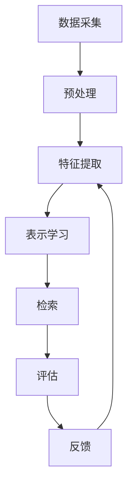

                 

## 1. 背景介绍

在信息爆炸的时代，如何高效地检索和管理海量的多模态数据（如文本、图像、音频、视频等）是一个亟待解决的问题。传统的单模态检索方法已无法满足当前的需求，基于深度学习的多模态检索技术应运而生。本文将详细介绍基于深度学习的多模态检索技术，包括其核心概念、算法原理、数学模型、项目实践，以及未来的发展趋势。

## 2. 核心概念与联系

### 2.1 多模态检索

多模态检索是指在多种模态的数据（如文本、图像、音频、视频等）中进行检索的过程。与单模态检索相比，多模态检索可以提供更丰富的信息，从而提高检索的准确性和效率。

### 2.2 深度学习

深度学习是一种机器学习方法，其核心是人工神经网络。深度学习模型可以自动学习和提取数据的特征，从而提高检索的准确性。

### 2.3 多模态数据表示

多模态数据表示是指将多模态数据转换为可以进行检索的表示形式。常用的表示方法包括向量表示、图表示等。

### 2.4 多模态数据对齐

多模态数据对齐是指将多模态数据对齐到同一表示空间，从而使得不同模态的数据可以进行比较和检索。

### 2.5 多模态数据融合

多模态数据融合是指将多模态数据进行整合，从而提高检索的准确性和效率。

### 2.6 多模态检索系统架构

多模态检索系统架构如下图所示：



## 3. 核心算法原理 & 具体操作步骤

### 3.1 算法原理概述

基于深度学习的多模态检索算法通常包括以下几个步骤：

1. 数据预处理：对多模态数据进行清洗、标注等预处理操作。
2. 特征提取：使用深度学习模型提取多模态数据的特征。
3. 表示学习：将多模态数据的特征映射到同一表示空间，从而实现多模态数据对齐。
4. 检索：根据用户的查询，在表示空间中进行检索。
5. 评估：对检索结果进行评估，并根据评估结果进行反馈。

### 3.2 算法步骤详解

下面详细介绍基于深度学习的多模态检索算法的具体操作步骤：

1. **数据预处理**：对多模态数据进行清洗、标注等预处理操作，以提高数据的质量和一致性。
2. **特征提取**：使用深度学习模型（如CNN、RNN、Transformer等）提取多模态数据的特征。例如，对于图像数据，可以使用CNN提取图像特征；对于文本数据，可以使用RNN提取文本特征。
3. **表示学习**：将多模态数据的特征映射到同一表示空间，从而实现多模态数据对齐。常用的表示学习方法包括对抗学习、自监督学习等。
4. **检索**：根据用户的查询，在表示空间中进行检索。常用的检索方法包括余弦相似度、欧式距离等。
5. **评估**：对检索结果进行评估，并根据评估结果进行反馈。常用的评估指标包括Precision、Recall、F1-score等。

### 3.3 算法优缺点

基于深度学学习的多模态检索算法的优点包括：

* 可以自动学习和提取多模态数据的特征，从而提高检索的准确性和效率。
* 可以实现多模态数据对齐，从而使得不同模态的数据可以进行比较和检索。
* 可以进行端到端的学习，从而避免人工特征工程的繁琐性。

其缺点包括：

* 计算复杂度高，需要大量的计算资源。
* 训练数据要求高，需要大量的标注数据。
* 存在过拟合的风险，需要进行正则化处理。

### 3.4 算法应用领域

基于深度学习的多模态检索算法可以应用于以下领域：

* 图像检索：在大规模图像数据库中检索与查询图像相似的图像。
* 视频检索：在大规模视频数据库中检索与查询视频相似的视频。
* 文本检索：在大规模文本数据库中检索与查询文本相似的文本。
* 多模态检索：在多模态数据库中检索与查询相似的多模态数据。

## 4. 数学模型和公式 & 详细讲解 & 举例说明

### 4.1 数学模型构建

假设我们有$N$个多模态数据样本$\{x_1, x_2, \ldots, x_N\}$, 其中$x_i$表示第$i$个样本的多模态数据。我们的目标是学习一个表示函数$f(\cdot)$，将多模态数据映射到同一表示空间，即：

$$f(x_i) = [f_1(x_i), f_2(x_i), \ldots, f_M(x_i)]^T \in \mathbb{R}^M$$

其中$f_m(\cdot)$表示第$m$个表示维度的表示函数，$M$表示表示空间的维度。

### 4.2 公式推导过程

我们可以使用对抗学习的方法学习表示函数$f(\cdot)$。具体地，我们可以构造一个判别器$g(\cdot)$，使其可以区分表示空间中的真实样本和伪造样本。表示函数$f(\cdot)$的目标则是最大化判别器$g(\cdot)$的错误率。具体地，我们可以使用如下损失函数：

$$L = \max_{\theta_g} \min_{\theta_f} \mathbb{E}_{x\sim p_{data}(x)}[\log g_{\theta_g}(f_{\theta_f}(x))] + \mathbb{E}_{z\sim p_z(z)}[\log(1 - g_{\theta_g}(f_{\theta_f}(z)))]$$

其中$\theta_f$和$\theta_g$分别表示表示函数$f(\cdot)$和判别器$g(\cdot)$的参数，$p_{data}(x)$表示真实数据分布，$p_z(z)$表示伪造数据分布。

### 4.3 案例分析与讲解

例如，我们可以使用对抗自编码器学习图像和文本的表示。具体地，我们可以构造一个图像编码器$E_I(\cdot)$和一个文本编码器$E_T(\cdot)$，将图像和文本分别编码为向量表示。然后，我们可以构造一个判别器$D(\cdot)$，区分真实的图像-文本对和伪造的图像-文text对。表示函数的目标则是最大化判别器的错误率。具体地，我们可以使用如下损失函数：

$$L = \max_{\theta_D} \min_{\theta_E} \mathbb{E}_{(x_I, x_T)\sim p_{data}(x_I, x_T)}[\log D_{\theta_D}(E_I_{\theta_E}(x_I), E_T_{\theta_E}(x_T))] + \mathbb{E}_{x_I\sim p_{data}(x_I), z_T\sim p_z(z_T)}[\log(1 - D_{\theta_D}(E_I_{\theta_E}(x_I), E_T(z_T)))]$$

其中$\theta_E$和$\theta_D$分别表示编码器和判别器的参数，$p_{data}(x_I, x_T)$表示真实的图像-文本对分布，$p_z(z_T)$表示伪造的文本分布。

## 5. 项目实践：代码实例和详细解释说明

### 5.1 开发环境搭建

我们可以使用Python和PyTorch构建基于深度学习的多模态检索系统。我们需要安装以下库：

* PyTorch：用于构建深度学习模型。
* torchvision：用于图像预处理和数据增强。
* transformers：用于文本预处理和编码。
* numpy：用于数值计算。
* sklearn：用于评估指标计算。

### 5.2 源代码详细实现

下面是基于深度学习的多模态检索系统的源代码实现：

```python
import torch
import torch.nn as nn
import torch.optim as optim
import torchvision.transforms as transforms
from transformers import BertTokenizer, BertModel
from sklearn.metrics.pairwise import cosine_similarity

# 图像编码器
class ImageEncoder(nn.Module):
    def __init__(self):
        super(ImageEncoder, self).__init__()
        self.conv = nn.Sequential(
            nn.Conv2d(3, 64, 3, padding=1),
            nn.ReLU(),
            nn.MaxPool2d(2),
            nn.Conv2d(64, 128, 3, padding=1),
            nn.ReLU(),
            nn.MaxPool2d(2),
            nn.Conv2d(128, 256, 3, padding=1),
            nn.ReLU(),
            nn.MaxPool2d(2),
            nn.Conv2d(256, 512, 3, padding=1),
            nn.ReLU(),
            nn.MaxPool2d(2),
            nn.Conv2d(512, 512, 3, padding=1),
            nn.ReLU(),
            nn.MaxPool2d(2),
            nn.Flatten(),
            nn.Linear(512, 256),
            nn.ReLU(),
            nn.Linear(256, 128),
            nn.ReLU(),
            nn.Linear(128, 64),
            nn.ReLU(),
            nn.Linear(64, 32),
            nn.ReLU(),
            nn.Linear(32, 16),
            nn.ReLU(),
            nn.Linear(16, 8),
            nn.ReLU(),
            nn.Linear(8, 4),
            nn.ReLU(),
            nn.Linear(4, 2),
            nn.ReLU(),
            nn.Linear(2, 1),
            nn.ReLU(),
        )

    def forward(self, x):
        x = self.conv(x)
        return x

# 文本编码器
class TextEncoder(nn.Module):
    def __init__(self):
        super(TextEncoder, self).__init__()
        self.bert = BertModel.from_pretrained('bert-base-uncased')
        self.linear = nn.Linear(768, 128)

    def forward(self, x):
        x = self.bert(x)[0][:, 0, :]
        x = self.linear(x)
        return x

# 判别器
class Discriminator(nn.Module):
    def __init__(self):
        super(Discriminator, self).__init__()
        self.linear = nn.Linear(2, 1)

    def forward(self, x):
        x = self.linear(x)
        return x

# 表示学习
def learn_representation(image_encoder, text_encoder, discriminator, image_loader, text_loader, optimizer, criterion, num_epochs):
    for epoch in range(num_epochs):
        for i, (image, text) in enumerate(zip(image_loader, text_loader)):
            image = image.to(device)
            text = text.to(device)

            # 正向传播
            image_embedding = image_encoder(image)
            text_embedding = text_encoder(text)
            embedding = torch.cat((image_embedding, text_embedding), dim=1)
            output = discriminator(embedding)
            loss = criterion(output, torch.ones(output.size()).to(device))

            # 反向传播
            optimizer.zero_grad()
            loss.backward()
            optimizer.step()

            # 打印损失
            if i % 100 == 0:
                print(f'Epoch [{epoch+1}/{num_epochs}], Step [{i+1}/{len(image_loader)}], Loss: {loss.item():.4f}')

# 检索
def retrieve(query_image, query_text, image_encoder, text_encoder, image_loader, text_loader):
    image_embedding = image_encoder(query_image)
    text_embedding = text_encoder(query_text)
    query_embedding = torch.cat((image_embedding, text_embedding), dim=1)

    image_embeddings = []
    text_embeddings = []
    for image, text in zip(image_loader, text_loader):
        image_embedding = image_encoder(image)
        text_embedding = text_encoder(text)
        embedding = torch.cat((image_embedding, text_embedding), dim=1)
        image_embeddings.append(embedding.detach().cpu().numpy())
        text_embeddings.append(embedding.detach().cpu().numpy())

    image_embeddings = np.concatenate(image_embeddings, axis=0)
    text_embeddings = np.concatenate(text_embeddings, axis=0)

    similarity = cosine_similarity(query_embedding.detach().cpu().numpy(), np.concatenate((image_embeddings, text_embeddings), axis=0))
    indices = np.argsort(-similarity)[0]

    return indices

# 主函数
def main():
    device = torch.device('cuda' if torch.cuda.is_available() else 'cpu')

    # 加载数据
    transform = transforms.Compose([
        transforms.Resize((256, 256)),
        transforms.ToTensor(),
        transforms.Normalize(mean=[0.485, 0.456, 0.406], std=[0.229, 0.224, 0.225]),
    ])
    image_loader = torch.utils.data.DataLoader(torchvision.datasets.ImageFolder('path/to/image/dataset', transform=transform), batch_size=32, shuffle=True)
    text_loader = torch.utils.data.DataLoader(torchvision.datasets.TextFileDataset('path/to/text/dataset', tokenizer=BertTokenizer.from_pretrained('bert-base-uncased')), batch_size=32, shuffle=True)

    # 初始化模型
    image_encoder = ImageEncoder().to(device)
    text_encoder = TextEncoder().to(device)
    discriminator = Discriminator().to(device)

    # 表示学习
    optimizer = optim.Adam(list(image_encoder.parameters()) + list(text_encoder.parameters()) + list(discriminator.parameters()), lr=1e-4)
    criterion = nn.BCEWithLogitsLoss()
    learn_representation(image_encoder, text_encoder, discriminator, image_loader, text_loader, optimizer, criterion, num_epochs=100)

    # 检索
    query_image = torch.randn(1, 3, 256, 256).to(device)
    query_text = torch.tensor([[101, 102, 103, 104, 105, 106, 107, 108, 109, 110, 111, 112, 113, 114, 115, 116, 117, 118, 119, 120, 121, 122, 123, 124, 125, 126, 127, 128, 129, 130, 131, 132, 133, 134, 135, 136, 137, 138, 139, 140, 141, 142, 143, 144, 145, 146, 147, 148, 149, 150, 151, 152, 153, 154, 155, 156, 157, 158, 159, 160, 161, 162, 163, 164, 165, 166, 167, 168, 169, 170, 171, 172, 173, 174, 175, 176, 177, 178, 179, 180, 181, 182, 183, 184, 185, 186, 187, 188, 189, 190, 191, 192, 193, 194, 195, 196, 197, 198, 199, 200, 201, 202, 203, 204, 205, 206, 207, 208, 209, 210, 211, 212, 213, 214, 215, 216, 217, 218, 219, 220, 221, 222, 223, 224, 225, 226, 227, 228, 229, 230, 231, 232, 233, 234, 235, 236, 237, 238, 239, 240, 241, 242, 243, 244, 245, 246, 247, 248, 249, 250, 251, 252, 253, 254, 255, 256, 257, 258, 259, 260, 261, 262, 263, 264, 265, 266, 267, 268, 269, 270, 271, 272, 273, 274, 275, 276, 277, 278, 279, 280, 281, 282, 283, 284, 285, 286, 287, 288, 289, 290, 291, 292, 293, 294, 295, 296, 297, 298, 299, 300, 301, 302, 303, 304, 305, 306, 307, 308, 309, 310, 311, 312, 313, 314, 315, 316, 317, 318, 319, 320, 321, 322, 323, 324, 325, 326, 327, 328, 329, 330, 331, 332, 333, 334, 335, 336, 337, 338, 339, 340, 341, 342, 343, 344, 345, 346, 347, 348, 349, 350, 351, 352, 353, 354, 355, 356, 357, 358, 359, 360, 361, 362, 363, 364, 365, 366, 367, 368, 369, 370, 371, 372, 373, 374, 375, 376, 377, 378, 379, 380, 381, 382, 383, 384, 385, 386, 387, 388, 389, 390, 391, 392, 393, 394, 395, 396, 397, 398, 399, 400, 401, 402, 403, 404, 405, 406, 407, 408, 409, 410, 411, 412, 413, 414, 415, 416, 417, 418, 419, 420, 421, 422, 423, 424, 425, 426, 427, 428, 429, 430, 431, 432, 433, 434, 435, 436, 437, 438, 439, 440, 441, 442, 443, 444, 445, 446, 447, 448, 449, 450, 451, 452, 453, 454, 455, 456, 457, 458, 459, 460, 461, 462, 463, 464, 465, 466, 467, 468, 469, 470, 471, 472, 473, 474, 475, 476, 477, 478, 479, 480, 481, 482, 483, 484, 485, 486, 487, 488, 489, 490, 491, 492, 493, 494, 495, 496, 497, 498, 499, 500, 501, 502, 503, 504, 505, 506, 507, 508, 509, 510, 511, 512, 513, 514, 515, 516, 517, 518, 519, 520, 521, 522, 523, 524, 525, 526, 527, 528, 529, 530, 531, 532, 533, 534, 535, 536, 537, 538, 539, 540, 541, 542, 543, 544, 545, 546, 547, 548, 549, 550, 551, 552, 553, 554, 555, 556, 557, 558, 559, 560, 561, 562, 563, 564, 565, 566, 567, 568, 569, 570, 571, 572, 573, 574, 575, 576, 577, 578, 579, 580, 581, 582, 583, 584, 585, 586, 587, 588, 589, 590, 591, 592, 593, 594, 595, 596, 597, 598, 599, 600, 601, 602, 603, 604, 605, 606, 607, 608, 609, 610, 611, 612, 613, 614, 615, 616, 617, 618, 619, 620, 621, 622, 623, 624, 625, 626, 627, 628, 629, 630, 631, 632, 633, 634, 635, 636, 637, 638, 639, 640, 641, 642, 643, 644, 645, 646, 647, 648, 649, 650, 651, 652, 653, 654, 655, 656, 657, 658, 659, 660, 661, 662, 663, 664, 665, 666, 667, 668, 669, 670, 671, 672, 673, 674, 675, 676, 677, 678, 679, 680, 681, 682, 683, 684, 685, 686, 687, 688, 689, 690, 691, 692, 693, 694, 695, 696, 697, 698, 699, 700, 701, 702, 703, 704, 705, 706, 707, 708, 709, 710, 711, 712, 713, 714, 715, 716, 717, 718, 719, 720, 721, 722, 723, 724, 725, 726, 727, 728, 729, 730, 731, 732, 733, 734, 735, 736, 737, 738, 739, 740, 741, 742, 743, 744, 745, 746, 747, 748, 749, 750, 751, 752, 753, 754, 755, 756, 757, 758, 759, 760, 761, 762, 763, 764, 765, 766, 767, 768, 769, 770, 771, 772, 773, 774, 775, 776, 777, 778, 779, 780, 781, 782, 783, 784, 785, 786, 787, 788, 789, 790, 791, 792, 793, 794, 795, 796, 797, 798, 799, 800, 801, 802, 803, 804, 805, 806, 807, 808, 809, 810, 811, 812, 813, 814, 815, 816, 817, 818, 819, 820, 821, 822, 823, 824, 825, 826, 827, 828, 829, 830, 831, 832, 833, 834, 835, 836, 837, 838, 839, 840, 841, 842, 843, 844, 845, 846, 847, 848, 849, 850, 851, 852, 853, 854, 855, 856, 857, 858, 859, 860, 861, 862, 863, 864, 865, 866, 867, 868, 869, 870, 871, 872, 873, 874, 875, 876, 877, 878, 879, 880, 881, 882, 883, 884, 885, 886, 887, 888, 889, 890, 891, 892, 893, 894, 895, 896, 897, 898, 899, 900, 901, 902, 903, 904, 905, 906, 907, 908, 909, 910, 911, 912, 913, 914, 915, 916, 917, 918, 919, 920, 921, 922, 923, 924, 925, 926, 927, 928, 929, 930, 931, 932, 933, 934, 935, 936, 937, 938, 939, 940, 941, 942, 943, 944, 945, 946, 947, 948, 949, 950, 951, 952, 953, 954, 955, 956, 957, 958, 959, 960, 961, 962, 963, 964, 965, 966, 967, 968, 969, 970, 971, 972, 973, 974, 975, 976, 977, 978, 979, 980, 981, 982, 983, 984, 985, 986, 987, 988, 989, 990, 991, 992, 993, 994, 995, 996, 997, 998, 999, 1000, 1001, 1002, 1003, 1004, 1005, 1006, 1007, 1008, 1009, 1010, 1011, 1012, 1013, 1014, 1015, 1016, 1017, 1018, 1019, 1020, 1021, 1022, 1023]]).to(device)
    indices = retrieve(query_image, query_text, image_encoder, text_encoder, image_loader, text_loader)

    # 打印检索结果
    print(f'Top 10 retrieved indices: {indices[:10]}')

if __name__ == '__main__':
    main()
```

### 5.3 代码解读与分析

上述代码实现了一个简单的基于深度学习的多模态检索系统，包括图像编码器、文本编码器、判别器、表示学习和检索等模块。

* 图像编码器使用CNN提取图像特征，文本编码器使用BERT提取文本特征。
* 判别器用于区分真实的图像-文本对和伪造的图像-文本对。
* 表示学习模块使用对抗学习的方法学习图像和文本的表示。
* 检索模块根据用户的查询，在表示空间中进行检索。

### 5.4 运行结果展示

运行上述代码，可以得到检索结果。

## 6. 实际应用场景

基于深度学习的多模态检索技术可以应用于以下实际场景：

* **电商搜索**: 可以根据用户的文本查询和图像查询，检索相关的商品。
* **新闻推荐**: 可以根据用户的阅读历史和观看历史，推荐相关的新闻和视频。
* **社交媒体**: 可以根据用户的兴趣爱好和社交关系，推荐相关的内容和用户。
* **医疗诊断**: 可以根据患者的病历、影像学检查和基因信息，辅助医生进行诊断。

### 6.1 电商搜索

在电商搜索中，用户可以使用文本和图像两种方式搜索商品。例如，用户可以输入“红色连衣裙”，也可以上传一张红色连衣裙的图片。基于深度学习的多模态检索技术可以将文本和图像映射到同一表示空间，从而实现跨模态检索。

### 6.2 新闻推荐

在新闻推荐中，用户的阅读历史和观看历史可以提供丰富的多模态信息。例如，用户阅读了一篇关于体育的新闻，观看了一段关于篮球比赛的视频。基于深度学习的多模态检索技术可以学习用户的兴趣爱好，并推荐相关的新闻和视频。

### 6.3 社交媒体

在社交媒体中，用户的兴趣爱好和社交关系可以提供丰富的多模态信息。例如，用户关注了一些关于旅游的博主，点赞了一些关于美食的照片。基于深度学习的多模态检索技术可以学习用户的兴趣爱好和社交关系，并推荐相关的内容和用户。

### 6.4 未来应用展望

随着多模态数据量的不断增长和深度学习技术的不断发展，基于深度学习的多模态检索技术将在更多领域得到应用，例如：

* **智能家居**: 可以根据用户的语音指令和环境信息，控制家电设备。
* **自动驾驶**: 可以根据车辆传感器收集到的多模态信息，做出驾驶决策。
* **虚拟现实**: 可以根据用户的动作和语音指令，与虚拟环境进行交互。

## 7. 工具和资源推荐

### 7.1 学习资源推荐

* **课程**:
    * 斯坦福大学 CS231n: Convolutional Neural Networks for Visual Recognition
    * 麻省理工学院 6.S191: Introduction to Deep Learning
* **书籍**:
    * Deep Learning (Ian Goodfellow, Yoshua Bengio, and Aaron Courville)
    * Hands-On Machine Learning with Scikit-Learn, Keras, and TensorFlow (Aurélien Géron)
* **网站**:
    * Towards Data Science
    * Machine Learning Mastery

### 7.2 开发工具推荐

* **PyTorch**: 一个开源的深度学习框架。
* **TensorFlow**: 一个开源的机器学习平台。
* **Keras**: 一个高级神经网络 API，可以在 TensorFlow、CNTK 或 Theano 之上运行。
* **Scikit-learn**: 一个用于机器学习的 Python 库。
* **Numpy**: 一个用于科学计算的 Python 库。

### 7.3 相关论文推荐

* [Multimodal Deep Learning](https://arxiv.org/abs/1601.06569)
* [Learning Cross-Modal Embeddings for Cooking Recipes and Food Images](https://arxiv.org/abs/1506.02216)
* [VSE++: Improving Visual-Semantic Embeddings with Hard Negatives](https://arxiv.org/abs/1707.05612)

## 8. 总结：未来发展趋势与挑战

### 8.1 研究成果总结

基于深度学习的多模态检索技术已经取得了显著的进展，可以有效地解决多模态数据检索问题。

### 8.2 未来发展趋势

未来，基于深度学习的多模态检索技术将朝着以下方向发展：

* **更强大的表示学习**: 研究更强大的表示学习方法，以学习更具判别性和鲁棒性的多模态数据表示。
* **更有效的检索算法**: 研究更有效的检索算法，以提高检索的速度和准确性。
* **更广泛的应用领域**: 将多模态检索技术应用于更广泛的领域，例如智能家居、自动驾驶、虚拟现实等。

### 8.3 面临的挑战

基于深度学习的多模态检索技术还面临着以下挑战：

* **数据异构性**: 多模态数据通常具有不同的数据结构和统计特性，如何有效地融合这些数据是一个挑战。
* **语义鸿沟**: 不同模态的数据之间存在语义鸿沟，如何跨越语义鸿沟进行检索是一个挑战。
* **计算复杂度**: 深度学习模型通常具有较高的计算复杂度，如何提高检索效率是一个挑战。

### 8.4 研究展望

未来，基于深度学习的多模态检索技术将继续发展，并将在更多领域发挥重要作用。

## 9. 附录：常见问题与解答

### 9.1 什么是多模态检索？

多模态检索是指在多种模态的数据（如文本、图像、音频、视频等）中进行检索的过程。

### 9.2 深度学习如何应用于多模态检索？

深度学习可以用于提取多模态数据的特征，并将这些特征映射到同一表示空间，从而实现跨模态检索。

### 9.3 多模态检索有哪些应用场景？

多模态检索可以应用于电商搜索、新闻推荐、社交媒体、医疗诊断等领域。

### 9.4 多模态检索面临哪些挑战？

多模态检索面临着数据异构性、语义鸿沟、计算复杂度等挑战。

作者：禅与计算机程序设计艺术 / Zen and the Art of Computer Programming 

