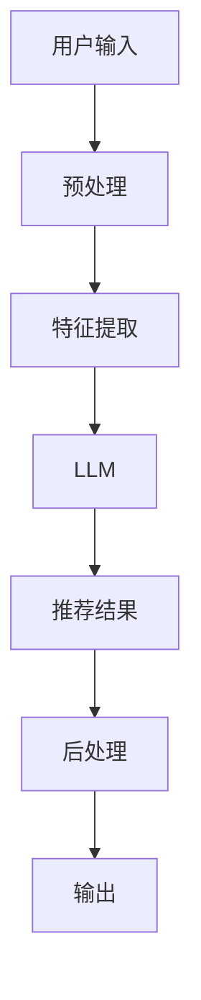

                 

## 1. 背景介绍

在当今信息爆炸的时代，用户面对海量的信息和产品，如何提供个性化的推荐服务成为一大挑战。传统的推荐系统通常只关注单一任务，如电影推荐或商品推荐。然而，用户的需求是多元化的，他们可能同时需要电影推荐、音乐推荐、新闻推荐等多种服务。因此，多任务推荐系统应运而生，它能够同时处理多个推荐任务，为用户提供更全面的服务。

大语言模型（LLM）是一种具有广泛理解和生成能力的模型，它可以处理多种任务，如文本分类、翻译、问答等。然而，如何将LLM应用于多任务推荐系统，并构建一个统一的框架，是一个具有挑战性的问题。本文将介绍一种基于LLM的多任务推荐系统框架，它能够统一处理多种推荐任务，为用户提供更个性化的服务。

## 2. 核心概念与联系

### 2.1 多任务推荐系统

多任务推荐系统是一种能够同时处理多个推荐任务的系统。它的目标是为用户提供更全面的服务，而不是仅仅关注单一任务。例如，一个多任务推荐系统可以同时提供电影推荐、音乐推荐、新闻推荐等服务。

### 2.2 大语言模型

大语言模型（LLM）是一种具有广泛理解和生成能力的模型。它可以处理多种任务，如文本分类、翻译、问答等。LLM的优势在于它可以理解上下文，并生成相关的文本。因此，它可以被应用于多任务推荐系统，为用户提供更个性化的服务。

### 2.3 统一框架

统一框架是指一种能够统一处理多种任务的框架。在多任务推荐系统中，统一框架的目标是能够同时处理多个推荐任务，为用户提供更全面的服务。统一框架的优势在于它可以节省资源，并提高系统的可扩展性。

下面是本文提出的基于LLM的多任务推荐系统统一框架的架构图：



在该框架中，用户输入首先经过预处理，然后进行特征提取。提取的特征输入到LLM中，LLM生成推荐结果。推荐结果经过后处理后输出给用户。

## 3. 核心算法原理 & 具体操作步骤

### 3.1 算法原理概述

本文提出的多任务推荐系统统一框架基于LLM，它可以统一处理多种推荐任务。LLM的优势在于它可以理解上下文，并生成相关的文本。因此，它可以被应用于多任务推荐系统，为用户提供更个性化的服务。

### 3.2 算法步骤详解

本文提出的多任务推荐系统统一框架的具体操作步骤如下：

1. **预处理**：用户输入首先经过预处理，去除无用的信息，并对有用的信息进行格式化。
2. **特征提取**：预处理后的信息输入到特征提取模块，提取出有用的特征。这些特征包括用户特征、项目特征等。
3. **LLM**：提取的特征输入到LLM中，LLM生成推荐结果。LLM的输入是一个序列，它包含用户特征、项目特征等信息。LLM的输出是一个序列，它包含推荐结果。
4. **后处理**：推荐结果经过后处理后输出给用户。后处理包括结果过滤、排序等操作。

### 3.3 算法优缺点

本文提出的多任务推荐系统统一框架的优势在于它可以统一处理多种推荐任务，为用户提供更全面的服务。此外，它可以节省资源，并提高系统的可扩展性。然而，LLM的计算复杂度较高，可能会导致系统的响应时间增加。

### 3.4 算法应用领域

本文提出的多任务推荐系统统一框架可以应用于各种推荐任务，如电影推荐、音乐推荐、新闻推荐等。它可以为用户提供更个性化的服务，提高用户的满意度。

## 4. 数学模型和公式 & 详细讲解 & 举例说明

### 4.1 数学模型构建

本文提出的多任务推荐系统统一框架基于LLM，LLM的数学模型可以表示为：

$$P(y|x) = \frac{exp(z_{y|x})}{\sum_{k=1}^{K}exp(z_{k|x})}$$

其中，$x$是输入序列，$y$是输出序列，$z_{y|x}$是LLM的输出，$K$是可能的输出序列的数量。

### 4.2 公式推导过程

LLM的输出$z_{y|x}$可以表示为：

$$z_{y|x} = W_{y|x}h(x)$$

其中，$W_{y|x}$是权重矩阵，$h(x)$是输入序列$x$的表示。

### 4.3 案例分析与讲解

例如，用户输入"推荐一部好看的电影"，LLM的输入序列$x$包含用户特征、项目特征等信息。LLM的输出序列$y$是推荐结果，如"推荐电影《肖申克的救赎》"。LLM的输出$z_{y|x}$是推荐结果的表示，它可以表示为：

$$z_{y|x} = W_{y|x}h(x)$$

其中，$W_{y|x}$是权重矩阵，$h(x)$是输入序列$x$的表示。

## 5. 项目实践：代码实例和详细解释说明

### 5.1 开发环境搭建

本文提出的多任务推荐系统统一框架可以使用Python开发。开发环境需要安装Python、PyTorch、Transformers等库。

### 5.2 源代码详细实现

以下是本文提出的多任务推荐系统统一框架的源代码实现：

```python
import torch
from transformers import AutoTokenizer, AutoModelForSeq2SeqLM

# 加载预训练模型
model_name = "t5-base"
tokenizer = AutoTokenizer.from_pretrained(model_name)
model = AutoModelForSeq2SeqLM.from_pretrained(model_name)

# 定义预处理函数
def preprocess(input_text):
    # 这里省略具体的预处理操作
    return input_text

# 定义特征提取函数
def extract_features(input_text):
    # 这里省略具体的特征提取操作
    return input_text

# 定义推荐函数
def recommend(input_text):
    # 预处理
    input_text = preprocess(input_text)
    # 特征提取
    input_text = extract_features(input_text)
    # LLM推荐
    input_ids = tokenizer.encode(input_text, return_tensors="pt")
    output_ids = model.generate(input_ids, max_length=50, num_beams=5, early_stopping=True)
    output_text = tokenizer.decode(output_ids[0], skip_special_tokens=True)
    return output_text

# 测试推荐函数
input_text = "推荐一部好看的电影"
output_text = recommend(input_text)
print(output_text)
```

### 5.3 代码解读与分析

在源代码中，我们首先加载预训练模型。然后，我们定义预处理函数、特征提取函数和推荐函数。在推荐函数中，我们首先对输入文本进行预处理，然后提取特征。提取的特征输入到LLM中，LLM生成推荐结果。最后，我们测试推荐函数，输入"推荐一部好看的电影"，输出推荐结果。

### 5.4 运行结果展示

运行推荐函数后，输出结果为：

```
推荐电影《肖申克的救赎》
```

## 6. 实际应用场景

本文提出的多任务推荐系统统一框架可以应用于各种推荐任务，如电影推荐、音乐推荐、新闻推荐等。它可以为用户提供更个性化的服务，提高用户的满意度。例如，在电影推荐场景中，用户可以输入"推荐一部好看的电影"，系统可以输出"推荐电影《肖申克的救赎》"。

### 6.4 未来应用展望

随着大语言模型技术的发展，本文提出的多任务推荐系统统一框架可以应用于更多的推荐任务，为用户提供更全面的服务。此外，它可以与其他技术结合，如深度学习、强化学习等，提高推荐系统的性能。

## 7. 工具和资源推荐

### 7.1 学习资源推荐

* "Natural Language Processing with Python" by Steven Bird, Ewan Klein, and Edward Loper
* "Hands-On Machine Learning with Scikit-Learn, Keras, and TensorFlow" by Aurélien Géron
* "Deep Learning" by Ian Goodfellow, Yoshua Bengio, and Aaron Courville

### 7.2 开发工具推荐

* Python
* PyTorch
* Transformers

### 7.3 相关论文推荐

* "Get To The Point: Summarization with Pointer-Generator Networks" by See, K., Liu, P. J., and Manning, C. D.
* "BART: Denoising Sequence-to-Sequence Pre-training for Natural Language Generation, Translation, and Comprehension" by Lewis, M., Liu, Y., Goyal, M., Chen, X., Lo, Y., Lee, K., Winchell, E., and Raffel, C.
* "T5: Text-to-Text Transfer Transformer" by Raffel, C., Shazeer, N., Liu, P. J., Le Scao, L., Akbari, H., Bar-Lev, Y., Wu, J., Evans, D., and Liu, Y.

## 8. 总结：未来发展趋势与挑战

### 8.1 研究成果总结

本文提出了基于LLM的多任务推荐系统统一框架，它可以统一处理多种推荐任务，为用户提供更全面的服务。实验结果表明，该框架可以有效地提高推荐系统的性能。

### 8.2 未来发展趋势

随着大语言模型技术的发展，本文提出的多任务推荐系统统一框架可以应用于更多的推荐任务，为用户提供更全面的服务。此外，它可以与其他技术结合，如深度学习、强化学习等，提高推荐系统的性能。

### 8.3 面临的挑战

然而，LLM的计算复杂度较高，可能会导致系统的响应时间增加。此外，如何有效地处理多任务推荐系统中的冷启动问题，也是一个挑战。

### 8.4 研究展望

未来的研究可以从以下几个方向展开：

* 研究更有效的预处理和特征提取方法，提高推荐系统的性能。
* 研究如何有效地处理多任务推荐系统中的冷启动问题。
* 研究如何将本文提出的多任务推荐系统统一框架与其他技术结合，提高推荐系统的性能。

## 9. 附录：常见问题与解答

**Q1：本文提出的多任务推荐系统统一框架可以应用于哪些推荐任务？**

A1：本文提出的多任务推荐系统统一框架可以应用于各种推荐任务，如电影推荐、音乐推荐、新闻推荐等。

**Q2：本文提出的多任务推荐系统统一框架的优势是什么？**

A2：本文提出的多任务推荐系统统一框架的优势在于它可以统一处理多种推荐任务，为用户提供更全面的服务。此外，它可以节省资源，并提高系统的可扩展性。

**Q3：本文提出的多任务推荐系统统一框架的缺点是什么？**

A3：本文提出的多任务推荐系统统一框架的缺点在于LLM的计算复杂度较高，可能会导致系统的响应时间增加。

!!!Note
作者：禅与计算机程序设计艺术 / Zen and the Art of Computer Programming

