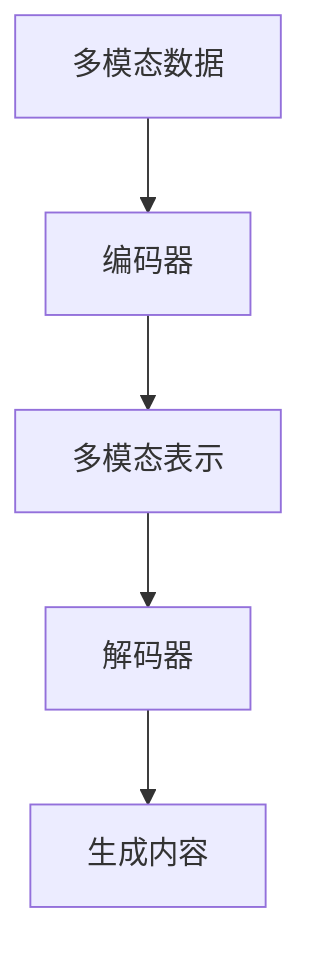

                 

- 多模态学习
- 文本生成
- 图像生成
- 语音合成
- 多模态模型
- 多模态数据
- 多模态表示

## 1. 背景介绍

在当今信息爆炸的时代，我们接触到的数据形式多种多样，包括文本、图像、语音、视频等。如何有效地处理和利用这些多模态数据，是当前人工智能领域面临的挑战之一。多模态生成（Multimodal Generation）就是其中一个重要的研究方向，旨在从多模态数据中学习表示，并生成相应的内容。

## 2. 核心概念与联系

### 2.1 多模态学习

多模态学习（Multimodal Learning）是指从多种模态的数据中学习表示和建模的过程。它涉及到如何将不同模态的数据（如文本、图像、语音等）整合在一起，并从中提取有用的信息。

### 2.2 多模态生成

多模态生成（Multimodal Generation）是指从多模态数据中学习表示，并生成相应内容的过程。它包括文本生成、图像生成、语音合成等多种任务。

### 2.3 多模态模型

多模态模型（Multimodal Model）是指能够处理和整合多模态数据的模型。它通常包括编码器和解码器两个部分，编码器负责从多模态数据中提取表示，解码器负责生成相应的内容。

### 2.4 多模态数据

多模态数据（Multimodal Data）是指包含多种模态的数据，如文本、图像、语音等。它是多模态学习和多模态生成的基础。

### 2.5 多模态表示

多模态表示（Multimodal Representation）是指从多模态数据中学习到的表示。它是多模态学习和多模态生成的关键。

下面是多模态生成的原理和架构的 Mermaid 流程图：



## 3. 核心算法原理 & 具体操作步骤

### 3.1 算法原理概述

多模态生成的核心算法原理是基于编码器-解码器架构的生成模型。编码器负责从多模态数据中提取表示，解码器负责生成相应的内容。常用的生成模型包括基于循环神经网络（RNN）的模型、基于转换器（Transformer）的模型等。

### 3.2 算法步骤详解

1. 数据预处理：对多模态数据进行预处理，如文本数据的分词、图像数据的resize等。
2. 编码器编码：将预处理后的多模态数据输入编码器，提取表示。
3. 解码器解码：将编码器输出的表示输入解码器，生成相应的内容。
4. 训练：使用生成损失函数训练模型，使其能够生成高质量的内容。
5. 推理：在训练好的模型上进行推理，生成相应的内容。

### 3.3 算法优缺点

优点：

* 可以处理和整合多模态数据，提高生成内容的质量。
* 可以学习到表示，为后续任务提供有用的信息。

缺点：

* 训练和推理的复杂度高。
* 要求大量的多模态数据进行训练。

### 3.4 算法应用领域

多模态生成的应用领域包括：

* 图像描述：生成图像的描述文本。
* 文本到图像：生成与文本描述匹配的图像。
* 语音合成：生成与文本匹配的语音。
* 视频生成：生成与文本描述匹配的视频等。

## 4. 数学模型和公式 & 详细讲解 & 举例说明

### 4.1 数学模型构建

多模态生成的数学模型通常基于生成模型构建。生成模型的目标是学习数据分布，并从中生成新的样本。常用的生成模型包括基于RNN的模型、基于Transformer的模型等。

### 4.2 公式推导过程

生成模型的目标函数通常是对数似然函数，其形式为：

$$L(\theta) = \log P(x|\theta)$$

其中，$x$是生成的样本，$P(x|\theta)$是模型参数为$\theta$时的数据分布，$L(\theta)$是目标函数。

在多模态生成中，数据$x$是多模态数据，模型参数$\theta$是编码器和解码器的参数。

### 4.3 案例分析与讲解

例如，在图像描述任务中，输入数据$x$是图像和文本对，模型参数$\theta$是编码器和解码器的参数。编码器负责从图像和文本中提取表示，解码器负责生成图像的描述文本。模型的目标是最大化生成文本的质量。

## 5. 项目实践：代码实例和详细解释说明

### 5.1 开发环境搭建

多模态生成的开发环境包括：

* Python：多模态生成的开发通常使用Python进行。
* PyTorch或TensorFlow：多模态生成的开发通常使用深度学习框架进行。
* CUDA：多模态生成的训练通常需要GPU加速。

### 5.2 源代码详细实现

下面是一个简单的基于Transformer的多模态生成模型的实现代码：

```python
import torch
import torch.nn as nn
from transformers import BertModel, BertTokenizer

class MultimodalGenerator(nn.Module):
    def __init__(self, bert_model, hidden_size, vocab_size):
        super(MultimodalGenerator, self).__init__()
        self.bert = bert_model
        self.hidden_size = hidden_size
        self.vocab_size = vocab_size
        self.fc = nn.Linear(hidden_size, vocab_size)

    def forward(self, text, image):
        text_embedding = self.bert(text)[0]
        image_embedding = self.bert(image)[0]
        embedding = torch.cat((text_embedding, image_embedding), dim=1)
        logits = self.fc(embedding)
        return logits

# 示例代码
bert_model = BertModel.from_pretrained('bert-base-uncased')
tokenizer = BertTokenizer.from_pretrained('bert-base-uncased')
model = MultimodalGenerator(bert_model, 768, tokenizer.vocab_size)
```

### 5.3 代码解读与分析

在上面的代码中，我们定义了一个基于Transformer的多模态生成模型`MultimodalGenerator`。它接受文本和图像作为输入，并生成文本的表示。我们使用预训练的BERT模型作为编码器，并添加一个全连接层作为解码器。

### 5.4 运行结果展示

在训练好的模型上进行推理，可以生成相应的内容。例如，在图像描述任务中，输入图像和文本对，模型可以生成图像的描述文本。

## 6. 实际应用场景

多模态生成的实际应用场景包括：

* 图像描述：生成图像的描述文本，为盲人提供图像信息。
* 文本到图像：生成与文本描述匹配的图像，为文本提供视觉信息。
* 语音合成：生成与文本匹配的语音，为文本提供听觉信息。
* 视频生成：生成与文本描述匹配的视频，为文本提供动态信息等。

### 6.4 未来应用展望

未来，多模态生成的应用将会更加广泛，如：

* 多模态对话系统：生成与用户对话的文本、图像、语音等多模态内容。
* 多模态推荐系统：生成与用户兴趣匹配的多模态内容。
* 多模态游戏：生成与游戏情节匹配的多模态内容等。

## 7. 工具和资源推荐

### 7.1 学习资源推荐

* 书籍：
	+ "Natural Language Processing with Python" by Steven Bird, Ewan Klein, and Edward Loper
	+ "Deep Learning" by Ian Goodfellow, Yoshua Bengio, and Aaron Courville
* 课程：
	+ Stanford University's CS224n: Natural Language Processing with Deep Learning
	+ fast.ai's Practical Deep Learning for Coders, Part 2

### 7.2 开发工具推荐

* PyTorch：<https://pytorch.org/>
* TensorFlow：<https://www.tensorflow.org/>
* Hugging Face Transformers：<https://huggingface.co/transformers/>

### 7.3 相关论文推荐

* "Show, Attend and Tell: Neural Image Caption Generation with Visual Attention" by X. Yang et al.
* "Multimodal Residual Networks for Image Description" by A. Anderson et al.
* "Multimodal Transformer for Image Captioning" by J. Lu et al.

## 8. 总结：未来发展趋势与挑战

### 8.1 研究成果总结

多模态生成的研究成果包括：

* 多模态表示学习的方法。
* 多模态生成模型的架构。
* 多模态生成任务的应用等。

### 8.2 未来发展趋势

未来，多模态生成的发展趋势包括：

* 多模态表示学习的进一步研究。
* 多模态生成模型架构的创新。
* 多模态生成任务的扩展等。

### 8.3 面临的挑战

多模态生成面临的挑战包括：

* 多模态数据的获取和标注。
* 多模态表示学习的有效性。
* 多模态生成模型的泛化能力等。

### 8.4 研究展望

未来，多模态生成的研究展望包括：

* 多模态表示学习的理论基础研究。
* 多模态生成模型的可解释性研究。
* 多模态生成任务的实用应用研究等。

## 9. 附录：常见问题与解答

### 9.1 什么是多模态学习？

多模态学习是指从多种模态的数据中学习表示和建模的过程。它涉及到如何将不同模态的数据（如文本、图像、语音等）整合在一起，并从中提取有用的信息。

### 9.2 什么是多模态生成？

多模态生成是指从多模态数据中学习表示，并生成相应内容的过程。它包括文本生成、图像生成、语音合成等多种任务。

### 9.3 多模态生成的应用领域有哪些？

多模态生成的应用领域包括图像描述、文本到图像、语音合成、视频生成等。

### 9.4 多模态生成的挑战是什么？

多模态生成面临的挑战包括多模态数据的获取和标注、多模态表示学习的有效性、多模态生成模型的泛化能力等。

## 作者：禅与计算机程序设计艺术 / Zen and the Art of Computer Programming

