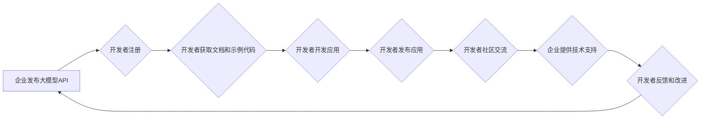

> 大模型、开发者关系管理、开源社区、生态系统、API、工具链、技术支持、激励机制、商业模式

## 1. 背景介绍

大模型技术近年来发展迅速，其强大的能力在自然语言处理、图像识别、代码生成等领域展现出巨大潜力。随着大模型技术的普及，越来越多的企业开始探索大模型的应用场景，并希望通过大模型构建自己的产品和服务。然而，大模型的开发和应用并非易事，它需要大量的计算资源、专业人才和技术积累。

开发者作为大模型应用的推动者和创新者，在推动大模型技术发展和商业化进程中扮演着至关重要的角色。因此，大模型企业需要建立完善的开发者关系管理体系，以吸引、留住和激励开发者，共同构建一个健康、可持续发展的生态系统。

## 2. 核心概念与联系

开发者关系管理（Developer Relations，简称 DevRel）是指企业针对开发者群体，建立和维护长期、互惠互利的合作关系的策略和实践。

**DevRel 的核心目标是：**

* **吸引开发者：** 通过提供优质的产品、服务和资源，吸引开发者加入到企业的生态系统中。
* **留住开发者：** 通过提供良好的技术支持、社区氛围和激励机制，让开发者长期参与和贡献。
* **激励开发者：** 通过提供奖励、认可和机会，激励开发者积极开发和推广企业的产品和服务。

**DevRel 与大模型的关系：**

大模型技术本身具有开放性和可定制性，这为开发者提供了丰富的开发和应用空间。而 DevRel 的核心目标与大模型的开源和生态发展相契合，两者相互促进，共同推动大模型技术的普及和应用。

**DevRel 流程图：**



## 3. 核心算法原理 & 具体操作步骤

### 3.1  算法原理概述

大模型的训练主要基于深度学习算法，其中 Transformer 架构是目前最流行的模型结构之一。Transformer 模型通过自注意力机制，能够捕捉文本序列中的长距离依赖关系，从而实现更准确的理解和生成文本。

### 3.2  算法步骤详解

1. **数据预处理:** 将原始文本数据进行清洗、分词、标记等操作，使其能够被模型理解。
2. **模型训练:** 使用深度学习框架（如 TensorFlow、PyTorch）训练 Transformer 模型，通过调整模型参数，使其能够准确地预测文本序列的下一个词。
3. **模型评估:** 使用测试集评估模型的性能，并根据评估结果进行模型调优。
4. **模型部署:** 将训练好的模型部署到服务器上，提供 API 接口供开发者调用。

### 3.3  算法优缺点

**优点:**

* 能够捕捉长距离依赖关系，提高文本理解和生成能力。
* 训练数据量大，模型参数多，能够学习到更丰富的语言知识。

**缺点:**

* 训练成本高，需要大量的计算资源和时间。
* 模型参数量大，部署和推理成本较高。

### 3.4  算法应用领域

* 自然语言处理：文本分类、情感分析、机器翻译、问答系统等。
* 图像识别：图像分类、目标检测、图像生成等。
* 代码生成：代码自动补全、代码生成、代码翻译等。

## 4. 数学模型和公式 & 详细讲解 & 举例说明

### 4.1  数学模型构建

Transformer 模型的核心是自注意力机制，其数学模型可以表示为：

$$
Attention(Q, K, V) = \frac{exp(Q \cdot K^T / \sqrt{d_k})}{exp(Q \cdot K^T / \sqrt{d_k})} \cdot V
$$

其中：

* $Q$：查询矩阵
* $K$：键矩阵
* $V$：值矩阵
* $d_k$：键向量的维度

### 4.2  公式推导过程

自注意力机制通过计算查询向量与键向量的点积，来衡量它们之间的相关性。点积结果经过 softmax 函数归一化，得到每个键向量的权重，然后将权重与值向量相乘，得到最终的注意力输出。

### 4.3  案例分析与讲解

假设我们有一个句子 "我爱学习编程"，将其转换为词向量表示，每个词向量维度为 128。

* $Q$：查询向量
* $K$：键向量
* $V$：值向量

通过计算 $Q$ 与 $K$ 的点积，并经过 softmax 函数归一化，可以得到每个词对其他词的注意力权重。例如，"学习" 的注意力权重会对 "编程" 较高，因为它们在语义上相关。

最终的注意力输出将是每个词的加权平均值，其中权重由注意力机制决定。

## 5. 项目实践：代码实例和详细解释说明

### 5.1  开发环境搭建

* 安装 Python 3.7 或更高版本
* 安装 TensorFlow 或 PyTorch 深度学习框架
* 安装必要的库，例如 numpy、pandas、matplotlib 等

### 5.2  源代码详细实现

```python
import tensorflow as tf

# 定义 Transformer 模型
class Transformer(tf.keras.Model):
    def __init__(self, vocab_size, embedding_dim, num_heads, num_layers):
        super(Transformer, self).__init__()
        self.embedding = tf.keras.layers.Embedding(vocab_size, embedding_dim)
        self.transformer_layers = tf.keras.layers.StackedRNNCells([
            tf.keras.layers.MultiHeadAttention(num_heads=num_heads, key_dim=embedding_dim)
            for _ in range(num_layers)
        ])
        self.dense = tf.keras.layers.Dense(vocab_size)

    def call(self, inputs):
        embeddings = self.embedding(inputs)
        outputs = self.transformer_layers(embeddings)
        logits = self.dense(outputs)
        return logits

# 实例化 Transformer 模型
model = Transformer(vocab_size=10000, embedding_dim=128, num_heads=8, num_layers=6)

# 训练模型
model.compile(optimizer='adam', loss='sparse_categorical_crossentropy', metrics=['accuracy'])
model.fit(train_data, train_labels, epochs=10)

# 推理模型
predictions = model.predict(test_data)
```

### 5.3  代码解读与分析

* 代码首先定义了一个 Transformer 模型类，包含嵌入层、多头注意力层和全连接层。
* 然后实例化模型，并使用 Adam 优化器、交叉熵损失函数和准确率指标进行训练。
* 最后使用训练好的模型对测试数据进行预测。

### 5.4  运行结果展示

训练完成后，可以评估模型的性能，例如准确率、困惑度等。

## 6. 实际应用场景

### 6.1  聊天机器人

大模型可以用于构建智能聊天机器人，能够理解用户的自然语言输入，并生成自然流畅的回复。

### 6.2  文本摘要

大模型可以用于自动生成文本摘要，提取文本的关键信息，并生成简洁的概括。

### 6.3  机器翻译

大模型可以用于机器翻译，将一种语言的文本翻译成另一种语言。

### 6.4  未来应用展望

大模型的应用场景还在不断扩展，未来可能应用于：

* 代码生成和自动化
* 创意写作和内容创作
* 个性化推荐和用户体验
* 科学研究和数据分析

## 7. 工具和资源推荐

### 7.1  学习资源推荐

* **书籍:**
    * 《深度学习》
    * 《自然语言处理》
* **在线课程:**
    * Coursera: 深度学习
    * Udacity: 自然语言处理
* **博客和论坛:**
    * TensorFlow Blog
    * PyTorch Blog
    * Hugging Face

### 7.2  开发工具推荐

* **深度学习框架:** TensorFlow, PyTorch
* **文本处理库:** NLTK, SpaCy
* **代码库:** Hugging Face Transformers

### 7.3  相关论文推荐

* Attention Is All You Need
* BERT: Pre-training of Deep Bidirectional Transformers for Language Understanding
* GPT-3: Language Models are Few-Shot Learners

## 8. 总结：未来发展趋势与挑战

### 8.1  研究成果总结

大模型技术取得了显著进展，在自然语言处理、图像识别等领域展现出强大的能力。开发者关系管理对于大模型的普及和应用至关重要。

### 8.2  未来发展趋势

* 模型规模和能力将继续提升
* 模型训练效率和成本将得到降低
* 大模型应用场景将更加广泛
* 开发者关系管理将更加重视

### 8.3  面临的挑战

* 模型安全性、可靠性和可解释性
* 数据隐私和安全
* 模型偏见和歧视
* 伦理和社会影响

### 8.4  研究展望

* 研究更安全、可靠、可解释的大模型
* 开发更有效的模型训练方法
* 探索大模型在更多领域的应用
* 建立完善的大模型开发者生态系统

## 9. 附录：常见问题与解答

* **Q: 如何选择合适的开发框架？**
* **A:** TensorFlow 和 PyTorch 是目前最流行的深度学习框架，选择哪个框架取决于个人喜好和项目需求。

* **Q: 如何训练大模型？**
* **A:** 训练大模型需要大量的计算资源和时间，可以使用云计算平台进行训练。

* **Q: 如何评估大模型的性能？**
* **A:** 可以使用准确率、困惑度等指标评估大模型的性能。

* **Q: 如何部署大模型？**
* **A:** 可以将训练好的模型部署到服务器上，提供 API 接口供开发者调用。


作者：禅与计算机程序设计艺术 / Zen and the Art of Computer Programming 
<end_of_turn>