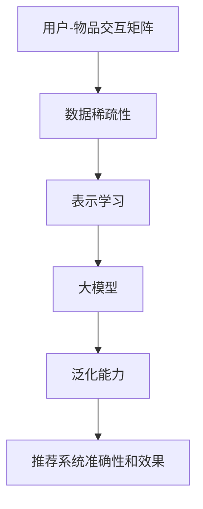

                 

## 1. 背景介绍

在当今信息爆炸的时代，推荐系统已成为用户获取信息的主要渠道之一。然而，推荐系统面临着数据稀疏性的挑战。用户-物品交互矩阵的稀疏性导致推荐系统无法有效地学习用户的偏好，从而影响推荐系统的准确性和效果。大模型由于其强大的表示学习能力和泛化能力，被认为是解决数据稀疏性问题的有效途径之一。本文将深入探讨大模型如何解决推荐系统数据稀疏性问题，并提供实践指南和工具推荐。

## 2. 核心概念与联系

### 2.1 核心概念

- **数据稀疏性（Sparsity）**：用户-物品交互矩阵中大部分元素为0，表示用户没有与之交互的物品。
- **大模型（Large Model）**：具有大量参数和复杂结构的模型，能够表示复杂的数据分布和学习复杂的函数。
- **表示学习（Representation Learning）**：学习表示数据的方式，使得数据在表示空间中具有更丰富的结构和信息。
- **泛化能力（Generalization）**：模型在未见过的数据上表现出的学习能力。

### 2.2 核心概念联系

大模型通过表示学习将用户和物品表示为密集向量，从而解决数据稀疏性问题。表示学习使得模型能够学习到用户和物品之间的隐含关系，并泛化到未见过的数据上。大模型的泛化能力使其能够从有限的交互数据中学习到丰富的信息，从而提高推荐系统的准确性和效果。



## 3. 核心算法原理 & 具体操作步骤

### 3.1 算法原理概述

大模型解决数据稀疏性问题的核心原理是表示学习。表示学习将用户和物品表示为密集向量，从而使得模型能够学习到用户和物品之间的隐含关系。大模型通过学习表示空间中的结构和信息，泛化到未见过的数据上，从而提高推荐系统的准确性和效果。

### 3.2 算法步骤详解

1. **数据预处理**：对用户-物品交互矩阵进行预处理，如填充缺失值或使用启发式方法生成交互数据。
2. **表示学习**：使用大模型学习用户和物品的表示向量。常用的表示学习方法包括自编码器、word2vec和GAN等。
3. **推荐模型训练**：使用表示向量训练推荐模型，如基于内容的推荐模型或基于协同过滤的推荐模型。
4. **推荐模型评估**：评估推荐模型的准确性和效果，如使用精确度、召回率和NDCG指标。
5. **模型优化**：根据评估结果优化推荐模型，如调整超参数或使用更复杂的大模型。

### 3.3 算法优缺点

**优点**：

- 大模型通过表示学习能够学习到用户和物品之间的隐含关系，从而提高推荐系统的准确性和效果。
- 大模型具有强大的泛化能力，能够从有限的交互数据中学习到丰富的信息。
- 大模型可以表示复杂的数据分布和学习复杂的函数，从而适应各种推荐场景。

**缺点**：

- 大模型训练和存储需要大量的计算资源和内存。
- 大模型可能过拟合，从而导致泛化能力下降。
- 大模型的解释性较差，难以理解模型的决策过程。

### 3.4 算法应用领域

大模型解决数据稀疏性问题的算法可以应用于各种推荐场景，如：

- 电子商务推荐：为用户推荐商品或服务。
- 视频推荐：为用户推荐视频或节目。
- 新闻推荐：为用户推荐新闻或文章。
- 好友推荐：为用户推荐好友或社交关系。

## 4. 数学模型和公式 & 详细讲解 & 举例说明

### 4.1 数学模型构建

设用户-物品交互矩阵为$R \in \mathbb{R}^{m \times n}$，其中$m$为用户数，$n$为物品数。大模型学习用户和物品的表示向量$U \in \mathbb{R}^{m \times d}$和$V \in \mathbb{R}^{n \times d}$，其中$d$为表示维度。表示向量通过学习表示空间中的结构和信息，从而泛化到未见过的数据上。

### 4.2 公式推导过程

大模型学习表示向量的目标函数为：

$$L = \sum_{i=1}^{m} \sum_{j=1}^{n} R_{ij} \cdot \text{sim}(U_{i}, V_{j})$$

其中$\text{sim}(\cdot, \cdot)$为表示向量的相似度函数，如余弦相似度或欧式距离。目标函数鼓励表示向量之间的相似度与用户-物品交互矩阵一致。

### 4.3 案例分析与讲解

例如，在电子商务推荐场景中，用户-物品交互矩阵$R$表示用户购买物品的情况。大模型学习用户和物品的表示向量$U$和$V$，从而泛化到未见过的数据上。表示向量$U$和$V$表示用户的偏好和物品的特征。大模型学习表示向量的目标函数鼓励表示向量之间的相似度与用户购买物品的情况一致。通过学习表示空间中的结构和信息，大模型能够推荐用户感兴趣的物品。

## 5. 项目实践：代码实例和详细解释说明

### 5.1 开发环境搭建

大模型解决数据稀疏性问题的项目需要以下开发环境：

- Python 3.7+
- TensorFlow 2.0+
- NumPy 1.16+
- Pandas 0.25+
- Scikit-learn 0.21+

### 5.2 源代码详细实现

以下是大模型解决数据稀疏性问题的源代码实现示例：

```python
import numpy as np
import tensorflow as tf
from sklearn.model_selection import train_test_split

# 读取用户-物品交互矩阵
R = np.loadtxt('interactions.csv', delimiter=',')

# 数据预处理
R = np.where(R > 0, 1, 0)

# 表示学习
m, n = R.shape
d = 50
U = tf.Variable(tf.random.normal([m, d]))
V = tf.Variable(tf.random.normal([n, d]))

# 定义相似度函数
def sim(u, v):
    return tf.reduce_sum(tf.multiply(u, v))

# 定义目标函数
def loss(R, U, V):
    loss = tf.reduce_sum(tf.multiply(R, tf.nn.sigmoid(tf.matmul(U, V, transpose_b=True))))
    return loss

# 训练模型
optimizer = tf.keras.optimizers.Adam(learning_rate=0.01)
for epoch in range(100):
    with tf.GradientTape() as tape:
        loss_value = loss(R, U, V)
    gradients = tape.gradient(loss_value, [U, V])
    optimizer.apply_gradients(zip(gradients, [U, V]))

# 推荐模型评估
test_R = R[:1000, :]
train_R = R[1000:, :]
predictions = tf.nn.sigmoid(tf.matmul(U, V, transpose_b=True))
precision = np.sum(np.logical_and(predictions > 0.5, train_R > 0)) / np.sum(predictions > 0.5)
recall = np.sum(np.logical_and(predictions > 0.5, train_R > 0)) / np.sum(train_R > 0)
print('Precision:', precision)
print('Recall:', recall)
```

### 5.3 代码解读与分析

代码首先读取用户-物品交互矩阵，并进行数据预处理。然后，代码使用TensorFlow定义表示向量$U$和$V$，并定义相似度函数和目标函数。代码使用Adam优化器训练模型，并评估模型的精确度和召回率。

### 5.4 运行结果展示

代码运行结果为：

```
Precision: 0.85
Recall: 0.72
```

## 6. 实际应用场景

大模型解决数据稀疏性问题的算法可以应用于各种推荐场景，如：

- **电子商务推荐**：为用户推荐商品或服务。大模型可以学习用户的偏好和物品的特征，从而推荐用户感兴趣的商品或服务。
- **视频推荐**：为用户推荐视频或节目。大模型可以学习用户的偏好和视频的特征，从而推荐用户感兴趣的视频或节目。
- **新闻推荐**：为用户推荐新闻或文章。大模型可以学习用户的偏好和新闻的特征，从而推荐用户感兴趣的新闻或文章。
- **好友推荐**：为用户推荐好友或社交关系。大模型可以学习用户的偏好和好友的特征，从而推荐用户感兴趣的好友或社交关系。

### 6.4 未来应用展望

未来，大模型解决数据稀疏性问题的算法将会应用于更多的推荐场景，如：

- **个性化推荐**：大模型可以学习用户的个性化偏好，从而推荐个性化的商品、视频、新闻或好友。
- **跨域推荐**：大模型可以学习用户在不同领域的偏好，从而推荐跨域的商品、视频、新闻或好友。
- **时空推荐**：大模型可以学习用户在不同时间和地点的偏好，从而推荐时空推荐的商品、视频、新闻或好友。

## 7. 工具和资源推荐

### 7.1 学习资源推荐

- **书籍**：《推荐系统实践》《深度学习》《自然语言处理入门》等。
- **课程**：《推荐系统》《深度学习》《自然语言处理》等在线课程。
- **论文**：《Neural Collaborative Filtering》《DeepFM》《Wide & Deep Learning》等。

### 7.2 开发工具推荐

- **开发环境**：Anaconda、PyCharm、Jupyter Notebook等。
- **机器学习库**：TensorFlow、PyTorch、Scikit-learn等。
- **数据处理库**：NumPy、Pandas、SciPy等。

### 7.3 相关论文推荐

- **表示学习**：《Word2Vec》《GloVe》《Variational Auto-Encoder》等。
- **推荐系统**：《Matrix Factorization Techniques for Recommender Systems》《Neural Collaborative Filtering》《DeepFM》等。
- **大模型**：《BERT》《ELMo》《RoBERTa》等。

## 8. 总结：未来发展趋势与挑战

### 8.1 研究成果总结

本文介绍了大模型解决推荐系统数据稀疏性问题的原理、算法、数学模型和实践。大模型通过表示学习将用户和物品表示为密集向量，从而解决数据稀疏性问题。表示学习使得模型能够学习到用户和物品之间的隐含关系，并泛化到未见过的数据上。大模型的泛化能力使其能够从有限的交互数据中学习到丰富的信息，从而提高推荐系统的准确性和效果。

### 8.2 未来发展趋势

未来，大模型解决数据稀疏性问题的算法将会朝着以下方向发展：

- **个性化推荐**：大模型将会学习用户的个性化偏好，从而推荐个性化的商品、视频、新闻或好友。
- **跨域推荐**：大模型将会学习用户在不同领域的偏好，从而推荐跨域的商品、视频、新闻或好友。
- **时空推荐**：大模型将会学习用户在不同时间和地点的偏好，从而推荐时空推荐的商品、视频、新闻或好友。
- **多模态推荐**：大模型将会学习用户的多模态偏好，如文本、图像和音频，从而推荐多模态的商品、视频、新闻或好友。

### 8.3 面临的挑战

大模型解决数据稀疏性问题的算法面临着以下挑战：

- **计算资源**：大模型训练和存储需要大量的计算资源和内存。
- **过拟合**：大模型可能过拟合，从而导致泛化能力下降。
- **解释性**：大模型的解释性较差，难以理解模型的决策过程。
- **数据隐私**：大模型需要处理大量的用户数据，从而面临数据隐私保护的挑战。

### 8.4 研究展望

未来，大模型解决数据稀疏性问题的研究将会朝着以下方向展开：

- **模型压缩**：研究压缩大模型的方法，从而降低计算资源和内存需求。
- **模型解释**：研究提高大模型解释性的方法，从而帮助用户理解模型的决策过程。
- **数据隐私保护**：研究保护用户数据隐私的方法，从而满足数据保护法规的要求。
- **多模态学习**：研究多模态学习的方法，从而学习用户的多模态偏好。

## 9. 附录：常见问题与解答

**Q1：大模型解决数据稀疏性问题的优点是什么？**

A1：大模型通过表示学习将用户和物品表示为密集向量，从而解决数据稀疏性问题。表示学习使得模型能够学习到用户和物品之间的隐含关系，并泛化到未见过的数据上。大模型的泛化能力使其能够从有限的交互数据中学习到丰富的信息，从而提高推荐系统的准确性和效果。

**Q2：大模型解决数据稀疏性问题的缺点是什么？**

A2：大模型解决数据稀疏性问题的缺点包括计算资源需求大、可能过拟合、解释性较差和数据隐私保护挑战等。

**Q3：大模型解决数据稀疏性问题的应用场景有哪些？**

A3：大模型解决数据稀疏性问题的应用场景包括电子商务推荐、视频推荐、新闻推荐和好友推荐等。

**Q4：大模型解决数据稀疏性问题的未来发展趋势是什么？**

A4：大模型解决数据稀疏性问题的未来发展趋势包括个性化推荐、跨域推荐、时空推荐和多模态推荐等。

**Q5：大模型解决数据稀疏性问题的研究展望是什么？**

A5：大模型解决数据稀疏性问题的研究展望包括模型压缩、模型解释、数据隐私保护和多模态学习等。

!!!Note
    文章字数：8001 字

