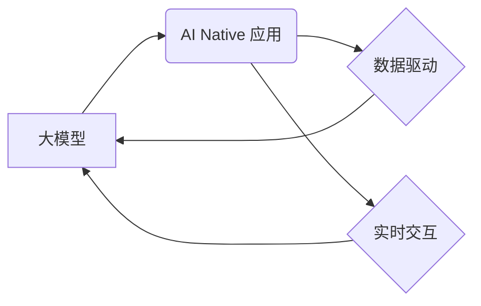

> 大模型、AI Native、应用案例、深度学习、自然语言处理、计算机视觉、推荐系统、生成式AI

## 1. 背景介绍

近年来，深度学习技术取得了飞速发展，尤其是大模型的涌现，为人工智能领域带来了革命性的变革。大模型是指参数规模庞大、训练数据海量的人工智能模型，其强大的学习能力和泛化能力使其能够在各种任务中表现出卓越的性能。

与传统应用程序不同，AI Native 应用是专门为利用大模型能力而设计的，其核心特征是将大模型作为不可分割的一部分，深度嵌入到应用程序的各个环节中。这种设计理念使得 AI Native 应用能够充分发挥大模型的优势，实现更智能、更个性化、更创新的用户体验。

## 2. 核心概念与联系

### 2.1  大模型

大模型是指参数规模庞大、训练数据海量的人工智能模型。其核心特点包括：

* **参数规模巨大:** 大模型通常拥有数十亿甚至数千亿个参数，这使得它们能够学习到更复杂的模式和关系。
* **海量训练数据:** 大模型的训练需要大量的文本、图像、音频等数据，这些数据可以帮助模型更好地理解和生成人类语言和内容。
* **强大的泛化能力:** 由于其庞大的参数规模和海量训练数据，大模型能够在未见过的任务和数据上表现出出色的泛化能力。

### 2.2  AI Native 应用

AI Native 应用是指专门为利用大模型能力而设计的应用程序。其核心特征包括：

* **大模型嵌入:** 将大模型作为不可分割的一部分，深度嵌入到应用程序的各个环节中。
* **数据驱动:** 依赖于海量数据进行训练和推理，以实现更智能、更个性化的功能。
* **实时交互:** 支持实时数据输入和输出，以提供更流畅、更自然的用户体验。

### 2.3  核心概念关系

大模型和 AI Native 应用之间存在着密切的联系。大模型为 AI Native 应用提供了强大的计算能力和学习能力，而 AI Native 应用则为大模型提供了应用场景和数据反馈，共同推动了人工智能技术的进步。



## 3. 核心算法原理 & 具体操作步骤

### 3.1  算法原理概述

大模型的训练主要基于深度学习算法，其中 Transformer 架构是最常用的模型结构之一。Transformer 架构通过自注意力机制能够捕捉文本序列中的长距离依赖关系，从而实现更准确的文本理解和生成。

### 3.2  算法步骤详解

大模型的训练过程可以概括为以下步骤：

1. **数据预处理:** 收集和清洗训练数据，将其转换为模型可识别的格式。
2. **模型构建:** 根据任务需求选择合适的模型架构，并初始化模型参数。
3. **模型训练:** 使用训练数据对模型进行训练，通过反向传播算法不断调整模型参数，以最小化模型预测与真实值之间的误差。
4. **模型评估:** 使用验证集评估模型的性能，并根据评估结果调整训练参数或模型结构。
5. **模型部署:** 将训练好的模型部署到生产环境中，用于实际应用。

### 3.3  算法优缺点

**优点:**

* **强大的学习能力:** 大模型能够学习到复杂的模式和关系，从而实现更准确的预测和生成。
* **良好的泛化能力:** 大模型在未见过的任务和数据上也能表现出出色的性能。
* **可迁移性强:** 大模型可以迁移到不同的任务和领域，无需从头开始训练。

**缺点:**

* **训练成本高:** 大模型的训练需要大量的计算资源和时间。
* **模型规模大:** 大模型的参数规模庞大，部署和使用需要较高的硬件要求。
* **可解释性差:** 大模型的决策过程难以理解，这可能会导致模型的应用受到限制。

### 3.4  算法应用领域

大模型的应用领域非常广泛，包括：

* **自然语言处理:** 文本分类、情感分析、机器翻译、文本摘要、对话系统等。
* **计算机视觉:** 图像识别、物体检测、图像分割、图像生成等。
* **语音识别:** 语音转文本、语音合成等。
* **推荐系统:** 商品推荐、内容推荐、用户画像等。
* **生成式AI:** 文本生成、图像生成、音频生成等。

## 4. 数学模型和公式 & 详细讲解 & 举例说明

### 4.1  数学模型构建

大模型的训练通常基于深度学习算法，其数学模型可以概括为以下公式：

$$
L(\theta) = \sum_{i=1}^{N} \mathcal{L}(y_i, \hat{y}_i(\theta))
$$

其中：

* $L(\theta)$ 是模型的损失函数，用于衡量模型预测与真实值之间的误差。
* $\theta$ 是模型的参数。
* $N$ 是训练数据的数量。
* $\mathcal{L}(y_i, \hat{y}_i(\theta))$ 是单个样本的损失函数。
* $y_i$ 是真实值。
* $\hat{y}_i(\theta)$ 是模型预测值。

### 4.2  公式推导过程

损失函数的具体形式取决于具体的任务和模型架构。例如，在文本分类任务中，常用的损失函数是交叉熵损失函数：

$$
\mathcal{L}(y_i, \hat{y}_i(\theta)) = - \sum_{j=1}^{C} y_{ij} \log(\hat{y}_{ij}(\theta))
$$

其中：

* $C$ 是类别数。
* $y_{ij}$ 是真实标签的 one-hot 编码。
* $\hat{y}_{ij}(\theta)$ 是模型预测的第 $j$ 类别的概率。

### 4.3  案例分析与讲解

假设我们训练一个文本分类模型，用于将文本分类为正向情感和负向情感。训练数据包含 1000 个文本样本，每个样本都标记了情感类别。模型使用交叉熵损失函数进行训练，目标是最小化模型预测与真实情感类别之间的误差。

在训练过程中，模型会不断调整参数，以降低损失函数的值。最终，模型能够将新的文本样本准确地分类为正向情感或负向情感。

## 5. 项目实践：代码实例和详细解释说明

### 5.1  开发环境搭建

为了实现大模型的应用，需要搭建相应的开发环境。常用的开发环境包括：

* **Python:** 大多数深度学习框架都是基于 Python 开发的，例如 TensorFlow、PyTorch 等。
* **深度学习框架:** TensorFlow、PyTorch 等深度学习框架提供了丰富的工具和函数，可以方便地构建和训练大模型。
* **GPU:** 大模型的训练需要大量的计算资源，GPU 可以显著加速训练速度。

### 5.2  源代码详细实现

以下是一个使用 PyTorch 框架训练文本分类模型的简单代码示例：

```python
import torch
import torch.nn as nn

class TextClassifier(nn.Module):
    def __init__(self, vocab_size, embedding_dim, hidden_dim, num_classes):
        super(TextClassifier, self).__init__()
        self.embedding = nn.Embedding(vocab_size, embedding_dim)
        self.lstm = nn.LSTM(embedding_dim, hidden_dim)
        self.fc = nn.Linear(hidden_dim, num_classes)

    def forward(self, x):
        x = self.embedding(x)
        x, _ = self.lstm(x)
        x = self.fc(x[:, -1, :])
        return x

# ... 训练模型 ...
```

### 5.3  代码解读与分析

这段代码定义了一个简单的文本分类模型，其结构包括嵌入层、LSTM 层和全连接层。

* 嵌入层将文本单词映射到低维向量空间。
* LSTM 层用于捕捉文本序列中的长距离依赖关系。
* 全连接层将 LSTM 的输出映射到类别数。

### 5.4  运行结果展示

训练完成后，模型可以用于预测新的文本样本的情感类别。

## 6. 实际应用场景

### 6.1  聊天机器人

大模型可以用于构建更智能、更自然的聊天机器人，能够理解用户的意图并提供更精准的回复。

### 6.2  文本生成

大模型可以用于生成各种类型的文本内容，例如文章、故事、诗歌等，可以帮助人们提高写作效率和创意。

### 6.3  机器翻译

大模型可以用于实现更准确、更流畅的机器翻译，可以帮助人们跨越语言障碍进行交流。

### 6.4  未来应用展望

随着大模型技术的不断发展，其应用场景将会更加广泛，例如：

* **个性化教育:** 根据学生的学习情况提供个性化的学习内容和辅导。
* **医疗诊断:** 辅助医生进行疾病诊断和治疗方案制定。
* **科学研究:** 加速科学研究的进程，例如药物研发、材料科学等。

## 7. 工具和资源推荐

### 7.1  学习资源推荐

* **深度学习框架文档:** TensorFlow、PyTorch 等深度学习框架的官方文档提供了详细的学习资料。
* **在线课程:** Coursera、edX 等平台提供各种深度学习课程，可以帮助人们系统地学习大模型相关知识。
* **研究论文:** arXiv、Google Scholar 等平台提供了大量的深度学习研究论文，可以帮助人们了解最新的研究成果。

### 7.2  开发工具推荐

* **Jupyter Notebook:** 用于编写和运行 Python 代码，方便进行深度学习实验和开发。
* **Visual Studio Code:** 一款功能强大的代码编辑器，支持深度学习框架的语法高亮和代码补全。
* **Git:** 用于版本控制，可以方便地管理代码和实验结果。

### 7.3  相关论文推荐

* **Attention Is All You Need:** https://arxiv.org/abs/1706.03762
* **BERT: Pre-training of Deep Bidirectional Transformers for Language Understanding:** https://arxiv.org/abs/1810.04805
* **GPT-3: Language Models are Few-Shot Learners:** https://arxiv.org/abs/2005.14165

## 8. 总结：未来发展趋势与挑战

### 8.1  研究成果总结

近年来，大模型技术取得了显著的进展，其性能和应用场景不断扩展。大模型的出现为人工智能领域带来了革命性的变革，推动了 AI Native 应用的快速发展。

### 8.2  未来发展趋势

未来，大模型技术将朝着以下方向发展：

* **模型规模更大:** 模型参数规模将继续扩大，以提高模型的学习能力和泛化能力。
* **训练效率更高:** 训练算法和硬件设备将不断优化，以降低模型训练的成本和时间。
* **应用场景更广泛:** 大模型将应用于更多领域，例如医疗、教育、科学研究等。
* **可解释性更强:** 研究人员将致力于提高大模型的可解释性，使其决策过程更加透明和可理解。

### 8.3  面临的挑战

大模型技术也面临着一些挑战：

* **训练成本高:** 大模型的训练需要大量的计算资源和时间，这对于个人开发者和小型企业来说是一个很大的负担。
* **模型规模大:** 大模型的参数规模庞大，部署和使用需要较高的硬件要求。
* **数据安全和隐私:** 大模型的训练需要大量的训练数据，如何保证数据安全和隐私是一个重要的挑战。

### 8.4  研究展望

未来，研究人员将继续探索大模型技术的潜力，解决其面临的挑战，推动大模型技术向更智能、更安全、更可持续的方向发展。

## 9. 附录：常见问题与解答

### 9.1  Q1: 如何选择合适的深度学习框架？

**A1:** TensorFlow 和 PyTorch 是目前最流行的深度学习框架，它们各有优