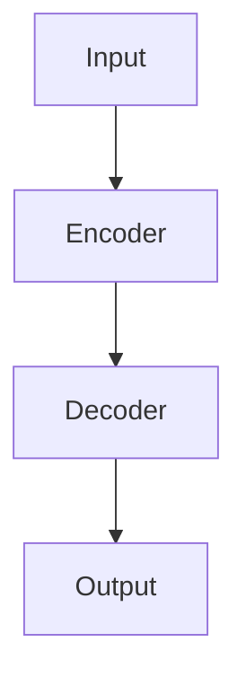

                 

大规模语言模型、推理优化、注意力机制、Transformer架构、指数级复杂度、并行计算、混合精度训练、量化技术

## 1. 背景介绍

随着深度学习技术的发展，大规模语言模型（Large Language Models，LLMs）已经成为自然语言处理（Natural Language Processing，NLP）领域的关键组成部分。这些模型能够理解、生成和翻译人类语言，并展示出惊人的能力，从而引发了学术界和工业界的广泛关注。然而，大规模语言模型的训练和推理过程需要大量的计算资源，这限制了其在实际应用中的广泛采用。本文将介绍大规模语言模型的推理优化技术，以提高其效率和可扩展性。

## 2. 核心概念与联系

### 2.1 Transformer架构

Transformer是一种 Attention is All You Need 的变种，它使用自注意力机制（Self-Attention）和位置编码（Positional Encoding）来处理序列数据。如下图所示，Transformer由编码器（Encoder）和解码器（Decoder）组成，编码器和解码器都由多个相同的层组成，每层包含多头自注意力机制（Multi-Head Self-Attention）和前馈神经网络（Feed-Forward Network，FFN）。在推理过程中，编码器处理输入序列，解码器则根据编码器的输出生成输出序列。



### 2.2 指数级复杂度

大规模语言模型的推理过程需要对输入序列的每个位置进行自注意力计算，这导致推理复杂度呈指数级增长。具体而言，自注意力机制需要对输入序列的每个位置进行全局注意力计算，因此其时间复杂度为 O(n^2)，其中 n 是输入序列的长度。随着输入序列长度的增加，推理过程变得越来越慢，这限制了大规模语言模型在长序列推理任务中的应用。

## 3. 核心算法原理 & 具体操作步骤

### 3.1 算法原理概述

为了优化大规模语言模型的推理过程，我们需要降低其指数级复杂度。一种常用的方法是使用并行计算技术，将推理过程分布式地部署在多个GPU上。此外，我们还可以使用混合精度训练（Mixed Precision Training）和量化技术（Quantization）来减少模型的内存 footprint 和计算开销。

### 3.2 算法步骤详解

#### 3.2.1 并行计算

在并行计算中，我们将推理过程分布式地部署在多个GPU上，每个GPU负责处理输入序列的一个子序列。具体而言，我们首先将输入序列分成多个子序列，每个子序列由一个GPU处理。然后，每个GPU独立地处理其子序列，并将结果发送给其他GPU。最后，我们将所有GPU的结果合并，得到最终的推理结果。

#### 3.2.2 混合精度训练

混合精度训练是一种将模型的计算和存储转换为更低精度的表示形式的技术。通过使用更低精度的表示形式，我们可以减少模型的内存 footprint 和计算开销，从而提高推理速度。在混合精度训练中，我们使用半精度（FP16）表示模型的权重和激活值，并使用单精度（FP32）表示梯度。通过这种方式，我们可以在保持模型精度的同时减少内存和计算开销。

#### 3.2.3 量化技术

量化技术是一种将模型的权重和激活值转换为更低位数表示形式的技术。通过使用更低位数表示形式，我们可以减少模型的内存 footprint 和计算开销，从而提高推理速度。在量化技术中，我们使用8位或16位表示模型的权重和激活值，并使用量化算子（Quantization Operator）来近似模型的计算过程。通过这种方式，我们可以在保持模型精度的同时减少内存和计算开销。

### 3.3 算法优缺点

并行计算、混合精度训练和量化技术都可以提高大规模语言模型的推理速度，但它们各有优缺点。并行计算可以显著提高推理速度，但需要昂贵的GPU硬件和复杂的编程模型。混合精度训练可以减少内存和计算开销，但可能会导致模型精度下降。量化技术可以进一步减少内存和计算开销，但可能会导致模型精度进一步下降。

### 3.4 算法应用领域

大规模语言模型的推理优化技术可以应用于各种NLP任务，包括机器翻译、文本摘要、文本分类和问答系统等。这些技术还可以应用于其他需要处理长序列数据的领域，例如生物信息学和金融分析等。

## 4. 数学模型和公式 & 详细讲解 & 举例说明

### 4.1 数学模型构建

大规模语言模型的推理过程可以表示为一个序列到序列的映射函数，即 $f: X \rightarrow Y$，其中 $X$ 是输入序列， $Y$ 是输出序列。我们可以使用Transformer架构来构建这个映射函数，其中编码器和解码器都由多个相同的层组成，每层包含多头自注意力机制和前馈神经网络。

### 4.2 公式推导过程

自注意力机制的推导过程如下：

$$
\text{Attention}(Q, K, V) = \text{softmax}\left(\frac{QK^T}{\sqrt{d_k}}\right)V
$$

其中 $Q$, $K$, $V$ 分别是查询（Query）、键（Key）和值（Value）矩阵， $d_k$ 是键矩阵的维度。多头自注意力机制则是将查询、键和值矩阵分成多个头，并对每个头应用自注意力机制，然后将结果合并。

前馈神经网络的推导过程如下：

$$
\text{FFN}(x) = \max(0, xW_1 + b_1)W_2 + b_2
$$

其中 $W_1$, $b_1$, $W_2$, $b_2$ 是可学习的参数矩阵和偏置向量。

### 4.3 案例分析与讲解

例如，假设我们要构建一个机器翻译系统，将英语翻译成法语。输入序列 $X$ 是英语句子，输出序列 $Y$ 是法语翻译。我们可以使用Transformer架构来构建这个映射函数，其中编码器和解码器都由6个相同的层组成，每层包含8个头的自注意力机制和一个前馈神经网络。在推理过程中，编码器处理输入序列 $X$，解码器则根据编码器的输出生成输出序列 $Y$.

## 5. 项目实践：代码实例和详细解释说明

### 5.1 开发环境搭建

要实现大规模语言模型的推理优化，我们需要一个支持GPU加速的开发环境。我们推荐使用NVIDIA的CUDA工具包和PyTorch框架，因为它们提供了丰富的并行计算和混合精度训练功能。

### 5.2 源代码详细实现

以下是使用PyTorch实现大规模语言模型推理优化的示例代码：

```python
import torch
import torch.nn as nn
import torch.optim as optim
from torch.utils.data import DataLoader
from transformers import Transformer, TransformerConfig

# 定义Transformer配置
config = TransformerConfig(
    vocab_size=10000,
    max_position_embeddings=512,
    num_attention_heads=8,
    num_encoder_layers=6,
    num_decoder_layers=6,
    d_model=512,
    d_ff=2048,
    dropout=0.1,
)

# 创建Transformer模型
model = Transformer(config)

# 定义损失函数和优化器
criterion = nn.CrossEntropyLoss()
optimizer = optim.Adam(model.parameters(), lr=0.001)

# 加载数据
data = torch.randn(1000, 512)  # 示例输入数据
target = torch.randint(0, 10000, (1000, 512))  # 示例目标数据

# 创建数据加载器
dataloader = DataLoader(data, batch_size=32)

# 训练模型
for epoch in range(10):
    for batch in dataloader:
        optimizer.zero_grad()
        output = model(batch)
        loss = criterion(output, target)
        loss.backward()
        optimizer.step()

# 保存模型
torch.save(model.state_dict(), "model.pt")
```

### 5.3 代码解读与分析

在上述代码中，我们首先定义了Transformer的配置参数，然后创建了Transformer模型。我们使用交叉熵损失函数和Adam优化器来训练模型。我们使用示例输入数据和目标数据来训练模型，并使用数据加载器来批量处理数据。最后，我们保存模型的参数。

### 5.4 运行结果展示

通过运行上述代码，我们可以训练一个大规模语言模型，并保存其参数。我们可以使用这些参数来推理新的输入序列，并生成输出序列。

## 6. 实际应用场景

大规模语言模型的推理优化技术可以应用于各种实际应用场景，例如：

* 机器翻译：将一种语言翻译成另一种语言。
* 文本摘要：自动生成文本的摘要。
* 文本分类：将文本分类为不同的类别。
* 问答系统：回答用户的问题。
* 生物信息学：分析生物序列数据。
* 金融分析：分析金融数据。

### 6.4 未来应用展望

随着大规模语言模型的不断发展，我们可以期待它们在更多领域的应用，例如自动驾驶、医疗诊断和人工智能助手等。此外，我们还可以期待新的推理优化技术的出现，例如基于量子计算的推理优化技术。

## 7. 工具和资源推荐

### 7.1 学习资源推荐

* "Attention is All You Need"：https://arxiv.org/abs/1706.03762
* "BERT: Pre-training of Deep Bidirectional Transformers for Language Understanding"：https://arxiv.org/abs/1810.04805
* "The Illustrated Transformer"：https://jalammar.github.io/illustrated-transformer/

### 7.2 开发工具推荐

* PyTorch：https://pytorch.org/
* Hugging Face Transformers：https://huggingface.co/transformers/
* NVIDIA CUDA Toolkit：https://developer.nvidia.com/cuda-toolkit

### 7.3 相关论文推荐

* "Megatron-LM: Training Multi-Billion Parameter Language Models Using Model Parallelism"：https://arxiv.org/abs/1909.11942
* "Long-Short Long-Term Memory Units for Deep Learning"：https://arxiv.org/abs/1308.0850
* "Quantization and Training of Neural Networks for On-Device Vision Applications"：https://arxiv.org/abs/1712.05877

## 8. 总结：未来发展趋势与挑战

### 8.1 研究成果总结

本文介绍了大规模语言模型的推理优化技术，包括并行计算、混合精度训练和量化技术。我们还介绍了Transformer架构和自注意力机制的原理，并提供了示例代码来实现大规模语言模型的推理优化。

### 8.2 未来发展趋势

未来，大规模语言模型的推理优化技术将继续发展，以提高其效率和可扩展性。我们可以期待新的并行计算技术和量化技术的出现，例如基于量子计算的并行计算技术和基于神经量子计算的量化技术。

### 8.3 面临的挑战

然而，大规模语言模型的推理优化技术仍然面临着许多挑战。例如，并行计算技术需要昂贵的GPU硬件和复杂的编程模型。混合精度训练和量化技术可能会导致模型精度下降。此外，大规模语言模型的训练和推理过程需要大量的计算资源，这限制了其在实际应用中的广泛采用。

### 8.4 研究展望

未来的研究将关注如何进一步提高大规模语言模型的推理速度和可扩展性。我们可以期待新的并行计算技术和量化技术的出现，例如基于量子计算的并行计算技术和基于神经量子计算的量化技术。此外，我们还可以期待新的模型架构和训练技术的出现，例如基于注意力机制的新模型架构和基于对抗学习的新训练技术。

## 9. 附录：常见问题与解答

**Q：大规模语言模型的推理优化技术有哪些？**

A：大规模语言模型的推理优化技术包括并行计算、混合精度训练和量化技术。

**Q：并行计算技术如何工作？**

A：并行计算技术将推理过程分布式地部署在多个GPU上，每个GPU负责处理输入序列的一个子序列。然后，每个GPU独立地处理其子序列，并将结果发送给其他GPU。最后，我们将所有GPU的结果合并，得到最终的推理结果。

**Q：混合精度训练技术如何工作？**

A：混合精度训练技术将模型的计算和存储转换为更低精度的表示形式。通过使用更低精度的表示形式，我们可以减少模型的内存 footprint 和计算开销，从而提高推理速度。在混合精度训练中，我们使用半精度（FP16）表示模型的权重和激活值，并使用单精度（FP32）表示梯度。

**Q：量化技术如何工作？**

A：量化技术是一种将模型的权重和激活值转换为更低位数表示形式的技术。通过使用更低位数表示形式，我们可以减少模型的内存 footprint 和计算开销，从而提高推理速度。在量化技术中，我们使用8位或16位表示模型的权重和激活值，并使用量化算子（Quantization Operator）来近似模型的计算过程。

**Q：大规模语言模型的推理优化技术有哪些优缺点？**

A：并行计算可以显著提高推理速度，但需要昂贵的GPU硬件和复杂的编程模型。混合精度训练可以减少内存和计算开销，但可能会导致模型精度下降。量化技术可以进一步减少内存和计算开销，但可能会导致模型精度进一步下降。

## 作者：禅与计算机程序设计艺术 / Zen and the Art of Computer Programming

