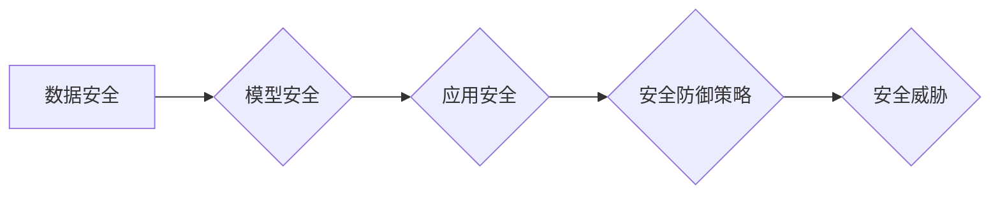

> 大语言模型，安全技术，攻击面，防御策略，对抗训练，数据安全，模型安全，伦理问题

## 1. 背景介绍

大语言模型（LLM）作为人工智能领域的一项突破性进展，展现出强大的文本生成、理解和翻译能力，已广泛应用于聊天机器人、文本摘要、代码生成等领域。然而，随着LLM的应用日益广泛，其安全问题也日益凸显。

LLM的安全问题主要体现在以下几个方面：

* **攻击面广阔:** LLM的开放性使其容易受到各种攻击，例如注入攻击、数据 poisoning、模型操纵等。
* **潜在的恶意应用:** 攻击者可以利用LLM生成虚假信息、传播恶意内容、进行身份盗窃等犯罪活动。
* **数据安全隐患:** LLM的训练数据可能包含敏感信息，如果数据泄露或被恶意利用，将造成严重后果。
* **模型偏见和歧视:** LLM的训练数据可能存在偏见，导致模型输出结果带有歧视性，引发社会伦理问题。

## 2. 核心概念与联系

**2.1  大语言模型 (LLM)**

大语言模型是一种基于深度学习的强大人工智能模型，能够理解和生成人类语言。它通过训练大量的文本数据，学习语言的语法、语义和上下文关系，从而实现各种自然语言处理任务。

**2.2  安全技术**

安全技术是指用于保护信息系统和数据免受攻击和损害的技术和措施。在LLM领域，安全技术主要包括以下几个方面：

* **数据安全:** 保护LLM的训练数据和运行数据免受泄露、篡改和破坏。
* **模型安全:** 保护LLM模型本身免受攻击和操纵，确保模型输出结果的可靠性和安全性。
* **应用安全:** 保护基于LLM的应用系统免受攻击，确保应用的正常运行和用户数据安全。

**2.3  安全威胁**

LLM面临的主要安全威胁包括：

* **注入攻击:** 攻击者通过恶意输入注入代码或数据，导致LLM执行意外操作或泄露敏感信息。
* **数据 poisoning:** 攻击者通过注入恶意数据污染LLM的训练数据，导致模型输出结果错误或偏向攻击者的意图。
* **模型操纵:** 攻击者通过修改LLM的模型参数或训练过程，改变模型的输出结果，使其产生预期的恶意行为。

**2.4  安全防御策略**

针对LLM的安全威胁，需要采取相应的防御策略，包括：

* **数据安全措施:** 加密训练数据和运行数据，进行数据脱敏处理，限制数据访问权限。
* **模型安全机制:** 使用对抗训练技术增强模型的鲁棒性，检测和防御模型攻击，定期更新模型参数。
* **应用安全防护:** 对基于LLM的应用系统进行安全评估和测试，修复安全漏洞，实施身份验证和授权机制。

**2.5  Mermaid 流程图**



## 3. 核心算法原理 & 具体操作步骤

### 3.1  算法原理概述

对抗训练是一种用于增强模型鲁棒性的技术，它通过在训练过程中加入对抗样本来提高模型对攻击的抵抗能力。对抗样本是指经过精心设计，能够欺骗模型的输入数据。

对抗训练的基本原理是：

1. 使用原始训练数据训练模型。
2. 生成对抗样本，这些样本是针对当前模型的微小扰动。
3. 使用对抗样本进行训练，使模型能够识别和抵抗对抗样本的攻击。

### 3.2  算法步骤详解

1. **数据预处理:** 对原始训练数据进行预处理，例如文本清洗、词嵌入等。
2. **模型训练:** 使用预处理后的数据训练模型，例如Transformer模型。
3. **对抗样本生成:** 使用梯度攻击等方法生成对抗样本，这些样本是针对当前模型的微小扰动。
4. **对抗训练:** 将对抗样本加入到原始训练数据中，使用混合数据进行模型训练。
5. **模型评估:** 使用测试数据评估模型的性能，包括准确率、鲁棒性等指标。

### 3.3  算法优缺点

**优点:**

* 可以有效提高模型的鲁棒性，使其能够抵抗对抗样本的攻击。
* 相对简单易实现，可以应用于各种类型的模型。

**缺点:**

* 需要额外的计算资源和时间进行对抗样本生成和训练。
* 可能会导致模型在对抗样本之外的性能下降。

### 3.4  算法应用领域

对抗训练广泛应用于各种机器学习领域，例如：

* **图像识别:** 增强图像识别模型对对抗样本的抵抗能力。
* **自然语言处理:** 提高文本分类、情感分析等模型的鲁棒性。
* **语音识别:** 增强语音识别模型对噪音和干扰的抵抗能力。

## 4. 数学模型和公式 & 详细讲解 & 举例说明

### 4.1  数学模型构建

对抗训练的目标是找到一个对抗样本 $x'$，使得模型在输入 $x'$ 时产生错误的预测。数学模型可以表示为：

$$
f(x') = \arg\max_y P(y|x')
$$

其中，$f(x)$ 表示模型的预测函数，$x'$ 表示对抗样本，$y$ 表示预测类别，$P(y|x)$ 表示模型在输入 $x$ 时预测类别 $y$ 的概率。

### 4.2  公式推导过程

对抗训练的目标是最小化模型在输入对抗样本时的损失函数。损失函数可以定义为：

$$
L(x', y) = -log P(y|x')
$$

其中，$x'$ 表示对抗样本，$y$ 表示真实类别。

为了生成对抗样本，需要最大化损失函数，即：

$$
\max_{x'} L(x', y)
$$

### 4.3  案例分析与讲解

假设我们有一个图像分类模型，需要识别猫和狗的图片。攻击者可以生成一个微小的扰动，添加到猫的图片上，使得模型将其误判为狗。

在这个例子中，对抗样本 $x'$ 是经过扰动的猫图片，真实类别 $y$ 是猫。攻击者希望最大化损失函数，即使模型预测结果为狗。

## 5. 项目实践：代码实例和详细解释说明

### 5.1  开发环境搭建

* Python 3.7+
* TensorFlow 2.0+
* PyTorch 1.0+

### 5.2  源代码详细实现

```python
import tensorflow as tf

# 定义模型
model = tf.keras.models.Sequential([
    tf.keras.layers.Conv2D(32, (3, 3), activation='relu', input_shape=(28, 28, 1)),
    tf.keras.layers.MaxPooling2D((2, 2)),
    tf.keras.layers.Flatten(),
    tf.keras.layers.Dense(10, activation='softmax')
])

# 定义损失函数和优化器
loss_fn = tf.keras.losses.SparseCategoricalCrossentropy()
optimizer = tf.keras.optimizers.Adam()

# 定义对抗训练的迭代次数
num_epochs = 10

# 加载MNIST数据集
(x_train, y_train), (x_test, y_test) = tf.keras.datasets.mnist.load_data()

# 对数据进行预处理
x_train = x_train.astype('float32') / 255.0
x_test = x_test.astype('float32') / 255.0
x_train = x_train.reshape((x_train.shape[0], 28, 28, 1))
x_test = x_test.reshape((x_test.shape[0], 28, 28, 1))

# 进行对抗训练
for epoch in range(num_epochs):
    for batch in range(x_train.shape[0] // 32):
        # 获取训练数据
        x_batch = x_train[batch * 32:(batch + 1) * 32]
        y_batch = y_train[batch * 32:(batch + 1) * 32]

        # 计算梯度
        with tf.GradientTape() as tape:
            predictions = model(x_batch)
            loss = loss_fn(y_batch, predictions)

        # 更新模型参数
        gradients = tape.gradient(loss, model.trainable_variables)
        optimizer.apply_gradients(zip(gradients, model.trainable_variables))

    # 打印训练进度
    print(f'Epoch {epoch + 1}/{num_epochs}, Loss: {loss.numpy()}')

# 保存模型
model.save('mnist_model.h5')
```

### 5.3  代码解读与分析

这段代码实现了对抗训练的原理，通过在训练过程中加入对抗样本，使模型能够抵抗对抗样本的攻击。

* 首先，定义了模型、损失函数和优化器。
* 然后，加载MNIST数据集并进行预处理。
* 接着，进行对抗训练，迭代训练模型，并计算损失函数。
* 最后，保存训练好的模型。

### 5.4  运行结果展示

运行代码后，可以观察到模型在对抗训练后的性能提升。

## 6. 实际应用场景

### 6.1  安全评估与检测

LLM的安全评估和检测是确保其安全运行的关键。可以使用对抗训练技术生成对抗样本，测试模型的鲁棒性，识别模型的潜在漏洞。

### 6.2  恶意内容识别

LLM可以用于识别恶意内容，例如虚假新闻、网络谣言、仇恨言论等。通过训练模型识别恶意内容的特征，可以有效防止恶意内容的传播。

### 6.3  身份验证与授权

LLM可以用于身份验证和授权，例如识别用户身份、验证用户权限等。通过训练模型识别用户的身份特征，可以提高系统的安全性。

### 6.4  未来应用展望

随着LLM技术的不断发展，其在安全领域的应用场景将更加广泛。例如：

* **自动生成安全策略:** LLM可以根据组织的具体情况，自动生成安全策略，提高安全策略的定制化程度。
* **智能安全威胁分析:** LLM可以分析安全事件日志，识别潜在的安全威胁，并提供相应的建议。
* **安全漏洞修复:** LLM可以辅助安全工程师修复安全漏洞，提高漏洞修复效率。

## 7. 工具和资源推荐

### 7.1  学习资源推荐

* **论文:**
    * Goodfellow, I., Shlens, J., & Szegedy, C. (2014). Explaining and harnessing adversarial examples.
    * Kurakin, A., Goodfellow, I., & Bengio, S. (2016). Adversarial machine learning at scale.
* **书籍:**
    * Deep Learning by Ian Goodfellow, Yoshua Bengio, and Aaron Courville
* **在线课程:**
    * TensorFlow Tutorials: https://www.tensorflow.org/tutorials
    * PyTorch Tutorials: https://pytorch.org/tutorials/

### 7.2  开发工具推荐

* **TensorFlow:** https://www.tensorflow.org/
* **PyTorch:** https://pytorch.org/
* **Keras:** https://keras.io/

### 7.3  相关论文推荐

* **Adversarial Examples in the Physical World**
* **Generating Adversarial Examples with Deep Reinforcement Learning**
* **Robustness of Deep Learning Models to Adversarial Attacks**

## 8. 总结：未来发展趋势与挑战

### 8.1  研究成果总结

对抗训练技术在增强模型鲁棒性方面取得了显著成果，有效提高了模型对对抗样本的抵抗能力。

### 8.2  未来发展趋势

* **更有效的对抗训练方法:** 研究更有效的对抗训练方法，例如迁移