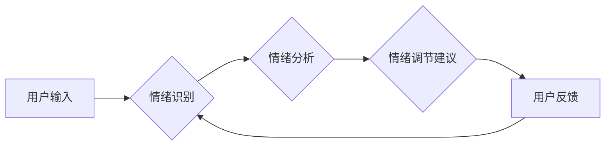

> 情绪管理, 情绪识别, 情绪调节, 人工智能, 算法, 心理学, 认知行为疗法, 编程思维

## 1. 背景介绍

在当今快速发展的社会，我们每个人都面临着来自工作、生活、人际关系等方面的压力。这些压力会引发各种负面情绪，例如焦虑、愤怒、悲伤等，从而影响我们的身心健康和生活质量。情绪管理，即有效识别、理解和调节自己的情绪，已成为现代人必备的生活技能。

传统的认知行为疗法（CBT）为情绪管理提供了理论基础和实践方法，但其需要专业的指导和较长的学习时间。近年来，随着人工智能（AI）技术的快速发展，AI技术在情绪管理领域也展现出巨大的潜力。AI算法能够分析用户的语言、表情、生理信号等数据，识别用户的当前情绪状态，并提供个性化的情绪调节建议。

## 2. 核心概念与联系

情绪管理的核心概念包括：

* **情绪识别:** 准确识别用户的当前情绪状态，例如快乐、悲伤、愤怒、焦虑等。
* **情绪调节:** 通过认知、行为或生理手段，改变用户的负面情绪，使其更加积极健康。
* **情绪反馈:** 向用户提供情绪状态的反馈，帮助用户更好地了解和管理自己的情绪。

AI技术在情绪管理中的应用可以概括为以下流程：



## 3. 核心算法原理 & 具体操作步骤

### 3.1  算法原理概述

情绪识别算法通常基于以下技术：

* **自然语言处理（NLP）:** 分析用户的文本输入，识别情绪相关的关键词和表达方式。
* **机器学习（ML）:** 利用训练数据，训练模型识别不同情绪状态的特征。
* **深度学习（DL）:** 使用深度神经网络，提取更复杂的特征，提高情绪识别的准确率。

### 3.2  算法步骤详解

1. **数据收集:** 收集大量文本数据，例如社交媒体帖子、聊天记录、电子邮件等，并标注其对应的情绪标签。
2. **数据预处理:** 对文本数据进行清洗、分词、词干提取等预处理操作，以便于模型训练。
3. **模型训练:** 选择合适的机器学习或深度学习模型，利用预处理后的数据进行训练，学习情绪识别的特征。
4. **模型评估:** 使用测试数据评估模型的性能，例如准确率、召回率、F1-score等。
5. **模型部署:** 将训练好的模型部署到实际应用场景中，例如聊天机器人、情绪监测系统等。

### 3.3  算法优缺点

**优点:**

* **自动化:** 可以自动识别用户的情绪状态，无需人工干预。
* **效率:** 可以快速处理大量数据，提高情绪识别的效率。
* **准确率:** 深度学习算法能够识别更复杂的特征，提高情绪识别的准确率。

**缺点:**

* **数据依赖:** 需要大量高质量的训练数据，否则模型性能会下降。
* **解释性:** 深度学习模型的内部机制较为复杂，难以解释其决策过程。
* **文化差异:** 不同文化背景下，情绪表达方式可能存在差异，需要针对不同文化进行模型训练。

### 3.4  算法应用领域

情绪识别算法在以下领域具有广泛的应用前景：

* **心理健康:** 帮助识别抑郁、焦虑等心理疾病的早期症状，提供及时干预。
* **教育:** 了解学生的学习情绪，提供个性化的学习建议。
* **营销:** 分析用户的购买情绪，提供更精准的营销服务。
* **客服:** 自动识别用户的客服需求，提供更快速、更有效的服务。

## 4. 数学模型和公式 & 详细讲解 & 举例说明

### 4.1  数学模型构建

情绪识别模型通常采用分类模型，将用户的输入映射到不同的情绪类别。常用的分类模型包括支持向量机（SVM）、逻辑回归（LR）、决策树（DT）等。

### 4.2  公式推导过程

例如，使用逻辑回归模型进行情绪识别，其目标是学习一个参数向量 $w$，使得模型能够准确地预测用户的输入属于不同情绪类别的概率。

逻辑回归模型的输出为：

$$
p(y=k|x) = \frac{e^{w_k^T x}}{1 + \sum_{j=1}^{C} e^{w_j^T x}}
$$

其中：

* $p(y=k|x)$ 表示用户输入 $x$ 属于类别 $k$ 的概率。
* $w_k$ 表示类别 $k$ 的参数向量。
* $C$ 表示情绪类别的总数。

模型参数 $w$ 通过最大似然估计（MLE）方法进行训练，其目标函数为：

$$
L(w) = -\sum_{i=1}^{N} \log p(y_i|x_i)
$$

其中：

* $N$ 表示训练样本的数量。
* $y_i$ 表示第 $i$ 个样本的真实情绪类别。
* $x_i$ 表示第 $i$ 个样本的输入特征。

### 4.3  案例分析与讲解

假设我们训练了一个情绪识别模型，用于识别用户文本输入的情绪类别，包括“快乐”、“悲伤”、“愤怒”三种类别。

当用户输入“今天天气真好，心情很愉悦！”时，模型会输出“快乐”类别的概率较高，因为该文本包含了“天气真好”、“心情很愉悦”等快乐相关的关键词。

## 5. 项目实践：代码实例和详细解释说明

### 5.1  开发环境搭建

* Python 3.x
* TensorFlow 或 PyTorch 深度学习框架
* NLTK 自然语言处理库
* scikit-learn 机器学习库

### 5.2  源代码详细实现

```python
import tensorflow as tf

# 定义模型结构
model = tf.keras.models.Sequential([
    tf.keras.layers.Embedding(input_dim=vocab_size, output_dim=embedding_dim),
    tf.keras.layers.LSTM(units=128),
    tf.keras.layers.Dense(units=num_classes, activation='softmax')
])

# 编译模型
model.compile(optimizer='adam',
              loss='sparse_categorical_crossentropy',
              metrics=['accuracy'])

# 训练模型
model.fit(x_train, y_train, epochs=10, batch_size=32)

# 评估模型
loss, accuracy = model.evaluate(x_test, y_test)
print('Loss:', loss)
print('Accuracy:', accuracy)
```

### 5.3  代码解读与分析

* **Embedding层:** 将单词映射到低维向量空间，提取单词的语义信息。
* **LSTM层:** 长短期记忆网络，能够捕捉文本序列中的长距离依赖关系。
* **Dense层:** 全连接层，将 LSTM 层的输出映射到不同的情绪类别。
* **softmax激活函数:** 将模型输出转换为概率分布，表示每个情绪类别的概率。

### 5.4  运行结果展示

训练完成后，可以使用模型对新的文本输入进行情绪识别，并输出对应的概率分布。

## 6. 实际应用场景

### 6.1  心理健康领域

* **抑郁症筛查:** 分析用户的社交媒体帖子或聊天记录，识别抑郁症的早期症状。
* **焦虑症管理:** 提供个性化的放松技巧和情绪调节建议，帮助用户缓解焦虑情绪。
* **心理咨询:** 开发情绪识别辅助的聊天机器人，提供24小时的心理咨询服务。

### 6.2  教育领域

* **学生情绪监测:** 分析学生的课堂参与度和作业完成情况，识别学生的学习情绪和压力水平。
* **个性化学习:** 根据学生的学习情绪，提供个性化的学习建议和学习资源。
* **师生互动:** 帮助老师更好地理解学生的学习需求和情绪状态，促进师生互动。

### 6.3  营销领域

* **客户情绪分析:** 分析用户的评论、反馈和社交媒体互动，了解用户的购买情绪和产品体验。
* **精准营销:** 根据用户的购买情绪，提供个性化的产品推荐和营销服务。
* **品牌形象管理:** 监控用户的对品牌的评价和情绪，及时调整品牌策略。

### 6.4  未来应用展望

随着人工智能技术的不断发展，情绪管理技术将应用于更广泛的领域，例如：

* **医疗保健:** 帮助医生识别患者的情绪状态，提供更精准的医疗服务。
* **金融服务:** 分析用户的投资情绪，提供更有效的理财建议。
* **人机交互:** 开发更智能、更人性化的机器人和虚拟助手。

## 7. 工具和资源推荐

### 7.1  学习资源推荐

* **书籍:**
    * 《深度学习》
    * 《自然语言处理》
    * 《认知行为疗法》
* **在线课程:**
    * Coursera
    * edX
    * Udacity

### 7.2  开发工具推荐

* **TensorFlow:** 开源深度学习框架
* **PyTorch:** 开源深度学习框架
* **NLTK:** 自然语言处理库
* **scikit-learn:** 机器学习库

### 7.3  相关论文推荐

* **Emotion Recognition Using Deep Learning:** https://arxiv.org/abs/1803.06947
* **A Survey on Emotion Recognition Using Textual Data:** https://arxiv.org/abs/1903.04977

## 8. 总结：未来发展趋势与挑战

### 8.1  研究成果总结

近年来，AI技术在情绪管理领域取得了显著的进展，例如：

* **情绪识别准确率的提高:** 深度学习算法能够识别更复杂的特征，提高情绪识别的准确率。
* **情绪调节方法的丰富:** AI技术可以提供个性化的情绪调节建议，例如放松技巧、认知重构等。
* **情绪管理工具的普及:** 越来越多的情绪管理工具应用于手机、智能手表等设备，方便用户随时随地进行情绪管理。

### 8.2  未来发展趋势

* **多模态情绪识别:** 将文本、语音、表情、生理信号等多模态数据融合，提高情绪识别的准确性和鲁棒性。
* **个性化情绪管理:** 基于用户的个人特征和情绪数据，提供更精准、更有效的个性化情绪管理方案。
* **情绪管理干预:** 开发基于AI的智能情绪管理干预系统，帮助用户克服负面情绪，提升心理健康水平。

### 8.3  面临的挑战

* **数据隐私和安全:** 情绪识别技术需要收集用户的个人数据，因此需要确保数据的隐私和安全。
* **算法偏见:** 训练数据可能存在偏见，导致模型输出存在偏差，需要进行算法公平性评估和改进。
* **伦理问题:** AI技术在情绪管理领域的应用可能引发伦理问题，例如用户自主权、数据滥用等，需要进行深入的伦理探讨和规范。

### 8.4  研究展望

未来，AI技术将继续推动情绪管理领域的进步，为人们提供更智能、更便捷、更有效的情绪管理工具和服务。


## 9. 附录：常见问题与解答

**1. 情绪识别技术是否准确？**

情绪识别技术的准确率取决于多种因素，例如训练数据质量、模型复杂度、情绪表达方式等。目前，情绪识别技术的准确率已经取得了显著的进步，但仍存在一定的误差。

**2. 情绪识别技术会侵犯用户的隐私吗？**

情绪识别技术需要收集用户的个人数据，因此需要确保数据的隐私和安全。开发和应用情绪识别技术时，需要遵循相关法律法规和伦理规范，保护用户的隐私权。

**3. 如何使用情绪识别技术进行情绪管理？**

可以使用情绪识别辅助的应用程序或工具，例如聊天机器人、情绪监测系统等，帮助用户识别自己的情绪状态，并提供个性化的情绪调节建议。

**4. 情绪识别技术有哪些应用场景？**

情绪识别技术可以应用于心理健康、教育、营销