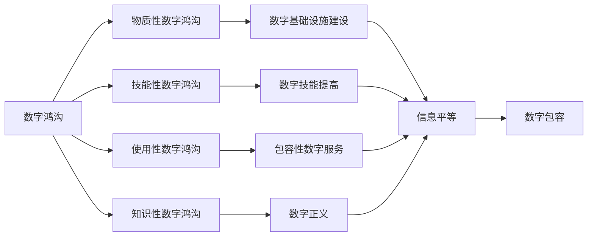

                 

数字鸿沟、信息平等、数字包容、数字红利、数字化转型、数字基础设施、数字技能、数字分化、数字正义

## 1. 背景介绍

在过去几十年里，数字技术的发展和应用带来了巨大的红利，推动了经济增长和社会进步。然而，这些红利并没有平均分配，而是导致了数字鸿沟的扩大。数字鸿沟是指在数字化转型过程中，不同人群、地区和国家之间在数字技能、数字基础设施和数字服务的获取方面存在的差距。这种差距导致了信息不平等，限制了数字技术的优势，阻碍了数字包容的实现。

根据联合国的数据，全球有37亿人仍然没有互联网接入，其中大部分生活在发展中国家。即使在发达国家，数字鸿沟也存在于城乡之间、贫富之间和老幼之间。数字鸿沟的存在导致了数字分化，即数字技术的使用加剧了社会不平等，而不是缩小差距。

要实现信息平等，我们需要从数字红利转向数字包容，确保每个人都能获取和使用数字技术。这需要我们关注数字基础设施的建设，提高数字技能，提供包容性的数字服务，并确保数字正义。

## 2. 核心概念与联系

### 2.1 数字鸿沟的定义与类型

数字鸿沟是指在数字化转型过程中，不同人群、地区和国家之间在数字技能、数字基础设施和数字服务的获取方面存在的差距。数字鸿沟可以分为以下几种类型：

* 物质性数字鸿沟：指的是数字基础设施的缺乏，如互联网接入、电脑和智能手机等硬件设备。
* 技能性数字鸿沟：指的是数字技能的缺乏，如上网、使用软件和应用等技能。
* 使用性数字鸿沟：指的是数字服务的缺乏，如数字政府服务、在线教育和医疗等服务。
* 知识性数字鸿沟：指的是信息获取和理解的差距，如语言障碍和信息过载等。

### 2.2 数字包容的定义与目标

数字包容是指确保每个人都能获取和使用数字技术，从而实现信息平等。数字包容的目标是缩小数字鸿沟，消除数字分化，并确保数字技术的优势惠及每个人。数字包容需要关注以下几个方面：

* 数字基础设施的建设，确保每个人都能接入互联网。
* 数字技能的提高，确保每个人都能使用数字技术。
* 包容性的数字服务，确保每个人都能获取和使用数字服务。
* 数字正义，确保数字技术的使用不会加剧社会不平等。

### 2.3 数字鸿沟与数字包容的关系

数字鸿沟和数字包容是相互关联的概念。数字鸿沟的存在阻碍了数字包容的实现，而数字包容则是缩小数字鸿沟的关键。数字包容需要关注数字鸿沟的各种类型，并采取针对性的措施加以缩小。只有实现了数字包容，才能真正实现信息平等，从而发挥数字技术的优势。



## 3. 核心算法原理 & 具体操作步骤

### 3.1 算法原理概述

数字包容需要关注数字鸿沟的各种类型，并采取针对性的措施加以缩小。为此，我们可以使用一种名为“数字包容算法”的算法来指导数字包容的实现。该算法的原理是关注数字鸿沟的各个维度，并采取针对性的措施加以缩小。算法的输入是数字鸿沟的各种类型，输出是数字包容的实现方案。

### 3.2 算法步骤详解

数字包容算法的具体操作步骤如下：

1. 识别数字鸿沟的各种类型，包括物质性数字鸿沟、技能性数字鸿沟、使用性数字鸿沟和知识性数字鸿沟。
2. 评估数字鸿沟的严重程度，确定优先缩小的维度。
3. 为每种类型的数字鸿沟设计针对性的措施，如数字基础设施建设、数字技能提高、包容性数字服务和数字正义等。
4. 实施这些措施，并监测其效果。
5. 根据监测结果，调整和优化措施，以实现数字包容的目标。

### 3.3 算法优缺点

数字包容算法的优点包括：

* 关注数字鸿沟的各个维度，从而实现全面的数字包容。
* 提供了针对性的措施，从而有效缩小数字鸿沟。
* 可以根据监测结果进行调整和优化，从而提高数字包容的效果。

数字包容算法的缺点包括：

* 需要大量的数据收集和分析，从而可能导致成本高昂。
* 需要跨部门和跨领域的合作，从而可能导致协调困难。
* 可能需要长期的努力，从而可能导致进展缓慢。

### 3.4 算法应用领域

数字包容算法可以应用于各种领域，包括但不限于：

* 政府部门，如数字政府建设和公共服务提供。
* 教育领域，如在线教育和数字技能培训。
* 医疗领域，如电子病历和远程医疗。
* 金融领域，如数字支付和金融包容。
* 就业领域，如在线求职和数字技能认证。

## 4. 数学模型和公式 & 详细讲解 & 举例说明

### 4.1 数学模型构建

要评估数字鸿沟的严重程度，我们可以构建一个数学模型。该模型的输入是数字鸿沟的各种类型，输出是数字鸿沟的严重程度指数（Digital Divide Severity Index，DDSI）。DDSI的计算公式如下：

$$DDSI = \frac{\sum_{i=1}^{n}w_i \cdot x_i}{\sum_{i=1}^{n}w_i}$$

其中，$w_i$是数字鸿沟的各种类型的权重，$x_i$是数字鸿沟的各种类型的严重程度，$n$是数字鸿沟的类型数量。

### 4.2 公式推导过程

DDSI的公式是基于加权平均的原理推导出来的。数字鸿沟的各种类型的权重可以根据其重要性进行设置。数字鸿沟的严重程度可以通过调查和统计数据进行评估。例如，物质性数字鸿沟的严重程度可以通过互联网接入率进行评估，技能性数字鸿沟的严重程度可以通过数字技能水平进行评估，等等。

### 4.3 案例分析与讲解

例如，假设我们要评估某个国家的数字鸿沟严重程度。我们可以设置数字鸿沟的各种类型的权重如下：

* 物质性数字鸿沟：0.3
* 技能性数字鸿沟：0.3
* 使用性数字鸿沟：0.2
* 知识性数字鸿沟：0.2

我们可以通过调查和统计数据评估数字鸿沟的严重程度，并计算DDSI。假设我们得到了以下数据：

* 物质性数字鸿沟：0.6（严重）
* 技能性数字鸿沟：0.5（中等）
* 使用性数字鸿沟：0.4（中等）
* 知识性数字鸿沟：0.3（轻微）

那么，DDSI的计算结果为：

$$DDSI = \frac{0.3 \cdot 0.6 + 0.3 \cdot 0.5 + 0.2 \cdot 0.4 + 0.2 \cdot 0.3}{0.3 + 0.3 + 0.2 + 0.2} = 0.475$$

这个结果表明，该国的数字鸿沟严重程度为中等。

## 5. 项目实践：代码实例和详细解释说明

### 5.1 开发环境搭建

要实现数字包容算法，我们需要使用编程语言进行实现。我们选择使用Python语言，并使用Jupyter Notebook作为开发环境。我们需要安装以下库：

* NumPy：用于数学运算
* Pandas：用于数据处理
* Matplotlib：用于数据可视化

### 5.2 源代码详细实现

以下是数字包容算法的Python实现代码：
```python
import numpy as np
import pandas as pd
import matplotlib.pyplot as plt

# 定义数字鸿沟的各种类型
digital_divide_types = ['Material', 'Skill', 'Usage', 'Knowledge']

# 定义数字鸿沟的各种类型的权重
weights = np.array([0.3, 0.3, 0.2, 0.2])

# 定义数字鸿沟的严重程度数据
severity_data = np.array([0.6, 0.5, 0.4, 0.3])

# 计算数字鸿沟严重程度指数
def calculate_ddsi(weights, severity_data):
    return np.sum(weights * severity_data) / np.sum(weights)

# 计算数字鸿沟严重程度指数
ddsi = calculate_ddsi(weights, severity_data)

# 打印结果
print('Digital Divide Severity Index:', ddsi)

# 绘制数字鸿沟严重程度柱状图
plt.bar(digital_divide_types, severity_data)
plt.xlabel('Digital Divide Types')
plt.ylabel('Severity')
plt.title('Digital Divide Severity')
plt.show()
```
### 5.3 代码解读与分析

该代码首先定义了数字鸿沟的各种类型和权重，然后定义了数字鸿沟的严重程度数据。然后，它定义了一个函数`calculate_ddsi()`来计算数字鸿沟严重程度指数。最后，它计算数字鸿沟严重程度指数，并绘制数字鸿沟严重程度柱状图。

### 5.4 运行结果展示

运行该代码后，我们可以得到数字鸿沟严重程度指数为0.475，以及数字鸿沟严重程度柱状图。柱状图显示了数字鸿沟的各种类型的严重程度，从而直观地展示了数字鸿沟的情况。

## 6. 实际应用场景

数字包容算法可以应用于各种实际应用场景，以下是几个例子：

### 6.1 政府部门

政府部门可以使用数字包容算法来评估数字鸿沟的严重程度，并设计针对性的措施加以缩小。例如，政府可以使用数字包容算法来评估互联网接入率，并设计相应的政策来提高互联网接入率。政府还可以使用数字包容算法来评估数字技能水平，并设计相应的培训项目来提高数字技能水平。

### 6.2 教育领域

教育领域可以使用数字包容算法来评估数字鸿沟的严重程度，并设计针对性的措施加以缩小。例如，学校可以使用数字包容算法来评估学生的数字技能水平，并设计相应的培训项目来提高数字技能水平。学校还可以使用数字包容算法来评估互联网接入率，并设计相应的政策来提高互联网接入率。

### 6.3 医疗领域

医疗领域可以使用数字包容算法来评估数字鸿沟的严重程度，并设计针对性的措施加以缩小。例如，医院可以使用数字包容算法来评估患者的互联网接入率，并设计相应的政策来提高互联网接入率。医院还可以使用数字包容算法来评估患者的数字技能水平，并设计相应的培训项目来提高数字技能水平。

### 6.4 未来应用展望

未来，数字包容算法可以应用于更多的领域，如金融领域、就业领域等。数字包容算法还可以与其他技术结合，如人工智能和物联网，从而实现更智能和更高效的数字包容。

## 7. 工具和资源推荐

### 7.1 学习资源推荐

以下是一些学习数字包容的推荐资源：

* 书籍：
	+ "数字鸿沟：数字化转型中的不平等"（Digital Divide: Inequality in the Information Age）作者：Hargittai, Eszter
	+ "数字包容：信息平等的新挑战"（Digital Inclusion: The New Digital Divide）作者：Helsper, Ellen
* 在线课程：
	+ Coursera上的"数字包容"课程（Digital Inclusion）作者：University of Colorado System
	+ edX上的"数字包容"课程（Digital Inclusion）作者：University of Michigan

### 7.2 开发工具推荐

以下是一些开发数字包容算法的推荐工具：

* 编程语言：
	+ Python：一种流行的编程语言，具有丰富的库和工具，适合开发数字包容算法。
	+ R：一种流行的统计编程语言，具有丰富的库和工具，适合开发数字包容算法。
* 数据库：
	+ MySQL：一种流行的关系型数据库，适合存储数字鸿沟的数据。
	+ MongoDB：一种流行的NoSQL数据库，适合存储数字鸿沟的数据。
* 可视化工具：
	+ Tableau：一种流行的数据可视化工具，适合可视化数字鸿沟的数据。
	+ Power BI：一种流行的数据可视化工具，适合可视化数字鸿沟的数据。

### 7.3 相关论文推荐

以下是一些相关的论文推荐：

* "数字鸿沟的测量：方法和指标"（Measuring the Digital Divide: Methods and Indicators）作者：van Deursen, A.J. & van Dijk, J.A.
* "数字包容：信息平等的新挑战"（Digital Inclusion: The New Digital Divide）作者：Helsper, E.
* "数字鸿沟的根源：技术、经济和社会因素"（The Roots of the Digital Divide: Technical, Economic, and Social Factors）作者：Norris, P.

## 8. 总结：未来发展趋势与挑战

### 8.1 研究成果总结

数字包容是实现信息平等的关键，需要关注数字鸿沟的各种类型，并采取针对性的措施加以缩小。数字包容算法可以指导数字包容的实现，并帮助评估数字鸿沟的严重程度。数字包容算法可以应用于各种领域，如政府部门、教育领域和医疗领域等。

### 8.2 未来发展趋势

未来，数字包容将会成为数字化转型的关键议题。数字包容需要关注数字鸿沟的各种类型，并采取针对性的措施加以缩小。数字包容算法将会得到进一步的发展和完善，并与其他技术结合，从而实现更智能和更高效的数字包容。

### 8.3 面临的挑战

数字包容面临着多种挑战，包括：

* 数字鸿沟的复杂性：数字鸿沟是一个复杂的问题，涉及技术、经济和社会等多个因素。
* 数字鸿沟的动态性：数字鸿沟是一个动态的问题，需要不断地监测和评估。
* 数字鸿沟的全球性：数字鸿沟是一个全球性的问题，需要国际合作和协调。

### 8.4 研究展望

未来的研究可以关注以下几个方向：

* 数字鸿沟的新维度：数字鸿沟的维度在不断地扩展，如数字安全和隐私等。
* 数字包容的新技术：数字包容需要不断地采用新技术，如物联网和人工智能等。
* 数字包容的新模式：数字包容需要不断地探索新的模式，如公私合作和共享经济等。

## 9. 附录：常见问题与解答

### 9.1 什么是数字鸿沟？

数字鸿沟是指在数字化转型过程中，不同人群、地区和国家之间在数字技能、数字基础设施和数字服务的获取方面存在的差距。

### 9.2 数字鸿沟有哪些类型？

数字鸿沟可以分为物质性数字鸿沟、技能性数字鸿沟、使用性数字鸿沟和知识性数字鸿沟等几种类型。

### 9.3 什么是数字包容？

数字包容是指确保每个人都能获取和使用数字技术，从而实现信息平等。

### 9.4 数字包容的目标是什么？

数字包容的目标是缩小数字鸿沟，消除数字分化，并确保数字技术的优势惠及每个人。

### 9.5 如何实现数字包容？

实现数字包容需要关注数字鸿沟的各种类型，并采取针对性的措施加以缩小。数字包容算法可以指导数字包容的实现。

### 9.6 数字包容算法是什么？

数字包容算法是一种指导数字包容实现的算法，其原理是关注数字鸿沟的各个维度，并采取针对性的措施加以缩小。

### 9.7 数字包容算法的优缺点是什么？

数字包容算法的优点包括关注数字鸿沟的各个维度，提供了针对性的措施，可以根据监测结果进行调整和优化。其缺点包括需要大量的数据收集和分析，需要跨部门和跨领域的合作，可能需要长期的努力。

### 9.8 数字包容算法可以应用于哪些领域？

数字包容算法可以应用于各种领域，包括但不限于政府部门、教育领域、医疗领域、金融领域和就业领域等。

### 9.9 如何评估数字鸿沟的严重程度？

可以构建数学模型，使用加权平均的原理计算数字鸿沟严重程度指数（DDSI），从而评估数字鸿沟的严重程度。

### 9.10 如何缩小数字鸿沟？

缩小数字鸿沟需要关注数字鸿沟的各种类型，并采取针对性的措施加以缩小。这些措施包括数字基础设施的建设、数字技能的提高、包容性的数字服务和数字正义等。

!!!Note
作者：禅与计算机程序设计艺术 / Zen and the Art of Computer Programming

