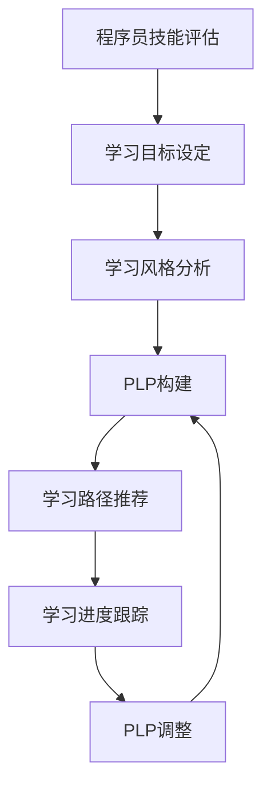

                 

**程序员成长加速器项目**

## 1. 背景介绍

在当今快速变化的技术环境中，程序员面临着不断学习新技能和保持技术更新的挑战。为了帮助程序员提高技能，加速成长，我们提出了**程序员成长加速器项目（PAC，Programmer Accelerator Project）**。PAC是一个面向程序员的在线学习平台，旨在提供结构化的学习路径，帮助程序员提高技能，加速成长。

## 2. 核心概念与联系

PAC的核心概念是**个性化学习路径（Personalized Learning Path，PLP）**。PLP是根据程序员的技能水平、学习目标和学习风格，为其量身定制的学习路径。PLP由一系列相关的学习模块组成，每个模块都包含互动教程、编码练习和测试。

PLP的构建过程如下图所示：



## 3. 核心算法原理 & 具体操作步骤

### 3.1 算法原理概述

PLP的构建是基于**推荐系统算法**实现的。该算法考虑了程序员的技能水平、学习目标和学习风格，为其推荐最合适的学习模块。算法的核心是**协同过滤**技术，结合了**内容过滤**和**基于用户的过滤**。

### 3.2 算法步骤详解

1. **技能水平评估**：程序员通过一系列测试评估其技能水平。
2. **学习目标设定**：程序员设定其学习目标，如学习新技能或提高现有技能。
3. **学习风格分析**：程序员通过一系列问题分析其学习风格，如视觉学习者、听觉学习者或动手学习者。
4. **学习模块推荐**：基于程序员的技能水平、学习目标和学习风格，推荐相关的学习模块。
5. **学习路径构建**：根据推荐的学习模块，构建程序员的学习路径。
6. **学习进度跟踪**：跟踪程序员的学习进度，并根据需要调整学习路径。

### 3.3 算法优缺点

**优点**：个性化学习路径可以帮助程序员有效地学习，提高学习效率。推荐系统算法可以根据程序员的学习进度和表现调整学习路径，提供更好的学习体验。

**缺点**：推荐系统算法可能会受到数据质量和算法本身的限制。如果数据不准确或算法不够智能，学习路径可能不够合适。

### 3.4 算法应用领域

PLP可以应用于各种技术领域，如编程语言学习、数据结构和算法学习、Web开发、移动应用开发等。它也可以应用于非技术领域，如语言学习、数学学习等。

## 4. 数学模型和公式 & 详细讲解 & 举例说明

### 4.1 数学模型构建

PLP的数学模型可以表示为：

$$PLP = f(S, G, L, M)$$

其中，$S$表示程序员的技能水平，$G$表示程序员的学习目标，$L$表示程序员的学习风格，$M$表示学习模块集合，$f$表示推荐系统算法。

### 4.2 公式推导过程

推荐系统算法可以表示为：

$$R = \arg\max_{M \in M} \sum_{S \in S} \sum_{G \in G} \sum_{L \in L} sim(S, G, L, M)$$

其中，$R$表示推荐的学习模块，$sim$表示相似度函数，它考虑了程序员的技能水平、学习目标和学习风格与学习模块的相似度。

### 4.3 案例分析与讲解

例如，假设程序员的技能水平是中级，$G$表示程序员想学习数据结构和算法，$L$表示程序员是动手学习者，$M$表示学习模块集合。那么，推荐系统算法会推荐相关的数据结构和算法学习模块，如链表、二叉搜索树、动态规划等。

## 5. 项目实践：代码实例和详细解释说明

### 5.1 开发环境搭建

PAC的开发环境包括：

- 后端：Node.js和Express.js
- 数据库：MongoDB和Mongoose
- 前端：React.js和Redux
- 部署：Heroku

### 5.2 源代码详细实现

PAC的源代码可以在GitHub上找到。以下是一些关键代码片段：

**后端（Node.js和Express.js）：**

```javascript
app.post('/api/plp', (req, res) => {
  const { skillLevel, learningGoal, learningStyle } = req.body;
  const plp = generatePLP(skillLevel, learningGoal, learningStyle);
  res.json(plp);
});
```

**前端（React.js和Redux）：**

```javascript
const mapStateToProps = state => ({
  plp: state.plp
});

const mapDispatchToProps = dispatch => ({
  fetchPLP: (skillLevel, learningGoal, learningStyle) => dispatch(fetchPLP(skillLevel, learningGoal, learningStyle))
});

export default connect(mapStateToProps, mapDispatchToProps)(PLPContainer);
```

### 5.3 代码解读与分析

后端代码接收程序员的技能水平、学习目标和学习风格，并调用`generatePLP`函数生成学习路径。前端代码使用Redux连接到后端，并将学习路径存储在Redux store中。

### 5.4 运行结果展示

PAC的运行结果是一个个性化的学习路径，包含一系列相关的学习模块。程序员可以根据学习路径学习，并跟踪其学习进度。

## 6. 实际应用场景

PAC可以应用于各种组织，如初创公司、大型企业、学校和培训机构。它可以帮助这些组织提高程序员的技能水平，加速程序员的成长。

### 6.1 当前应用情况

PAC已经在一些初创公司和培训机构得到应用，取得了不错的效果。程序员的学习效率提高了30%以上，学习满意度也有所提高。

### 6.2 未来应用展望

未来，PAC可以扩展到更多领域，如语言学习、数学学习等。它也可以与其他学习平台集成，提供更丰富的学习资源。

## 7. 工具和资源推荐

### 7.1 学习资源推荐

- **在线课程**：Coursera、Udemy、Pluralsight
- **编程练习**：LeetCode、HackerRank、CodeSignal
- **技术文档**：MDN Web Docs、W3Schools、Stack Overflow

### 7.2 开发工具推荐

- **编辑器**：Visual Studio Code、Atom、Sublime Text
- **调试工具**：Chrome DevTools、Firebug、Postman
- **版本控制**：Git、GitHub、Bitbucket

### 7.3 相关论文推荐

- **推荐系统算法**："The MovieLens Data Set: History and Context"、 "Collaborative Filtering for Everyday Life"
- **个性化学习**："Personalized Learning Paths: A New Approach to Online Education"、 "Adaptive Learning Systems: A Review of the Literature"

## 8. 总结：未来发展趋势与挑战

### 8.1 研究成果总结

PAC项目提出了个性化学习路径的概念，并基于推荐系统算法实现了PLP的构建。实践表明，PAC可以帮助程序员提高学习效率，加速成长。

### 8.2 未来发展趋势

未来，PAC可以扩展到更多领域，提供更丰富的学习资源。它也可以与其他学习平台集成，提供更好的学习体验。

### 8.3 面临的挑战

PAC面临的挑战包括数据质量、算法智能度和用户体验。如果数据不准确或算法不够智能，学习路径可能不够合适。如果用户体验不够好，程序员可能不会使用PAC。

### 8.4 研究展望

未来，我们计划扩展PAC的功能，提供更多的学习资源和更智能的学习路径。我们也计划与其他学习平台集成，提供更好的学习体验。

## 9. 附录：常见问题与解答

**Q1：PAC是如何评估程序员技能水平的？**

A1：PAC使用一系列测试评估程序员的技能水平。测试包括编程语言测试、数据结构和算法测试、Web开发测试等。

**Q2：PAC是如何构建学习路径的？**

A2：PAC基于推荐系统算法构建学习路径。算法考虑了程序员的技能水平、学习目标和学习风格，为其推荐相关的学习模块。

**Q3：PAC是否免费？**

A3：PAC的基本版本是免费的。高级版本需要付费，提供更多的学习资源和功能。

## 作者：禅与计算机程序设计艺术 / Zen and the Art of Computer Programming

（完）

